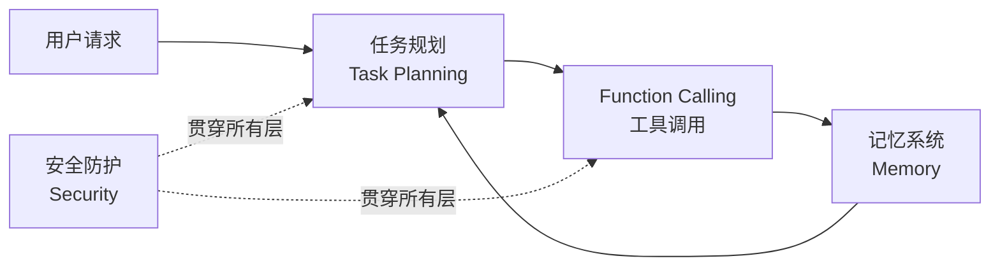

# Agent 核心机制

本目录收录 AI Agent 系统中的核心能力模块面试题，涵盖记忆管理、工具调用、任务规划和安全防护。

## 内容索引

| 主题 | 核心概念 | 文档 |
|------|----------|------|
| **记忆系统** | STM/LTM 分层设计、记忆更新策略、检索与使用 | [memory-system.md](./memory-system.md) |
| **Function Calling** | 工具注册与描述、参数校验、调用失败处理 | [function-calling.md](./function-calling.md) |
| **任务规划** | 模型驱动规划、规则规划、混合规划策略 | [task-planning.md](./task-planning.md) |
| **安全防护** | Prompt 注入防御、工具调用安全、权限控制 | [security.md](./security.md) |

## 模块关系

## 面试重点

- **记忆系统**：短期记忆如何控制长度？长期记忆如何检索？何时触发记忆压缩？
- **Function Calling**：如何设计工具描述让模型准确选择？工具调用失败的重试策略？
- **任务规划**：静态规划 vs 动态规划的选择依据？如何处理任务依赖和循环？
- **安全防护**：Prompt 注入攻击的防御机制？敏感工具的权限隔离方案？
