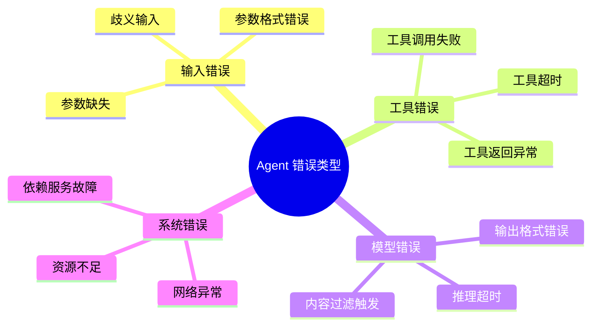
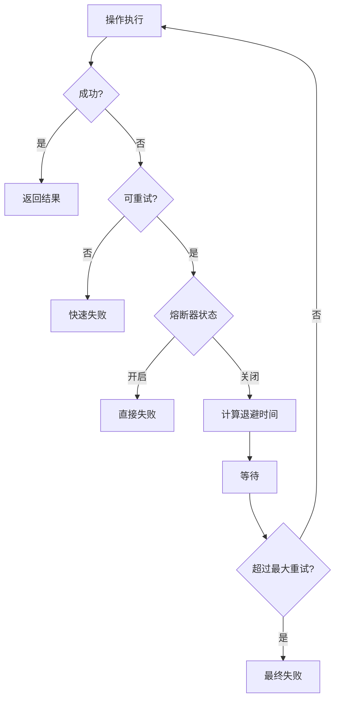
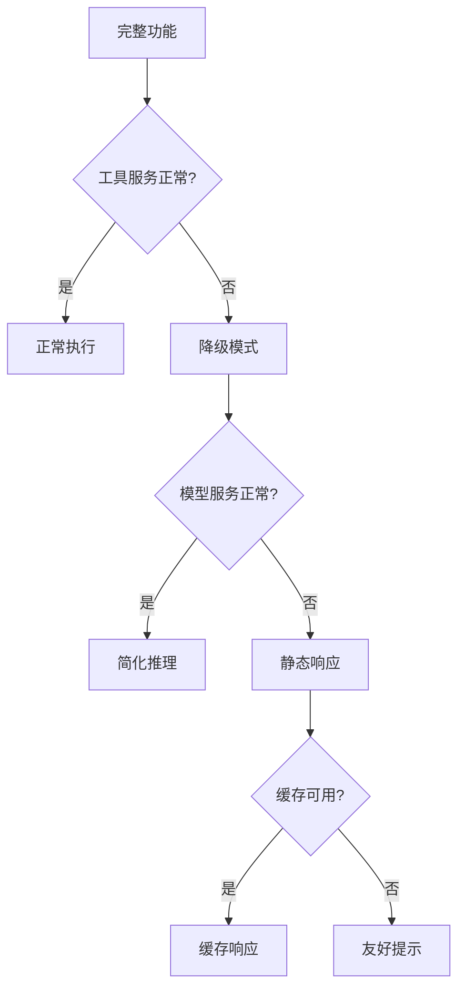

# Agent 错误处理与容错设计详解

> 错误处理是 Agent 系统可靠性的关键，良好的容错设计能够让 Agent 在面对异常情况时优雅恢复。

---

## 一、概念与原理

### 1.1 Agent 错误类型分类



### 1.2 错误处理原则

| 原则 | 说明 | 实践建议 |
|-----|------|---------|
| **快速失败** | 尽早发现错误，避免级联故障 | 输入校验前置 |
| **优雅降级** | 主路径失败时提供备选方案 | 多模型回退 |
| **可观测性** | 记录完整错误上下文 | 结构化日志 |
| **用户透明** | 向用户说明发生了什么 | 友好的错误提示 |

---

## 二、面试题详解

### 题目 1：Agent 系统中有哪些常见的错误类型？如何处理？（初级）

**题目描述：**
请列举 Agent 系统中常见的错误类型，并说明针对每种错误的处理策略。

**考察点：**
- 对 Agent 系统错误模式的了解
- 错误处理策略设计

**详细解答：**

**错误分类与处理：**

```java
/**
 * Agent 错误处理器
 */
public class AgentErrorHandler {
    
    /**
     * 错误处理入口
     */
    public ErrorHandlingResult handleError(AgentError error, ExecutionContext context) {
        return switch (error.getType()) {
            case INPUT_VALIDATION -> handleInputError(error, context);
            case TOOL_EXECUTION -> handleToolError(error, context);
            case MODEL_INFERENCE -> handleModelError(error, context);
            case SYSTEM -> handleSystemError(error, context);
            default -> handleUnknownError(error, context);
        };
    }
    
    /**
     * 1. 输入错误处理
     */
    private ErrorHandlingResult handleInputError(AgentError error, ExecutionContext context) {
        // 策略：主动澄清
        if (error instanceof MissingParameterException e) {
            return ErrorHandlingResult.clarification(
                String.format("请提供以下信息：%s", String.join(", ", e.getMissingParams()))
            );
        }
        
        // 策略：参数修正建议
        if (error instanceof InvalidFormatException e) {
            return ErrorHandlingResult.suggestion(
                String.format("'%s' 格式不正确，期望格式：%s", 
                    e.getField(), e.getExpectedFormat())
            );
        }
        
        return ErrorHandlingResult.fallback("输入处理失败，请重新描述您的需求");
    }
    
    /**
     * 2. 工具错误处理
     */
    private ErrorHandlingResult handleToolError(AgentError error, ExecutionContext context) {
        // 策略：重试
        if (error instanceof ToolTimeoutException) {
            if (context.getRetryCount() < 3) {
                return ErrorHandlingResult.retry(1000 * (context.getRetryCount() + 1));
            }
            return ErrorHandlingResult.fallback("服务暂时不可用，请稍后重试");
        }
        
        // 策略：备选工具
        if (error instanceof ToolExecutionException) {
            Tool alternative = findAlternativeTool(context.getCurrentTool());
            if (alternative != null) {
                return ErrorHandlingResult.switchTool(alternative);
            }
        }
        
        return ErrorHandlingResult.escalate("工具执行失败，需要人工介入");
    }
    
    /**
     * 3. 模型错误处理
     */
    private ErrorHandlingResult handleModelError(AgentError error, ExecutionContext context) {
        // 策略：模型降级
        if (error instanceof ModelTimeoutException || 
            error instanceof ModelOverloadException) {
            Model fallbackModel = getFallbackModel();
            return ErrorHandlingResult.switchModel(fallbackModel);
        }
        
        // 策略：内容过滤处理
        if (error instanceof ContentFilterException) {
            return ErrorHandlingResult.clarification(
                "您的请求可能涉及敏感内容，请换一种方式描述"
            );
        }
        
        return ErrorHandlingResult.fallback("推理服务暂时不可用");
    }
}
```

**错误处理策略矩阵：**

| 错误类型 | 处理策略 | 用户反馈 | 日志级别 |
|---------|---------|---------|---------|
| 参数缺失 | 主动询问 | "请提供XX信息" | INFO |
| 格式错误 | 修正建议 | "期望格式为..." | INFO |
| 工具超时 | 指数退避重试 | "正在重试..." | WARN |
| 工具失败 | 备选工具 | 透明切换 | ERROR |
| 模型超时 | 降级模型 | 无感知 | WARN |
| 内容过滤 | 澄清请求 | 友好提示 | INFO |
| 系统错误 | 快速失败 | "服务异常" | ERROR |

---

### 题目 2：如何设计 Agent 的重试机制？（中级）

**题目描述：**
请设计一个健壮的重试机制，包括重试策略、退避算法和熔断机制。

**考察点：**
- 分布式系统重试模式
- 容错设计能力

**详细解答：**

**重试机制架构：**



**实现代码：**

```java
/**
 * 重试执行器
 */
public class RetryExecutor {
    
    private final CircuitBreaker circuitBreaker;
    private final RetryPolicy retryPolicy;
    
    /**
     * 带重试的操作执行
     */
    public <T> T executeWithRetry(Callable<T> operation, String operationName) {
        // 检查熔断器
        if (!circuitBreaker.allowRequest()) {
            throw new CircuitBreakerOpenException(operationName);
        }
        
        int attempt = 0;
        Exception lastException = null;
        
        while (attempt < retryPolicy.getMaxAttempts()) {
            try {
                T result = operation.call();
                // 成功，记录成功
                circuitBreaker.recordSuccess();
                return result;
                
            } catch (Exception e) {
                lastException = e;
                attempt++;
                
                // 判断是否需要重试
                if (!retryPolicy.shouldRetry(e) || attempt >= retryPolicy.getMaxAttempts()) {
                    break;
                }
                
                // 计算退避时间
                long backoffMs = calculateBackoff(attempt);
                
                // 记录失败
                circuitBreaker.recordFailure();
                
                // 等待后重试
                try {
                    Thread.sleep(backoffMs);
                } catch (InterruptedException ie) {
                    Thread.currentThread().interrupt();
                    throw new RetryInterruptedException(ie);
                }
            }
        }
        
        // 所有重试失败
        throw new RetryExhaustedException(operationName, retryPolicy.getMaxAttempts(), lastException);
    }
    
    /**
     * 指数退避 + 抖动
     */
    private long calculateBackoff(int attempt) {
        // 基础退避：2^attempt * baseDelay
        long exponential = (long) (Math.pow(2, attempt) * retryPolicy.getBaseDelayMs());
        
        // 添加随机抖动 (0-30%)
        double jitter = 0.7 + Math.random() * 0.3;
        
        // 上限控制
        return Math.min((long) (exponential * jitter), retryPolicy.getMaxDelayMs());
    }
}

/**
 * 熔断器实现
 */
public class CircuitBreaker {
    
    private enum State { CLOSED, OPEN, HALF_OPEN }
    
    private State state = State.CLOSED;
    private final int failureThreshold;       // 失败阈值
    private final long timeoutMs;             // 熔断持续时间
    private final AtomicInteger failureCount = new AtomicInteger(0);
    private volatile long lastFailureTime = 0;
    
    public synchronized boolean allowRequest() {
        if (state == State.CLOSED) {
            return true;
        }
        
        if (state == State.OPEN) {
            // 检查是否超过熔断时间
            if (System.currentTimeMillis() - lastFailureTime > timeoutMs) {
                state = State.HALF_OPEN;
                failureCount.set(0);
                return true;
            }
            return false;
        }
        
        // HALF_OPEN 状态允许试探性请求
        return true;
    }
    
    public synchronized void recordSuccess() {
        if (state == State.HALF_OPEN) {
            // 半开状态下成功，关闭熔断器
            state = State.CLOSED;
            failureCount.set(0);
        }
    }
    
    public synchronized void recordFailure() {
        int failures = failureCount.incrementAndGet();
        lastFailureTime = System.currentTimeMillis();
        
        if (failures >= failureThreshold) {
            state = State.OPEN;
        }
    }
}
```

**重试策略配置：**

| 场景 | 最大重试 | 退避策略 | 熔断阈值 | 说明 |
|-----|---------|---------|---------|------|
| 工具调用 | 3 | 指数退避 1s/2s/4s | 5次/30s | 外部服务不稳定 |
| 模型推理 | 2 | 固定 2s | 3次/60s | API 限流保护 |
| 数据库查询 | 3 | 线性退避 100ms | 10次/30s | 连接池耗尽 |
| 网络请求 | 5 | 指数退避 + 抖动 | 10次/60s | 网络抖动 |

---

### 题目 3：Agent 如何实现优雅降级？（中级）

**题目描述：**
请设计 Agent 系统的降级策略，当主要功能不可用时，如何提供有限但可用的服务。

**考察点：**
- 降级策略设计
- 服务可用性保障

**详细解答：**

**降级策略层级：**



**降级实现：**

```java
/**
 * 降级服务管理器
 */
public class DegradationManager {
    
    private final Map<String, DegradationStrategy> strategies;
    
    /**
     * 执行带降级的操作
     */
    public <T> T executeWithDegradation(String operation, Callable<T> primary, Class<T> returnType) {
        try {
            // 尝试主路径
            return primary.call();
        } catch (Exception e) {
            // 获取降级策略
            DegradationStrategy<T> strategy = strategies.get(operation);
            if (strategy != null) {
                return strategy.degrade(e, returnType);
            }
            throw new DegradationException("无可用降级策略", e);
        }
    }
    
    /**
     * 工具调用降级策略
     */
    public class ToolDegradationStrategy implements DegradationStrategy<String> {
        
        @Override
        public String degrade(Exception error, Class<String> returnType) {
            // 策略 1: 使用缓存结果
            String cached = getCachedResult();
            if (cached != null) {
                return "[来自缓存] " + cached;
            }
            
            // 策略 2: 简化回答
            return "当前服务暂时不可用，以下是基于常识的回答：...";
        }
    }
    
    /**
     * 模型推理降级策略
     */
    public class ModelDegradationStrategy implements DegradationStrategy<String> {
        
        private final LLMClient fallbackModel;  // 轻量级备用模型
        private final Map<String, String> staticResponses;  // 静态响应模板
        
        @Override
        public String degrade(Exception error, Class<String> returnType) {
            // 策略 1: 切换到轻量级模型
            if (fallbackModel != null && fallbackModel.isAvailable()) {
                return fallbackModel.generate(getSimplifiedPrompt());
            }
            
            // 策略 2: 使用静态模板
            String template = matchStaticTemplate();
            if (template != null) {
                return template;
            }
            
            // 策略 3: 返回友好提示
            return "服务繁忙，请稍后重试";
        }
    }
}

/**
 * 功能开关控制
 */
public class FeatureToggle {
    
    private final Map<String, FeatureState> features = new ConcurrentHashMap<>();
    
    public enum FeatureState {
        ENABLED,      // 完全启用
        DEGRADED,     // 降级模式
        DISABLED      // 完全禁用
    }
    
    /**
     * 根据系统负载动态调整
     */
    public void adjustBasedOnLoad(SystemMetrics metrics) {
        double cpuUsage = metrics.getCpuUsage();
        double memoryUsage = metrics.getMemoryUsage();
        
        if (cpuUsage > 0.9 || memoryUsage > 0.9) {
            // 高负载，启用降级
            setFeatureState("complex_reasoning", FeatureState.DEGRADED);
            setFeatureState("image_generation", FeatureState.DISABLED);
        } else if (cpuUsage > 0.7 || memoryUsage > 0.8) {
            // 中等负载，部分降级
            setFeatureState("complex_reasoning", FeatureState.DEGRADED);
        } else {
            // 正常负载，全部启用
            setFeatureState("complex_reasoning", FeatureState.ENABLED);
            setFeatureState("image_generation", FeatureState.ENABLED);
        }
    }
}
```

**降级策略对比：**

| 降级层级 | 触发条件 | 用户体验 | 实现复杂度 |
|---------|---------|---------|-----------|
| 功能简化 | 工具不可用 | 功能受限但可用 | 中 |
| 模型降级 | 主模型超时 | 响应质量降低 | 低 |
| 缓存响应 | 服务中断 | 可能过时但即时 | 中 |
| 静态模板 | 完全故障 | 有限但稳定 | 低 |
| 服务拒绝 | 过载保护 | 明确不可用 | 低 |

---

## 三、延伸追问

### 追问 1：如何防止级联故障？

**简要答案：**
- **超时控制**：每个操作设置严格超时
- **资源隔离**：不同功能使用独立线程池
- **熔断机制**：快速失败防止雪崩
- **限流保护**：控制并发请求数量

### 追问 2：Agent 错误日志应该如何设计？

**简要答案：**
- **结构化日志**：JSON 格式便于分析
- **上下文追踪**：每个请求唯一 Trace ID
- **分级记录**：ERROR/WARN/INFO 合理分布
- **敏感信息脱敏**：避免记录用户隐私

---

## 四、总结

### 面试回答模板

> Agent 错误处理需要分层设计：输入层校验、工具层重试、模型层降级、系统层熔断。
>
> **核心策略：**
> 1. **快速失败**：尽早发现错误，避免资源浪费
> 2. **优雅降级**：主路径失败时提供备选方案
> 3. **重试机制**：指数退避 + 熔断保护
> 4. **用户透明**：友好提示，不暴露内部错误
>
> **重试配置：**
> - 工具调用：3 次重试，指数退避 1s/2s/4s
> - 模型推理：2 次重试，固定间隔
> - 熔断阈值：5 次失败/30 秒窗口

### 一句话记忆

| 概念 | 一句话 |
|-----|--------|
| **快速失败** | 早发现早处理，不拖泥带水 |
| **指数退避** | 重试间隔越来越长，给系统恢复时间 |
| **熔断器** | 连续失败就断开，防止雪崩 |
| **优雅降级** | 主路不通走辅路，保证基本可用 |
