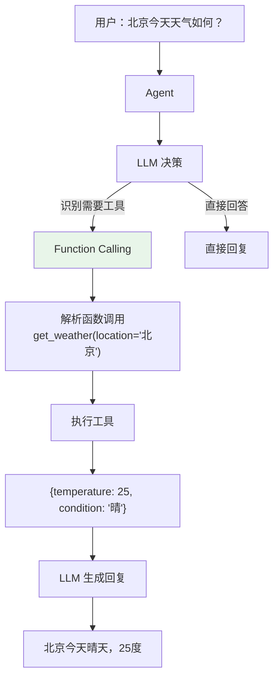
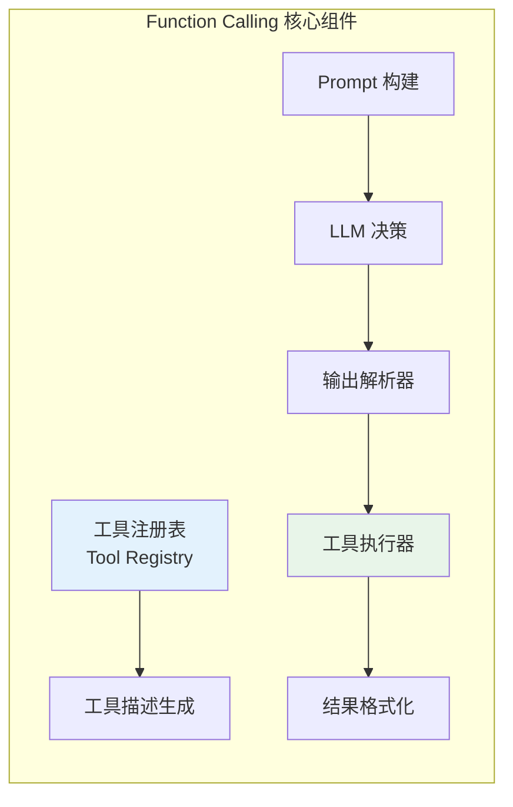
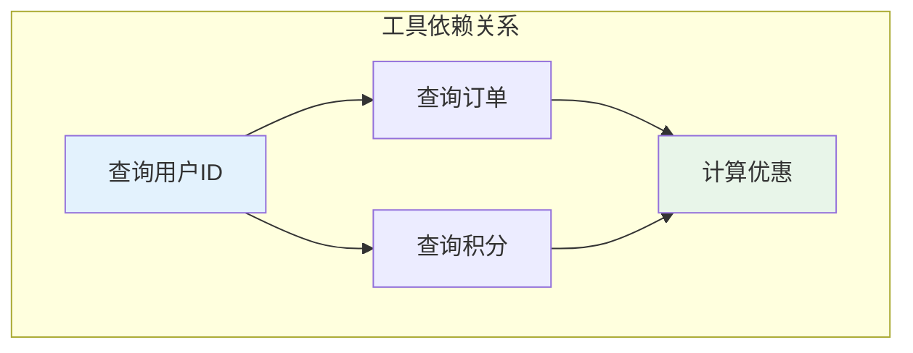
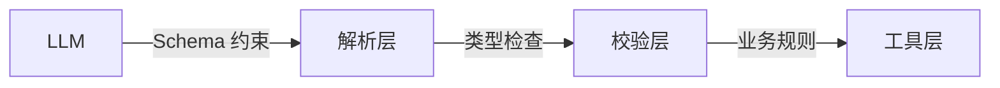

# Function Calling 设计与实现

## 一、概述

### 1.1 什么是 Function Calling？

**Function Calling** 是 LLM 与外部工具交互的标准机制。它允许 LLM 在需要时"调用"外部函数（如查询天气、搜索数据库、发送邮件等），并将结果整合到回复中。



### 1.2 核心组件



| 组件 | 职责 | 关键设计 |
|------|------|---------|
| **工具注册表** | 管理可用工具 | 名称唯一、描述清晰、参数 Schema 完整 |
| **Prompt 构建** | 向 LLM 描述工具 | JSON Schema 格式、示例说明 |
| **输出解析** | 提取函数调用 | 容错处理、格式校验 |
| **执行器** | 实际调用工具 | 参数校验、超时控制、并发执行 |
| **结果回传** | 工具结果给 LLM | 格式化、截断、错误包装 |

---

## 二、工具注册与描述

### 2.1 工具定义

```java
/**
 * 工具接口
 */
public interface Tool {
    
    /**
     * 工具名称（唯一标识）
     */
    String getName();
    
    /**
     * 工具描述（LLM 用）
     */
    String getDescription();
    
    /**
     * 参数 Schema（JSON Schema 格式）
     */
    Map<String, Object> getParameterSchema();
    
    /**
     * 执行工具
     */
    ToolResult execute(Map<String, Object> arguments);
}

/**
 * 天气查询工具示例
 */
@Component
public class WeatherTool implements Tool {
    
    @Override
    public String getName() {
        return "get_weather";
    }
    
    @Override
    public String getDescription() {
        return "查询指定城市的天气信息，包括温度、天气状况等";
    }
    
    @Override
    public Map<String, Object> getParameterSchema() {
        return Map.of(
            "type", "object",
            "properties", Map.of(
                "location", Map.of(
                    "type", "string",
                    "description", "城市名称，如'北京'、'上海'"
                ),
                "date", Map.of(
                    "type", "string",
                    "description", "日期，格式'yyyy-MM-dd'，默认为今天"
                )
            ),
            "required", List.of("location")
        );
    }
    
    @Override
    public ToolResult execute(Map<String, Object> arguments) {
        String location = (String) arguments.get("location");
        String date = (String) arguments.getOrDefault("date", "today");
        
        // 调用天气 API
        WeatherData data = weatherApi.query(location, date);
        
        return ToolResult.success(Map.of(
            "temperature", data.getTemperature(),
            "condition", data.getCondition(),
            "humidity", data.getHumidity()
        ));
    }
}
```

### 2.2 工具注册表

```java
@Component
public class ToolRegistry {
    
    private final Map<String, Tool> tools = new ConcurrentHashMap<>();
    
    /**
     * 注册工具
     */
    public void register(Tool tool) {
        if (tools.containsKey(tool.getName())) {
            throw new IllegalArgumentException(
                "Tool already registered: " + tool.getName()
            );
        }
        tools.put(tool.getName(), tool);
        log.info("Registered tool: {}", tool.getName());
    }
    
    /**
     * 获取工具
     */
    public Tool getTool(String name) {
        Tool tool = tools.get(name);
        if (tool == null) {
            throw new ToolNotFoundException("Tool not found: " + name);
        }
        return tool;
    }
    
    /**
     * 获取所有工具描述（用于 Prompt）
     */
    public List<ToolDescription> getAllToolDescriptions() {
        return tools.values().stream()
            .map(tool -> new ToolDescription(
                tool.getName(),
                tool.getDescription(),
                tool.getParameterSchema()
            ))
            .collect(Collectors.toList());
    }
}
```

---

## 三、Prompt 构建与 LLM 调用

### 3.1 工具描述注入

```java
public class FunctionCallingPromptBuilder {
    
    /**
     * 构建带工具描述的 Prompt
     */
    public String buildPrompt(String userInput, List<ToolDescription> tools) {
        StringBuilder prompt = new StringBuilder();
        
        // 系统指令
        prompt.append("你是一个智能助手，可以使用以下工具帮助用户：\n\n");
        
        // 工具描述
        for (ToolDescription tool : tools) {
            prompt.append(formatToolDescription(tool));
        }
        
        // 输出格式说明
        prompt.append("""
            
            使用工具的格式：
            {
                "function": "工具名",
                "arguments": {
                    "参数名": "参数值"
                }
            }
            
            如果不需要工具，直接回复用户。
            
            """);
        
        // 用户输入
        prompt.append("用户：").append(userInput);
        
        return prompt.toString();
    }
    
    private String formatToolDescription(ToolDescription tool) {
        return String.format("""
            【%s】
            描述：%s
            参数：%s
            
            """,
            tool.getName(),
            tool.getDescription(),
            JsonUtils.toJson(tool.getParameterSchema())
        );
    }
}
```

### 3.2 OpenAI 格式示例

```java
/**
 * OpenAI Function Calling 格式
 */
public class OpenAIFunctionCalling {
    
    public ChatCompletionRequest buildRequest(String userInput, List<Tool> tools) {
        List<FunctionDefinition> functions = tools.stream()
            .map(tool -> FunctionDefinition.builder()
                .name(tool.getName())
                .description(tool.getDescription())
                .parameters(tool.getParameterSchema())
                .build())
            .collect(Collectors.toList());
        
        return ChatCompletionRequest.builder()
            .model("gpt-4")
            .messages(List.of(
                Message.system("You are a helpful assistant."),
                Message.user(userInput)
            ))
            .functions(functions)
            .function_call("auto")  // 让模型决定是否调用
            .build();
    }
}
```

---

## 四、输出解析与执行

### 4.1 函数调用解析

```java
@Component
public class FunctionCallParser {
    
    private final ObjectMapper objectMapper;
    
    /**
     * 解析 LLM 输出
     */
    public FunctionCall parse(String llmOutput) {
        try {
            // 尝试解析为函数调用格式
            JsonNode node = objectMapper.readTree(llmOutput);
            
            if (node.has("function") && node.has("arguments")) {
                return FunctionCall.builder()
                    .functionName(node.get("function").asText())
                    .arguments(objectMapper.convertValue(
                        node.get("arguments"), 
                        new TypeReference<Map<String, Object>>() {}
                    ))
                    .build();
            }
            
            // 不是函数调用格式
            return null;
            
        } catch (JsonProcessingException e) {
            // 解析失败，不是函数调用
            return null;
        }
    }
}

/**
 * 函数调用对象
 */
@Data
@Builder
public class FunctionCall {
    private String functionName;
    private Map<String, Object> arguments;
}
```

### 4.2 参数校验

```java
@Component
public class ParameterValidator {
    
    /**
     * 校验参数是否符合 Schema
     */
    public ValidationResult validate(Map<String, Object> arguments, 
                                      Map<String, Object> schema) {
        List<String> errors = new ArrayList<>();
        
        // 检查必填参数
        List<String> required = (List<String>) schema.get("required");
        if (required != null) {
            for (String param : required) {
                if (!arguments.containsKey(param)) {
                    errors.add("Missing required parameter: " + param);
                }
            }
        }
        
        // 检查参数类型
        Map<String, Object> properties = (Map<String, Object>) schema.get("properties");
        if (properties != null) {
            for (Map.Entry<String, Object> arg : arguments.entrySet()) {
                String paramName = arg.getKey();
                Object paramValue = arg.getValue();
                
                Map<String, Object> paramSchema = (Map<String, Object>) properties.get(paramName);
                if (paramSchema != null) {
                    String expectedType = (String) paramSchema.get("type");
                    if (!checkType(paramValue, expectedType)) {
                        errors.add(String.format(
                            "Parameter '%s' should be %s, got %s",
                            paramName, expectedType, paramValue.getClass().getSimpleName()
                        ));
                    }
                }
            }
        }
        
        return errors.isEmpty() 
            ? ValidationResult.success() 
            : ValidationResult.failure(errors);
    }
    
    private boolean checkType(Object value, String expectedType) {
        return switch (expectedType) {
            case "string" -> value instanceof String;
            case "integer" -> value instanceof Integer || value instanceof Long;
            case "number" -> value instanceof Number;
            case "boolean" -> value instanceof Boolean;
            case "array" -> value instanceof List;
            case "object" -> value instanceof Map;
            default -> true;
        };
    }
}

@Data
@AllArgsConstructor
public class ValidationResult {
    private boolean valid;
    private List<String> errors;
    
    public static ValidationResult success() {
        return new ValidationResult(true, Collections.emptyList());
    }
    
    public static ValidationResult failure(List<String> errors) {
        return new ValidationResult(false, errors);
    }
}
```

---

## 五、多工具调用与顺序控制

### 5.1 依赖关系分析



### 5.2 调度器实现

```java
@Component
public class ToolScheduler {
    
    /**
     * 拓扑排序决定执行顺序
     */
    public List<ToolCall> schedule(List<ToolCall> calls, 
                                    Map<String, List<String>> dependencies) {
        // Kahn 算法拓扑排序
        Map<String, Integer> inDegree = new HashMap<>();
        Map<String, ToolCall> callMap = new HashMap<>();
        
        for (ToolCall call : calls) {
            inDegree.put(call.getToolName(), 0);
            callMap.put(call.getToolName(), call);
        }
        
        for (Map.Entry<String, List<String>> entry : dependencies.entrySet()) {
            for (String dep : entry.getValue()) {
                inDegree.merge(entry.getKey(), 1, Integer::sum);
            }
        }
        
        Queue<String> queue = new LinkedList<>();
        List<ToolCall> result = new ArrayList<>();
        
        // 入度为 0 的入队
        for (Map.Entry<String, Integer> entry : inDegree.entrySet()) {
            if (entry.getValue() == 0) {
                queue.offer(entry.getKey());
            }
        }
        
        while (!queue.isEmpty()) {
            String toolName = queue.poll();
            result.add(callMap.get(toolName));
            
            // 减少依赖该工具的入度
            for (Map.Entry<String, List<String>> entry : dependencies.entrySet()) {
                if (entry.getValue().contains(toolName)) {
                    int newDegree = inDegree.get(entry.getKey()) - 1;
                    inDegree.put(entry.getKey(), newDegree);
                    if (newDegree == 0) {
                        queue.offer(entry.getKey());
                    }
                }
            }
        }
        
        return result;
    }
    
    /**
     * 并行执行无依赖的工具
     */
    public List<ToolResult> executeParallel(List<ToolCall> calls, 
                                             ToolRegistry registry) {
        List<CompletableFuture<ToolResult>> futures = calls.stream()
            .map(call -> CompletableFuture.supplyAsync(() -> {
                Tool tool = registry.getTool(call.getToolName());
                return tool.execute(call.getArguments());
            }))
            .collect(Collectors.toList());
        
        return futures.stream()
            .map(CompletableFuture::join)
            .collect(Collectors.toList());
    }
}
```

---

## 六、工具调用失败处理

### 6.1 容错策略

| 策略 | 适用场景 | 实现方式 |
|------|---------|---------|
| **重试** | 瞬态故障（网络抖动） | 指数退避重试 |
| **降级** | 有备用方案 | 切换备用工具 |
| **跳过** | 非关键工具 | 返回空结果继续 |
| **终止** | 关键工具失败 | 抛出异常停止 |
| **人工介入** | 多次失败 | 转人工处理 |

### 6.2 实现代码

```java
@Component
public class ToolExecutor {
    
    private static final int MAX_RETRIES = 3;
    private static final long INITIAL_BACKOFF = 1000; // 1秒
    
    /**
     * 带重试的执行
     */
    public ToolResult executeWithRetry(ToolCall call, ToolRegistry registry) {
        Tool tool = registry.getTool(call.getToolName());
        int attempts = 0;
        Exception lastError = null;
        
        while (attempts < MAX_RETRIES) {
            try {
                // 参数校验
                ValidationResult validation = validateParameters(call, tool);
                if (!validation.isValid()) {
                    return ToolResult.failure(
                        "Parameter validation failed: " + validation.getErrors()
                    );
                }
                
                // 执行工具
                return tool.execute(call.getArguments());
                
            } catch (Exception e) {
                lastError = e;
                attempts++;
                
                if (attempts < MAX_RETRIES && isRetryable(e)) {
                    // 指数退避
                    long backoff = INITIAL_BACKOFF * (1L << (attempts - 1));
                    log.warn("Tool execution failed, retrying in {}ms: {}", 
                        backoff, e.getMessage());
                    
                    try {
                        Thread.sleep(backoff);
                    } catch (InterruptedException ie) {
                        Thread.currentThread().interrupt();
                        break;
                    }
                }
            }
        }
        
        // 重试耗尽，执行失败处理
        return handleFailure(call, tool, lastError);
    }
    
    /**
     * 失败处理
     */
    private ToolResult handleFailure(ToolCall call, Tool tool, Exception error) {
        log.error("Tool execution failed after retries: {}", call.getToolName(), error);
        
        // 关键工具检查
        if (tool.isCritical()) {
            throw new ToolExecutionException(
                "Critical tool failed: " + call.getToolName(), error
            );
        }
        
        // 尝试降级
        if (tool.hasFallback()) {
            return executeFallback(tool, call.getArguments());
        }
        
        // 返回空结果，让 LLM 继续
        return ToolResult.empty();
    }
    
    private ToolResult executeFallback(Tool tool, Map<String, Object> arguments) {
        Tool fallback = tool.getFallbackTool();
        return fallback.execute(arguments);
    }
    
    private boolean isRetryable(Exception e) {
        // 网络超时、连接失败可重试
        return e instanceof TimeoutException 
            || e instanceof ConnectException
            || e instanceof SocketTimeoutException;
    }
}

@Data
@AllArgsConstructor
public class ToolResult {
    private boolean success;
    private Object data;
    private String error;
    
    public static ToolResult success(Object data) {
        return new ToolResult(true, data, null);
    }
    
    public static ToolResult failure(String error) {
        return new ToolResult(false, null, error);
    }
    
    public static ToolResult empty() {
        return new ToolResult(true, null, null);
    }
}
```

---

## 七、面试题详解

### 题目 1：Function Calling 和直接生成代码有什么区别？

#### 考察点
- 安全性理解
- 架构设计能力

#### 详细解答

**核心区别：**

| 维度 | Function Calling | 直接生成代码 |
|------|-----------------|-------------|
| **安全性** | ✅ 受控（白名单工具） | ❌ 风险（任意代码） |
| **可控性** | ✅ 参数校验、权限控制 | ❌ 难以限制 |
| **可观测** | ✅ 调用链路清晰 | ❌ 黑箱执行 |
| **回滚** | ✅ 可重试、降级 | ❌ 难恢复 |

**为什么不用直接生成代码：**
- 安全风险（删除数据、越权访问）
- 难以调试（生成的代码可能出错）
- 性能不可控（循环、死锁）

---

### 题目 2：工具参数校验应该在哪一层做？

#### 考察点
- 分层设计
- 防御式编程

#### 详细解答

**多层校验：**



| 层级 | 校验内容 | 目的 |
|------|---------|------|
| **LLM 层** | JSON Schema 约束 | 减少格式错误 |
| **解析层** | 类型匹配、必填项 | 提前发现问题 |
| **工具层** | 业务规则、权限 | 最终安全保证 |

**原则：** 越靠近用户越早校验，但工具层必须最终校验。

---

### 题目 3：如何处理工具调用超时？

#### 考察点
- 超时控制
- 降级策略

#### 详细解答

**超时处理策略：**

```java
public ToolResult executeWithTimeout(ToolCall call, long timeoutMs) {
    try {
        return CompletableFuture.supplyAsync(() -> 
            tool.execute(call.getArguments())
        )
        .orTimeout(timeoutMs, TimeUnit.MILLISECONDS)
        .join();
        
    } catch (TimeoutException e) {
        log.warn("Tool execution timeout: {}", call.getToolName());
        
        // 取消执行
        cancelExecution(call);
        
        // 返回降级结果
        return ToolResult.failure("Execution timeout");
    }
}
```

**策略选择：**
- **同步工具**：设置超时，超时报错
- **异步工具**：返回任务 ID，轮询结果
- **长任务**：拆分步骤，中间状态保存

---

## 八、延伸追问

1. **"如何防止工具被滥用（如循环调用）？"**
   - 调用次数限制
   - 调用深度限制
   - 超时控制

2. **"工具结果如何缓存？"**
   - 幂等工具可缓存
   - 基于参数哈希
   - TTL 过期策略

3. **"Function Calling 和 ReAct 的关系？"**
   - Function Calling 是 ReAct 的"Action"实现
   - ReAct 是更完整的范式（Thought + Action + Observation）