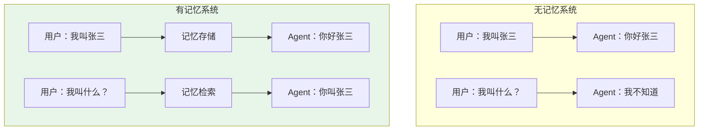
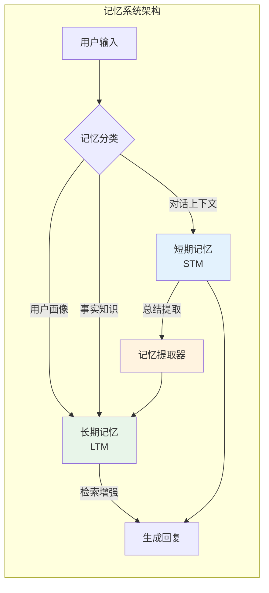
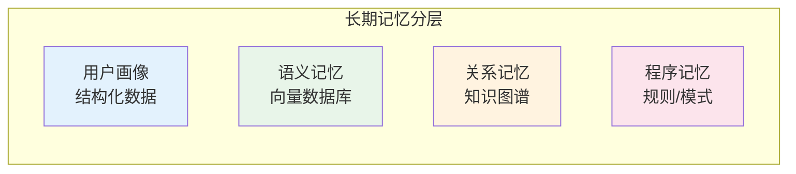
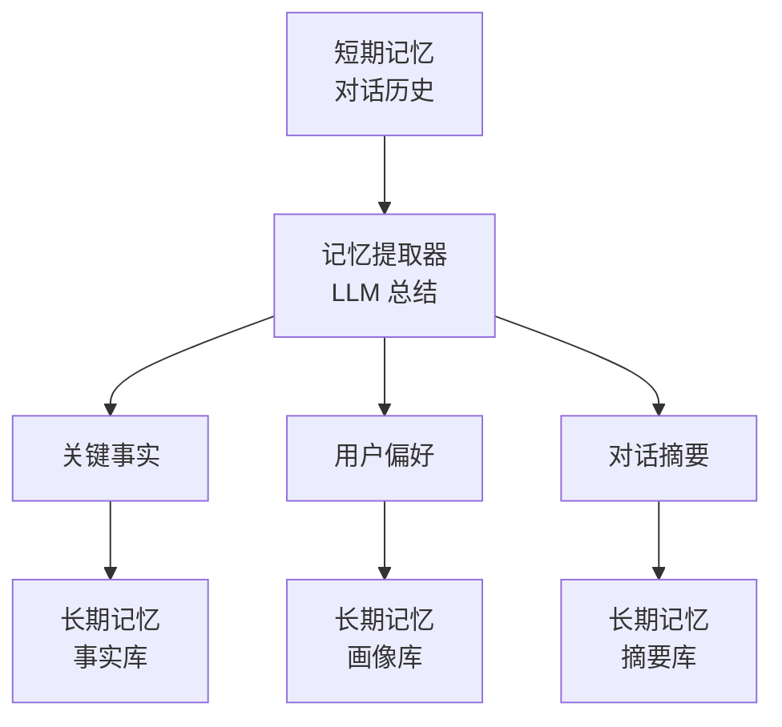
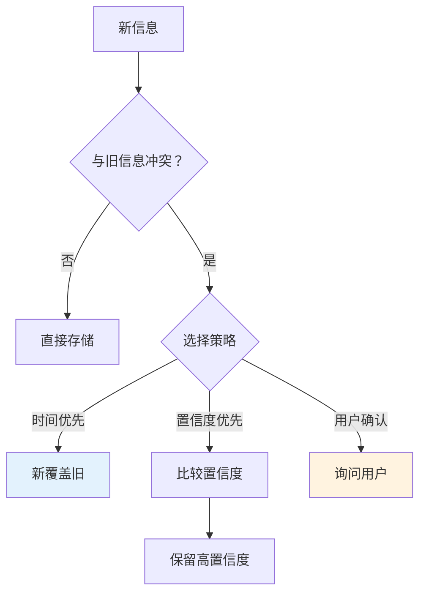
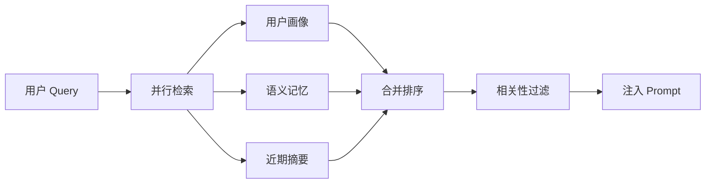
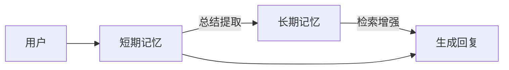

# 记忆系统（Memory System）

## 一、概述

### 1.1 为什么需要记忆系统？

LLM 本身是无状态的，每次请求都是独立的。记忆系统赋予 Agent **持续学习**和**个性化服务**的能力：



### 1.2 记忆系统架构



---

## 二、短期记忆（Short-Term Memory）

### 2.1 特点

| 特性 | 说明 |
|------|------|
| **时效性** | 当前对话会话内有效 |
| **容量有限** | 通常保留最近 N 轮（10-20 轮） |
| **原始形式** | 保存完整对话历史 |
| **访问速度** | 极快（内存读取） |

### 2.2 实现方式

**滑动窗口实现：**

```java
public class ShortTermMemory {
    
    private final Deque<Message> conversationHistory;
    private final int maxRounds;  // 最大保留轮数
    
    public ShortTermMemory(int maxRounds) {
        this.maxRounds = maxRounds;
        this.conversationHistory = new LinkedList<>();
    }
    
    /**
     * 添加消息
     */
    public void addMessage(String role, String content) {
        conversationHistory.addLast(new Message(role, content));
        
        // 滑动窗口：超出限制时移除最旧的
        while (conversationHistory.size() > maxRounds * 2) {
            conversationHistory.pollFirst(); // 移除一问
            conversationHistory.pollFirst(); // 移除一答
        }
    }
    
    /**
     * 获取最近 N 轮上下文
     */
    public List<Message> getRecentContext(int n) {
        int start = Math.max(0, conversationHistory.size() - n * 2);
        return new ArrayList<>(conversationHistory)
            .subList(start, conversationHistory.size());
    }
    
    /**
     * 清空记忆（会话结束）
     */
    public void clear() {
        conversationHistory.clear();
    }
}

/**
 * 消息对象
 */
@Data
class Message {
    private String role;      // user / assistant / system
    private String content;   // 内容
    private long timestamp;   // 时间戳
}
```

### 2.3 使用场景

- **多轮对话连贯性**：理解指代和省略
- **临时上下文引用**：如"刚才说的那个"
- **工具调用链**：多步工具调用的中间状态

---

## 三、长期记忆（Long-Term Memory）

### 3.1 特点

| 特性 | 说明 |
|------|------|
| **持久性** | 跨会话保留，长期存储 |
| **结构化** | 提取关键信息，非原始文本 |
| **可检索** | 支持语义搜索 |
| **分层存储** | 不同类型记忆分开存储 |

### 3.2 存储类型



| 类型 | 存储内容 | 存储方式 | 示例 |
|------|---------|---------|------|
| **用户画像** | 基本信息、偏好 | 结构化数据库 | `{"职业": "程序员", "喜好": "Java"}` |
| **语义记忆** | 对话摘要、事实 | 向量数据库 | "用户喜欢使用 Spring Boot" |
| **关系记忆** | 实体关系 | 知识图谱 | 用户 -[工作于]-> 某公司 |
| **程序记忆** | 行为模式 | 规则库 | 用户习惯先问再确认 |

### 3.3 Java 实现

```java
public class LongTermMemory {
    
    private final UserProfileRepository profileRepo;
    private final VectorStore vectorStore;
    private final KnowledgeGraph knowledgeGraph;
    private final EmbeddingModel embeddingModel;
    
    /**
     * 存储用户画像
     */
    public void storeProfile(String userId, String key, Object value) {
        UserProfile profile = profileRepo.findByUserId(userId);
        if (profile == null) {
            profile = new UserProfile(userId);
        }
        profile.setAttribute(key, value);
        profileRepo.save(profile);
    }
    
    /**
     * 存储语义记忆
     */
    public void storeSemanticMemory(String userId, String content, 
                                     Map<String, Object> metadata) {
        float[] embedding = embeddingModel.embed(content);
        
        MemoryRecord record = MemoryRecord.builder()
            .userId(userId)
            .content(content)
            .embedding(embedding)
            .metadata(metadata)
            .timestamp(System.currentTimeMillis())
            .build();
        
        vectorStore.store(record);
    }
    
    /**
     * 检索相关记忆
     */
    public List<MemoryRecord> retrieveRelevant(String userId, String query, int topK) {
        float[] queryVec = embeddingModel.embed(query);
        return vectorStore.search(userId, queryVec, topK);
    }
    
    /**
     * 存储关系记忆
     */
    public void storeRelation(String userId, String subject, 
                               String predicate, String object) {
        knowledgeGraph.addTriple(userId, subject, predicate, object);
    }
}

/**
 * 记忆记录
 */
@Data
@Builder
class MemoryRecord {
    private String id;
    private String userId;
    private String content;
    private float[] embedding;
    private Map<String, Object> metadata;
    private long timestamp;
}
```

---

## 四、短期记忆 → 长期记忆（提取与总结）

### 4.1 触发时机

| 触发条件 | 说明 |
|---------|------|
| **会话结束** | 用户主动结束或超时 |
| **固定轮数** | 每 N 轮（如 5 轮）触发一次 |
| **重要信息** | 检测到关键词（如"记住"、"我是"） |
| **显式指令** | 用户说"记住这个" |

### 4.2 提取流程



### 4.3 Java 实现

```java
public class MemoryExtractor {
    
    private final LLMClient llm;
    private final ObjectMapper objectMapper;
    
    /**
     * 从对话中提取记忆
     */
    public ExtractedMemory extract(List<Message> conversation) {
        String prompt = buildExtractionPrompt(conversation);
        String response = llm.complete(prompt);
        
        try {
            return objectMapper.readValue(response, ExtractedMemory.class);
        } catch (JsonProcessingException e) {
            // 解析失败，返回空
            return new ExtractedMemory();
        }
    }
    
    private String buildExtractionPrompt(List<Message> conversation) {
        StringBuilder convoText = new StringBuilder();
        for (Message msg : conversation) {
            convoText.append(msg.getRole()).append(": ")
                     .append(msg.getContent()).append("\n");
        }
        
        return String.format("""
            请分析以下对话，提取需要长期保存的信息：
            
            对话内容：
            %s
            
            请以 JSON 格式输出：
            {
                "facts": [
                    {"content": "事实内容", "importance": 0.9}
                ],
                "preferences": {
                    "键": "值"
                },
                "summary": "对话摘要（100字以内）",
                "entities": [
                    {"name": "实体名", "type": "人物/地点/组织"}
                ]
            }
            
            注意：
            - 只提取重要、持久的信息
            - 忽略临时性、无关紧要的内容
            - 事实要有置信度评分（0-1）
            """, convoText);
    }
}

/**
 * 提取的记忆
 */
@Data
class ExtractedMemory {
    private List<Fact> facts;
    private Map<String, Object> preferences;
    private String summary;
    private List<Entity> entities;
}

@Data
class Fact {
    private String content;
    private double importance;
}

@Data
class Entity {
    private String name;
    private String type;
}

---

## 五、记忆更新策略

### 5.1 更新类型

| 策略 | 说明 | 示例 |
|------|------|------|
| **增量更新** | 新信息追加到已有记忆 | 用户新增一个喜好 |
| **覆盖更新** | 新信息替换旧信息 | 用户修改地址 |
| **时效衰减** | 旧记忆权重随时间降低 | 临时性偏好 |
| **冲突解决** | 新旧信息矛盾时决策 | 用户更正之前的信息 |

### 5.2 冲突解决策略



### 5.3 Java 实现

```java
public class MemoryUpdater {
    
    private final LongTermMemory ltm;
    
    /**
     * 更新记忆（带冲突检测）
     */
    public void updateMemory(String userId, String key, 
                              String newValue, UpdateStrategy strategy) {
        String oldValue = ltm.getMemory(userId, key);
        
        if (oldValue == null) {
            // 无冲突，直接存储
            ltm.storeProfile(userId, key, newValue);
        } else if (oldValue.equals(newValue)) {
            // 相同，无需更新
            return;
        } else {
            // 冲突，按策略处理
            handleConflict(userId, key, oldValue, newValue, strategy);
        }
    }
    
    private void handleConflict(String userId, String key,
                                 String oldVal, String newVal, 
                                 UpdateStrategy strategy) {
        switch (strategy) {
            case OVERRIDE:
                // 新覆盖旧（默认）
                ltm.storeProfile(userId, key, newVal);
                break;
                
            case VERSION:
                // 保留版本历史
                ltm.storeVersion(userId, key, oldVal, newVal);
                break;
                
            case CONFIDENCE:
                // 置信度判断
                double oldConf = extractConfidence(oldVal);
                double newConf = extractConfidence(newVal);
                if (newConf > oldConf) {
                    ltm.storeProfile(userId, key, newVal);
                }
                break;
                
            case CONFIRM:
                // 标记待确认，下次交互时询问
                ltm.markForConfirmation(userId, key, oldVal, newVal);
                break;
        }
    }
    
    /**
     * 时效衰减：降低旧记忆权重
     */
    public void applyDecay(String userId, double decayRate) {
        List<MemoryRecord> memories = ltm.getAllMemories(userId);
        
        for (MemoryRecord mem : memories) {
            long age = System.currentTimeMillis() - mem.getTimestamp();
            double days = age / (1000 * 60 * 60 * 24);
            
            // 指数衰减
            double newWeight = Math.exp(-decayRate * days);
            
            if (newWeight < 0.1) {
                // 权重过低，归档或删除
                ltm.archive(userId, mem.getId());
            } else {
                ltm.updateWeight(userId, mem.getId(), newWeight);
            }
        }
    }
}

enum UpdateStrategy {
    OVERRIDE,    // 覆盖
    VERSION,     // 版本控制
    CONFIDENCE,  // 置信度优先
    CONFIRM      // 用户确认
}
```

---

## 六、记忆检索与使用

### 6.1 检索流程



### 6.2 Java 实现

```java
public class MemoryRetriever {
    
    private final LongTermMemory ltm;
    private final EmbeddingModel embeddingModel;
    
    /**
     * 检索相关记忆
     */
    public RetrievedContext retrieve(String userId, String query) {
        RetrievedContext context = new RetrievedContext();
        
        // 1. 检索用户画像
        UserProfile profile = ltm.getProfile(userId);
        context.setProfile(profile);
        
        // 2. 语义检索相关记忆
        float[] queryVec = embeddingModel.embed(query);
        List<MemoryRecord> semanticMemories = ltm.retrieveRelevant(
            userId, queryVec, 5
        );
        context.setSemanticMemories(semanticMemories);
        
        // 3. 检索近期摘要
        List<MemoryRecord> recentSummaries = ltm.getRecentSummaries(userId, 3);
        context.setRecentSummaries(recentSummaries);
        
        return context;
    }
    
    /**
     * 构建记忆增强的 Prompt
     */
    public String buildPrompt(String userId, String query, 
                               RetrievedContext context) {
        StringBuilder prompt = new StringBuilder();
        
        // 用户画像
        if (context.getProfile() != null) {
            prompt.append("【用户画像】\n");
            prompt.append(context.getProfile().toSummary()).append("\n\n");
        }
        
        // 相关记忆
        if (!context.getSemanticMemories().isEmpty()) {
            prompt.append("【相关背景】\n");
            for (MemoryRecord mem : context.getSemanticMemories()) {
                prompt.append("- ").append(mem.getContent()).append("\n");
            }
            prompt.append("\n");
        }
        
        // 用户问题
        prompt.append("【当前问题】\n").append(query);
        
        return prompt.toString();
    }
}
```

---

## 七、面试题详解

### 题目 1：短期记忆和长期记忆的区别是什么？如何配合？

#### 考察点
- 记忆分层设计理解
- 系统架构能力

#### 详细解答

**核心区别：**

| 维度 | 短期记忆 | 长期记忆 |
|------|---------|---------|
| **时效** | 会话级 | 持久级 |
| **形式** | 原始对话 | 结构化提取 |
| **容量** | 有限（N 轮） | 理论上无限 |
| **访问** | 内存直接读 | 需检索 |
| **更新** | 实时追加 | 定期提取 |

**配合方式：**



1. **会话内**：依赖 STM 保持连贯
2. **跨会话**：依赖 LTM 提供背景
3. **转换**：会话结束时 STM → LTM

---

### 题目 2：如何避免记忆膨胀（无限增长）？

#### 考察点
- 记忆生命周期管理
- 成本控制意识

#### 详细解答

**策略：**

| 策略 | 实现 | 效果 |
|------|------|------|
| **时效衰减** | 旧记忆权重降低 | 自动淡化 |
| **重要性筛选** | 只保留高置信度 | 质量控制 |
| **定期归档** | 删除/冷存储低频记忆 | 空间控制 |
| **摘要合并** | 相似记忆合并 | 去冗余 |

**实现示例：**

```java
// 定期清理任务
@Scheduled(cron = "0 0 2 * * ?") // 每天凌晨 2 点
public void cleanupMemories() {
    for (String userId : getActiveUsers()) {
        // 1. 应用衰减
        memoryUpdater.applyDecay(userId, 0.01);
        
        // 2. 归档低频记忆
        List<MemoryRecord> toArchive = ltm.getLowWeightMemories(userId, 0.1);
        for (MemoryRecord mem : toArchive) {
            ltm.archive(userId, mem.getId());
        }
        
        // 3. 合并相似记忆
        List<MemoryRecord> similar = ltm.findSimilarMemories(userId);
        mergeSimilarMemories(userId, similar);
    }
}
```

---

### 题目 3：记忆提取失败怎么办？

#### 考察点
- 容错设计
- 降级策略

#### 详细解答

**失败场景：**
- LLM 提取返回格式错误
- 提取内容为空
- 解析 JSON 失败

**应对策略：**

```java
public ExtractedMemory extractWithFallback(List<Message> conversation) {
    try {
        // 第一次尝试：标准提取
        return extractor.extract(conversation);
    } catch (Exception e) {
        log.warn("Extraction failed, retrying with simpler prompt", e);
        
        try {
            // 降级：简化 Prompt
            return extractor.extractSimple(conversation);
        } catch (Exception e2) {
            log.error("Extraction failed completely", e2);
            
            // 最终降级：只存原始摘要
            String summary = generateSimpleSummary(conversation);
            ExtractedMemory fallback = new ExtractedMemory();
            fallback.setSummary(summary);
            return fallback;
        }
    }
}
```

---

## 八、延伸追问

1. **"多用户场景下记忆如何隔离？"**
   - 用户 ID 作为分区键
   - 独立向量空间
   - 权限控制

2. **"敏感信息如何脱敏？"**
   - 实体识别 + 替换
   - 加密存储
   - 访问审计

3. **"记忆和 RAG 知识库的关系？"**
   - 记忆：个性化、动态
   - 知识库：通用、静态
   - 检索时合并使用