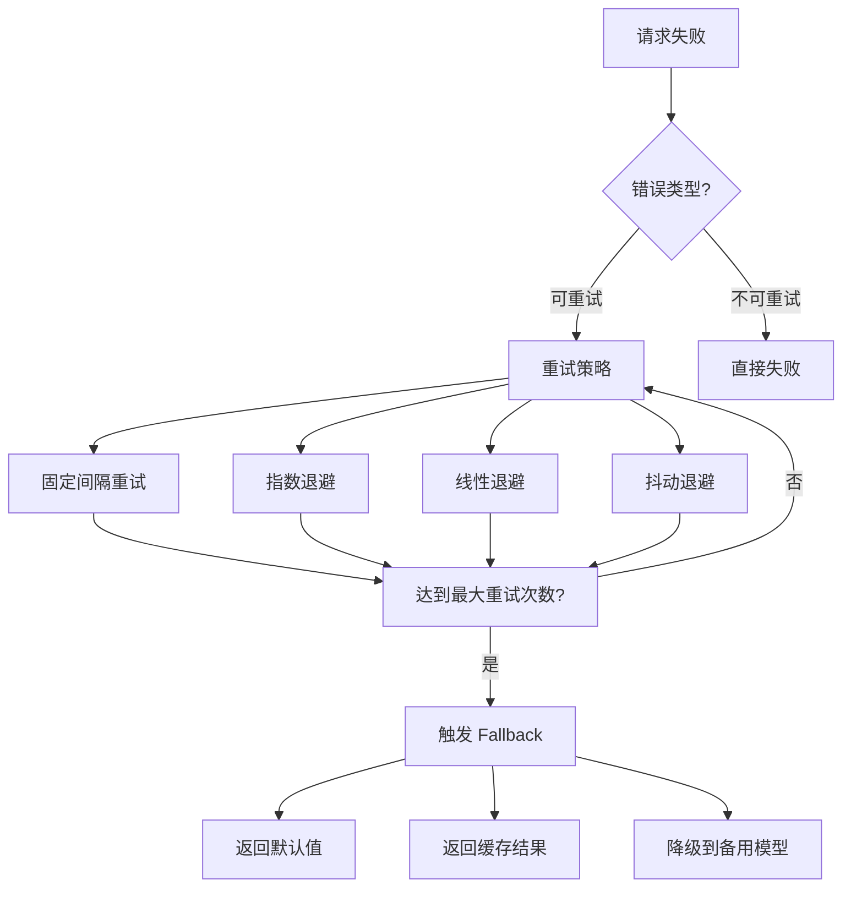

# Agent 重试与容错机制

> 掌握 Agent 系统中的重试策略、退避算法和故障转移设计

---

## 一、概念与原理

### 1.1 为什么需要重试与容错

Agent 系统依赖外部 API（LLM、工具、数据库），这些服务可能出现：
- **瞬时故障**：网络抖动、服务短暂不可用
- **限流错误**：429 Too Many Requests
- **超时错误**：请求处理时间过长
- **内容错误**：模型输出格式异常

**核心思想**：通过自动重试和优雅降级，提高系统可用性和用户体验。

### 1.2 重试策略类型



### 1.3 指数退避算法

**数学公式**：
```
delay = min(base * 2^attempt + jitter, maxDelay)
```

| 参数 | 说明 | 典型值 |
|------|------|--------|
| base | 基础延迟 | 1s |
| attempt | 当前重试次数（从0开始） | - |
| jitter | 随机抖动（避免惊群） | 0-100ms |
| maxDelay | 最大延迟上限 | 60s |

**示例**：
| 重试次数 | 延迟计算 | 实际延迟 |
|----------|----------|----------|
| 0 | 1s | 1s |
| 1 | 2s | 2s |
| 2 | 4s | 4s |
| 3 | 8s | 8s |
| 4 | 16s | 16s |
| 5 | 32s | 32s |

---

## 二、面试题详解

### 题目 1：什么是指数退避？为什么比固定间隔重试更好？

**难度**：初级 ⭐

**考察点**：对重试策略的理解，分布式系统中避免惊群效应的意识

**详细解答**：

**指数退避**是一种重试策略，每次重试的等待时间呈指数增长（1s, 2s, 4s, 8s...）。

**优势对比**：

| 维度 | 固定间隔 | 指数退避 |
|------|----------|----------|
| 瞬时压力 | 高（所有客户端同时重试） | 低（分散重试时间） |
| 服务恢复 | 可能加剧过载 | 给服务恢复时间 |
| 资源利用 | 浪费（频繁无效重试） | 高效（逐步降低频率） |
| 适用场景 | 已知固定恢复时间 | 未知恢复时间 |

**Java 伪代码**：

```java
/**
 * 指数退避重试器
 * 
 * 使用场景：调用外部 API 失败时的自动重试
 * 核心思想：失败次数越多，等待时间越长，避免惊群效应
 */
public class ExponentialBackoffRetry {
    
    private final int maxRetries;      // 最大重试次数
    private final long baseDelayMs;    // 基础延迟（毫秒）
    private final long maxDelayMs;     // 最大延迟上限
    private final double jitterFactor; // 抖动因子（0-1）
    
    public ExponentialBackoffRetry(int maxRetries, long baseDelayMs) {
        this(maxRetries, baseDelayMs, 60000L, 0.1);
    }
    
    public ExponentialBackoffRetry(int maxRetries, long baseDelayMs, 
                                    long maxDelayMs, double jitterFactor) {
        this.maxRetries = maxRetries;
        this.baseDelayMs = baseDelayMs;
        this.maxDelayMs = maxDelayMs;
        this.jitterFactor = jitterFactor;
    }
    
    /**
     * 执行带重试的操作
     * 
     * @param operation 要执行的操作
     * @return 操作结果
     * @throws RetryExhaustedException 重试次数耗尽
     */
    public <T> T executeWithRetry(Callable<T> operation) throws RetryExhaustedException {
        for (int attempt = 0; attempt <= maxRetries; attempt++) {
            try {
                return operation.call();
            } catch (Exception e) {
                if (attempt == maxRetries) {
                    throw new RetryExhaustedException("重试次数耗尽", e);
                }
                
                // 检查是否可重试
                if (!isRetryable(e)) {
                    throw new NonRetryableException("不可重试的错误", e);
                }
                
                // 计算退避时间
                long delay = calculateDelay(attempt);
                
                System.out.printf("第 %d 次重试，等待 %d ms...%n", attempt + 1, delay);
                
                try {
                    Thread.sleep(delay);
                } catch (InterruptedException ie) {
                    Thread.currentThread().interrupt();
                    throw new RetryExhaustedException("重试被中断", ie);
                }
            }
        }
        
        throw new RetryExhaustedException("重试次数耗尽");
    }
    
    /**
     * 计算退避延迟
     */
    private long calculateDelay(int attempt) {
        // 指数计算：base * 2^attempt
        long exponentialDelay = baseDelayMs * (1L << attempt);
        
        // 添加上限
        long delay = Math.min(exponentialDelay, maxDelayMs);
        
        // 添加抖动（避免惊群）
        long jitter = (long) (delay * jitterFactor * Math.random());
        delay += jitter;
        
        return delay;
    }
    
    /**
     * 判断错误是否可重试
     */
    private boolean isRetryable(Exception e) {
        if (e instanceof ApiException) {
            int statusCode = ((ApiException) e).getStatusCode();
            // 可重试：限流(429)、服务端错误(5xx)、超时
            return statusCode == 429 || statusCode >= 500 || statusCode == 408;
        }
        // 网络错误默认可重试
        return e instanceof IOException || e instanceof TimeoutException;
    }
}
```

### 面试回答模板

> 指数退避是一种让重试间隔呈指数增长的策略。它比固定间隔更好，因为：1）分散重试时间，避免所有客户端同时重试造成"惊群效应"；2）给故障服务更多恢复时间；3）减少无效请求，节省资源。

---

### 题目 2：如何设计一个支持 Fallback 的 Agent 调用链？

**难度**：中级 ⭐⭐

**考察点**：容错设计能力，降级策略的思考和实现

**详细解答**：

**Fallback 策略类型**：

| 策略 | 适用场景 | 实现复杂度 |
|------|----------|------------|
| 备用模型 | 主模型不可用 | 中 |
| 缓存结果 | 相同请求重复失败 | 低 |
| 默认值 | 非关键功能 | 低 |
| 简化逻辑 | 复杂功能降级 | 高 |
| 人工介入 | 关键业务场景 | 中 |

**Java 伪代码**：

```java
/**
 * 带 Fallback 的 Agent 调用器
 * 
 * 使用场景：Agent 核心调用链路，确保服务可用性
 * 核心思想：主路径失败时，优雅降级到备用方案
 */
public class ResilientAgentCaller {
    
    private final LLMClient primaryModel;      // 主模型（如 GPT-4）
    private final LLMClient fallbackModel;     // 备用模型（如 GPT-3.5）
    private final ResponseCache cache;          // 响应缓存
    private final ExponentialBackoffRetry retry; // 重试器
    
    public ResilientAgentCaller(LLMClient primary, LLMClient fallback) {
        this.primaryModel = primary;
        this.fallbackModel = fallback;
        this.cache = new ResponseCache();
        this.retry = new ExponentialBackoffRetry(3, 1000);
    }
    
    /**
     * 执行 Agent 调用（带完整容错）
     * 
     * 调用链：主模型 → 重试 → 备用模型 → 缓存 → 默认值
     */
    public AgentResponse callAgent(AgentRequest request) {
        String cacheKey = generateCacheKey(request);
        
        // 1. 尝试主模型 + 重试
        try {
            return retry.executeWithRetry(() -> {
                AgentResponse response = primaryModel.generate(request);
                cache.put(cacheKey, response);
                return response;
            });
        } catch (RetryExhaustedException e) {
            System.err.println("主模型调用失败，尝试 Fallback: " + e.getMessage());
        }
        
        // 2. Fallback 1: 备用模型
        try {
            AgentResponse response = fallbackModel.generate(request);
            response.markAsFallback(); // 标记为降级结果
            return response;
        } catch (Exception e) {
            System.err.println("备用模型也失败: " + e.getMessage());
        }
        
        // 3. Fallback 2: 返回缓存结果
        AgentResponse cached = cache.get(cacheKey);
        if (cached != null) {
            cached.markAsCached();
            return cached;
        }
        
        // 4. Fallback 3: 返回默认值
        return createDefaultResponse(request);
    }
    
    /**
     * 创建默认响应
     */
    private AgentResponse createDefaultResponse(AgentRequest request) {
        return AgentResponse.builder()
            .content("抱歉，服务暂时不可用，请稍后重试。")
            .isDefault(true)
            .timestamp(System.currentTimeMillis())
            .build();
    }
    
    /**
     * 生成缓存键
     */
    private String generateCacheKey(AgentRequest request) {
        return HashUtil.md5(request.getPrompt() + request.getContext());
    }
}

/**
 * 响应缓存（简化版）
 */
public class ResponseCache {
    private final Map<String, CacheEntry> cache = new ConcurrentHashMap<>();
    private final long ttlMs; // 缓存过期时间
    
    public void put(String key, AgentResponse response) {
        cache.put(key, new CacheEntry(response, System.currentTimeMillis()));
    }
    
    public AgentResponse get(String key) {
        CacheEntry entry = cache.get(key);
        if (entry == null) return null;
        
        // 检查过期
        if (System.currentTimeMillis() - entry.timestamp > ttlMs) {
            cache.remove(key);
            return null;
        }
        
        return entry.response;
    }
    
    private static class CacheEntry {
        final AgentResponse response;
        final long timestamp;
        
        CacheEntry(AgentResponse response, long timestamp) {
            this.response = response;
            this.timestamp = timestamp;
        }
    }
}
```

### 面试回答模板

> 设计 Fallback 调用链时，我会采用分层降级策略：1）主模型失败时先重试；2）重试耗尽后切换到备用模型；3）备用模型也失败时返回缓存结果；4）最后返回默认值。每层都要记录日志，便于监控和告警。

---

### 题目 3：如何区分可重试错误和不可重试错误？

**难度**：中级 ⭐⭐

**考察点**：错误分类能力，对不同 HTTP 状态码和异常类型的理解

**详细解答**：

**可重试 vs 不可重试错误**：

| 错误类型 | 可重试？ | 原因 |
|----------|----------|------|
| 429 Too Many Requests | ✅ | 限流，稍后重试即可 |
| 503 Service Unavailable | ✅ | 服务暂时不可用 |
| 502 Bad Gateway | ✅ | 网关问题，通常是暂时的 |
| 500 Internal Server Error | ⚠️ | 服务端错误，可能可重试 |
| 400 Bad Request | ❌ | 请求参数错误，重试无用 |
| 401 Unauthorized | ❌ | 认证失败，需要人工介入 |
| 403 Forbidden | ❌ | 权限不足，重试无用 |
| 404 Not Found | ❌ | 资源不存在 |
| Timeout | ✅ | 网络或处理超时 |
| Connection Reset | ✅ | 连接被重置 |

**Java 伪代码**：

```java
/**
 * 错误分类器
 * 
 * 使用场景：判断错误是否值得重试
 * 核心思想：只有瞬时故障才重试，逻辑错误不重试
 */
public class ErrorClassifier {
    
    /**
     * 判断异常是否可重试
     */
    public static boolean isRetryable(Throwable error) {
        // 1. 网络层错误 - 默认可重试
        if (error instanceof IOException) {
            return true;
        }
        
        // 2. 超时错误 - 可重试
        if (error instanceof TimeoutException) {
            return true;
        }
        
        // 3. HTTP 状态码判断
        if (error instanceof ApiException) {
            int statusCode = ((ApiException) error).getStatusCode();
            return isRetryableHttpStatus(statusCode);
        }
        
        // 4. 业务错误判断
        if (error instanceof BusinessException) {
            String errorCode = ((BusinessException) error).getErrorCode();
            return isRetryableBusinessCode(errorCode);
        }
        
        // 5. 其他错误默认不可重试
        return false;
    }
    
    /**
     * 根据 HTTP 状态码判断
     */
    private static boolean isRetryableHttpStatus(int statusCode) {
        return switch (statusCode) {
            case 408 -> true;  // Request Timeout
            case 429 -> true;  // Too Many Requests (限流)
            case 500 -> true;  // Internal Server Error
            case 502 -> true;  // Bad Gateway
            case 503 -> true;  // Service Unavailable
            case 504 -> true;  // Gateway Timeout
            default -> false;  // 其他状态码不重试
        };
    }
    
    /**
     * 根据业务错误码判断
     */
    private static boolean isRetryableBusinessCode(String errorCode) {
        return switch (errorCode) {
            case "RATE_LIMIT_EXCEEDED" -> true;
            case "SERVICE_TEMPORARILY_UNAVAILABLE" -> true;
            case "TIMEOUT" -> true;
            case "QUOTA_EXCEEDED" -> false;  // 配额超限不重试
            case "INVALID_API_KEY" -> false; // API Key 错误不重试
            default -> false;
        };
    }
}
```

### 面试回答模板

> 区分可重试错误主要看两点：1）是否是瞬时故障（网络、超时、限流）；2）重试是否有意义。429、503、超时等可重试；400、401、403 等逻辑错误不重试。我会维护一个错误码映射表，让判断逻辑清晰可维护。

---

### 题目 4：在 Agent 系统中，如何防止重试风暴压垮下游服务？

**难度**：高级 ⭐⭐⭐

**考察点**：分布式系统设计能力，对级联故障的防范意识

**详细解答**：

**重试风暴的危害**：
- 正常负载：100 QPS
- 故障时：100 QPS × 3 次重试 = 300 QPS
- 服务恢复慢，形成恶性循环

**防护策略**：

| 策略 | 原理 | 实现 |
|------|------|------|
| **断路器** | 失败率达到阈值后快速失败 | Circuit Breaker Pattern |
| **限流** | 控制重试请求的比例 | 令牌桶/漏桶算法 |
| **抖动** | 随机化重试时间 | 添加 jitter |
| **退避上限** | 避免无限等待 | maxDelay 限制 |

**Java 伪代码**：

```java
/**
 * 断路器模式实现
 * 
 * 使用场景：防止故障服务被持续重试压垮
 * 核心思想：失败率过高时"熔断"，快速失败
 */
public class CircuitBreaker {
    
    private enum State { CLOSED, OPEN, HALF_OPEN }
    
    private State state = State.CLOSED;
    private final int failureThreshold;      // 触发熔断的失败次数
    private final long timeoutMs;            // 熔断持续时间
    private final AtomicInteger failureCount = new AtomicInteger(0);
    private volatile long lastFailureTime = 0;
    
    public CircuitBreaker(int failureThreshold, long timeoutMs) {
        this.failureThreshold = failureThreshold;
        this.timeoutMs = timeoutMs;
    }
    
    /**
     * 执行操作（带断路器保护）
     */
    public <T> T execute(Callable<T> operation) throws CircuitBreakerOpenException {
        if (state == State.OPEN) {
            // 检查是否超时，尝试进入半开状态
            if (System.currentTimeMillis() - lastFailureTime > timeoutMs) {
                state = State.HALF_OPEN;
                failureCount.set(0);
            } else {
                throw new CircuitBreakerOpenException("断路器已打开，快速失败");
            }
        }
        
        try {
            T result = operation.call();
            onSuccess();
            return result;
        } catch (Exception e) {
            onFailure();
            throw new RuntimeException(e);
        }
    }
    
    private void onSuccess() {
        if (state == State.HALF_OPEN) {
            // 半开状态下成功，关闭断路器
            state = State.CLOSED;
        }
        failureCount.set(0);
    }
    
    private void onFailure() {
        lastFailureTime = System.currentTimeMillis();
        int failures = failureCount.incrementAndGet();
        
        if (failures >= failureThreshold) {
            state = State.OPEN;
            System.err.println("断路器打开！失败次数: " + failures);
        }
    }
    
    public State getState() {
        return state;
    }
}

/**
 * 带限流的重试器
 * 
 * 使用场景：控制重试流量，保护下游服务
 * 核心思想：只有部分请求可以进入重试队列
 */
public class RateLimitedRetry {
    
    private final RateLimiter rateLimiter;  // 令牌桶限流器
    private final ExponentialBackoffRetry retry;
    
    public RateLimitedRetry(double permitsPerSecond, ExponentialBackoffRetry retry) {
        this.rateLimiter = RateLimiter.create(permitsPerSecond);
        this.retry = retry;
    }
    
    public <T> T execute(Callable<T> operation) {
        return retry.executeWithRetry(() -> {
            // 获取重试令牌
            if (!rateLimiter.tryAcquire()) {
                throw new RateLimitExceededException("重试限流，跳过本次重试");
            }
            return operation.call();
        });
    }
}
```

### 面试回答模板

> 防止重试风暴需要多层防护：1）断路器模式 - 失败率过高时快速失败，给服务恢复时间；2）限流 - 控制重试请求的比例；3）指数退避 + 抖动 - 分散重试时间。三者结合，既保证可用性，又避免压垮下游。

---

## 三、延伸追问

### 追问 1：如果备用模型也失败了，还有什么降级策略？

**简要答案**：
1. **缓存结果**：返回历史相似请求的缓存
2. **简化功能**：关闭非核心功能，保留核心能力
3. **人工介入**：关键业务转人工处理
4. **排队异步**：请求入队，稍后异步处理并通知用户
5. **静态内容**：返回预置的静态响应模板

### 追问 2：如何监控重试和 Fallback 的效果？

**简要答案**：
1. **指标监控**：重试次数、Fallback 触发率、断路器状态
2. **告警阈值**：Fallback 率 > 5% 触发告警
3. **链路追踪**：记录每次重试和降级的决策路径
4. **日志分析**：聚合分析重试模式，发现系统性问题

### 追问 3：指数退避的 maxDelay 设置多大合适？

**简要答案**：
- **用户体验优先**：maxDelay ≤ 5s（用户可接受等待）
- **系统稳定性优先**：maxDelay = 60s（给服务足够恢复时间）
- **混合策略**：前几次快速重试（1s, 2s），后续延长（4s, 8s, 16s）

---

## 四、总结

### 面试回答模板

> **重试与容错**是 Agent 系统高可用的核心机制。关键设计点：
> 1. 使用**指数退避**分散重试压力，避免惊群效应
> 2. 区分**可重试/不可重试**错误，避免无效重试
> 3. 设计**分层 Fallback** 策略，确保服务可用性
> 4. 引入**断路器**防止重试风暴压垮下游
> 5. 添加**监控告警**，及时发现和响应故障

### 一句话记忆

| 概念 | 一句话 |
|------|--------|
| **指数退避** | 失败越多等越久，分散压力防惊群 |
| **Fallback** | 主路径失败时，优雅降级保可用 |
| **断路器** | 失败率过高就熔断，快速失败给恢复时间 |
| **抖动** | 随机加一点延迟，避免所有客户端同时重试 |

---

## 质量检查清单

- [x] 文档结构完整（概念 → 面试题 → 延伸追问 → 总结）
- [x] 4 道面试题，包含详细答案
- [x] 有 Java 代码示例
- [x] 有 mermaid 图表
- [x] 有对比表格
- [x] 有面试回答模板
- [x] 技术概念准确