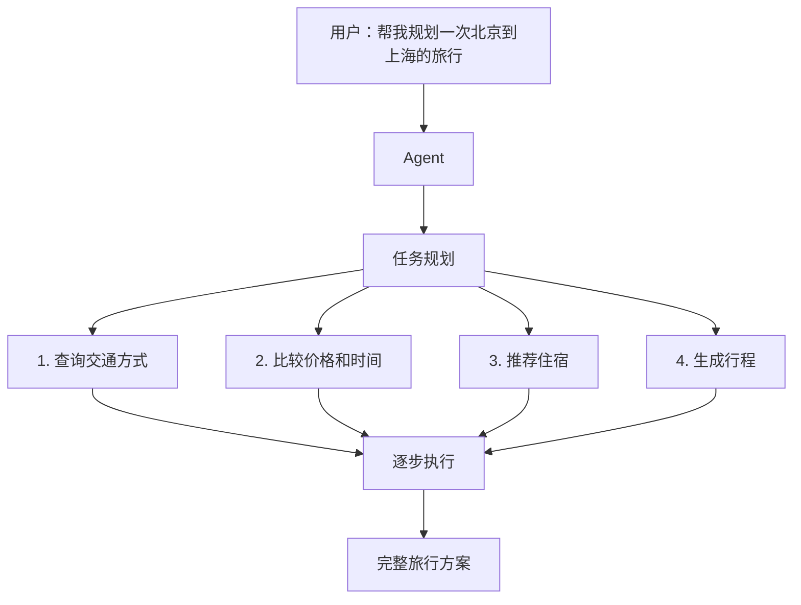
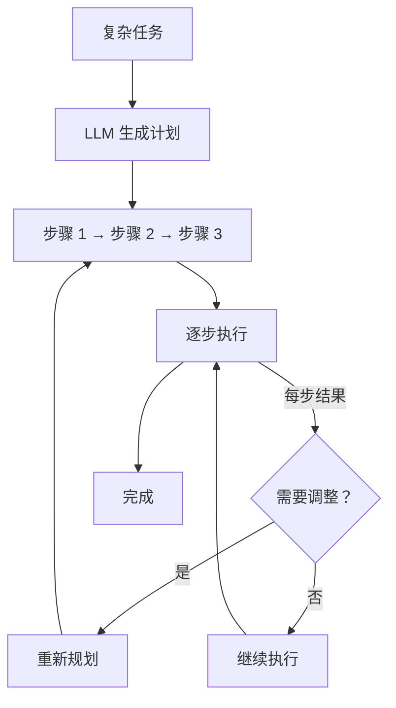
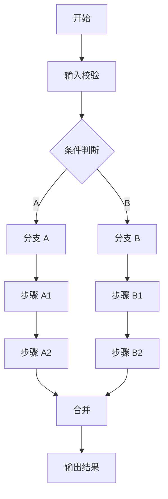
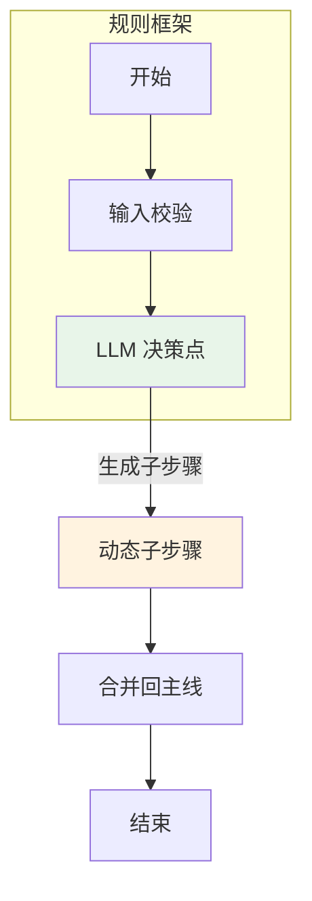
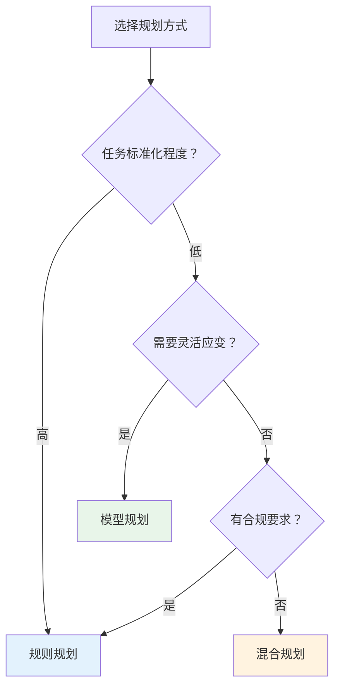
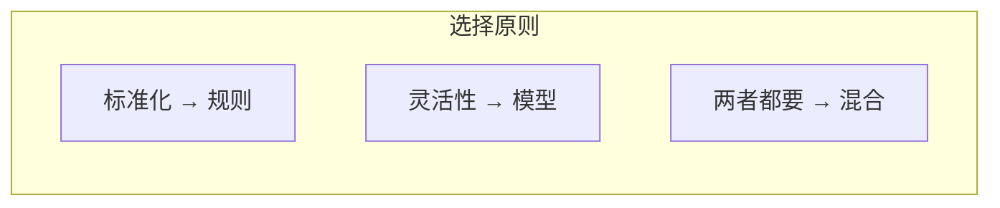

# 任务规划（Task Planning）

## 一、概述

### 1.1 什么是任务规划？

**任务规划**是 Agent 将复杂任务分解为可执行步骤的过程。它是 Agent 自主性的核心体现，决定了 Agent 能否完成多步骤、多依赖的复杂任务。



### 1.2 规划方式对比

| 方式 | 原理 | 优点 | 缺点 |
|------|------|------|------|
| **模型规划** | LLM 直接生成步骤 | 灵活、自适应 | 不可控、可能出错 |
| **规则规划** | 预定义工作流 | 可控、可预测 | 不够灵活 |
| **混合规划** | 规则框架 + 模型填充 | 兼顾两者 | 复杂度较高 |

---

## 二、模型规划（LLM-based Planning）

### 2.1 实现方式

**Plan-and-Solve 范式：**



### 2.2 Java 实现

```java
@Component
public class LLMTaskPlanner {
    
    private final LLMClient llm;
    
    /**
     * 生成任务计划
     */
    public TaskPlan plan(String task, List<Tool> availableTools) {
        String prompt = buildPlanningPrompt(task, availableTools);
        String response = llm.complete(prompt);
        
        return parsePlan(response);
    }
    
    private String buildPlanningPrompt(String task, List<Tool> tools) {
        StringBuilder prompt = new StringBuilder();
        prompt.append("请将以下任务分解为可执行步骤：\n\n");
        prompt.append("任务：").append(task).append("\n\n");
        
        prompt.append("可用工具：\n");
        for (Tool tool : tools) {
            prompt.append(String.format("- %s: %s\n", 
                tool.getName(), tool.getDescription()));
        }
        
        prompt.append("""
            
            请按以下格式输出执行计划：
            {
                "steps": [
                    {
                        "id": 1,
                        "description": "步骤描述",
                        "tool": "工具名（可选）",
                        "dependencies": [],
                        "expected_output": "预期输出"
                    }
                ]
            }
            
            注意：
            - 步骤要有明确的执行顺序
            - 标注步骤间的依赖关系
            - 每个步骤尽量原子化
            """);
        
        return prompt.toString();
    }
    
    private TaskPlan parsePlan(String response) {
        try {
            JsonNode node = objectMapper.readTree(response);
            List<Step> steps = new ArrayList<>();
            
            for (JsonNode stepNode : node.get("steps")) {
                Step step = Step.builder()
                    .id(stepNode.get("id").asInt())
                    .description(stepNode.get("description").asText())
                    .tool(stepNode.has("tool") ? stepNode.get("tool").asText() : null)
                    .dependencies(parseDependencies(stepNode.get("dependencies")))
                    .expectedOutput(stepNode.get("expected_output").asText())
                    .status(StepStatus.PENDING)
                    .build();
                steps.add(step);
            }
            
            return new TaskPlan(steps);
            
        } catch (Exception e) {
            throw new PlanningException("Failed to parse plan", e);
        }
    }
}

/**
 * 任务计划
 */
@Data
@AllArgsConstructor
public class TaskPlan {
    private List<Step> steps;
    
    /**
     * 获取可执行的步骤（依赖已完成的）
     */
    public List<Step> getExecutableSteps() {
        return steps.stream()
            .filter(step -> step.getStatus() == StepStatus.PENDING)
            .filter(step -> step.getDependencies().stream()
                .allMatch(depId -> isStepCompleted(depId)))
            .collect(Collectors.toList());
    }
    
    private boolean isStepCompleted(int stepId) {
        return steps.stream()
            .filter(s -> s.getId() == stepId)
            .anyMatch(s -> s.getStatus() == StepStatus.COMPLETED);
    }
}

/**
 * 执行步骤
 */
@Data
@Builder
public class Step {
    private int id;
    private String description;
    private String tool;           // 需要调用的工具
    private List<Integer> dependencies;  // 依赖的步骤 ID
    private String expectedOutput;
    private StepStatus status;
    private Object result;         // 执行结果
}

enum StepStatus {
    PENDING,      // 待执行
    EXECUTING,    // 执行中
    COMPLETED,    // 已完成
    FAILED        // 失败
}
```

### 2.3 动态重规划

```java
@Component
public class DynamicPlanner {
    
    /**
     * 根据执行结果动态调整计划
     */
    public TaskPlan replan(TaskPlan currentPlan, Step failedStep, String reason) {
        // 分析失败原因
        if (isRetryable(failedStep, reason)) {
            // 重试即可
            failedStep.setStatus(StepStatus.PENDING);
            return currentPlan;
        }
        
        // 需要重新规划
        String context = buildReplanContext(currentPlan, failedStep, reason);
        return llmPlanner.plan(context, availableTools);
    }
    
    private boolean isRetryable(Step step, String reason) {
        // 网络错误、超时等可重试
        return reason.contains("timeout") || reason.contains("network");
    }
}
```

---

## 三、规则规划（Rule-based Planning）

### 3.1 工作流定义



### 3.2 Java 实现

```java
@Component
public class WorkflowEngine {
    
    private final Map<String, Workflow> workflows;
    
    /**
     * 执行工作流
     */
    public WorkflowResult execute(String workflowName, Map<String, Object> context) {
        Workflow workflow = workflows.get(workflowName);
        if (workflow == null) {
            throw new WorkflowNotFoundException(workflowName);
        }
        
        WorkflowInstance instance = new WorkflowInstance(workflow, context);
        
        while (!instance.isCompleted()) {
            Node currentNode = instance.getCurrentNode();
            
            // 执行节点
            NodeResult result = executeNode(currentNode, context);
            
            // 确定下一个节点
            Node nextNode = determineNextNode(workflow, currentNode, result);
            instance.setCurrentNode(nextNode);
            
            // 保存执行历史
            instance.addExecutionHistory(currentNode, result);
        }
        
        return instance.getResult();
    }
    
    private NodeResult executeNode(Node node, Map<String, Object> context) {
        switch (node.getType()) {
            case TASK:
                return executeTaskNode(node, context);
            case DECISION:
                return executeDecisionNode(node, context);
            case PARALLEL:
                return executeParallelNode(node, context);
            default:
                throw new UnsupportedOperationException("Unknown node type");
        }
    }
    
    private NodeResult executeDecisionNode(Node node, Map<String, Object> context) {
        // 评估条件
        for (ConditionBranch branch : node.getBranches()) {
            if (evaluateCondition(branch.getCondition(), context)) {
                return NodeResult.builder()
                    .nextNodeId(branch.getTargetNodeId())
                    .build();
            }
        }
        
        // 默认分支
        return NodeResult.builder()
            .nextNodeId(node.getDefaultBranch())
            .build();
    }
}

/**
 * 工作流定义
 */
@Data
public class Workflow {
    private String name;
    private String description;
    private Node startNode;
    private Map<String, Node> nodes;
}

/**
 * 工作流节点
 */
@Data
@Builder
public class Node {
    private String id;
    private NodeType type;
    private String name;
    private Map<String, Object> config;
    private List<ConditionBranch> branches;  // 决策节点用
    private String defaultBranch;
}

enum NodeType {
    START,      // 开始
    TASK,       // 任务
    DECISION,   // 决策
    PARALLEL,   // 并行
    END         // 结束
}
```

---

## 四、混合规划

### 4.1 设计思想

**规则框架 + 模型填充：**



### 4.2 实现示例

```java
@Component
public class HybridPlanner {
    
    private final WorkflowEngine workflowEngine;
    private final LLMTaskPlanner llmPlanner;
    
    /**
     * 混合规划执行
     */
    public TaskResult execute(String task, String workflowTemplate) {
        // 1. 加载规则框架
        Workflow workflow = workflowEngine.load(workflowTemplate);
        
        // 2. 在决策点使用 LLM 生成动态步骤
        WorkflowResult result = workflowEngine.execute(workflow, Map.of(
            "task", task,
            "planner", llmPlanner  // 注入 LLM 规划器
        ));
        
        return result;
    }
}

/**
 * 动态规划节点
 */
@Component
public class DynamicPlanningNode implements NodeExecutor {
    
    @Override
    public NodeResult execute(Node node, Map<String, Object> context) {
        String subTask = (String) context.get("current_sub_task");
        LLMTaskPlanner planner = (LLMTaskPlanner) context.get("planner");
        
        // 使用 LLM 生成子计划
        TaskPlan subPlan = planner.plan(subTask, getAvailableTools());
        
        // 将子计划嵌入到当前工作流
        return NodeResult.builder()
            .data(subPlan)
            .nextNodeId("execute_sub_plan")
            .build();
    }
}
```

---

## 五、规划策略选择

### 5.1 决策矩阵

| 场景特征 | 推荐方式 | 原因 |
|---------|---------|------|
| **标准化流程** | 规则规划 | 可控、可审计 |
| **探索性任务** | 模型规划 | 灵活、自适应 |
| **合规要求严** | 规则规划 | 可追溯 |
| **快速迭代** | 模型规划 | 无需改代码 |
| **复杂依赖** | 混合规划 | 框架可控 + 细节灵活 |

### 5.2 选择流程



---

## 六、面试题详解

### 题目 1：模型规划和规则规划怎么选？

#### 考察点
- 技术选型能力
- 场景分析能力

#### 详细解答

**核心原则：**



**具体场景：**

| 场景 | 选择 | 理由 |
|------|------|------|
| 银行审批流程 | 规则 | 合规、可审计 |
| 客服对话 | 模型 | 开放域、需应变 |
| 代码生成 Agent | 混合 | 框架固定 + 逻辑灵活 |

---

### 题目 2：如何处理规划失败（生成的步骤无法执行）？

#### 考察点
- 容错设计
- 降级策略

#### 详细解答

**失败类型与处理：**

| 失败类型 | 处理策略 |
|---------|---------|
| **步骤不存在** | 跳过 + 告警 |
| **参数错误** | 重试生成 |
| **依赖缺失** | 补全依赖或重规划 |
| **执行超时** | 超时处理 + 标记失败 |

**实现：**

```java
public class PlanExecutor {
    
    public ExecutionResult executeWithFallback(TaskPlan plan) {
        for (Step step : plan.getSteps()) {
            try {
                executeStep(step);
            } catch (StepNotFoundException e) {
                // 跳过并记录
                log.warn("Step not found, skipping: {}", step.getId());
                step.setStatus(StepStatus.SKIPPED);
            } catch (ParameterValidationException e) {
                // 重试生成
                Step regenerated = regenerateStep(step);
                executeStep(regenerated);
            } catch (ExecutionTimeoutException e) {
                // 标记失败
                step.setStatus(StepStatus.FAILED);
                if (step.isCritical()) {
                    return ExecutionResult.failure("Critical step failed");
                }
            }
        }
        
        return ExecutionResult.success();
    }
}
```

---

### 题目 3：如何评估规划质量？

#### 考察点
- 评估指标设计
- 持续优化意识

#### 详细解答

**离线指标：**

| 指标 | 计算方式 |
|------|---------|
| 计划完成率 | 成功完成的计划 / 总计划 |
| 步骤有效率 | 有效步骤 / 总步骤 |
| 重规划次数 | 平均每个计划的重规划次数 |

**在线指标：**

| 指标 | 监控方式 |
|------|---------|
| 任务成功率 | 日志统计 |
| 用户满意度 | 反馈收集 |
| 平均执行时间 | 性能监控 |

---

## 七、延伸追问

1. **"如何防止模型生成循环依赖的计划？"**
   - 拓扑排序验证
   - 依赖图检测环
   - 最大深度限制

2. **"规划结果如何缓存复用？"**
   - 相似任务匹配
   - 计划模板化
   - 参数化复用

3. **"多 Agent 协作时的任务规划？"**
   - 全局规划器分配子任务
   - 各 Agent 本地规划
   - 冲突协调机制