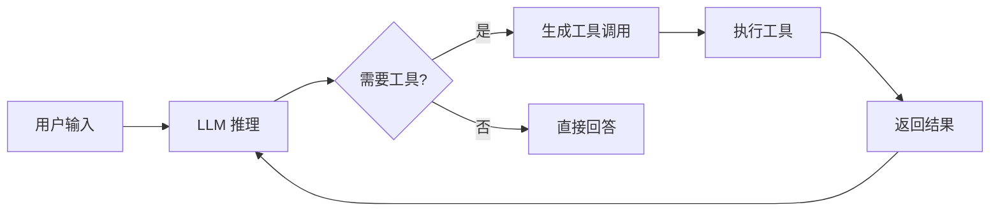
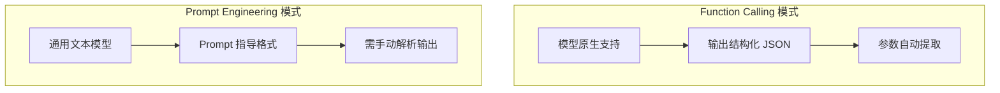
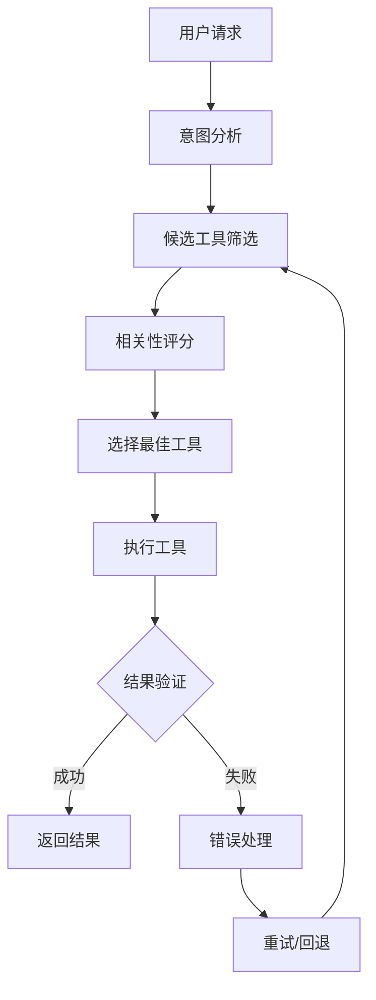

# Agent 工具使用设计模式详解

> 工具使用（Tool Use）是 Agent 系统的核心能力，理解其设计模式和最佳实践对于构建可靠的 Agent 至关重要。

---

## 一、概念与原理

### 1.1 什么是 Tool Use？

**Tool Use** 是指大语言模型（LLM）在推理过程中识别需要调用外部工具，并生成相应的工具调用指令的能力。



**核心能力：**
- **意图识别**：判断何时需要调用工具
- **工具选择**：从可用工具中选择最合适的
- **参数填充**：正确提取和填充工具参数
- **结果整合**：将工具返回结果融入后续推理

### 1.2 Tool Use 的两种实现模式

| 模式 | 描述 | 优点 | 缺点 |
|-----|------|-----|------|
| **Function Calling** | 模型原生支持，输出结构化调用指令 | 可靠、格式标准 | 依赖模型能力 |
| **Prompt Engineering** | 通过 Prompt 指导模型生成工具调用 | 通用性强 | 可靠性较低 |

### 1.3 工具定义格式

```java
/**
 * 工具定义标准格式（OpenAI Function Calling 风格）
 */
public class ToolDefinition {
    
    private String name;                    // 工具名称
    private String description;             // 工具描述（模型用）
    private JsonSchema parameters;          // 参数 JSON Schema
    
    // 示例：天气查询工具
    public static ToolDefinition weatherTool() {
        return ToolDefinition.builder()
            .name("get_weather")
            .description("获取指定城市的天气信息")
            .parameters(JsonSchema.builder()
                .type("object")
                .required(List.of("city"))
                .properties(Map.of(
                    "city", JsonSchema.builder()
                        .type("string")
                        .description("城市名称，如'北京'、'Shanghai'")
                        .build(),
                    "date", JsonSchema.builder()
                        .type("string")
                        .description("日期，格式 YYYY-MM-DD，默认为今天")
                        .build()
                ))
                .build())
            .build();
    }
}
```

---

## 二、面试题详解

### 题目 1：Function Calling 和 Prompt Engineering 两种 Tool Use 模式有什么区别？（初级）

**题目描述：**
请对比 Function Calling 和 Prompt Engineering 两种实现 Tool Use 的方式，说明各自的优缺点和适用场景。

**考察点：**
- 对 Tool Use 实现方式的理解
- 方案选型的判断能力

**详细解答：**

**实现方式对比：**



**详细对比：**

| 维度 | Function Calling | Prompt Engineering |
|-----|------------------|-------------------|
| **实现方式** | 模型原生能力 | 通过 Prompt 引导 |
| **输出格式** | 结构化 JSON | 自由文本，需约定格式 |
| **可靠性** | 高（格式保证） | 中（依赖模型遵循） |
| **模型要求** | 需要支持 FC 的模型 | 任意文本模型 |
| **灵活性** | 受限于预定义格式 | 高度灵活 |
| **调试难度** | 低 | 高 |
| **成本** | 可能更高（专用模型） | 通用模型即可 |

**适用场景：**

| 场景 | 推荐方案 | 原因 |
|-----|---------|------|
| 生产环境 | Function Calling | 可靠性优先 |
| 原型验证 | Prompt Engineering | 快速迭代 |
| 不支持 FC 的模型 | Prompt Engineering | 唯一选择 |
| 复杂工具链 | Function Calling | 结构化管理 |
| 需要高度定制 | Prompt Engineering | 灵活可控 |

---

### 题目 2：如何设计 Agent 的工具选择策略？（中级）

**题目描述：**
请设计一个工具选择策略，使 Agent 能够在多个可用工具中选择最合适的工具，并处理工具选择错误的情况。

**考察点：**
- 工具选择策略设计
- 错误处理和恢复机制

**详细解答：**

**工具选择架构：**



**实现方案：**

```java
/**
 * 智能工具选择器
 */
public class SmartToolSelector {
    
    private final List<Tool> availableTools;
    private final LLMClient llm;
    
    /**
     * 工具选择流程
     */
    public ToolSelection selectTool(String userIntent, Context context) {
        // 步骤 1: 候选工具筛选（快速过滤）
        List<Tool> candidates = filterCandidates(userIntent);
        
        // 步骤 2: 基于 LLM 的相关性评分
        List<ScoredTool> scored = scoreByLLM(userIntent, candidates);
        
        // 步骤 3: 选择最佳工具
        Tool selected = selectBest(scored);
        
        // 步骤 4: 计算置信度
        double confidence = calculateConfidence(scored);
        
        return new ToolSelection(selected, confidence, scored);
    }
    
    /**
     * 错误恢复策略
     */
    public ToolResult executeWithRecovery(ToolSelection selection, ToolCall call) {
        int maxRetries = 3;
        
        for (int attempt = 0; attempt < maxRetries; attempt++) {
            try {
                ToolResult result = executeTool(call);
                if (isValidResult(result)) {
                    return result;
                }
                // 结果无效，尝试修复参数
                call = correctParameters(call, result);
            } catch (ToolExecutionException e) {
                if (attempt == maxRetries - 1) {
                    // 尝试备选工具
                    return tryAlternativeTool(selection);
                }
            }
        }
        throw new ToolExecutionException("所有重试失败");
    }
}
```

**错误处理策略：**

| 错误类型 | 处理策略 | 说明 |
|---------|---------|------|
| 参数错误 | 自动修正重试 | 根据错误信息修正参数格式 |
| 工具不可用 | 切换到备选工具 | 选择相关性次高的工具 |
| 超时错误 | 指数退避重试 | 2s, 4s, 8s 间隔重试 |
| 结果无效 | 请求澄清 | 向用户确认意图 |

---

### 题目 3：Tool Use 中的参数提取有哪些常见问题？如何解决？（中级）

**题目描述：**
请说明在 Tool Use 中参数提取阶段的常见问题，以及相应的解决方案。

**考察点：**
- 参数提取的难点理解
- 工程实践中的解决方案

**详细解答：**

**常见问题及解决方案：**

```java
/**
 * 参数提取处理器
 */
public class ParameterExtractor {
    
    /**
     * 问题 1: 参数缺失
     * 解决：必填参数校验 + 主动询问
     */
    public ExtractionResult extractWithValidation(String userInput, Tool tool) {
        Map<String, Object> params = extractParameters(userInput, tool);
        
        // 检查必填参数
        List<String> missing = new ArrayList<>();
        for (String required : tool.getRequiredParams()) {
            if (!params.containsKey(required) || params.get(required) == null) {
                missing.add(required);
            }
        }
        
        if (!missing.isEmpty()) {
            return ExtractionResult.missing(missing, buildClarificationPrompt(missing));
        }
        
        return ExtractionResult.success(params);
    }
    
    /**
     * 问题 2: 参数类型错误
     * 解决：类型转换 + 校验
     */
    public Object convertType(String value, String targetType) {
        try {
            switch (targetType) {
                case "integer":
                    return Integer.parseInt(value);
                case "number":
                    return Double.parseDouble(value);
                case "boolean":
                    return Boolean.parseBoolean(value);
                case "date":
                    return LocalDate.parse(value);
                default:
                    return value;
            }
        } catch (Exception e) {
            throw new ParameterConversionException(value, targetType, e);
        }
    }
    
    /**
     * 问题 3: 歧义参数
     * 解决：多轮澄清
     */
    public ExtractionResult handleAmbiguity(String userInput, List<Parameter> ambiguous) {
        // 识别歧义
        Map<Parameter, List<String>> candidates = new HashMap<>();
        
        for (Param param : ambiguous) {
            List<String> possible = extractCandidates(userInput, param);
            if (possible.size() > 1) {
                candidates.put(param, possible);
            }
        }
        
        if (!candidates.isEmpty()) {
            return ExtractionResult.ambiguous(candidates, buildDisambiguationPrompt(candidates));
        }
        
        return ExtractionResult.success(extractParameters(userInput));
    }
}
```

**参数提取策略对比：**

| 策略 | 优点 | 缺点 | 适用场景 |
|-----|------|------|---------|
| **直接提取** | 简单快速 | 容易出错 | 简单明确的输入 |
| **LLM 辅助** | 准确率高 | 成本高 | 复杂自然语言 |
| **规则匹配** | 可控性强 | 维护成本高 | 结构化输入 |
| **混合策略** | 平衡效果 | 实现复杂 | 生产环境 |

---

## 三、延伸追问

### 追问 1：如何处理工具调用的并发和顺序依赖？

**简要答案：**
- **依赖图分析**：构建工具调用 DAG（有向无环图）
- **并行执行**：无依赖的工具并行调用
- **顺序保证**：通过依赖关系确定执行顺序
