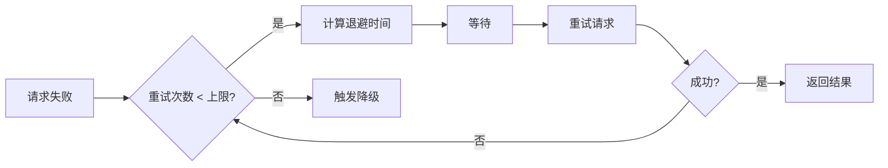
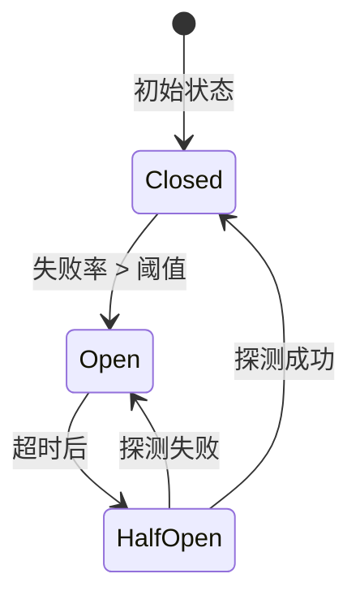
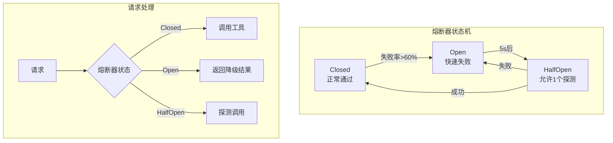
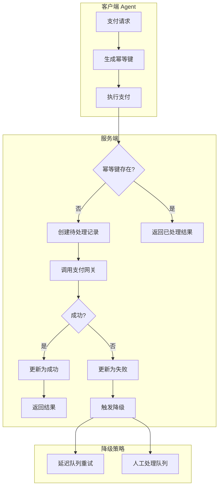

# Retry & Fallback 机制

> Agent 系统的容错设计与弹性架构核心机制

---

## 一、概念与原理

### 1.1 为什么需要重试与降级

在 AI Agent 系统中，以下场景频繁发生：
- **LLM API 限流**：OpenAI/Claude API 返回 429 Too Many Requests
- **网络抖动**：调用外部工具时连接超时
- **服务降级**：向量数据库或搜索引擎临时不可用
- **模型幻觉**：LLM 返回格式错误的工具调用参数

**核心目标**：提升系统可用性，将部分故障转化为可接受的降级体验。

### 1.2 核心机制概述

| 机制 | 作用 | 适用场景 |
|------|------|----------|
| **Retry（重试）** | 临时故障自动恢复 | 网络超时、限流、偶发错误 |
| **Backoff（退避）** | 控制重试频率，避免雪崩 | 配合重试使用 |
| **Circuit Breaker（熔断）** | 防止故障扩散 | 下游服务持续不可用 |
| **Fallback（降级）** | 提供备选方案 | 主路径失败时的兜底 |

### 1.3 指数退避算法（Exponential Backoff）

**原理**：每次重试等待时间指数增长，避免瞬间压垮服务。

```
等待时间 = min(base * 2^attempt + jitter, maxDelay)
```

- `base`：初始等待时间（如 1s）
- `attempt`：当前重试次数（从 0 开始）
- `jitter`：随机抖动（避免惊群效应）
- `maxDelay`：最大等待时间上限



### 1.4 熔断器模式（Circuit Breaker）

三种状态转换：



| 状态 | 行为 |
|------|------|
| **Closed（关闭）** | 正常放行请求，统计失败率 |
| **Open（打开）** | 快速失败，直接返回降级结果 |
| **Half-Open（半开）** | 放行少量探测请求，验证恢复 |

### 1.5 降级策略（Fallback）

**设计原则**：
1. **业务有损但可用**：牺牲部分功能保证核心流程
2. **快速响应**：降级路径必须比主路径更快
3. **可观测**：降级触发必须记录日志和监控

**常见降级方式**：
| 场景 | 主方案 | 降级方案 |
|------|--------|----------|
| LLM 调用 | GPT-4 | GPT-3.5 / 本地模型 |
| 向量检索 | 语义检索 | 关键词匹配 |
| 工具调用 | 精确 API | 模拟数据 / 缓存结果 |
| 多步推理 | CoT 深度思考 | 直接回答 |

### 1.6 幂等性（Idempotency）

**关键问题**：重试可能导致重复操作（如重复扣款、重复发送）。

**幂等性保障策略**：
1. **幂等键（Idempotency Key）**：客户端生成唯一标识，服务端去重
2. **状态机设计**：操作具有幂等状态（如 "已处理" 不再执行）
3. **乐观锁**：版本号控制，防止并发覆盖

---

## 二、面试题详解

### 题目 1（初级）：重试机制基础

**问题**：在 Agent 系统中调用 LLM API 时，为什么要使用指数退避重试而不是固定间隔重试？

#### 考察点
- 对重试策略的理解
- 对服务保护机制的认识
- 分布式系统基础概念

#### 详细解答

**固定间隔的问题**：
1. **惊群效应（Thundering Herd）**：所有失败请求同时重试，瞬间打垮服务
2. **无差别压力**：不考虑服务恢复时间，持续均匀施压
3. **资源浪费**：服务完全不可用时仍按固定频率重试

**指数退避的优势**：
1. **自动扩散**：等待时间指数增长，自然分散请求密度
2. **给服务恢复时间**：长间隔允许下游服务从过载中恢复
3. **可配置上限**：通过 maxDelay 防止无限等待

**Java 伪代码示例**：

```java
/**
 * 指数退避重试执行器
 * 
 * 使用场景：LLM API 调用、外部工具调用
 * 核心思想：失败时指数级增加等待时间，避免雪崩
 */
public class ExponentialBackoffRetry {
    
    // 配置参数
    private final long baseDelayMs = 1000;      // 初始等待 1s
    private final long maxDelayMs = 30000;      // 最大等待 30s
    private final int maxRetries = 5;           // 最大重试次数
    private final double jitterFactor = 0.1;    // 10% 随机抖动
    
    /**
     * 执行带重试的操作
     * 
     * @param operation 要执行的操作
     * @return 操作结果
     * @throws RetryExhaustedException 重试耗尽后抛出
     */
    public <T> T executeWithRetry(RetryableOperation<T> operation) {
        int attempt = 0;
        Exception lastException = null;
        
        while (attempt <= maxRetries) {
            try {
                // 尝试执行
                return operation.execute();
            } catch (RetryableException e) {
                lastException = e;
                
                if (attempt == maxRetries) {
                    break; // 重试次数耗尽
                }
                
                // 计算退避时间
                long delay = calculateDelay(attempt);
                
                // 记录日志
                System.out.printf("Attempt %d failed: %s, retrying in %dms...%n", 
                    attempt + 1, e.getMessage(), delay);
                
                // 等待
                try {
                    Thread.sleep(delay);
                } catch (InterruptedException ie) {
                    Thread.currentThread().interrupt();
                    throw new RuntimeException("Retry interrupted", ie);
                }
                
                attempt++;
            }
        }
        
        throw new RetryExhaustedException(
            "Max retries exhausted after " + maxRetries + " attempts", lastException);
    }
    
    /**
     * 计算退避时间（指数退避 + 抖动）
     */
    private long calculateDelay(int attempt) {
        // 指数部分：base * 2^attempt
        long exponential = baseDelayMs * (1L << attempt);
        
        // 添加上限
        long delay = Math.min(exponential, maxDelayMs);
        
        // 添加随机抖动（±10%）
        double jitter = 1.0 + (Math.random() * 2 - 1) * jitterFactor;
        return (long) (delay * jitter);
    }
}

/**
 * 可重试的操作接口
 */
@FunctionalInterface
public interface RetryableOperation<T> {
    T execute() throws RetryableException;
}

/**
 * 可重试的异常（标记性异常）
 */
public class RetryableException extends Exception {
    public RetryableException(String message, Throwable cause) {
        super(message, cause);
    }
}
```

#### 延伸追问

**Q1：抖动（Jitter）的作用是什么？**
> 防止多个并发失败请求在同一时刻重试。例如 100 个请求同时失败，无抖动时会同时重试，有抖动时会分散在 ±10% 时间窗口内。

**Q2：什么情况下不应该重试？**
> - 4xx 客户端错误（如 400 Bad Request）：重试无用
> - 幂等性无法保证的操作：可能导致重复副作用
> - 超时时间极短的场景：重试成本大于收益

---

### 题目 2（中级）：熔断器设计

**问题**：设计一个熔断器（Circuit Breaker）来保护 Agent 系统的工具调用模块。请说明状态转换逻辑和关键配置参数。

#### 考察点
- 熔断器模式的理解
- 状态机设计能力
- 容错架构设计经验

#### 详细解答

**核心设计**：



**关键配置参数**：

| 参数 | 说明 | 典型值 |
|------|------|--------|
| `failureThreshold` | 触发熔断的失败率阈值 | 50%-60% |
| `slowCallThreshold` | 慢调用阈值（超时判定） | 5s |
| `slowCallRate` | 慢调用比例阈值 | 80% |
| `waitDurationInOpen` | Open 状态持续时间 | 10s-30s |
| `permittedCallsInHalfOpen` | HalfOpen 允许探测数 | 1-3 |

**Java 伪代码示例**：

```java
/**
 * 熔断器实现 - 保护工具调用模块
 * 
 * 使用场景：外部 API 调用、数据库查询、LLM 调用
 * 核心思想：失败率达到阈值后快速失败，防止故障扩散
 */
public class CircuitBreaker {
    
    // 配置参数
    private final int failureThresholdPercent = 60;     // 失败率阈值
    private final int minCallThreshold = 10;            // 最小统计样本
    private final long openStateDurationMs = 10000;     // Open 状态持续 10s
    private final int halfOpenPermits = 1;              // HalfOpen 允许 1 个探测
    
    // 状态
    private volatile State state = State.CLOSED;
    private volatile long lastFailureTime = 0;
    private final AtomicInteger halfOpenCount = new AtomicInteger(0);
    
    // 统计窗口（滑动窗口，最近 1 分钟）
    private final SlidingWindowStats stats = new SlidingWindowStats(60);
    
    enum State {
        CLOSED,      // 关闭 - 正常放行
        OPEN,        // 打开 - 快速失败
        HALF_OPEN    // 半开 - 有限探测
    }
    
    /**
     * 执行受保护的调用
     */
    public <T> T execute(Supplier<T> operation, Supplier<T> fallback) {
        switch (state) {
            case CLOSED:
                return executeClosed(operation, fallback);
            case OPEN:
                return executeOpen(fallback);
            case HALF_OPEN:
                return executeHalfOpen(operation, fallback);
            default:
                throw new IllegalStateException("Unknown state: " + state);
        }
    }
    
    /**
     * Closed 状态：正常执行，收集统计
     */
    private <T> T executeClosed(Supplier<T> operation, Supplier<T> fallback) {
        try {
            T result = operation.get();
            stats.recordSuccess();
            return result;
        } catch (Exception e) {
            stats.recordFailure();
            
            // 检查是否需要熔断
            if (shouldOpen()) {
                transitionToOpen();
            }
            
            // 首次失败尝试降级
            return fallback.get();
        }
    }
    
    /**
     * Open 状态：快速失败，检查是否超时
     */
    private <T> T executeOpen(Supplier<T> fallback) {
        // 检查是否已过冷却期
        if (System.currentTimeMillis() - lastFailureTime > openStateDurationMs) {
            transitionToHalfOpen();
            // 重试一次（递归到 HALF_OPEN 分支）
            throw new IllegalStateException("Should retry in HALF_OPEN");
        }
        
        // 快速失败，直接降级
        System.out.println("CircuitBreaker is OPEN, returning fallback");
        return fallback.get();
    }
    
    /**
     * HalfOpen 状态：有限探测
     */
    private <T> T executeHalfOpen(Supplier<T> operation, Supplier<T> fallback) {
        // 获取探测许可
        if (halfOpenCount.incrementAndGet() > halfOpenPermits) {
            halfOpenCount.decrementAndGet();
            return fallback.get(); // 探测名额已满
        }
        
        try {
            T result = operation.get();
            // 探测成功，关闭熔断器
            transitionToClosed();
            return result;
        } catch (Exception e) {
            // 探测失败，重新打开
            transitionToOpen();
            return fallback.get();
        }
    }
    
    /**
     * 判断是否触发熔断
     */
    private boolean shouldOpen() {
        int total = stats.getTotalCalls();
        if (total < minCallThreshold) {
            return false; // 样本不足
        }
        
        int failureRate = (stats.getFailures() * 100) / total;
        return failureRate >= failureThresholdPercent;
    }
    
    /**
     * 状态转换方法
     */
    private void transitionToOpen() {
        state = State.OPEN;
        lastFailureTime = System.currentTimeMillis();
        System.out.println("CircuitBreaker transitioned to OPEN");
        // 触发告警（发送到监控系统）
    }
    
    private void transitionToHalfOpen() {
        state = State.HALF_OPEN;
        halfOpenCount.set(0);
        System.out.println("CircuitBreaker transitioned to HALF_OPEN");
    }
    
    private void transitionToClosed() {
        state = State.CLOSED;
        stats.reset();
        System.out.println("CircuitBreaker transitioned to CLOSED");
    }
}

/**
 * 滑动窗口统计（简化版）
 */
class SlidingWindowStats {
    private final AtomicInteger successes = new AtomicInteger(0);
    private final AtomicInteger failures = new AtomicInteger(0);
    
    public SlidingWindowStats(int windowSeconds) {
        // 实际实现应使用环形缓冲区，支持时间衰减
    }
    
    public void recordSuccess() {
        successes.incrementAndGet();
    }
    
    public void recordFailure() {
        failures.incrementAndGet();
    }
    
    public int getTotalCalls() {
        return successes.get() + failures.get();
    }
    
    public int getFailures() {
        return failures.get();
    }
    
    public void reset() {
        successes.set(0);
        failures.set(0);
    }
}

// ============ Agent 工具调用场景示例 ============

/**
 * 受熔断器保护的工具调用服务
 */
public class ProtectedToolService {
    
    private final CircuitBreaker circuitBreaker = new CircuitBreaker();
    private final ToolRegistry toolRegistry;
    
    public ProtectedToolService(ToolRegistry registry) {
        this.toolRegistry = registry;
    }
    
    /**
     * 调用工具（带熔断保护）
     */
    public ToolResult invokeTool(String toolName, Map<String, Object> params) {
        return circuitBreaker.execute(
            // 主操作：实际调用工具
            () -> {
                Tool tool = toolRegistry.get(toolName);
                return tool.execute(params);
            },
            // 降级操作：返回模拟结果或缓存
            () -> {
                System.out.println("Tool " + toolName + " is unavailable, using fallback");
                return ToolResult.fallback("Service temporarily unavailable, " +
                    "please try again later or use alternative tool");
            }
        );
    }
}
```

#### 延伸追问

**Q1：熔断器和重试机制如何配合使用？**
> 熔断器在宏观层面保护服务，重试在微观层面处理瞬态故障。典型流程：
> 1. 单次调用失败 → 指数退避重试 3 次
> 2. 重试仍失败 → 熔断器统计失败
> 3. 失败率超阈值 → 熔断器打开，快速失败
> 4. 冷却期后 → 熔断器半开，有限探测

**Q2：如何避免 HalfOpen 状态的探测请求压垮恢复中的服务？**
> - 限制探测并发数（如每秒 1 个）
> - 使用指数退避的探测间隔
> - 探测成功后逐步放量（渐进式恢复）

---

### 题目 3（高级）：幂等性与降级策略设计

**问题**：设计一个支持幂等重试的 Agent 支付工具调用系统。要求：
1. 同一笔支付请求多次调用不会产生重复扣款
2. 支付服务不可用时能优雅降级
3. 提供完整的 Java 实现思路

#### 考察点
- 幂等性设计能力
- 分布式事务理解
- 降级策略的工程实现

#### 详细解答

**系统架构**：



**幂等性保障机制**：

| 层级 | 机制 | 实现 |
|------|------|------|
| 客户端 | 幂等键生成 | `idempotency-key: userId + orderId + timestamp` |
| 服务端 | 去重表 | 唯一索引 `(idempotency_key, operation)` |
| 服务端 | 状态机 | `PENDING → SUCCESS/FAILURE` |
| 服务端 | 过期清理 | TTL 7 天自动清理 |

**Java 伪代码示例**：

```java
/**
 * 幂等支付服务
 * 
 * 使用场景：Agent 调用支付工具（如 Stripe、支付宝）
 * 核心思想：幂等键 + 状态机 + 降级策略
 */
public class IdempotentPaymentService {
    
    private final PaymentGateway gateway;
    private final IdempotencyStore idempotencyStore;
    private final CircuitBreaker circuitBreaker;
    private final DelayedRetryQueue retryQueue;
    
    public IdempotentPaymentService(PaymentGateway gateway) {
        this.gateway = gateway;
        this.idempotencyStore = new RedisIdempotencyStore();
        this.circuitBreaker = new CircuitBreaker();
        this.retryQueue = new DelayedRetryQueue();
    }
    
    /**
     * 执行幂等支付
     * 
     * @param request 支付请求
     * @return 支付结果
     */
    public PaymentResult processPayment(PaymentRequest request) {
        // 1. 生成幂等键
        String idempotencyKey = generateIdempotencyKey(request);
        
        // 2. 检查是否已处理
        PaymentRecord existing = idempotencyStore.get(idempotencyKey);
        if (existing != null) {
            // 已存在，直接返回结果（幂等命中）
            return PaymentResult.fromRecord(existing);
        }
        
        // 3. 创建待处理记录（乐观锁）
        PaymentRecord record = new PaymentRecord(
            idempotencyKey,
            request.getAmount(),
            request.getCurrency(),
            PaymentStatus.PENDING
        );
        
        if (!idempotencyStore.createIfAbsent(record)) {
            // 并发创建冲突，重新查询
            return processPayment(request);
        }
        
        // 4. 执行支付（带熔断和重试）
        return circuitBreaker.execute(
            () -> executeWithRetry(record, request),
            () -> handleFallback(record, request)
        );
    }
    
    /**
     * 带重试的支付执行
     */
    private PaymentResult executeWithRetry(PaymentRecord record, PaymentRequest request) {
        int maxRetries = 3;
        Exception lastException = null;
        
        for (int attempt = 0; attempt <= maxRetries; attempt++) {
            try {
                // 调用支付网关
                GatewayResponse response = gateway.charge(
                    request.getAmount(),
                    request.getCurrency(),
                    request.getPaymentMethod(),
                    record.getIdempotencyKey()  // 传递给网关
                );
                
                // 更新为成功
                record.setStatus(PaymentStatus.SUCCESS);
                record.setGatewayTransactionId(response.getTransactionId());
                idempotencyStore.update(record);
                
                return PaymentResult.success(
                    response.getTransactionId(),
                    response.getProcessedAt()
                );
                
            } catch (RetryableException e) {
                lastException = e;
                
                if (attempt < maxRetries) {
                    // 指数退避等待
                    long delay = calculateBackoff(attempt);
                    System.out.printf("Payment attempt %d failed, retrying in %dms...%n", 
                        attempt + 1, delay);
                    sleep(delay);
                }
            } catch (NonRetryableException e) {
                // 不可重试错误（如余额不足）
                record.setStatus(PaymentStatus.FAILED);
                record.setErrorCode(e.getErrorCode());
                idempotencyStore.update(record);
                return PaymentResult.failure(e.getErrorCode(), e.getMessage());
            }
        }
        
        // 重试耗尽，触发降级
        throw new PaymentException("Max retries exhausted", lastException);
    }
    
    /**
     * 降级处理
     */
    private PaymentResult handleFallback(PaymentRecord record, PaymentRequest request) {
        System.out.println("Payment service unavailable, activating fallback...");
        
        // 策略 1：加入延迟重试队列（服务恢复后自动处理）
        retryQueue.enqueue(record, Duration.ofMinutes(5));
        
        // 策略 2：标记为待人工处理（超过阈值金额）
        if (request.getAmount().compareTo(new BigDecimal("1000")) > 0) {
            alertManualProcessing(record);
        }
        
        // 返回异步处理状态
        record.setStatus(PaymentStatus.ASYNC_PROCESSING);
        idempotencyStore.update(record);
        
        return PaymentResult.asyncProcessing(
            record.getIdempotencyKey(),
            "Payment queued for async processing due to service unavailability"
        );
    }
    
    /**
     * 生成幂等键
     * 
     * 格式：userId:orderId:timestamp(day)
     * 同一订单同一天内的请求视为同一笔支付
     */
    private String generateIdempotencyKey(PaymentRequest request) {
        String dayStamp = LocalDate.now().format(DateTimeFormatter.BASIC_ISO_DATE);
        return String.format("%s:%s:%s",
            request.getUserId(),
            request.getOrderId(),
            dayStamp
        );
    }
    
    /**
     * 计算退避时间
     */
    private long calculateBackoff(int attempt) {
        return (long) (Math.pow(2, attempt) * 1000); // 1s, 2s, 4s
    }
    
    private void sleep(long ms) {
        try {
            Thread.sleep(ms);
        } catch (InterruptedException e) {
            Thread.currentThread().interrupt();
        }
    }
    
    private void alertManualProcessing(PaymentRecord record) {
        // 发送告警到运维系统
        System.out.println("ALERT: High-value payment requires manual review: " + record);
    }
}

/**
 * 支付记录状态
 */
enum PaymentStatus {
    PENDING,            // 待处理
    SUCCESS,            // 成功
    FAILED,             // 失败（确定）
    ASYNC_PROCESSING    // 异步处理中
}

/**
 * 支付记录
 */
@Data
class PaymentRecord {
    private final String idempotencyKey;
    private final BigDecimal amount;
    private final String currency;
    private PaymentStatus status;
    private String gatewayTransactionId;
    private String errorCode;
    private LocalDateTime createdAt;
    private LocalDateTime updatedAt;
}

/**
 * 幂等存储接口（Redis 实现）
 */
interface IdempotencyStore {
    PaymentRecord get(String key);
    boolean createIfAbsent(PaymentRecord record);
    void update(PaymentRecord record);
}
```

#### 延伸追问

**Q1：幂等键过期时间如何设置？**
> - 太短：用户重试时可能已过期，导致重复扣款
> - 太长：存储成本增加
> - 建议：7-30 天，与业务对账周期匹配

**Q2：如果支付网关本身不支持幂等键怎么办？**
> - 方案 1：在网关前加幂等代理层
> - 方案 2：使用预生成交易号模式（先创建交易记录，再调网关）
> - 方案 3：查询补偿（支付前先查是否已存在成功记录）

**Q3：如何处理"支付成功但更新数据库失败"的场景？**
> - 异步对账补偿：定时任务比对网关流水和本地记录
> - 消息队列最终一致性：支付结果通过 MQ 异步更新
> - 人工兜底：异常记录进入人工处理队列

---

## 三、延伸追问汇总

| 问题 | 核心要点 |
|------|----------|
| 抖动（Jitter）的作用 | 防止惊群效应，分散重试请求 |
| 什么情况下不应该重试 | 4xx 错误、非幂等操作、超时过短 |
| 熔断器和重试如何配合 | 重试处理瞬态故障，熔断器防止故障扩散 |
| HalfOpen 探测限流 | 限制并发数、指数退避探测、渐进式放量 |
| 幂等键过期策略 | 7-30 天，匹配业务对账周期 |
| 网关不支持幂等 | 加代理层、预生成交易号、查询补偿 |
| 支付成功但 DB 失败 | 异步对账、MQ 最终一致、人工兜底 |

---

## 四、总结

### 面试回答模板

> Retry & Fallback 是构建弹性 Agent 系统的核心机制。
> 
> **重试机制**：使用指数退避（Exponential Backoff）配合抖动（Jitter），避免惊群效应。重试适用于瞬态故障如网络超时，不适用于 4xx 客户端错误。
> 
> **熔断机制**：通过 Closed/Open/HalfOpen 三状态保护下游服务。当失败率超过阈值（如 60%）时快速失败，冷却期后有限探测恢复。
> 
> **降级策略**：主路径失败时提供备选方案，如 LLM 降级到轻量级模型、语义检索降级到关键词匹配。
> 
> **幂等性**：重试必须保证幂等，通过幂等键（Idempotency Key）和状态机防止重复副作用。
> 
> 常用框架：Resilience4j（Java）、Spring Retry、Polly（.NET）。

### 一句话记忆

| 概念 | 一句话 |
|------|--------|
| **指数退避** | 失败等一等，越等越久，给服务恢复时间 |
| **熔断器** | 失败太多就熔断，冷却后再试探 |
| **降级** | 主路不通走辅路，有损但可用 |
| **幂等性** | 重试不重复，同样的请求同样的结果 |

### 关键对比表

| 机制 | 解决的问题 | 不适用场景 |
|------|------------|------------|
| 重试 | 瞬态故障 | 确定性错误、非幂等操作 |
| 熔断 | 故障扩散 | 正常波动、预期内的失败 |
| 降级 | 服务不可用 | 核心路径无备选方案 |
| 幂等 | 重复副作用 | 只读操作 |

---

> 💡 **提示**：实际项目中建议直接使用成熟框架（如 Resilience4j），而非自研。框架已解决并发安全、指标监控、配置热更新等复杂问题。