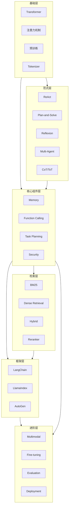
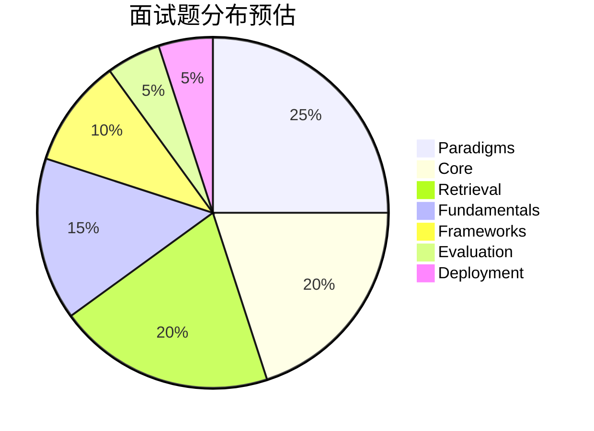

# 模块架构文档

> 描述 AI Agent 面试题库的知识体系架构和模块依赖关系

---

## 架构总览



---

## 模块依赖关系

### 学习路径推荐

```
新手路线：
Fundamentals → Paradigms → Core → Retrieval → Frameworks → Advanced

面试冲刺路线：
根据 JD 重点突击：
- 算法岗：Fundamentals + Paradigms + Core
- 工程岗：Core + Retrieval + Frameworks + Deployment
- 研究岗：Paradigms + Evaluation + Fine-tuning
```

### 模块间依赖

| 模块 | 依赖前置 | 被依赖后置 |
|------|----------|------------|
| fundamentals | - | paradigms, core, fine-tuning |
| paradigms | fundamentals | core, frameworks |
| core | fundamentals, paradigms | retrieval, frameworks, evaluation |
| retrieval | core | frameworks, deployment |
| frameworks | paradigms, core, retrieval | deployment, evaluation |
| evaluation | core, frameworks | - |
| deployment | frameworks, retrieval | - |
| multimodal | core | - |
| fine-tuning | fundamentals | - |

---

## 各模块定位

### fundamentals/ - 模型基础
**定位**：大模型底层原理，面试必考基础
**核心内容**：
- Transformer 架构（Encoder/Decoder/Encoder-Decoder）
- 注意力机制（Self-Attention, Cross-Attention, Multi-Head）
- 位置编码（绝对/相对/RoPE）
- 预训练任务（MLM, CLM, Span Corruption）

### paradigms/ - Agent 范式
**定位**：Agent 行为模式，面试高频考点
**核心内容**：
- ReAct：推理+行动循环
- Plan-and-Solve：先规划后执行
- Reflexion：自我反思学习
- Multi-Agent：多智能体协作
- CoT/ToT：链式/树式推理

### core/ - 核心组件
**定位**：Agent 系统必备组件
**核心内容**：
- Memory：短期/长期记忆设计
- Function Calling：工具调用机制
- Task Planning：任务规划策略
- Security：Prompt 注入防护

### retrieval/ - 检索技术
**定位**：RAG 核心，Agent 知识增强
**核心内容**：
- 稀疏检索（BM25）
- 稠密检索（向量检索）
- 混合检索（召回+精排）
- 上下文优化（Context Engineering）

### frameworks/ - 开发框架
**定位**：工程落地选型参考
**核心内容**：
- LangChain：通用 Agent 框架
- LlamaIndex：RAG 专用框架
- AutoGen：多 Agent 框架
- 选型决策树

### evaluation/ - 评估评测
**定位**：效果衡量与优化依据
**核心内容**：
- Agent 评测指标
- LLM-as-a-Judge
- 人工 vs 自动评估
- A/B 测试设计

### deployment/ - 部署运维
**定位**：生产环境落地
**核心内容**：
- 模型推理优化
- 量化技术（INT8/INT4）
- 推理引擎（vLLM/TGI）
- 服务化部署架构

### multimodal/ - 多模态
**定位**：扩展能力边界
**核心内容**：
- 视觉语言模型（VLM）
- 图文检索
- 多模态 Agent 架构

### fine-tuning/ - 微调对齐
**定位**：模型定制优化
**核心内容**：
- SFT 监督微调
- RLHF 原理
- LoRA/QLoRA 高效微调

---

## 面试考察重点分布



---

## 文档规范

### 文件命名
- 使用小写字母
- 单词间用连字符 `-` 分隔
- 示例：`hybrid-retrieval.md`, `memory-system.md`

### 内容结构
每个主题文档应包含：
1. 概念与原理
2. 面试题详解（3-5 题）
3. 延伸追问
4. 总结

详见 [quality-standards.md](./quality-standards.md)
