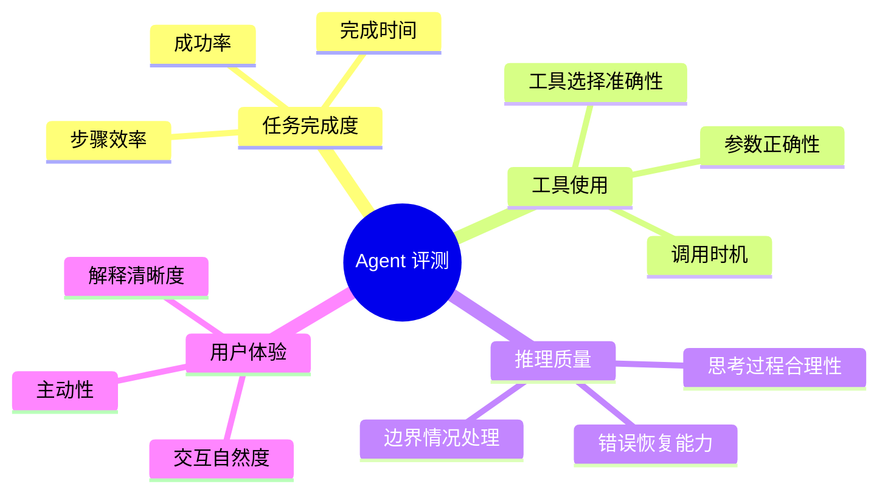
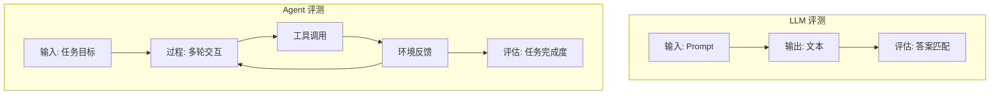
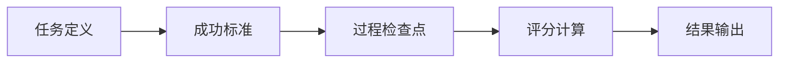
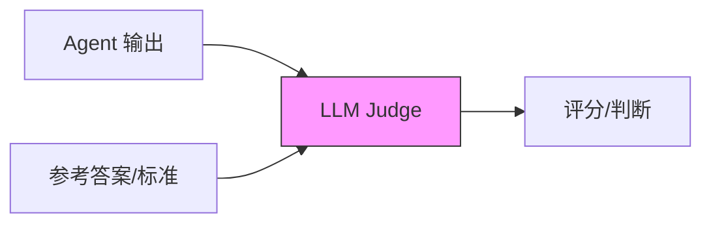
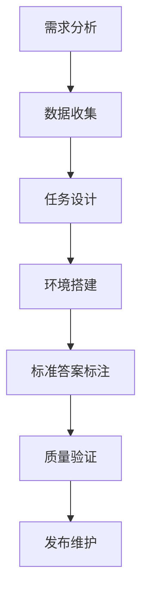

# Agent 评测指标详解

> Agent 系统的评测是 AI 工程落地的关键环节，需要建立科学、全面的评估体系。

---

## 一、概念与原理

### 1.1 为什么需要 Agent 评测？

传统 LLM 评测（如 MMLU、HumanEval）主要关注**静态能力**，而 Agent 评测需要评估**动态交互能力**：

| 维度 | LLM 评测 | Agent 评测 |
|-----|---------|-----------|
| **评估对象** | 单轮输出质量 | 多轮交互过程 |
| **关注重点** | 知识/推理能力 | 工具使用、任务完成度 |
| **成功标准** | 答案正确 | 任务完成 + 过程合理 |
| **复杂性** | 相对简单 | 涉及环境交互、状态管理 |

### 1.2 Agent 评测的核心维度



### 1.3 评测方法分类

| 方法 | 描述 | 优点 | 缺点 |
|-----|------|-----|------|
| **规则评测** | 预定义成功条件和检查点 | 可解释性强、成本低 | 难以覆盖所有情况 |
| **模型评测** | 使用 LLM-as-a-Judge | 灵活、可处理开放任务 | 成本高、可能有偏见 |
| **人工评测** | 人类专家评估 | 最可靠 | 成本高、速度慢 |
| **混合评测** | 规则 + 模型 + 人工 | 平衡效率和准确性 | 系统复杂 |

### 1.4 主流评测基准

| 基准 | 评测重点 | 任务类型 | 环境 |
|-----|---------|---------|------|
| **WebArena** | 网页操作能力 | 真实网站任务 | 真实网页 |
| **Mind2Web** | 网页 Agent | 多步骤网页任务 | 真实网页 |
| **SWE-bench** | 代码修复能力 | GitHub Issue 修复 | 真实代码库 |
| **AgentBench** | 通用 Agent 能力 | 多领域任务 | 模拟环境 |
| **ToolBench** | 工具使用能力 | API 调用任务 | 真实 API |
| **GAIA** | 复杂问题求解 | 多步骤推理 | 真实世界信息 |

---

## 二、面试题详解

### 题目 1：Agent 评测和传统 LLM 评测有什么区别？（初级）

**题目描述：**
请对比 Agent 评测和传统 LLM 评测（如 MMLU、HumanEval）的区别，说明 Agent 评测需要额外关注哪些维度。

**考察点：**
- 对 Agent 特性的理解
- 评测设计的系统思维

**详细解答：**

**核心区别对比：**



**关键差异：**

| 维度 | LLM 评测 | Agent 评测 |
|-----|---------|-----------|
| **评估对象** | 单轮输出 | 多轮交互过程 |
| **成功定义** | 答案正确 | 任务完成 + 过程合理 |
| **时间维度** | 单次推理 | 多步骤、可能耗时较长 |
| **环境交互** | 无 | 必须与环境/工具交互 |
| **失败模式** | 答案错误 | 工具选错、参数错、陷入循环 |

**Agent 评测特有维度：**

```java
/**
 * Agent 评测维度定义
 */
public class AgentEvaluationMetrics {
    
    // 1. 任务完成度
    public class TaskCompletion {
        double successRate;        // 任务成功率
        double partialSuccessRate; // 部分成功率
        int averageSteps;          // 平均完成步数
        double timeEfficiency;     // 时间效率
    }
    
    // 2. 工具使用质量
    public class ToolUsage {
        double toolSelectionAccuracy;  // 工具选择准确率
        double parameterAccuracy;      // 参数填写准确率
        double unnecessaryToolRate;    // 不必要工具调用率
        double toolCallSuccessRate;    // 工具调用成功率
    }
    
    // 3. 推理质量
    public class ReasoningQuality {
        double planningAccuracy;       // 规划准确性
        double errorRecoveryRate;      // 错误恢复率
        double hallucinationRate;      // 幻觉率
        double contextUtilization;     // 上下文利用度
    }
    
    // 4. 用户体验
    public class UserExperience {
        double responseRelevance;      // 回复相关性
        double explanationClarity;     // 解释清晰度
        double proactiveness;          // 主动性
    }
}
```

**示例对比：**

| 场景 | LLM 评测 | Agent 评测 |
|-----|---------|-----------|
| 数学题 | 答案是否正确 | 是否能调用计算器、步骤是否合理 |
| 代码生成 | 代码是否通过测试 | 是否能调试、修复错误 |
| 问答 | 答案是否准确 | 是否能搜索、验证信息 |

---

### 题目 2：如何设计 Agent 的任务完成度评估？（中级）

**题目描述：**
请设计一个评估 Agent 任务完成度的方案，包括评估指标、评分标准和自动化实现思路。

**考察点：**
- 评估指标设计能力
- 自动化评测的工程思维

**详细解答：**

**评估框架：**



**三级评估体系：**

```java
/**
 * Agent 任务完成度评估器
 */
public class TaskCompletionEvaluator {
    
    /**
     * 评估结果
     */
    public class EvaluationResult {
        TaskStatus status;           // SUCCESS / PARTIAL / FAILED
        double completionScore;      // 0-100 完成度分数
        List<CheckpointResult> checkpoints;  // 检查点结果
        String failureReason;        // 失败原因
        int stepsTaken;              // 实际步数
        int optimalSteps;            // 最优步数
        long timeSpentMs;            // 耗时
    }
    
    /**
     * 三级评估
     */
    public EvaluationResult evaluate(Task task, AgentTrajectory trajectory) {
        // Level 1: 结果检查
        boolean resultCorrect = checkFinalResult(task, trajectory);
        
        // Level 2: 过程检查
        List<CheckpointResult> checkpoints = checkProcess(task, trajectory);
        
        // Level 3: 效率评估
        EfficiencyMetrics efficiency = evaluateEfficiency(task, trajectory);
        
        // 综合评分
        double score = calculateScore(resultCorrect, checkpoints, efficiency);
        
        return new EvaluationResult(score, checkpoints, efficiency);
    }
    
    /**
     * 检查点定义示例
     */
    private List<Checkpoint> defineCheckpoints(Task task) {
        List<Checkpoint> checkpoints = new ArrayList<>();
        
        // 检查点 1: 任务理解
        checkpoints.add(new Checkpoint(
            "task_understanding",
            "Agent 正确理解任务目标",
            CheckType.MODEL_GRADING  // 用模型判断
        ));
        
        // 检查点 2: 工具选择
        checkpoints.add(new Checkpoint(
            "tool_selection",
            "选择了正确的工具",
            CheckType.RULE_BASED     // 规则判断
        ));
        
        // 检查点 3: 关键步骤
        checkpoints.add(new Checkpoint(
            "key_steps",
            "完成了关键步骤",
            CheckType.RESULT_MATCH    // 结果匹配
        ));
        
        return checkpoints;
    }
}
```

**评分标准设计：**

| 等级 | 分数范围 | 标准 | 示例 |
|-----|---------|------|------|
| **完美** | 100 | 完全正确 + 最优路径 | 最少步骤完成，无冗余操作 |
| **优秀** | 80-99 | 正确完成 + 小瑕疵 | 多了一两步，或参数有小问题 |
| **及格** | 60-79 | 部分完成 | 完成主要目标，有次要问题 |
| **失败** | < 60 | 未完成或严重错误 | 工具选错、陷入死循环 |

**自动化实现：**

```java
/**
 * 自动化评测流程
 */
public class AutomatedEvaluator {
    
    public EvaluationReport runEvaluation(Agent agent, TestSuite testSuite) {
        EvaluationReport report = new EvaluationReport();
        
        for (TestCase testCase : testSuite.getCases()) {
            // 1. 设置环境
            Environment env = setupEnvironment(testCase);
            
            // 2. 运行 Agent
            AgentTrajectory trajectory = agent.execute(testCase.getGoal(), env);
            
            // 3. 多维度评估
            TaskResult taskResult = evaluateTaskCompletion(testCase, trajectory);
            ToolResult toolResult = evaluateToolUsage(testCase, trajectory);
            SafetyResult safetyResult = evaluateSafety(trajectory);
            
            // 4. 聚合结果
            TestResult result = aggregate(taskResult, toolResult, safetyResult);
            report.addResult(result);
        }
        
        // 5. 生成统计报告
        return report.generateStatistics();
    }
    
    /**
     * 规则评测示例
     */
    private boolean ruleBasedCheck(Trajectory trajectory, Rule rule) {
        switch (rule.getType()) {
            case TOOL_SEQUENCE:
                // 检查工具调用顺序
                return checkToolSequence(trajectory, rule.getExpectedSequence());
                
            case RESULT_CONTAINS:
                // 检查结果是否包含特定内容
                return trajectory.getFinalOutput().contains(rule.getExpectedContent());
                
            case NO_ERROR:
                // 检查是否无错误
                return trajectory.getErrors().isEmpty();
                
            case STEP_COUNT:
                // 检查步数是否在合理范围
                return trajectory.getSteps() <= rule.getMaxSteps();
                
            default:
                return false;
        }
    }
}
```

---

### 题目 3：Agent 评测中的 LLM-as-a-Judge 方法有什么优缺点？（中级）

**题目描述：**
请说明使用 LLM 作为评测者（LLM-as-a-Judge）的方法，分析其优缺点，以及如何缓解潜在问题。

**考察点：**
- 对 LLM 评测的理解
- 对偏见和可靠性问题的认识

**详细解答：**

**LLM-as-a-Judge 原理：**



**实现示例：**

```java
/**
 * LLM-as-a-Judge 实现
 */
public class LLMJudge {
    
    private final LLM model;
    
    /**
     * 评分模式
     */
    public Score score(String agentOutput, String reference, String criteria) {
        String prompt = buildScoringPrompt(agentOutput, reference, criteria);
        String response = model.generate(prompt);
        return parseScore(response);
    }
    
    /**
     * 对比模式
     */
    public ComparisonResult compare(String outputA, String outputB, String task) {
        String prompt = String.format("""
            任务: %s
            
            输出 A:
            %s
            
            输出 B:
            %s
            
            请判断哪个输出更好，并说明原因。
            回复格式: {"winner": "A/B/Tie", "reason": "..."}
            """, task, outputA, outputB);
        
        String response = model.generate(prompt);
        return parseComparison(response);
    }
    
    /**
     * 构建评分 Prompt
     */
    private String buildScoringPrompt(String output, String reference, String criteria) {
        return String.format("""
            你是一个专业的评测员。请根据以下标准对 Agent 的输出进行评分。
            
            评分标准: %s
            
            参考答案: %s
            
            Agent 输出: %s
            
            请从 1-10 打分，并说明理由。
            回复格式: {"score": 8, "reason": "..."}
            """, criteria, reference, output);
    }
}
```

**优点：**

| 优点 | 说明 |
|-----|------|
| **灵活性** | 可评估开放性问题，无需预定义规则 |
| **多维度** | 可同时评估准确性、流畅性、安全性等 |
| **可解释** | 可要求模型给出评分理由 |
| **成本低** | 比人工评测便宜，比规则评测覆盖广 |

**缺点及缓解策略：**

| 缺点 | 影响 | 缓解策略 |
|-----|------|---------|
| **位置偏见** | 偏好第一个或最后一个选项 | 多次交换位置评测，取平均 |
| **长度偏见** | 偏好更长的回答 | 归一化评分，或明确要求简洁 |
| **自我提升** | 偏好自己生成的内容 | 使用不同模型做评测 |
| **标准漂移** | 不同时间/批次标准不一致 | 加入参考样本校准 |
| **成本** | 大量评测时 API 费用高 | 先用规则筛选，再用 LLM 复核 |

**最佳实践：**

```java
/**
 * 缓解偏见的评测策略
 */
public class RobustLLMJudge {
    
    /**
     * 多次评测取平均（缓解位置偏见）
     */
    public Score robustScore(String output, String reference) {
        List<Score> scores = new ArrayList<>();
        
        // 多次评测，交换位置
        for (int i = 0; i < 3; i++) {
            scores.add(llmJudge.score(output, reference));
        }
        
        // 去掉最高最低，取平均
        return calculateRobustAverage(scores);
    }
    
    /**
     * 多模型评测（缓解模型特定偏见）
     */
    public ConsensusScore multiModelJudge(String output, String reference) {
        Map<String, Score> modelScores = new HashMap<>();
        
        // 使用多个模型评测
        modelScores.put("gpt-4", gpt4Judge.score(output, reference));
        modelScores.put("claude", claudeJudge.score(output, reference));
        modelScores.put("glm", glmJudge.score(output, reference));
        
        // 计算一致性
        double agreement = calculateAgreement(modelScores);
        
        // 多数投票
        Score consensus = majorityVote(modelScores);
        
        return new ConsensusScore(consensus, agreement, modelScores);
    }
    
    /**
     * 人机结合（关键决策人工复核）
     */
    public EvaluationResult hybridEvaluation(String output, String reference) {
        // 1. LLM 初筛
        Score llmScore = llmJudge.score(output, reference);
        
        // 2. 低置信度样本人工复核
        if (llmScore.getConfidence() < 0.7) {
            return humanJudge.score(output, reference);
        }
        
        return llmScore;
    }
}
```

---

### 题目 4：如何构建 Agent 评测数据集？（高级）

**题目描述：**
请设计一个 Agent 评测数据集的构建流程，包括数据收集、标注、质量控制和多样性保障。

**考察点：**
- 数据集构建的系统能力
- 对 Agent 评测特殊性的理解

**详细解答：**

**数据集构建流程：**



**详细设计：**

```java
/**
 * Agent 评测数据集构建器
 */
public class AgentBenchmarkBuilder {
    
    /**
     * 步骤 1: 需求分析
     */
    public class Requirements {
        List<Capability> targetCapabilities;  // 目标能力
        List<Domain> domains;                  // 覆盖领域
        DifficultyDistribution difficulty;     // 难度分布
        int targetSize;                        // 目标规模
    }
    
    /**
     * 步骤 2: 数据收集
     */
    public class DataCollection {
        
        // 来源 1: 真实场景日志
        public List<Task> collectFromLogs(String logSource) {
            // 从生产环境收集真实用户请求
            // 脱敏处理
            // 筛选有代表性的任务
        }
        
        // 来源 2: 人工设计
        public List<Task> designByExperts(List<Capability> capabilities) {
            // 领域专家设计边界案例
            // 覆盖各种成功/失败场景
        }
        
        // 来源 3: 合成生成
        public List<Task> synthesize(Task template, int count) {
            // 基于模板生成变体
            // 使用 LLM 扩展多样性
        }
    }
    
    /**
     * 步骤 3: 任务设计
     */
    public class TaskDesign {
        
        public Task createTask(TaskType type) {
            Task task = new Task();
            
            // 任务描述
            task.setDescription(generateDescription(type));
            
            // 初始状态
            task.setInitialState(createInitialState(type));
            
            // 成功标准
            task.setSuccessCriteria(defineSuccessCriteria(type));
            
            // 检查点
            task.setCheckpoints(defineCheckpoints(type));
            
            // 元数据
            task.setMetadata(createMetadata(type));
            
            return task;
        }
        
        /**
         * 成功标准定义
         */
        private SuccessCriteria defineSuccessCriteria(TaskType type) {
            return SuccessCriteria.builder()
                .requiredResults(Arrays.asList("result1", "result2"))
                .forbiddenActions(Arrays.asList("delete", "drop"))
                .maxSteps(20)
                .maxTimeMinutes(5)
                .build();
        }
    }
    
    /**
     * 步骤 4: 环境搭建
     */
    public class EnvironmentSetup {
        
        /**
         * 沙箱环境
         */
        public Sandbox createSandbox() {
            return Sandbox.builder()
                .isolated(true)           // 隔离
                .snapshotSupport(true)    // 支持快照
                .resettable(true)         // 可重置
                .observable(true)         // 可观测
                .build();
        }
        
        /**
         * 工具集定义
         */
        public List<Tool> defineTools() {
            return Arrays.asList(
                Tool.builder()
                    .name("search")
                    .description("搜索信息")
                    .parameters(searchParams())
                    .build(),
                Tool.builder()
                    .name("calculator")
                    .description("计算")
                    .parameters(calcParams())
                    .build()
            );
        }
    }
    
    /**
     * 步骤 5: 标注
     */
    public class Annotation {
        
        /**
         * 多维度标注
         */
        public TaskAnnotation annotate(Task task) {
            TaskAnnotation annotation = new TaskAnnotation();
            
            // 参考答案轨迹
            annotation.setReferenceTrajectory(
                expertDemonstrate(task)
            );
            
            // 难度评级
            annotation.setDifficulty(
                rateDifficulty(task)
            );
            
            // 能力标签
            annotation.setRequiredCapabilities(
                identifyCapabilities(task)
            );
            
            // 常见错误模式
            annotation.setCommonErrors(
                identifyCommonErrors(task)
            );
            
            return annotation;
        }
    }
    
    /**
     * 步骤 6: 质量验证
     */
    public class QualityValidation {
        
        public ValidationReport validate(Dataset dataset) {
            ValidationReport report = new ValidationReport();
            
            // 检查 1: 可解性
            report.setSolvabilityCheck(checkAllSolvable(dataset));
            
            // 检查 2: 确定性
            report.setDeterminismCheck(checkDeterministic(dataset));
            
            // 检查 3: 多样性
            report.setDiversityMetrics(calculateDiversity(dataset));
            
            // 检查 4: 难度分布
            report.setDifficultyDistribution(analyzeDifficulty(dataset));
            
            // 检查 5: 标注一致性
            report.setAnnotationAgreement(checkInterAnnotatorAgreement(dataset));
            
            return report;
        }
    }
}
```

**质量控制清单：**

| 检查项 | 方法 | 通过标准 |
|-------|------|---------|
| **可解性** | 专家完成 | 100% 可解 |
| **确定性** | 多次运行 | 结果一致 |
| **无歧义** | 多人标注 | 一致性 > 90% |
| **难度适中** | 预测试 | 成功率 30-70% |
| **无泄漏** | 检查训练集 | 无重复/相似 |
| **多样性** | 统计分析 | 覆盖目标分布 |

---

## 三、延伸追问

### 追问 1：如何处理评测中的非确定性问题？

**简要答案：**
- **多次运行**：对非确定性 Agent 多次评测取平均
- **置信区间**：报告分数时附带置信区间
- **确定性约束**：评测时固定随机种子
- **统计检验**：使用配对 t 检验比较不同模型

### 追问 2：Agent 评测中的安全问题如何评估？

**简要答案：**
- **有害指令遵循**：测试是否执行危险操作
- **隐私保护**：检查是否泄露敏感信息
- **权限控制**：验证越权访问防护
- **沙箱隔离**：确保评测环境安全隔离

### 追问 3：如何评估 Agent 的鲁棒性？

**简要答案：**
- **对抗测试**：输入扰动、歧义表述
- **边界测试**：极端参数、空输入
- **错误注入**：工具失败、网络异常
- **压力测试**：高并发、长序列

### 追问 4：评测结果如何可视化展示？

**简要答案：**
- **雷达图**：多维度能力对比
- **热力图**：不同任务类型表现
- **学习曲线**：随训练步数的变化
- **错误分析**：失败案例分类统计

---

## 四、总结

### 面试回答模板

> Agent 评测需要关注**任务完成度、工具使用质量、推理过程、用户体验**四个核心维度。
>
> **评测方法：**
> 1. **规则评测**：预定义检查点，适合确定性任务
> 2. **LLM-as-a-Judge**：灵活评估开放任务，注意位置/长度偏见
> 3. **人工评测**：最可靠，用于关键决策和校准
>
> **关键指标：**
> - 成功率、完成步数、工具选择准确率
> - 错误恢复率、幻觉率、用户满意度
>
> **数据集构建：**
> - 真实场景 + 专家设计 + 合成生成
> - 必须验证可解性、确定性、多样性
>
> **主流基准：** WebArena、SWE-bench、AgentBench、GAIA

### 一句话记忆

| 概念 | 一句话 |
|-----|--------|
| **Agent 评测** | 不只是答案对，还要看过程、工具、效率 |
| **LLM Judge** | 灵活但可能有偏见，多模型+人工来校准 |
| **三级评估** | 结果对、过程对、效率高 |
| **数据集构建** | 真实+专家+合成，质量把控要严格 |

---

## 参考资料

1. Zhou et al. "AgentBench: Evaluating LLMs as Agents" (2023)
2. Shi et al. "Mind2Web: Towards a Generalist Agent for the Web" (2023)
3. Jimenez et al. "SWE-bench: Can Language Models Resolve Real-World GitHub Issues?" (2023)
4. Mialon et al. "GAIA: A Benchmark for General AI Assistants" (2023)
5. Zheng et al. "Judging LLM-as-a-Judge with MT-Bench and Chatbot Arena" (2023)
