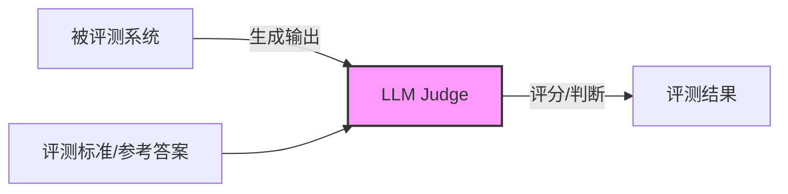
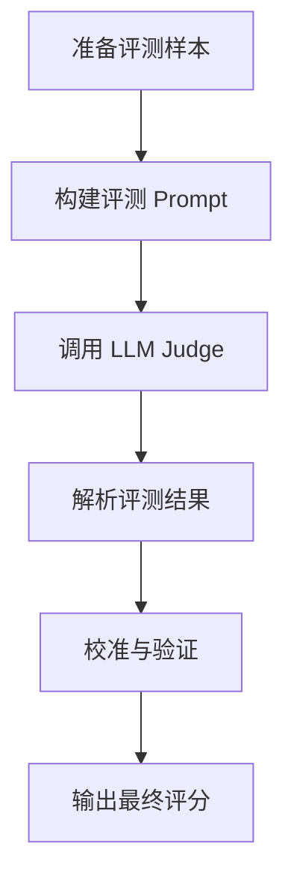
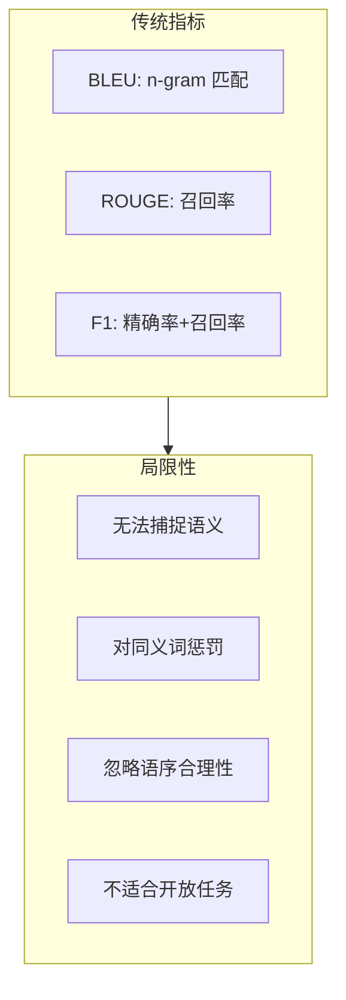
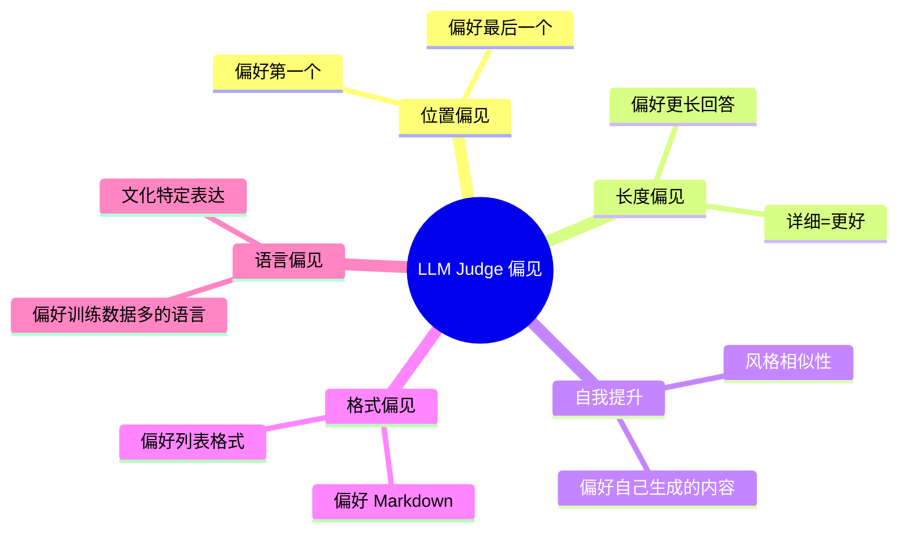
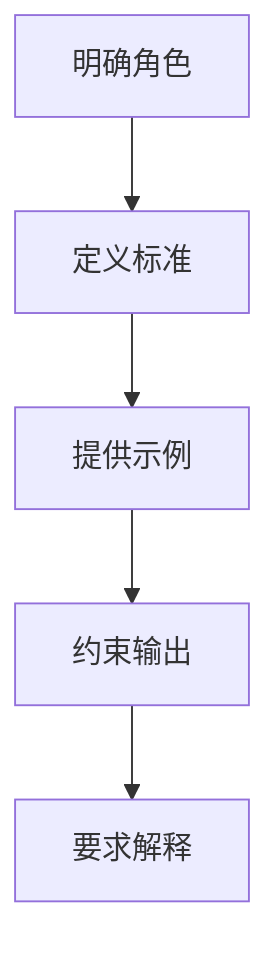
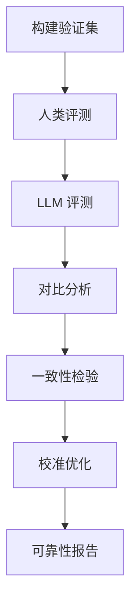

# LLM-as-a-Judge 方法详解

> 使用大语言模型作为评测者是当前 Agent 和 LLM 评测的主流方法，理解其原理、优缺点和最佳实践至关重要。

---

## 一、概念与原理

### 1.1 什么是 LLM-as-a-Judge？

**LLM-as-a-Judge** 是指使用大语言模型（如 GPT-4、Claude 等）来评估其他模型或 Agent 的输出质量。



**兴起背景：**
- 传统评测（如 BLEU、ROUGE）无法评估语义质量
- 人工评测成本高、速度慢
- 开放域任务难以定义客观标准

### 1.2 评测模式分类

| 模式 | 描述 | 适用场景 |
|-----|------|---------|
| **单点评分** | 直接打分（1-10） | 绝对质量评估 |
| **成对比较** | A vs B 选更好 | 模型对比、排序 |
| **分类判断** | 判断是否符合标准 | 安全性、合规性 |
| **详细评估** | 多维度评分 + 理由 | 深度分析 |

### 1.3 评测流程



### 1.4 评测维度设计

```java
/**
 * LLM Judge 评测维度
 */
public class EvaluationDimensions {
    
    // 通用维度
    public class GeneralDimensions {
        double helpfulness;      // 有用性
        double relevance;        // 相关性
        double accuracy;         // 准确性
        double coherence;        // 连贯性
        double fluency;          // 流畅度
    }
    
    // Agent 特化维度
    public class AgentDimensions {
        double taskCompletion;   // 任务完成度
        double toolUsage;        // 工具使用质量
        double reasoning;        // 推理过程质量
        double errorRecovery;    // 错误恢复能力
        double userExperience;   // 用户体验
    }
    
    // 安全性维度
    public class SafetyDimensions {
        double harmfulness;      // 有害性（越低越好）
        double bias;             // 偏见（越低越好）
        double privacy;          // 隐私保护
        double honesty;          // 诚实度
    }
}
```

---

## 二、面试题详解

### 题目 1：LLM-as-a-Judge 相比传统评测方法有什么优势？（初级）

**题目描述：**
请对比 LLM-as-a-Judge 与传统自动评测指标（如 BLEU、ROUGE、F1）的区别，说明其优势和适用场景。

**考察点：**
- 对不同评测方法的理解
- 对语义评估的认识

**详细解答：**

**传统评测指标局限：**



**对比分析：**

| 维度 | BLEU/ROUGE | LLM-as-a-Judge |
|-----|-----------|----------------|
| **评估对象** | n-gram 匹配 | 语义理解 |
| **同义词处理** | 视为错误 | 可识别等价表达 |
| **语序敏感** | 敏感 | 理解灵活表达 |
| **开放任务** | 不适用 | 适用 |
| **可解释性** | 低 | 高（可要求理由） |
| **成本** | 低（计算） | 高（API 调用） |
| **一致性** | 100% | 非 100% |

**代码示例对比：**

```java
/**
 * 传统评测 vs LLM Judge
 */
public class EvaluationComparison {
    
    /**
     * 传统 BLEU 评测
     */
    public double bleuEvaluate(String candidate, String reference) {
        // 只计算 n-gram 重叠
        // candidate: "The cat sat on the mat"
        // reference: "A cat was sitting on the mat"
        // BLEU 会惩罚 "The" vs "A"，"sat" vs "sitting"
        return BLEU.calculate(candidate, reference);  // 得分可能很低
    }
    
    /**
     * LLM Judge 评测
     */
    public EvaluationResult llmJudgeEvaluate(String candidate, String reference) {
        String prompt = String.format("""
            请评估以下回答的质量。
            
            参考答案：%s
            模型回答：%s
            
            请从以下维度评分（1-10）：
            1. 语义准确性
            2. 信息完整性
            3. 表达流畅度
            
            即使用词不同，只要语义等价也应给高分。
            """, reference, candidate);
        
        String response = llm.generate(prompt);
        // LLM 能理解 "sat" 和 "sitting" 语义等价
        return parseEvaluation(response);
    }
}
```

**适用场景：**

| 场景 | 推荐方法 | 原因 |
|-----|---------|------|
| 机器翻译 | BLEU + LLM Judge | BLEU 快速筛选，LLM 深度评估 |
| 开放问答 | LLM Judge | 无标准答案，需语义理解 |
| 代码生成 | 执行验证 + LLM Judge | 功能正确优先，代码质量用 LLM |
| 摘要生成 | ROUGE + LLM Judge | 内容覆盖 + 语义质量 |
| Agent 轨迹 | LLM Judge | 过程复杂，需综合判断 |

---

### 题目 2：LLM-as-a-Judge 有哪些已知的偏见？如何缓解？（中级）

**题目描述：**
请说明 LLM-as-a-Judge 中常见的偏见类型，并给出相应的缓解策略。

**考察点：**
- 对 LLM 评测局限性的理解
- 系统性的偏见缓解思路

**详细解答：**

**已知偏见类型：**



**详细分析与缓解策略：**

```java
/**
 * 偏见分析与缓解
 */
public class BiasMitigation {
    
    /**
     * 偏见 1: 位置偏见
     * 现象：LLM 倾向于选择第一个或最后一个选项
     */
    public class PositionBias {
        
        // 问题示例
        public void demonstrate() {
            // Prompt: "A 和 B 哪个更好？"
            // 交换位置后，LLM 可能改变选择
            
            String result1 = judge.compare("A", "B");  // 可能选 A
            String result2 = judge.compare("B", "A");  // 可能还是选 A（位置偏见）
        }
        
        // 缓解策略
        public ComparisonResult mitigate(String outputA, String outputB) {
            List<ComparisonResult> results = new ArrayList<>();
            
            // 策略 1: 多次交换位置评测
            for (int i = 0; i < 3; i++) {
                results.add(judge.compare(outputA, outputB));
                // 交换
                String temp = outputA;
                outputA = outputB;
                outputB = temp;
            }
            
            // 策略 2: 多数投票
            return majorityVote(results);
        }
    }
    
    /**
     * 偏见 2: 长度偏见
     * 现象：更长的回答往往得分更高
     */
    public class LengthBias {
        
        // 缓解策略
        public Score evaluateWithLengthNormalization(String output, String reference) {
            // 策略 1: 显式要求简洁
            String prompt = """
                请评估回答质量，评分标准：
                - 准确性（40%）：信息是否正确
                - 简洁性（30%）：是否无冗余
                - 完整性（30%）：是否覆盖要点
                
                注意：冗长不等于好，简洁准确的回答应得高分。
                """;
            
            // 策略 2: 长度归一化
            Score rawScore = judge.score(prompt, output, reference);
            double lengthPenalty = calculateLengthPenalty(output.length(), reference.length());
            
            return new Score(rawScore.getValue() * lengthPenalty);
        }
    }
    
    /**
     * 偏见 3: 自我提升
     * 现象：LLM 偏好与自己风格相似的内容
     */
    public class SelfEnhancementBias {
        
        // 缓解策略
        public Score crossModelEvaluation(String output, String reference) {
            // 策略：使用不同模型家族做评测
            Map<String, Score> scores = new HashMap<>();
            
            scores.put("GPT-4", gpt4Judge.score(output, reference));
            scores.put("Claude", claudeJudge.score(output, reference));
            scores.put("GLM", glmJudge.score(output, reference));
            
            // 计算一致性
            double agreement = calculateAgreement(scores.values());
            
            // 如果一致性低，标记为低置信度
            Score average = calculateAverage(scores.values());
            return new Score(average.getValue(), agreement);
        }
    }
    
    /**
     * 偏见 4: 格式偏见
     * 现象：偏好特定格式（Markdown、列表等）
     */
    public class FormatBias {
        
        // 缓解策略
        public Score evaluateContentOnly(String output, String reference) {
            // 策略 1: 内容提取
            String contentOnly = stripFormatting(output);
            String refContentOnly = stripFormatting(reference);
            
            // 策略 2: 显式 Prompt
            String prompt = """
                请评估回答的内容质量，忽略格式。
                回答可以以任何格式呈现，重点关注：
                - 信息准确性
                - 逻辑清晰度
                - 有用性
                """;
            
            return judge.score(prompt, contentOnly, refContentOnly);
        }
        
        private String stripFormatting(String text) {
            return text
                .replaceAll("#+ ", "")      // 移除标题
                .replaceAll("\\*\\*", "")    // 移除加粗
                .replaceAll("- ", "")        // 移除列表标记
                .replaceAll("\\n\\s*\\n", "\\n");  // 规范化空行
        }
    }
}
```

**偏见缓解效果对比：**

| 偏见类型 | 缓解前误差 | 缓解后误差 | 方法 |
|---------|-----------|-----------|------|
| 位置偏见 | 15-20% | 3-5% | 多次交换 + 多数投票 |
| 长度偏见 | 10-15% | 5-8% | 显式要求 + 长度归一化 |
| 自我提升 | 8-12% | 4-6% | 跨模型评测 |
| 格式偏见 | 5-10% | 2-4% | 内容提取 + 显式 Prompt |

---

### 题目 3：如何设计一个高质量的 LLM Judge Prompt？（中级）

**题目描述：**
请设计一个用于评估 Agent 任务完成质量的 LLM Judge Prompt，并说明设计原则和注意事项。

**考察点：**
- Prompt 工程能力
- 对评测维度的系统设计

**详细解答：**

**Prompt 设计原则：**



**高质量 Prompt 示例：**

```java
/**
 * Agent 任务评测 Prompt 设计
 */
public class JudgePromptDesign {
    
    /**
     * 完整的评测 Prompt
     */
    public String buildEvaluationPrompt(Task task, AgentTrajectory trajectory) {
        return String.format("""
            # 角色定义
            你是一位专业的 AI Agent 评测专家，拥有丰富的任务评估经验。
            你的职责是客观、公正地评估 Agent 的任务完成情况。
            
            # 任务信息
            任务描述：%s
            任务目标：%s
            成功标准：%s
            
            # Agent 执行轨迹
            ```
            %s
            ```
            
            # 评测维度
            请从以下 5 个维度进行评估（每项 1-10 分）：
            
            1. **任务完成度** (Task Completion)
               - 是否达成了任务目标？
               - 结果是否正确完整？
               - 评分标准：10=完美完成，7=基本完成，4=部分完成，1=未完成
            
            2. **工具使用质量** (Tool Usage)
               - 工具选择是否恰当？
               - 参数填写是否正确？
               - 是否有不必要的工具调用？
               - 评分标准：10=工具使用完美，7=有小问题，4=有明显问题，1=工具使用错误
            
            3. **推理过程** (Reasoning)
               - 思考过程是否合理？
               - 步骤是否清晰有序？
               - 是否展示了正确的解决问题的思路？
               - 评分标准：10=推理优秀，7=推理合理，4=推理有缺陷，1=推理错误
            
            4. **效率** (Efficiency)
               - 完成步骤是否简洁？
               - 是否有冗余操作？
               - 评分标准：10=最优路径，7=基本高效，4=步骤过多，1=严重冗余
            
            5. **错误处理** (Error Handling)
               - 遇到问题时是否能正确识别？
               - 是否能有效恢复？
               - 评分标准：10=完美处理，7=基本处理，4=处理不当，1=未处理或恶化
            
            # 输出格式
            请以 JSON 格式输出，包含：
            {
                "scores": {
                    "task_completion": <int>,
                    "tool_usage": <int>,
                    "reasoning": <int>,
                    "efficiency": <int>,
                    "error_handling": <int>
                },
                "overall_score": <int>,
                "reasoning": "<每项评分的详细理由>",
                "strengths": ["<优点1>", "<优点2>"],
                "weaknesses": ["<不足1>", "<不足2>"],
                "suggestions": "<改进建议>"
            }
            
            # 注意事项
            - 严格依据任务目标和成功标准评估，不引入额外标准
            - 即使 Agent 最终成功，如果过程有问题也要扣分
            - 关注过程质量，不只是结果
            - 保持客观，避免个人偏好影响评分
            
            请开始评估：
            """, 
            task.getDescription(),
            task.getGoal(),
            task.getSuccessCriteria(),
            trajectory.toString()
        );
    }
    
    /**
     * Few-shot 示例增强
     */
    public String buildFewShotPrompt() {
        return """
            # 评分示例
            
            ## 示例 1：优秀表现（10 分）
            任务：查询北京今天的天气
            轨迹：
            1. Thought: 用户需要北京今天的天气信息
            2. Action: search(query="北京今天天气")
            3. Observation: 北京今天晴，25°C
            4. Thought: 已获取所需信息
            5. Action: finish(answer="北京今天晴天，气温 25°C")
            
            评分：task_completion=10, tool_usage=10, reasoning=10, efficiency=10, error_handling=10
            理由：目标明确，工具选择正确，一步完成，结果准确
            
            ## 示例 2：一般表现（6 分）
            任务：查询北京今天的天气
            轨迹：
            1. Thought: 需要天气信息
            2. Action: search(query="北京天气")  // 未指定"今天"
            3. Observation: 北京本周天气预报...
            4. Thought: 信息不够具体，需要重新搜索
            5. Action: search(query="北京今天天气")
            6. Observation: 北京今天晴，25°C
            7. Action: finish(answer="北京今天晴天，气温 25°C")
            
            评分：task_completion=10, tool_usage=6, reasoning=7, efficiency=5, error_handling=8
            理由：最终完成但第一次工具参数不准确，效率偏低
            
            ## 示例 3：失败案例（2 分）
            任务：查询北京今天的天气
            轨迹：
            1. Thought: 需要天气信息
            2. Action: calculator(expression="25+5")  // 错误工具
            3. Observation: 30
            4. Thought: 计算完成
            5. Action: finish(answer="30")
            
            评分：task_completion=1, tool_usage=1, reasoning=2, efficiency=2, error_handling=1
            理由：完全错误理解任务，工具选择严重错误
            """;
    }
}
```

**Prompt 设计检查清单：**

| 检查项 | 说明 | 示例 |
|-------|------|------|
| **角色明确** | 定义 Judge 的身份 | "你是一位专业的评测专家" |
| **标准清晰** | 每项评分标准具体 | "10=完美，7=基本..." |
| **示例充分** | 提供 Few-shot 示例 | 优秀/一般/失败案例 |
| **输出约束** | 指定格式便于解析 | JSON 格式 |
| **要求解释** | 强制说明理由 | "reasoning" 字段 |
| **注意事项** | 提醒常见偏见 | "避免个人偏好" |

---

### 题目 4：如何验证 LLM Judge 的可靠性？（高级）

**题目描述：**
请设计一个验证 LLM Judge 可靠性的方案，包括与人类评测的对比、一致性检验和校准方法。

**考察点：**
- 评测系统验证能力
- 统计分析和校准方法

**详细解答：**

**验证框架：**



**详细实现：**

```java
/**
 * LLM Judge 可靠性验证
 */
public class JudgeReliabilityValidator {
    
    /**
     * 步骤 1: 构建验证集
     */
    public ValidationSet buildValidationSet() {
        return ValidationSet.builder()
            // 覆盖不同难度
            .addEasySamples(100)      // 简单任务
            .addMediumSamples(200)    // 中等任务
            .addHardSamples(100)      // 困难任务
            // 覆盖不同结果类型
            .addSuccessSamples(250)   // 成功案例
            .addPartialSamples(100)   // 部分成功
            .addFailureSamples(50)    // 失败案例
            // 覆盖边界情况
            .addEdgeCases(50)
            .build();
    }
    
    /**
     * 步骤 2: 人类评测
     */
    public class HumanEvaluation {
        
        // 多标注者
        public Map<String, List<HumanScore>> collectHumanScores(ValidationSet set) {
            Map<String, List<HumanScore>> results = new HashMap<>();
            
            // 每个样本由 3 位标注者独立评测
            for (Sample sample : set.getSamples()) {
                List<HumanScore> scores = new ArrayList<>();
                for (int i = 0; i < 3; i++) {
                    scores.add(annotator[i].evaluate(sample));
                }
                results.put(sample.getId(), scores);
            }
            
            return results;
        }
        
        // 计算标注者间一致性
        public double calculateInterAnnotatorAgreement(Map<String, List<HumanScore>> scores) {
            // 使用 Fleiss' Kappa 或 ICC
            return fleissKappa(scores);
        }
    }
    
    /**
     * 步骤 3: LLM 评测
     */
    public class LLMEvaluation {
        
        // 多次采样
        public List<LLMScore> evaluateWithMultipleSamples(Sample sample, int n) {
            List<LLMScore> scores = new ArrayList<>();
            for (int i = 0; i < n; i++) {
                scores.add(llmJudge.evaluate(sample));
            }
            return scores;
        }
        
        // 计算自一致性
        public double calculateSelfConsistency(List<LLMScore> scores) {
            // 计算方差或标准差
            double variance = calculateVariance(scores);
            return 1.0 / (1.0 + variance);  // 归一化到 0-1
        }
    }
    
    /**
     * 步骤 4: 对比分析
     */
    public class ComparisonAnalysis {
        
        public ComparisonReport compare(HumanScores human, LLMScores llm) {
            ComparisonReport report = new ComparisonReport();
            
            // 1. 皮尔逊相关系数
            report.setPearsonCorrelation(calculatePearson(human, llm));
            
            // 2. Spearman 秩相关
            report.setSpearmanCorrelation(calculateSpearman(human, llm));
            
            // 3. 均方误差
            report.setMeanSquaredError(calculateMSE(human, llm));
            
            // 4. 分类一致性（如高/中/低分档）
            report.setClassificationAgreement(calculateClassificationAgreement(human, llm));
            
            // 5. 偏差分析
            report.setBiasAnalysis(analyzeBias(human, llm));
            
            return report;
        }
        
        // 分析系统性偏差
        private BiasAnalysis analyzeBias(HumanScores human, LLMScores llm) {
            BiasAnalysis bias = new BiasAnalysis();
            
            // 长度偏差
            bias.setLengthBias(analyzeLengthBias(human, llm));
            
            // 难度偏差
            bias.setDifficultyBias(analyzeDifficultyBias(human, llm));
            
            // 领域偏差
            bias.setDomainBias(analyzeDomainBias(human, llm));
            
            return bias;
        }
    }
    
    /**
     * 步骤 5: 校准方法
     */
    public class Calibration {
        
        /**
         * 线性校准
         */
        public CalibratedScore linearCalibration(LLMScore raw, CalibrationParams params) {
            // y = a * x + b
            double calibrated = params.getSlope() * raw.getValue() + params.getIntercept();
            return new CalibratedScore(calibrated);
        }
        
        /**
         * 分位数校准
         */
        public CalibratedScore quantileCalibration(LLMScore raw, QuantileMapping mapping) {
            // 将 LLM 分数映射到人类分数的分布
            return mapping.map(raw);
        }
        
        /**
         * 温度缩放
         */
        public CalibratedScore temperatureScaling(LLMScore raw, double temperature) {
            // 调整置信度
            double scaledConfidence = raw.getConfidence() / temperature;
            return new CalibratedScore(raw.getValue(), scaledConfidence);
        }
        
        /**
         * 学习校准模型
         */
        public CalibrationModel trainCalibrationModel(
                List<HumanScore> humanScores,
                List<LLMScore> llmScores) {
            // 使用保序回归或 Platt Scaling
            return IsotonicRegression.train(humanScores, llmScores);
        }
    }
    
    /**
     * 生成可靠性报告
     */
    public ReliabilityReport generateReport(ValidationResult result) {
        return ReliabilityReport.builder()
            .correlation(result.getPearsonCorrelation())
            .agreementRate(result.getClassificationAgreement())
            .selfConsistency(result.getSelfConsistency())
            .interAnnotatorAgreement(result.getInterAnnotatorAgreement())
            .biasSummary(result.getBiasAnalysis())
            .recommendations(generateRecommendations(result))
            .build();
    }
}
```

**可靠性指标：**

| 指标 | 目标值 | 说明 |
|-----|-------|------|
| **Pearson 相关系数** | > 0.8 | 与人类评分线性相关 |
| **Spearman 相关系数** | > 0.8 | 排序一致性 |
| **分类一致率** | > 85% | 高/中/低分档一致 |
| **自一致性** | > 90% | 多次评测一致性 |
| **人类一致性** | > 80% | 达到人类标注者间一致性 |

---

## 三、延伸追问

### 追问 1：LLM Judge 和人工评测的性价比如何权衡？

**简要答案：**
- **成本对比**：LLM Judge 成本约为人工的 1/100-1/50
- **质量对比**：人工更准确，但 LLM 可规模化
- **混合策略**：LLM 初筛 + 人工复核关键样本
- **置信度机制**：低置信度样本自动转人工

### 追问 2：如何处理 LLM Judge 的 API 成本问题？

**简要答案：**
- **分层评测**：简单规则先筛选，复杂任务用 LLM
- **采样评测**：只评测代表性子集
- **缓存机制**：相同输入复用结果
- **模型选择**：简单任务用便宜模型（如 GPT-3.5）

### 追问 3：多语言场景下 LLM Judge 有什么挑战？

**简要答案：**
- **语言偏见**：对低资源语言评估不准确
- **文化差异**：某些表达在不同文化中有不同含义
- **缓解策略**：
  - 使用母语模型做评测
  - 增加多语言 Few-shot 示例
  - 翻译为英语后评测（可能丢失细节）

### 追问 4：如何防止 LLM Judge 被"欺骗"？

**简要答案：**
- **对抗样本测试**：测试对刻意误导的鲁棒性
- **多维度验证**：不依赖单一指标
- **人类抽查**：定期人工验证
- **动态更新**：持续更新 Judge Prompt 和模型

---

## 四、总结

### 面试回答模板

> LLM-as-a-Judge 是使用大语言模型评估其他系统输出的方法，相比传统指标能更好地捕捉语义质量。
>
> **优势：**
> - 可评估开放域任务
> - 理解语义等价性（同义词、灵活表达）
> - 可解释性强（可要求理由）
>
> **已知偏见及缓解：**
> - **位置偏见**：多次交换位置 + 多数投票
> - **长度偏见**：显式要求简洁 + 长度归一化
> - **自我提升**：跨模型评测
> - **格式偏见**：内容提取 + 忽略格式
>
> **Prompt 设计原则：**
> - 明确角色、定义标准、提供示例、约束输出、要求解释
>
> **可靠性验证：**
> - 与人类评测对比（Pearson > 0.8）
> - 计算自一致性（> 90%）
> - 偏差分析和校准

### 一句话记忆

| 概念 | 一句话 |
|-----|--------|
| **LLM Judge** | 用大模型评小模型，语义理解强但要防偏见 |
| **位置偏见** | 偏爱第一个或最后一个，多测几次换位置 |
| **长度偏见** | 觉得长就是好，显式要求简洁来纠正 |
| **Prompt 设计** | 角色+标准+示例+格式，四要素缺一不可 |
| **可靠性验证** | 和人类比、算一致、找偏差、做校准 |

---

## 参考资料

1. Zheng et al. "Judging LLM-as-a-Judge with MT-Bench and Chatbot Arena" (2023)
2. Li et al. "Leveraging Large Language Models for NLG Evaluation" (2023)
3. Wang et al. "Large Language Models are not Fair Evaluators" (2023)
4. Huang et al. "Bias in LLM-as-a-Judge: Position and Length" (2024)
5. Chan et al. "Challenges in LLM Evaluation" (2024)
