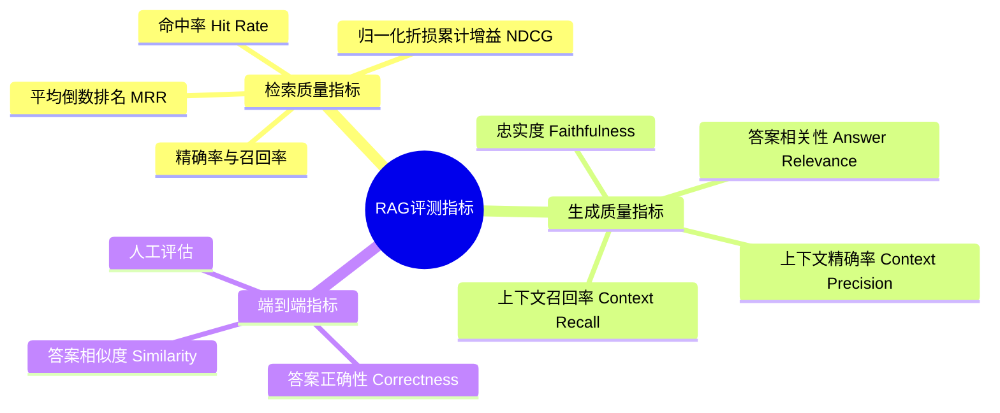
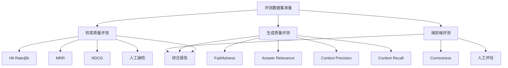

# RAG 评测指标详解

> 全面解析 RAG（检索增强生成）系统的评测指标体系，涵盖检索质量、生成质量和端到端评估三大维度

---

## 一、概念与原理

### 1.1 什么是 RAG 评测

RAG（Retrieval-Augmented Generation）评测是衡量检索增强生成系统质量的系统化方法，涉及两个核心环节的质量评估：

1. **检索质量（Retrieval Quality）**：评估从知识库中召回相关文档的能力
2. **生成质量（Generation Quality）**：评估基于检索结果生成准确回答的能力

### 1.2 RAG 评测的独特挑战

相比传统 NLP 任务，RAG 评测面临以下挑战：

| 挑战 | 说明 | 影响 |
|------|------|------|
| **检索与生成耦合** | 生成质量依赖于检索结果 | 难以独立定位问题环节 |
| **答案多样性** | 同一问题可能有多个正确回答 | 难以用单一标准答案衡量 |
| **知识边界模糊** | 需要判断答案是否超出检索范围 | 幻觉检测困难 |
| **动态知识库** | 知识库持续更新 | 评测基准需要同步维护 |

### 1.3 评测指标体系架构



---

## 二、面试题详解

### 题目 1：RAG 系统的评测为什么要分为检索质量和生成质量两个维度？

**难度**：初级 ⭐

**考察点**：理解 RAG 系统的架构特点，知道为什么需要分层评测

#### 详细解答

RAG 系统由**检索器（Retriever）**和**生成器（Generator）**两个独立组件组成，分层评测的原因如下：

1. **问题定位**：当 RAG 系统表现不佳时，需要判断是检索环节还是生成环节出了问题
   - 如果检索结果本身就不相关，即使生成模型再好也无法产出好答案
   - 如果检索结果相关但生成答案错误，说明生成环节需要优化

2. **独立优化**：两个组件可以独立迭代优化
   - 检索器可以更换 Embedding 模型、调整相似度阈值、优化索引策略
   - 生成器可以更换 LLM、调整 Prompt、优化上下文压缩

3. **责任归属**：在团队协作中，明确是哪个组件的问题有助于责任划分

**示例场景**：
```
用户问题："Python 的 GIL 是什么？"

情况 A（检索问题）：
- 检索结果：["Java 内存模型", "C++ 并发编程"]
- 生成答案：无法回答（因为检索结果不相关）
- 诊断：需要优化检索器

情况 B（生成问题）：
- 检索结果：["Python GIL 详解", "GIL 对多线程的影响"]
- 生成答案："GIL 是 Java 的全局解释器锁..."
- 诊断：检索正确，但生成器产生了幻觉
```

---

### 题目 2：请解释 Hit Rate@k、MRR、NDCG 三个检索指标的区别和适用场景

**难度**：中级 ⭐⭐

**考察点**：掌握常用检索评测指标的计算方式和适用场景

#### 详细解答

##### 1. Hit Rate@k（命中率@k）

**定义**：在前 k 个检索结果中，至少包含 1 个相关文档的比例

**计算公式**：
```
Hit Rate@k = (命中查询数) / (总查询数)
```

**特点**：
- 只关心"是否命中"，不关心排名位置
- 计算简单，易于理解
- 适合粗排阶段的快速评估

**适用场景**：
- 评估检索系统的覆盖能力
- 确定合适的 k 值（如 top-5、top-10）

##### 2. MRR（Mean Reciprocal Rank，平均倒数排名）

**定义**：第一个相关文档排名的倒数的平均值

**计算公式**：
```
MRR = (1/|Q|) * Σ(1/rank_i)
```
其中 rank_i 是第 i 个查询的第一个相关文档的排名

**特点**：
- 关注第一个相关结果的位置
- 排名越靠前，得分越高
- 对排名敏感，但对后续相关结果不敏感

**适用场景**：
- 搜索引擎评估（用户通常只看第一个结果）
- 问答系统（通常只需要一个答案）

##### 3. NDCG（Normalized Discounted Cumulative Gain）

**定义**：考虑文档相关度等级和排名位置的归一化指标

**计算步骤**：
```
1. CG@k = Σ(rel_i)  // 累计增益
2. DCG@k = Σ(rel_i / log2(i+1))  // 折损累计增益
3. IDCG@k = 理想排序的 DCG@k  // 理想情况
4. NDCG@k = DCG@k / IDCG@k  // 归一化
```

**特点**：
- 支持多级相关度标注（如 0-3 分）
- 排名越靠前，权重越高
- 最精细的检索评估指标

**适用场景**：
- 需要精细评估排序质量的场景
- 文档有相关度分级标注的数据集

##### 对比总结

| 指标 | 关注重点 | 计算复杂度 | 适用场景 |
|------|----------|------------|----------|
| Hit Rate@k | 是否命中 | 低 | 快速评估、确定 k 值 |
| MRR | 首个相关结果排名 | 中 | 单答案场景 |
| NDCG | 整体排序质量 | 高 | 精细评估、多级相关度 |

---

### 题目 3：什么是 RAG 的"忠实度（Faithfulness）"指标？如何计算？

**难度**：中级 ⭐⭐

**考察点**：理解生成质量的核心指标，掌握忠实度的评估方法

#### 详细解答

##### 忠实度定义

**Faithfulness（忠实度）**衡量生成答案与检索上下文的一致性，即答案中的信息是否都能在检索到的文档中找到依据。

这是检测**幻觉（Hallucination）**的关键指标。

##### 计算方式

**基于模型的评估（推荐）**：
```python
"""
使用 LLM 作为评判器，判断答案的每个陈述是否被上下文支持
"""

def calculate_faithfulness(answer: str, contexts: List[str], llm: LLM) -> float:
    """
    计算忠实度分数
    
    步骤：
    1. 将答案分解为独立陈述
    2. 判断每个陈述是否被上下文支持
    3. 忠实度 = 被支持的陈述数 / 总陈述数
    """
    # Step 1: 提取陈述
    statements = llm.extract_statements(answer)
    # 例如："Python 由 Guido 创建。它支持多种编程范式。" -> 
    # ["Python 由 Guido 创建", "Python 支持多种编程范式"]
    
    # Step 2: 验证每个陈述
    supported_count = 0
    for stmt in statements:
        verification = llm.verify(stmt, contexts)
        # 返回: 0=不支持, 1=支持, 2=无法验证
        if verification == 1:
            supported_count += 1
    
    # Step 3: 计算分数
    return supported_count / len(statements)
```

**Prompt 示例**：
```
请判断以下陈述是否被给定的上下文支持。

陈述：{statement}

上下文：
{context}

请回答以下选项之一：
- 支持：陈述被上下文明确支持
- 不支持：陈述与上下文矛盾或无法找到依据
- 无法验证：上下文信息不足以判断

答案：
```

##### 忠实度的局限性

1. **上下文本身可能错误**：忠实度只检查答案与上下文的一致性，不保证上下文正确
2. **无法检测遗漏**：答案可能忠实但不完整，遗漏了重要信息
3. **模型评判偏差**：LLM 作为评判器可能有自己的偏见

---

### 题目 4：请设计一个完整的 RAG 评测方案，包括检索和生成两个维度

**难度**：高级 ⭐⭐⭐

**考察点**：系统性思维，能够设计完整的评测流程，考虑实际工程中的各种因素

#### 详细解答

##### 评测方案架构



##### 1. 评测数据集准备

**数据集要求**：
- 至少 100 条测试用例（推荐 500+）
- 覆盖不同难度和类型的问题
- 每个问题标注：标准答案、相关文档 ID、答案类型

**数据格式**：
```json
{
  "id": "eval_001",
  "question": "什么是 Transformer 的注意力机制？",
  "ground_truth": "注意力机制是 Transformer 的核心组件，允许模型在处理序列时关注不同位置的信息...",
  "relevant_doc_ids": ["doc_123", "doc_456"],
  "category": "概念解释",
  "difficulty": "medium"
}
```

##### 2. 检索质量评测

**评测流程**：
```python
def evaluate_retrieval(test_set, retriever):
    results = []
    for item in test_set:
        # 执行检索
        retrieved_docs = retriever.retrieve(item["question"], top_k=10)
        
        # 计算指标
        metrics = {
            "hit_rate@5": calculate_hit_rate(retrieved_docs, item["relevant_doc_ids"], k=5),
            "hit_rate@10": calculate_hit_rate(retrieved_docs, item["relevant_doc_ids"], k=10),
            "mrr": calculate_mrr(retrieved_docs, item["relevant_doc_ids"]),
            "ndcg@10": calculate_ndcg(retrieved_docs, item["relevant_doc_ids"], k=10)
        }
        results.append(metrics)
    
    # 汇总结果
    return aggregate_metrics(results)
```

**通过标准示例**：
| 指标 | 及格线 | 良好 | 优秀 |
|------|--------|------|------|
| Hit Rate@5 | ≥ 60% | ≥ 75% | ≥ 85% |
| MRR | ≥ 0.5 | ≥ 0.65 | ≥ 0.8 |
| NDCG@10 | ≥ 0.5 | ≥ 0.65 | ≥ 0.8 |

##### 3. 生成质量评测

**核心指标**：

**Context Precision（上下文精确率）**：
```
Context Precision = (检索结果中相关文档数) / (检索结果总数)
```

**Context Recall（上下文召回率）**：
```
Context Recall = (检索结果中相关文档数) / (所有相关文档数)
```

**Faithfulness（忠实度）**：前文已介绍

**Answer Relevance（答案相关性）**：
```python
def calculate_answer_relevance(question: str, answer: str, llm: LLM) -> float:
    """
    评估答案与问题的相关程度
    方法：让 LLM 判断答案是否直接回答了问题
    """
    prompt = f"""
    问题：{question}
    答案：{answer}
    
    请判断这个答案是否直接回答了问题（1-5分）：
    5分：完全回答，信息完整准确
    4分：基本回答，略有遗漏
    3分：部分相关，但未直接回答
    2分：勉强相关，大部分无关
    1分：完全无关
    
    评分：
    """
    score = llm.evaluate(prompt)
    return score / 5.0  # 归一化到 0-1
```

##### 4. 端到端评测

**人工评估维度**：
| 维度 | 说明 | 评分标准 |
|------|------|----------|
| **正确性** | 答案事实准确 | 1-5 分 |
| **完整性** | 是否覆盖问题所有方面 | 1-5 分 |
| **简洁性** | 是否简洁无冗余 | 1-5 分 |
| **可读性** | 表达是否清晰易懂 | 1-5 分 |

**自动化综合指标**：
```python
def calculate_correctness(answer: str, ground_truth: str, llm: LLM) -> dict:
    """
    使用 LLM 对比生成答案与标准答案
    """
    prompt = f"""
    请对比以下两个答案，判断生成答案的正确性。
    
    标准答案：{ground_truth}
    生成答案：{answer}
    
    请输出：
    1. 正确性评分（0-1）：生成答案的事实准确度
    2. 相似度评分（0-1）：与标准答案的语义相似度
    3. 遗漏信息：生成答案相比标准答案缺少的关键信息
    4. 错误信息：生成答案中包含的错误信息
    """
    return llm.evaluate_structured(prompt)
```

##### 5. 评测报告模板

```markdown
# RAG 系统评测报告

## 执行摘要
- 评测时间：2024-XX-XX
- 测试用例数：500
- 整体评分：85/100（良好）

## 检索质量
| 指标 | 得分 | 目标 | 状态 |
|------|------|------|------|
| Hit Rate@5 | 78% | 75% | ✅ 达标 |
| MRR | 0.72 | 0.65 | ✅ 达标 |
| NDCG@10 | 0.68 | 0.65 | ✅ 达标 |

## 生成质量
| 指标 | 得分 | 目标 | 状态 |
|------|------|------|------|
| Faithfulness | 0.85 | 0.80 | ✅ 达标 |
| Answer Relevance | 0.82 | 0.80 | ✅ 达标 |
| Context Precision | 0.75 | 0.70 | ✅ 达标 |

## 问题分析
1. **检索问题**：技术概念类问题检索准确率较低（65%）
2. **生成问题**：长答案的忠实度下降（70% vs 平均 85%）

## 优化建议
1. 针对技术概念类问题优化 Query 扩展策略
2. 对长答案增加分块验证机制
```

---

## 三、延伸追问

### 追问 1：RAG 评测中，人工评估和自动评估各有什么优缺点？什么时候必须用人工评估？

**简要答案要点**：

| 评估方式 | 优点 | 缺点 | 适用场景 |
|----------|------|------|----------|
| **自动评估** | 快速、可重复、成本低 | 可能遗漏语义细微差别 | 日常迭代、回归测试 |
| **人工评估** | 准确、可捕捉细微差别 | 慢、成本高、主观性强 | 上线前验收、关键场景 |

**必须用人工评估的情况**：
1. 主观性强的任务（如创意写作、开放式问答）
2. 安全敏感场景（医疗、法律）
3. 自动评估指标与业务指标不一致时
4. 建立自动评估基准前的人工标注阶段

### 追问 2：如果 RAG 系统的检索指标很好但生成指标很差，可能是什么原因？如何排查？

**简要答案要点**：

**可能原因**：
1. **上下文过长**：检索结果太多，LLM 无法有效利用
2. **上下文质量**：检索到的文档相关但信息密度低
3. **Prompt 问题**：Prompt 设计不当，未引导 LLM 充分利用上下文
4. **模型能力**：LLM 本身的长文本理解能力不足

**排查方法**：
```python
# 1. 检查上下文长度
def analyze_context_length(retrieved_docs):
    total_tokens = sum(count_tokens(doc) for doc in retrieved_docs)
    print(f"总上下文长度：{total_tokens} tokens")
    if total_tokens > 4000:  # 超过 LLM 有效窗口
        print("建议：压缩上下文或增加重排序")

# 2. 检查上下文相关性分布
def analyze_relevance_distribution(retrieved_docs, question):
    for i, doc in enumerate(retrieved_docs):
        score = calculate_relevance(doc, question)
        print(f"Doc {i}: 相关度 {score}")
    # 如果后几位相关度明显偏低，说明 top_k 过大
```

### 追问 3：RAG 评测中如何处理"无法回答"的情况？

**简要答案要点**：

**问题背景**：当知识库中没有相关信息时，RAG 系统应该回答"我不知道"而非编造答案。

**评测方法**：
1. **拒答准确率**：系统正确识别无法回答的问题比例
2. **幻觉率**：系统编造答案的比例
3. **覆盖率**：系统能回答的问题比例

**平衡策略**：
```python
# 在 Prompt 中明确指示
SYSTEM_PROMPT = """
你是一个基于检索文档回答问题的助手。
规则：
1. 只使用提供的文档回答问题
2. 如果文档中没有相关信息，明确回答"根据现有资料无法回答"
3. 不要编造任何信息
"""
```

---

## 四、总结

### 面试回答模板

> RAG 评测需要从**检索质量**和**生成质量**两个维度进行。检索维度关注 Hit Rate、MRR、NDCG 等指标，评估系统召回相关文档的能力；生成维度关注 Faithfulness、Answer Relevance 等指标，评估生成答案的准确性和相关性。在实际工程中，建议采用分层评测策略：先用自动指标快速迭代，上线前再用人工评估确保质量。

### 一句话记忆

| 概念 | 一句话 |
|------|--------|
| **Hit Rate@k** | 前 k 个结果中是否命中相关文档，衡量检索覆盖能力 |
| **MRR** | 第一个相关文档排名的倒数，关注"最快找到答案" |
| **NDCG** | 考虑相关度等级和排名的精细指标，适合排序质量评估 |
| **Faithfulness** | 生成答案与检索上下文的一致性，检测幻觉的关键指标 |
| **Context Precision/Recall** | 检索结果中相关文档的比例和覆盖率 |

### 面试回答示例

**面试官**：你们如何评估 RAG 系统的效果？

**回答框架**：
1. **分层评估**："我们将评测分为检索和生成两个维度，这样可以独立定位问题"
2. **检索指标**："检索侧主要关注 Hit Rate@5 和 MRR，确保能召回相关文档"
3. **生成指标**："生成侧核心指标是 Faithfulness，用 LLM 判断答案是否忠实于上下文"
4. **工程实践**："日常迭代用自动指标，上线前会抽样做人工评估"
5. **持续优化**："我们还建立了 bad case 收集机制，定期分析失败案例"

---

## 参考资源

- [RAGAS: Automated Evaluation of Retrieval Augmented Generation](https://arxiv.org/abs/2309.15217)
- [LangChain RAG Evaluation Guide](https://python.langchain.com/docs/guides/evaluation/rag)
- [Azure RAG Evaluation Best Practices](https://learn.microsoft.com/en-us/azure/ai-studio/concepts/evaluation-approach-gen-ai)

---

*本文档最后更新：2026-04-12*