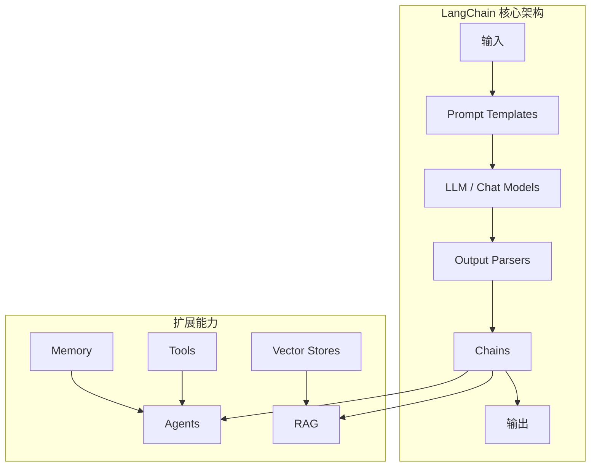
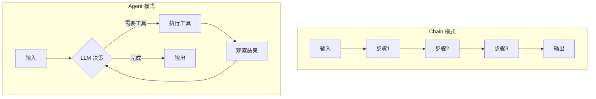
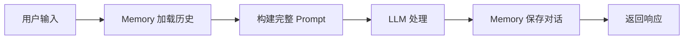
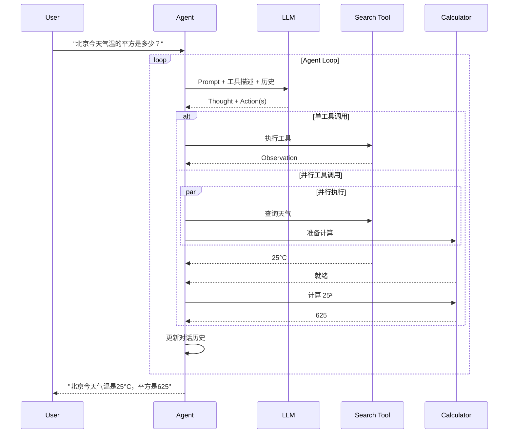

# LangChain 深度解析

> 深入理解 LangChain 的核心架构、组件设计与工程实践

---

## 一、概念与原理

### 1.1 什么是 LangChain

LangChain 是一个用于开发 LLM 应用的 Python/JS 框架，核心设计理念是**链式调用（Chaining）**——将多个组件组合成可复用的流水线。



### 1.2 核心组件架构

| 组件 | 职责 | 类比 |
|------|------|------|
| **Model I/O** | 封装 LLM 调用 | 适配器层 |
| **Prompts** | 模板化管理 | 模板引擎 |
| **Chains** | 组件编排 | 工作流引擎 |
| **Agents** | 动态决策 | 智能控制器 |
| **Memory** | 状态管理 | 会话存储 |
| **Retrieval** | 知识检索 | 搜索引擎 |

### 1.3 链式调用原理

LangChain 的核心抽象是 `Runnable` 接口，所有组件都实现了统一的调用契约：

```python
# 伪代码展示 Runnable 接口
interface Runnable<I, O>:
    def invoke(input: I) -> O
    def batch(inputs: List[I]) -> List[O]
    def stream(input: I) -> Iterator[O]
```

**链式组合方式：**


---

## 二、面试题详解

### 题目 1（初级）：LangChain 的 Chain 和 Agent 有什么区别？

**考察点：** 理解 LangChain 两种核心编排模式的差异

#### 详细解答

| 维度 | Chain | Agent |
|------|-------|-------|
| **执行流程** | 预定义的固定流程 | 动态决策的执行流程 |
| **LLM 调用次数** | 通常 1-N 次（固定） | 可能多次（循环直到完成） |
| **工具使用** | 被动调用 | 主动决策何时调用 |
| **适用场景** | 流程确定的固定任务 | 需要推理决策的开放任务 |
| **可控性** | 高（流程透明） | 相对较低（黑盒决策） |

**核心区别：**



**代码示例：**

```java
/**
 * Chain 模式：预定义流程
 * 适用于：翻译、格式化、固定流程的数据处理
 */
public class TranslationChain {
    
    private final ChatModel llm;
    private final PromptTemplate promptTemplate;
    
    public String translate(String text, String targetLang) {
        // 1. 格式化 Prompt
        String prompt = promptTemplate.format(Map.of(
            "text", text,
            "targetLang", targetLang
        ));
        
        // 2. 调用 LLM
        String result = llm.invoke(prompt);
        
        // 3. 解析输出（可选）
        return outputParser.parse(result);
    }
}

/**
 * Agent 模式：动态决策
 * 适用于：需要工具调用的复杂任务
 */
public class ResearchAgent {
    
    private final ChatModel llm;
    private final List<Tool> tools;
    private final String systemPrompt = """
        你是一个研究助手。你可以使用以下工具：
        {tool_descriptions}
        
        请按以下格式思考并行动：
        Thought: 你的思考过程
        Action: 工具名称
        Action Input: 工具参数
        Observation: 工具返回结果
        ...（重复直到获得最终答案）
        Final Answer: 最终答案
        """;
    
    public String research(String query) {
        List<Message> messages = new ArrayList<>();
        messages.add(new SystemMessage(systemPrompt));
        messages.add(new HumanMessage(query));
        
        // Agent 循环：直到决定停止
        while (true) {
            String response = llm.invoke(messages);
            
            // 解析 Thought/Action
            AgentAction action = parseAction(response);
            
            if (action.isFinish()) {
                return action.getFinalAnswer();
            }
            
            // 执行工具
            String observation = executeTool(action);
            messages.add(new AIMessage(response));
            messages.add(new ToolMessage(observation));
        }
    }
}
```

#### 延伸追问

**Q1：什么场景应该用 Chain，什么场景应该用 Agent？**

> 用 Chain：流程固定、可预测、成本敏感、需要高可控性（如：数据 ETL、格式化输出）
> 用 Agent：任务开放、需要推理、需要外部工具、任务步骤不确定（如：研究助手、客服机器人）

**Q2：Agent 的循环调用有什么风险？**

> 1. **无限循环**：LLM 可能反复调用工具无法收敛
> 2. **成本失控**：每次循环都消耗 Token
> 3. **延迟问题**：多次 LLM 调用增加响应时间
> 
> 解决方案：设置最大迭代次数、超时机制、成本预算

**Q3：LCEL（LangChain Expression Language）是什么？**

> LCEL 是 LangChain 的声明式链式组合语法，使用 `|` 操作符连接组件：
> ```python
> chain = prompt | llm | output_parser
> ```
> 优势：代码简洁、自动优化（如并行化）、类型安全

---

### 题目 2（中级）：LangChain 的 Memory 系统是如何工作的？有哪些实现方式？

**考察点：** 理解对话状态管理的原理和不同 Memory 实现的特点

#### 详细解答

**Memory 的核心作用：**



**Memory 的工作流程：**

1. **加载（load_memory_variables）**：从存储中读取历史对话
2. **注入（inject）**：将历史插入到 Prompt 的指定位置
3. **保存（save_context）**：将当前对话回合保存到存储

**常见 Memory 实现对比：**

| Memory 类型 | 存储内容 | 特点 | 适用场景 |
|-------------|----------|------|----------|
| **BufferMemory** | 原始对话历史 | 简单直接，可能超长 | 短对话 |
| **BufferWindowMemory** | 最近 K 轮对话 | 固定窗口，控制长度 | 中等长度对话 |
| **SummaryMemory** | 历史摘要 | 压缩历史，信息可能丢失 | 长对话 |
| **VectorStoreMemory** | 向量化检索 | 语义检索，支持大量历史 | 需要上下文感知的场景 |
| **EntityMemory** | 实体信息 | 提取并跟踪关键实体 | 需要记住用户信息的场景 |

**代码示例：**

```java
/**
 * Memory 接口定义
 */
public interface BaseMemory {
    // 加载历史上下文
    Map<String, Object> loadMemoryVariables(Map<String, Object> inputs);
    
    // 保存当前对话
    void saveContext(Map<String, Object> inputs, Map<String, Object> outputs);
    
    // 清空记忆
    void clear();
}

/**
 * ConversationBufferMemory 实现
 * 最简单的内存实现，直接保存原始对话
 */
public class ConversationBufferMemory implements BaseMemory {
    
    private final List<Message> chatHistory = new ArrayList<>();
    private final String memoryKey = "history";
    
    @Override
    public Map<String, Object> loadMemoryVariables(Map<String, Object> inputs) {
        // 将历史消息序列化为字符串
        String historyStr = chatHistory.stream()
            .map(msg -> msg.getRole() + ": " + msg.getContent())
            .collect(Collectors.joining("\n"));
        
        return Map.of(memoryKey, historyStr);
    }
    
    @Override
    public void saveContext(Map<String, Object> inputs, Map<String, Object> outputs) {
        // 保存用户输入
        String userInput = (String) inputs.get("input");
        chatHistory.add(new HumanMessage(userInput));
        
        // 保存 AI 输出
        String aiOutput = (String) outputs.get("output");
        chatHistory.add(new AIMessage(aiOutput));
    }
    
    @Override
    public void clear() {
        chatHistory.clear();
    }
}

/**
 * ConversationBufferWindowMemory 实现
 * 只保留最近 K 轮对话
 */
public class ConversationBufferWindowMemory implements BaseMemory {
    
    private final int k;  // 保留的轮数
    private final Queue<Message> chatHistory = new LinkedList<>();
    
    public ConversationBufferWindowMemory(int k) {
        this.k = k;
    }
    
    @Override
    public void saveContext(Map<String, Object> inputs, Map<String, Object> outputs) {
        // 添加新消息
        chatHistory.add(new HumanMessage((String) inputs.get("input")));
        chatHistory.add(new AIMessage((String) outputs.get("output")));
        
        // 保持窗口大小
        while (chatHistory.size() > k * 2) {
            chatHistory.poll();  // 移除最旧的消息
        }
    }
    
    // ... loadMemoryVariables, clear 类似
}

/**
 * ConversationSummaryMemory 实现
 * 使用 LLM 生成历史摘要
 */
public class ConversationSummaryMemory implements BaseMemory {
    
    private final ChatModel llm;
    private String summary = "";
    private final String summarizationPrompt = """
        请对以下对话历史进行摘要，保留关键信息：
        当前摘要：{summary}
        新对话：{new_lines}
        更新后的摘要：
        """;
    
    @Override
    public void saveContext(Map<String, Object> inputs, Map<String, Object> outputs) {
        String newLines = "Human: " + inputs.get("input") + "\nAI: " + outputs.get("output");
        
        // 调用 LLM 生成新摘要
        String prompt = summarizationPrompt
            .replace("{summary}", summary)
            .replace("{new_lines}", newLines);
        
        summary = llm.invoke(prompt);
    }
    
    @Override
    public Map<String, Object> loadMemoryVariables(Map<String, Object> inputs) {
        return Map.of("history", "以下是之前的对话摘要：\n" + summary);
    }
}
```

#### 延伸追问

**Q1：Memory 和 Prompt 中的上下文窗口有什么关系？**

> Memory 的内容最终会被注入到 Prompt 中，因此：
> 1. Memory 内容不能超过模型的上下文窗口限制
> 2. 需要为实际输入预留足够的 Token
> 3. 通常建议 Memory 占用不超过上下文窗口的 50%

**Q2：如何在多轮对话中实现长期记忆？**

> 1. **数据库存储**：将对话历史持久化到数据库
> 2. **摘要更新**：定期用 LLM 生成长期摘要
> 3. **关键信息提取**：提取用户偏好、事实等存入知识库
> 4. **RAG 增强**：用向量检索获取相关历史

**Q3：Memory 在多用户场景下如何处理？**

> 需要实现会话隔离：
> ```java
> public class MultiUserMemory {
>     private final Map<String, BaseMemory> userMemories = new ConcurrentHashMap<>();
>     
>     public BaseMemory getMemory(String userId) {
>         return userMemories.computeIfAbsent(userId, k -> new ConversationBufferMemory());
>     }
> }
> ```

---

### 题目 3（高级）：LangChain 的 Agent 是如何实现 Tool Calling 的？请设计一个支持并行工具调用的 Agent

**考察点：** 深入理解 Agent 的工具调用机制，具备设计复杂 Agent 的能力

#### 详细解答

**Agent 工具调用架构：**



**工具调用协议（ReAct）：**

```
Thought: 我需要先查询北京今天的天气，然后计算平方
Action: weather_api
Action Input: {"city": "北京", "date": "today"}
Observation: {"temperature": 25, "unit": "C"}

Thought: 现在我有了温度数据，需要计算平方
Action: calculator
Action Input: {"operation": "square", "value": 25}
Observation: 625

Thought: 我已经得到了最终答案
Final Answer: 北京今天气温是25°C，平方是625
```

**代码示例：**

```java
/**
 * 工具接口定义
 */
public interface Tool {
    String getName();
    String getDescription();
    String getParameters();  // JSON Schema
    String execute(String input);
}

/**
 * Agent Action 定义
 */
public class AgentAction {
    private String tool;
    private String toolInput;
    private String thought;
    
    public boolean isFinish() {
        return "Final Answer".equals(tool);
    }
}

/**
 * 支持并行工具调用的 Agent
 */
public class ParallelToolAgent {
    
    private final ChatModel llm;
    private final Map<String, Tool> tools;
    private final ExecutorService executor;
    
    // ReAct 格式的 Prompt
    private final String systemPrompt = """
        你是一个智能助手，可以使用以下工具：
        {tool_descriptions}
        
        请按以下格式思考并行动：
        Thought: 你的思考过程
        Action: 工具名称（如果需要多个工具，用逗号分隔）
        Action Input: JSON格式的参数（多个工具用数组）
        
        工具返回后你会看到：
        Observation: 工具返回结果
        
        当你有最终答案时：
        Thought: 我知道最终答案了
        Final Answer: 你的答案
        """;
    
    /**
     * 执行 Agent 循环
     */
    public String run(String query, int maxIterations) {
        List<Message> messages = new ArrayList<>();
        messages.add(new SystemMessage(formatSystemPrompt()));
        messages.add(new HumanMessage(query));
        
        for (int i = 0; i < maxIterations; i++) {
            // 1. 调用 LLM 获取下一步行动
            String response = llm.invoke(messages);
            
            // 2. 解析响应
            AgentResult result = parseResponse(response);
            
            if (result.isFinish()) {
                return result.getFinalAnswer();
            }
            
            // 3. 并行执行工具
            List<ToolCall> toolCalls = result.getToolCalls();
            List<Observation> observations = executeToolsParallel(toolCalls);
            
            // 4. 更新对话历史
            messages.add(new AIMessage(response));
            for (Observation obs : observations) {
                messages.add(new ToolMessage(obs.toString()));
            }
        }
        
        throw new RuntimeException("达到最大迭代次数");
    }
    
    /**
     * 并行执行多个工具
     */
    private List<Observation> executeToolsParallel(List<ToolCall> toolCalls) {
        List<Future<Observation>> futures = new ArrayList<>();
        
        // 提交所有工具调用任务
        for (ToolCall call : toolCalls) {
            Tool tool = tools.get(call.getToolName());
            if (tool == null) {
                throw new RuntimeException("未知工具: " + call.getToolName());
            }
            
            Future<Observation> future = executor.submit(() -> {
                String result = tool.execute(call.getToolInput());
                return new Observation(call.getToolName(), result);
            });
            
            futures.add(future);
        }
        
        // 收集所有结果
        List<Observation> observations = new ArrayList<>();
        for (Future<Observation> future : futures) {
            try {
                observations.add(future.get(30, TimeUnit.SECONDS));
            } catch (Exception e) {
                observations.add(new Observation("error", e.getMessage()));
            }
        }
        
        return observations;
    }
    
    /**
     * 解析 LLM 响应
     */
    private AgentResult parseResponse(String response) {
        AgentResult result = new AgentResult();
        
        // 提取 Thought
        Pattern thoughtPattern = Pattern.compile("Thought:\\s*(.+?)(?=\\nAction:|\\nFinal Answer:|$)", Pattern.DOTALL);
        Matcher thoughtMatcher = thoughtPattern.matcher(response);
        if (thoughtMatcher.find()) {
            result.setThought(thoughtMatcher.group(1).trim());
        }
        
        // 检查是否完成
        Pattern finalPattern = Pattern.compile("Final Answer:\\s*(.+)$", Pattern.DOTALL);
        Matcher finalMatcher = finalPattern.matcher(response);
        if (finalMatcher.find()) {
            result.setFinish(true);
            result.setFinalAnswer(finalMatcher.group(1).trim());
            return result;
        }
        
        // 提取 Action（支持多个）
        Pattern actionPattern = Pattern.compile("Action:\\s*(.+?)\\nAction Input:\\s*(\\{.+?\\}|\\[.+?\\])", Pattern.DOTALL);
        Matcher actionMatcher = actionPattern.matcher(response);
        
        List<ToolCall> toolCalls = new ArrayList<>();
        while (actionMatcher.find()) {
            String toolsStr = actionMatcher.group(1).trim();
            String inputStr = actionMatcher.group(2).trim();
            
            // 解析多个工具（逗号分隔）
            String[] toolNames = toolsStr.split(",\\s*");
            
            if (toolNames.length == 1) {
                // 单个工具
                toolCalls.add(new ToolCall(toolNames[0], inputStr));
            } else {
                // 多个工具 - 输入应该是数组
                JSONArray inputs = new JSONArray(inputStr);
                for (int i = 0; i < toolNames.length; i++) {
                    toolCalls.add(new ToolCall(toolNames[i], inputs.get(i).toString()));
                }
            }
        }
        
        result.setToolCalls(toolCalls);
        return result;
    }
}
```

#### 延伸追问

**Q1：LangChain 的 Agent 和 OpenAI 的 Function Calling 有什么区别？**

> | 特性 | LangChain Agent | OpenAI Function Calling |
> |------|-----------------|------------------------|
> | 决策方式 | LLM 生成文本决策 | 结构化输出工具调用 |
> | 格式 | ReAct 文本格式 | JSON Schema |
> | 可控性 | 灵活但解析复杂 | 结构化但受限于模型 |
> | 模型支持 | 任意 LLM | 仅支持 Function Calling 的模型 |
> 
> LangChain 的 AgentExecutor 可以封装 OpenAI Function Calling，提供统一的接口。

**Q2：如何处理工具调用失败的情况？**

> ```java
> public class RobustToolAgent extends ParallelToolAgent {
>     
>     @Override
>     protected Observation executeToolWithRetry(ToolCall call, int maxRetries) {
>         for (int i = 0; i < maxRetries; i++) {
>             try {
>                 Tool tool = tools.get(call.getToolName());
>                 String result = tool.execute(call.getToolInput());
>                 return new Observation(call.getToolName(), result);
>             } catch (Exception e) {
>                 if (i == maxRetries - 1) {
>                     // 最后一次失败，返回错误信息
>                     return new Observation(call.getToolName(), 
>                         "Error: " + e.getMessage());
>                 }
>                 // 指数退避
>                 Thread.sleep((long) Math.pow(2, i) * 1000);
>             }
>         }
>     }
> }
> ```

**Q3：Agent 的 Prompt 工程有哪些最佳实践？**

> 1. **清晰的工具描述**：每个工具的描述要明确输入输出
> 2. **Few-shot 示例**：在 Prompt 中加入正确的调用示例
> 3. **明确的停止条件**：告诉 LLM 何时应该停止调用工具
> 4. **错误处理提示**：让 LLM 知道如何处理工具返回的错误
> 5. **输出格式约束**：使用结构化格式（如 ReAct）便于解析

---

## 三、延伸追问

### 追问 1：LangChain 的性能优化有哪些手段？

**要点：**
1. **批处理（Batching）**：使用 `batch()` 方法并行处理多个输入
2. **缓存（Caching）**：对 LLM 调用结果进行缓存
3. **流式输出（Streaming）**：使用 `stream()` 减少首 token 延迟
4. **异步执行**：使用 `ainvoke()` 进行异步调用
5. **Prompt 压缩**：减少不必要的 Token 消耗

```java
// 批处理示例
List<String> inputs = Arrays.asList("问题1", "问题2", "问题3");
List<String> results = chain.batch(inputs);

// 流式输出示例
chain.stream(input).forEach(chunk -> {
    System.out.print(chunk);  // 实时输出
});
```

### 追问 2：LangChain 与 LlamaIndex 的核心差异是什么？

| 维度 | LangChain | LlamaIndex |
|------|-----------|------------|
| **核心定位** | 通用 LLM 应用框架 | 数据检索与索引框架 |
| **强项** | Agent、Chain 编排 | RAG、文档索引 |
| **数据连接** | 较通用 | 丰富的 Data Connector |
| **查询引擎** | 基础 | 高级（路由、子查询） |
| **使用场景** | 复杂 Agent 系统 | 知识库问答 |

### 追问 3：LangChain 的回调系统（Callbacks）有什么作用？

回调系统用于监控和干预 Chain/Agent 的执行过程：

```java
public interface BaseCallbackHandler {
    void onChainStart(String chainName, Map<String, Object> inputs);
    void onChainEnd(String chainName, Map<String, Object> outputs);
    void onLLMStart(String prompt);
    void onLLMEnd(String response, TokenUsage usage);
    void onToolStart(String toolName, String input);
    void onToolEnd(String toolName, String output);
    void onError(String error);
}

// 典型用途：
// 1. 日志记录
// 2. Token 使用量统计
// 3. 性能监控
// 4. 调试追踪
// 5. 流式输出到前端
```

---

## 四、总结

### 面试回答模板

> LangChain 是一个用于构建 LLM 应用的编排框架，核心设计是**链式组合（Chaining）**。它将 LLM 应用拆分为可复用的组件：Model I/O、Prompts、Chains、Agents、Memory、Retrieval。
> 
> **Chain vs Agent**：Chain 是预定义的固定流程，适合确定性的任务；Agent 是动态决策的执行流程，LLM 自己决定何时调用工具，适合开放性问题。
> 
> **Memory 系统**：通过 `load/save` 接口管理对话状态，有 Buffer、Window、Summary、Vector 等多种实现，用于控制上下文长度和保留关键信息。
> 
> **工具调用**：基于 ReAct 模式，LLM 生成 Thought→Action→Observation 的循环，直到获得最终答案。可以通过并行执行优化性能。

### 一句话记忆

| 概念 | 一句话 |
|------|--------|
| **LangChain** | LLM 应用的"乐高积木"，通过链式组合快速构建复杂应用 |
| **Chain** | 预定义流程，像流水线一样处理数据 |
| **Agent** | 智能控制器，让 LLM 自己决定怎么完成任务 |
| **Memory** | 给 LLM 装上"记忆"，支持多轮对话 |
| **LCEL** | 用 `\|` 符号优雅地组合组件，代码即管道 |

### 核心要点速查

```
LangChain 核心 = 组件 + 链式组合 + 可扩展性

组件层级：
  Model → Prompt → Chain → Agent
  Memory ↗      ↗      ↘ Tools
  Retrieval ↘───┘

关键设计模式：
  1. Runnable 接口统一调用契约
  2. LCEL 声明式链式语法
  3. ReAct Agent 推理+行动循环
  4. Memory 抽象解耦状态管理

性能优化：
  - 批处理 (batch)
  - 缓存 (cache)
  - 流式 (stream)
  - 异步 (async)
```

---

**参考资料：**
- [LangChain 官方文档](https://python.langchain.com/)
- [LangChain 架构设计](https://blog.langchain.dev/)
- [LCEL 指南](https://python.langchain.com/docs/expression_language/)
