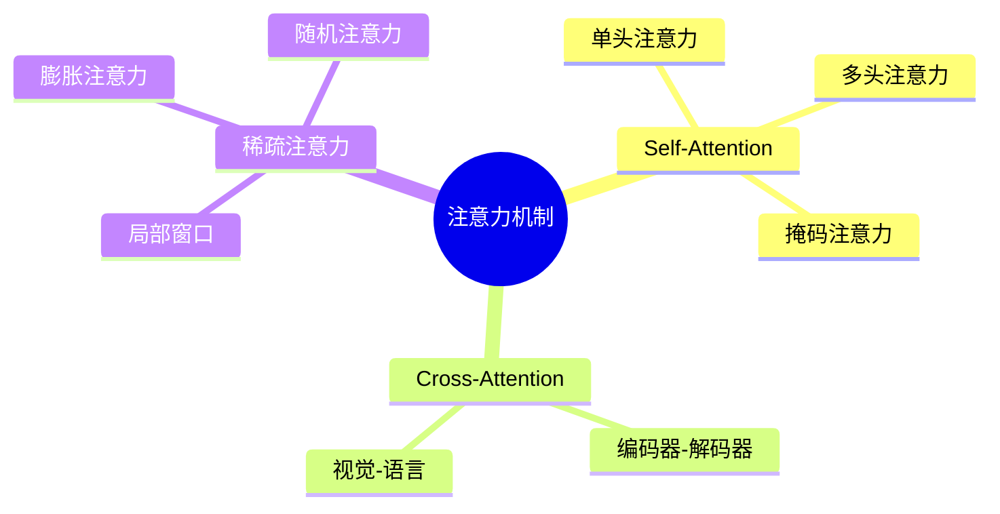
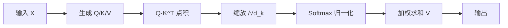

# 注意力机制详解

> 注意力机制是 Transformer 的核心，理解 Self-Attention、Cross-Attention 和 Multi-Head Attention 是掌握 LLM 的关键。

---

## 一、概念与原理

### 1.1 什么是注意力机制？

**注意力机制（Attention Mechanism）** 源于人类视觉注意力的启发：在处理信息时，我们会选择性地关注重要部分，忽略无关信息。

**核心思想：**
```
输出 = Σ(权重_i × 值_i)
```

其中权重由 Query 和 Key 的相似度决定，值（Value）是实际传递的信息。

### 1.2 注意力类型对比



### 1.3 Self-Attention 详解

**计算流程：**



**数学公式：**

```
Attention(Q, K, V) = softmax(QK^T / √d_k) · V

其中：
- Q = X · W_Q  (Query 矩阵)
- K = X · W_K  (Key 矩阵)
- V = X · W_V  (Value 矩阵)
- d_k = Key 的维度
```

### 1.4 Cross-Attention 详解

**与 Self-Attention 的区别：**

| 特性 | Self-Attention | Cross-Attention |
|-----|----------------|-----------------|
| Q 来源 | 输入序列自身 | 目标序列（如 Decoder） |
| K/V 来源 | 输入序列自身 | 源序列（如 Encoder） |
| 用途 | 序列内部建模 | 序列间信息交互 |
| 典型场景 | 编码器、解码器自注意力 | 编码器-解码器注意力 |

**应用场景：**
- **机器翻译**：Decoder 关注 Encoder 输出的不同部分
- **图文模型**：文本 Query 关注图像的 Key/Value
- **多模态融合**：不同模态间的信息对齐

### 1.5 注意力变体

#### 1.5.1 Scaled Dot-Product Attention

```java
/**
 * 缩放点积注意力（标准实现）
 */
public class ScaledDotProductAttention {
    private final double scale;
    
    public ScaledDotProductAttention(int dK) {
        this.scale = 1.0 / Math.sqrt(dK);
    }
    
    public Tensor forward(Tensor Q, Tensor K, Tensor V) {
        // Step 1: Q·K^T
        Tensor scores = Q.matmul(K.transpose());
        
        // Step 2: 缩放
        scores = scores.mul(scale);
        
        // Step 3: Softmax
        Tensor weights = softmax(scores);
        
        // Step 4: 加权求和
        return weights.matmul(V);
    }
}
```

#### 1.5.2 Additive Attention

```
Score(Q, K) = v^T · tanh(W_Q · Q + W_K · K)
```

- 使用加法而非点积计算相似度
- 更适合 Q 和 K 维度不同的情况
- 计算量更大，但表达能力更强

#### 1.5.3 Masked Attention

```java
/**
 * 掩码注意力（用于 Decoder 自回归生成）
 */
public class MaskedAttention {
    public Tensor forward(Tensor Q, Tensor K, Tensor V, Mask mask) {
        Tensor scores = Q.matmul(K.transpose()).mul(scale);
        
        // 应用掩码：未来位置设为 -∞
        if (mask != null) {
            scores = scores.masked_fill(mask, Double.NEGATIVE_INFINITY);
        }
        
        Tensor weights = softmax(scores);
        return weights.matmul(V);
    }
}

// 掩码矩阵示例（下三角为 0，上三角为 1）
// [[0, 1, 1, 1],
//  [0, 0, 1, 1],
//  [0, 0, 0, 1],
//  [0, 0, 0, 0]]
```

---

## 二、面试题详解

### 题目 1：Self-Attention 和 Cross-Attention 有什么区别？（初级）

**题目描述：**
请说明 Self-Attention 和 Cross-Attention 的区别，并举例说明 Cross-Attention 的应用场景。

**考察点：**
- 两种注意力机制的本质区别
- 实际应用场景的理解

**详细解答：**

**核心区别：**

| 维度 | Self-Attention | Cross-Attention |
|-----|----------------|-----------------|
| **Q/K/V 来源** | 都来自同一个输入序列 | Q 来自目标序列，K/V 来自源序列 |
| **计算方式** | 序列内部元素互相关注 | 目标序列关注源序列 |
| **信息流动** | 序列内信息重组 | 序列间信息传递 |

**代码对比：**

```java
/**
 * Self-Attention：Q/K/V 来自同一输入
 */
public class SelfAttention {
    public Tensor forward(Tensor X) {
        Tensor Q = linearQ(X);  // 来自 X
        Tensor K = linearK(X);  // 来自 X
        Tensor V = linearV(X);  // 来自 X
        return scaledDotProductAttention(Q, K, V);
    }
}

/**
 * Cross-Attention：Q 来自目标，K/V 来自源
 */
public class CrossAttention {
    public Tensor forward(Tensor target, Tensor source) {
        Tensor Q = linearQ(target);   // 来自目标序列
        Tensor K = linearK(source);   // 来自源序列
        Tensor V = linearV(source);   // 来自源序列
        return scaledDotProductAttention(Q, K, V);
    }
}
```

**应用场景：**

1. **机器翻译（Transformer Decoder）**
   ```
   英文输入 → Encoder → [表示向量]
                              ↓
   中文输出 ← Decoder ← Cross-Attention ← [表示向量]
   ```
   Decoder 在生成每个中文词时，通过 Cross-Attention 关注 Encoder 输出的相关英文部分。

2. **Stable Diffusion（文生图）**
   ```
   文本 Prompt → Text Encoder → [文本特征]
                                     ↓
   图像生成 ← UNet ← Cross-Attention ← [文本特征]
   ```
   UNet 通过 Cross-Attention 将文本条件注入图像生成过程。

3. **多模态理解（CLIP/LLaVA）**
   - 视觉特征作为 K/V
   - 文本 Query 关注图像的相应区域

---

### 题目 2：为什么 Attention 要除以 √d_k？（中级）

**题目描述：**
请解释 Scaled Dot-Product Attention 中的缩放因子 √d_k 的作用，如果不缩放会有什么后果？

**考察点：**
- 数值稳定性理解
- 对 Softmax 特性的掌握

**详细解答：**

**问题背景：**

假设 Q 和 K 的每个元素是独立随机变量，均值为 0，方差为 1：
```
Q, K ~ N(0, 1)
```

则点积 Q·K^T 的每个元素是 d_k 个独立随机变量的和：
```
Var(Q·K^T) = d_k × Var(Q_i × K_i) = d_k × 1 = d_k
```

**因此，点积的方差随 d_k 线性增长！**

**不缩放的后果：**

| d_k | 点积方差 | Softmax 输入范围 | 梯度问题 |
|-----|---------|-----------------|---------|
| 64 | 64 | [-20, 20] | 轻微饱和 |
| 512 | 512 | [-50, 50] | 严重饱和 |
| 1024 | 1024 | [-70, 70] | 几乎为 0 |

**Softmax 饱和问题：**

```
输入值很大时：softmax([100, 90, 80]) ≈ [1.0, 0.0, 0.0]
梯度几乎为 0，无法学习！
```

**缩放的作用：**

```
缩放后：Var(Q·K^T / √d_k) = d_k / d_k = 1
```

- 方差归一化为 1
- Softmax 输入保持在合理范围 [-5, 5]
- 梯度健康，训练稳定

**可视化：**

```java
/**
 * 缩放效果演示
 */
public class ScaleEffect {
    public void demonstrate() {
        int dK = 512;
        double scale = Math.sqrt(dK);  // ≈ 22.6
        
        // 模拟点积结果
        double[] dotProducts = {-40, -20, 0, 20, 40};
        
        System.out.println("d_k = " + dK);
        System.out.println("缩放因子 = √" + dK + " = " + scale);
        System.out.println();
        
        for (double dot : dotProducts) {
            double scaled = dot / scale;
            System.out.printf("原始: %.1f, 缩放后: %.2f%n", dot, scaled);
        }
        
        // 输出：
        // d_k = 512
        // 缩放因子 = √512 = 22.627...
        //
        // 原始: -40.0, 缩放后: -1.77
        // 原始: -20.0, 缩放后: -0.88
        // 原始: 0.0, 缩放后: 0.00
        // 原始: 20.0, 缩放后: 0.88
        // 原始: 40.0, 缩放后: 1.77
    }
}
```

---

### 题目 3：Multi-Head Attention 中多个头的作用是什么？（中级）

**题目描述：**
Transformer 为什么要使用 Multi-Head Attention？不同头之间有什么区别？如果只用一个头会怎样？

**考察点：**
- 多头注意力的设计动机
- 对模型表达能力的理解

**详细解答：**

**设计动机：**

语言中存在多种类型的依赖关系，单一注意力难以同时捕捉：

| 依赖类型 | 示例 | 需要的关注模式 |
|---------|------|---------------|
| **句法关系** | "猫**坐**在垫子上" | 动词-主语关联 |
| **指代关系** | "**它**很可爱" → "猫" | 代词-名词对齐 |
| **语义关系** | "国王-女王" ≈ "男人-女人" | 语义相似性 |
| **位置关系** | 相邻词关联 | 局部窗口关注 |

**多头机制：**

```java
/**
 * Multi-Head Attention 实现
 */
public class MultiHeadAttention {
    private final int numHeads;
    private final int dModel;
    private final int dK;
    
    public MultiHeadAttention(int numHeads, int dModel) {
        this.numHeads = numHeads;      // 如 8
        this.dModel = dModel;          // 如 512
        this.dK = dModel / numHeads;   // 如 64
    }
    
    public Tensor forward(Tensor Q, Tensor K, Tensor V) {
        // 1. 线性投影并分头
        // Q: [batch, seq, d_model] → [batch, heads, seq, d_k]
        Tensor Q_heads = linearQ(Q).reshape(-1, numHeads, -1, dK);
        Tensor K_heads = linearK(K).reshape(-1, numHeads, -1, dK);
        Tensor V_heads = linearV(V).reshape(-1, numHeads, -1, dK);
        
        // 2. 并行计算每个头的注意力
        Tensor[] headOutputs = new Tensor[numHeads];
        for (int h = 0; h < numHeads; h++) {
            headOutputs[h] = attention(
                Q_heads.slice(h), 
                K_heads.slice(h), 
                V_heads.slice(h)
            );
        }
        
        // 3. 拼接并投影
        Tensor concatenated = concat(headOutputs);  // [batch, seq, d_model]
        return linearOut(concatenated);
    }
}
```

**不同头的分工（可视化分析发现）：**

```
Head 0: 关注相邻位置（局部模式）
Head 1: 关注句法主语（主谓关系）
Head 2: 关注指代词（共指消解）
Head 3: 关注语义相似词
Head 4: 关注特定位置（如句末）
...
```

**单头的局限：**

```java
/**
 * 单头注意力的局限
 */
public class SingleHeadLimitation {
    public void analyze() {
        // 单头只能学习一种关注模式
        // 无法同时捕捉句法、语义、位置等多种关系
    }
}
```

**实验发现：**

| 配置 | 表达能力 | 参数量 | 典型应用 |
|-----|---------|--------|---------|
| 单头 | 弱 | d_model × d_k | 简单任务 |
| 8 头 | 强 | d_model × d_model | BERT-base |
| 16 头 | 更强 | 同上 | BERT-large |

**结论：**
- 多头 = 多个子空间并行学习
- 每个头可以专注于不同的关系类型
- 最终拼接融合，获得更丰富的表示

---

### 题目 4：Attention 的复杂度是多少？有什么优化方法？（高级）

**题目描述：**
请分析 Self-Attention 的时间和空间复杂度，并介绍常用的优化方法（如 Sparse Attention、Flash Attention）。

**考察点：**
- 复杂度分析能力
- 对优化技术的了解

**详细解答：**

**复杂度分析：**

| 操作 | 时间复杂度 | 空间复杂度 | 说明 |
|-----|-----------|-----------|------|
| Q/K/V 投影 | O(n × d²) | O(d²) | 线性变换 |
| QK^T 计算 | O(n² × d) | O(n²) | 注意力矩阵 |
| Softmax | O(n²) | O(n²) | 按行计算 |
| 加权求和 | O(n² × d) | O(n × d) | 输出计算 |
| **总计** | **O(n² × d)** | **O(n²)** | n=序列长度 |

**瓶颈：O(n²) 的注意力矩阵**

当 n=4096 时，注意力矩阵有 1600 万元素！

**优化方法 1：Sparse Attention（稀疏注意力）**

```java
/**
 * 局部窗口注意力
 */
public class LocalAttention {
    private final int windowSize;
    
    public Tensor forward(Tensor Q, Tensor K, Tensor V) {
        int seqLen = Q.length();
        Tensor output = zeros(seqLen, dK);
        
        // 只计算窗口内的注意力
        for (int i = 0; i < seqLen; i++) {
            int start = Math.max(0, i - windowSize);
            int end = Math.min(seqLen, i + windowSize + 1);
            
            // 局部 Q/K/V
            Tensor localQ = Q.slice(i, i+1);
            Tensor localK = K.slice(start, end);
            Tensor localV = V.slice(start, end);
            
            // 局部注意力
            output[i] = attention(localQ, localK, localV);
        }
        
        return output;
    }
}
// 复杂度：O(n × w × d)，w=窗口大小 << n
```

**稀疏模式对比：**

| 模式 | 关注范围 | 复杂度 | 代表模型 |
|-----|---------|--------|---------|
| **Full** | 全部位置 | O(n²) | 标准 Transformer |
| **Local** | 局部窗口 | O(n×w) | Longformer |
| **Strided** | 间隔采样 | O(n×n/r) | Sparse Transformer |
| **Factorized** | 局部+全局 | O(n×w + n×g) | BigBird |

**优化方法 2：Flash Attention**

```java
/**
 * Flash Attention 核心思想
 */
public class FlashAttention {
    
    public Tensor forward(Tensor Q, Tensor K, Tensor V) {
        // 核心优化：分块计算，避免存储完整注意力矩阵
        
        int blockSize = 256;  // SRAM 可容纳的块大小
        Tensor output = zeros(Q.shape());
        
        // 外循环：遍历 Q 的块
        for (Block qBlock : Q.blocks(blockSize)) {
            Tensor acc = zeros(qBlock.shape());
            double maxScore = Double.NEGATIVE_INFINITY;
            double sumExp = 0;
            
            // 内循环：遍历 K/V 的块
            for (Block kvBlock : zip(K.blocks(blockSize), V.blocks(blockSize))) {
                // 在 SRAM 中计算局部注意力
                Tensor localScores = qBlock.matmul(kvBlock.K.transpose());
                localScores = localScores.divide(Math.sqrt(dK));
                
                // Online Softmax：增量更新
                double newMax = Math.max(maxScore, localScores.max());
                sumExp = sumExp * Math.exp(maxScore - newMax) + 
                         localScores.exp().sum() * Math.exp(localScores.max() - newMax);
                maxScore = newMax;
                
                // 累加输出
                acc = acc.add(localScores.exp().matmul(kvBlock.V));
            }
            
            // 归一化
            output.setBlock(qBlock.index(), acc.divide(sumExp));
        }
        
        return output;
    }
}
```

**Flash Attention 优势：**

| 指标 | 标准 Attention | Flash Attention | 提升 |
|-----|---------------|-----------------|------|
| HBM 访问 | O(n²) | O(n) | 显著减少 |
| 内存占用 | O(n²) | O(n) | 可处理更长序列 |
| 速度 | 基准 | 2-4× | IO 感知优化 |

**优化方法 3：KV Cache（推理优化）**

```java
/**
 * KV Cache 推理优化
 */
public class KVCache {
    private List<Tensor> cachedK = new ArrayList<>();
    private List<Tensor> cachedV = new ArrayList<>();
    
    public Tensor forwardStep(Tensor newQ, Tensor newK, Tensor newV, int step) {
        // 缓存新的 K/V
        cachedK.add(newK);
        cachedV.add(newV);
        
        // 拼接所有历史的 K/V
        Tensor allK = concat(cachedK);  // [step+1, d_k]
        Tensor allV = concat(cachedV);  // [step+1, d_k]
        
        // 只计算新 token 与所有历史 token 的注意力
        // 复杂度：O(step × d) 每步，而非 O(step² × d)
        return attention(newQ, allK, allV);
    }
}
```

**复杂度对比（推理时）：**

| 方法 | 每步复杂度 | 总复杂度（n 步） |
|-----|-----------|----------------|
| 无 Cache | O(n² × d) | O(n³ × d) |
| 有 Cache | O(n × d) | O(n² × d) |

---

## 三、延伸追问

### 追问 1：为什么 Transformer 用 LayerNorm 而不是 BatchNorm？

**简要答案：**
- **序列长度不固定**：BatchNorm 需要固定 batch 统计量
- **特征独立**：LayerNorm 对每个样本独立归一化
- **训练和推理一致**：LayerNorm 不需要维护 running statistics

### 追问 2：Attention 和 CNN 的 receptive field 有什么区别？

**简要答案：**
- **CNN**：局部感受野，深层才能看到全局
- **Attention**：全局感受野，任意位置直接关联
- **复杂度权衡**：CNN O(n)，Attention O(n²)

### 追问 3：多头注意力的头数越多越好吗？

**简要答案：**
- 不是，存在边际递减
- 头数增加 → 每个头的维度减小（d_k = d_model / h）
- 经验值：8-16 头效果最佳
- 太多头可能导致表达能力分散

### 追问 4：什么是 Linear Attention？有什么优势？

**简要答案：**
- **核心思想**：用核技巧将 softmax 换成线性函数
- **复杂度**：O(n × d²)，而非 O(n² × d)
- **优势**：线性复杂度，适合超长序列
- **代表**：Performer、Linear Transformer

---

## 四、总结

### 面试回答模板

> 注意力机制通过 **Query-Key-Value** 计算实现选择性关注。
>
> **核心要点：**
> 1. **Self-Attention**：序列内部建模，Q/K/V 同源
> 2. **Cross-Attention**：序列间交互，Q 来自目标，K/V 来自源
> 3. **缩放因子 √d_k**：防止点积过大导致 softmax 饱和
> 4. **Multi-Head**：多子空间并行，捕捉不同关系类型
>
> **复杂度：**
> - 时间：O(n² × d)，空间：O(n²)
> - 优化：Sparse Attention、Flash Attention、KV Cache
>
> **应用场景：**
> - 机器翻译（Cross-Attention）
> - 文生图（Stable Diffusion）
> - 多模态融合（CLIP）

### 一句话记忆

| 概念 | 一句话 |
|-----|--------|
| **Self-Attention** | Q问K答，自己关注自己，序列内部建模 |
| **Cross-Attention** | 目标问、源回答，序列间信息交互 |
| **√d_k 缩放** | 防止点积太大，softmax 梯度消失 |
| **Multi-Head** | 多个头学不同关系，句法、语义、位置各司其职 |
| **复杂度优化** | Sparse 降复杂度，Flash 减内存，KV Cache 加速推理 |

---

## 参考资料

1. Vaswani et al. "Attention Is All You Need" (NeurIPS 2017)
2. Tay et al. "Efficient Transformers: A Survey" (2020)
3. Dao et al. "FlashAttention: Fast and Memory-Efficient Exact Attention" (2022)
4. Beltagy et al. "Longformer: The Long-Document Transformer" (2020)
5. Choromanski et al. "Rethinking Attention with Performers" (2020)
