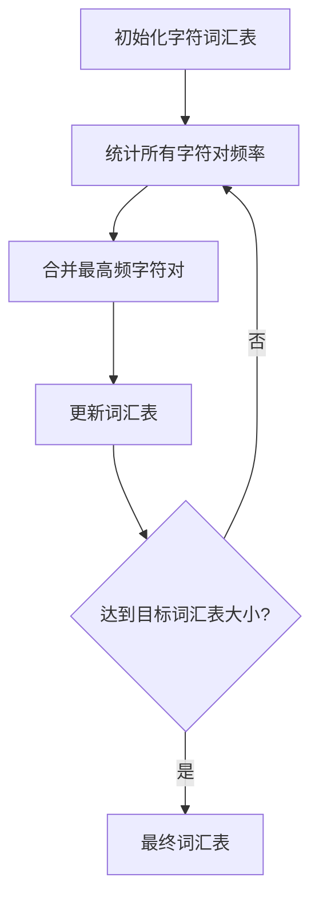

# Tokenizer 原理详解

> Tokenizer 是大语言模型的"守门员"，负责将人类语言转换为模型可理解的数字序列。理解其原理对于优化 Prompt、控制成本和提升效果至关重要。

---

## 一、概念与原理

### 1.1 什么是 Tokenization？

**Tokenization** 是将文本分割成模型可处理的单元（Token）的过程。这是 NLP 的第一步，也是大语言模型理解人类语言的基础。


**核心作用：**
- **文本分割**：将连续文本离散化为 Token
- **词汇映射**：建立 Token 到 ID 的映射表
- **子词处理**：处理未登录词（OOV）
- **特殊标记**：添加特殊 Token（如 `<s>`, `</s>`, `<pad>`）

### 1.2 主流 Tokenization 算法

| 算法 | 代表模型 | 核心思想 | 优点 | 缺点 |
|-----|---------|---------|------|------|
| **BPE** | GPT-2/3/4, LLaMA | 合并高频字符对 | 平衡词表大小和覆盖率 | 对中文不够友好 |
| **WordPiece** | BERT | 基于概率合并 | 适合多语言 | 词表较大 |
| **Unigram** | T5, AlBERT | 从大到小剪枝 | 更灵活 | 训练复杂 |
| **SentencePiece** | LLaMA-2, ChatGLM | 语言无关处理 | 无需预分词 | 可能切分过长 |

### 1.3 BPE 算法详解



**BPE 训练过程示例：**

```
初始语料：["low", "lower", "lowest", "new", "newer", "newest"]

Step 1: 初始词汇表 = {l, o, w, e, r, s, t, n}

Step 2: 统计字符对频率
  "lo": 3 (low, lower, lowest)
  "ow": 3 (low, lower, lowest)
  "we": 2 (lower, lowest)
  ...

Step 3: 合并最高频对 "lo" → 词汇表加入 "lo"

Step 4: 更新语料
  ["lo w", "lo wer", "lo west", "n e w", ...]

Step 5: 重复直到词汇表达到目标大小
```

---

## 二、面试题详解

### 题目 1：为什么大模型使用子词（Subword）而不是完整的单词？（初级）

**题目描述：**
请解释为什么大语言模型使用子词（Subword）Tokenization 而不是直接使用完整单词，并说明优缺点。

**考察点：**
- 对 Tokenization 设计原理的理解
- 词表设计的权衡思维

**详细解答：**

**子词 vs 单词对比：**

| 维度 | 单词级 | 子词级 |
|-----|--------|--------|
| **词表大小** | 非常大（50万+） | 可控（3-10万） |
| **OOV 问题** | 严重 | 极少 |
| **语义理解** | 直接 | 需要组合 |
| **形态变化** | 每个变体独立 | 共享词根 |
| **多语言** | 困难 | 容易扩展 |
| **计算效率** | Embedding 矩阵大 | 更紧凑 |

**子词优势示例：**

```
单词级处理:
- "play", "plays", "played", "playing" = 4 个独立 Token
- 词汇表需要包含所有变形
- 模型无法自动理解它们的关系

子词级处理 (BPE):
- "play", "plays", "played", "playing" = [play], [play, s], [play, ed], [play, ing]
- 共享词根 "play"
- 模型自动学习形态规则
- 遇到 "played" 时，即使训练数据少也能理解
```

---

### 题目 2：中文 Tokenization 有什么特殊挑战？如何解决？（中级）

**题目描述：**
请说明中文 Tokenization 相比英文的特殊挑战，以及当前主流的解决方案。

**考察点：**
- 对中文 NLP 的理解
- 跨语言 Tokenization 的挑战

**详细解答：**

**中文特殊挑战：**

| 挑战 | 说明 | 影响 |
|-----|------|------|
| **无空格分隔** | 中文连续书写，无天然边界 | 需要额外的分词步骤 |
| **歧义切分** | "研究生命" = 研究生/命 或 研究/生命 | 影响语义理解 |
| **字符集大** | 常用汉字 5000+，总字符数万 | 词表设计困难 |
| **多音多义** | 相同字形不同读音含义 | Token 无法区分 |
| **新词频繁** | 网络新词、专有名词不断涌现 | OOV 问题 |

**主流解决方案对比：**

| 方案 | 代表模型 | 原理 | 优点 | 缺点 |
|-----|---------|------|------|------|
| **逐字** | 早期 BERT | 每个汉字独立 | 简单无歧义 | Token 过长，效率低 |
| **词级** | 中文 BERT | 先分词再 Tokenize | 语义完整 | 分词错误会传播 |
| **子词** | GPT-4, ChatGLM | BPE/SentencePiece | 平衡效率和语义 | 可能切分语义词 |

---

### 题目 3：Token 数量如何影响模型成本和性能？（中级）

**题目描述：**
请说明 Token 数量对模型推理成本和性能的影响，以及如何优化 Token 使用。

**考察点：**
- 对模型计算复杂度的理解
- 成本优化意识

**详细解答：**

**Token 数量影响：**

| 维度 | 影响 | 说明 |
|-----|------|------|
| **计算成本** | O(n²) 注意力复杂度 | Token 越多，计算量平方增长 |
| **内存占用** | O(n) KV Cache | 长序列需要更多显存 |
| **API 费用** | 按 Token 计费 | 输入+输出 Token 数 × 单价 |
| **延迟** | 线性增长 | 生成每个 Token 需要时间 |
| **上下文窗口** | 有限制 | 超出限制需要截断或压缩 |

**成本对比示例：**

```
场景：处理一篇 1000 字的文章

中文:
- 约 1500-2000 Tokens（每个字 1.5-2 Token）
- GPT-4 输入成本: 2000 × $0.03/1K = $0.06

英文:
- 约 750-1000 Tokens（每个词 1.3 Token）
- GPT-4 输入成本: 1000 × $0.03/1K = $0.03

结论: 相同内容，中文成本约为英文 1.5-2 倍
```

**优化策略：**

| 策略 | 方法 | 效果 |
|-----|------|------|
| **Prompt 压缩** | 删除冗余词、使用缩写 | 减少 20-30% |
| **结构化输入** | 使用 JSON 代替自然语言 | 减少 10-20% |
| **分批处理** | 长文本分段处理 | 避免截断 |
| **缓存复用** | 重复内容使用 Embedding | 减少重复计算 |
| **模型选择** | 简单任务用小模型 | 成本降低 10-100 倍 |

---

## 三、延伸追问

### 追问 1：为什么同一个词在不同上下文中 Token 数可能不同？

**简要答案：**
- 空格和标点会影响切分
- 大小写可能不同（"Hello" vs "hello"）
- 前后字符影响 BPE 合并
- 特殊字符和数字处理方式不同

### 追问 2：如何估算一段文本的 Token 数量？

**简要答案：**
- 英文: 词数 × 1.3
- 中文: 字数 × 1.5-2
- 代码: 行数 × 10-30
- 使用官方 Tokenizer 库精确计算

---

## 四、总结

### 面试回答模板

> Tokenizer 是模型理解文本的第一步，将人类语言转换为数字序列。
>
> **主流算法：**
> - **BPE**: 合并高频字符对，GPT 系列使用
> - **WordPiece**: 基于概率合并，BERT 使用
> - **SentencePiece**: 语言无关，适合多语言
>
> **子词优势：**
> - 控制词表大小（3-10万 vs 50万+）
> - 解决 OOV 问题
> - 共享词根，理解形态变化
>
> **中文挑战：**
> - 无空格分隔，需要预分词
> - Token 效率低（1.5-2 Token/字）
> - 成本比英文高 1.5-2 倍
>
> **成本优化：**
> - Prompt 压缩、结构化输入
> - 缓存复用、模型分级

### 一句话记忆

| 概念 | 一句话 |
|-----|--------|
| **BPE** | 从字符开始，逐步合并高频对 |
| **子词** | 平衡词表大小和覆盖率，解决 OOV |
| **中文 Token** | 无空格更复杂，效率比英文低 |
| **Token 成本** | 按 Token 计费，中文更贵 |
