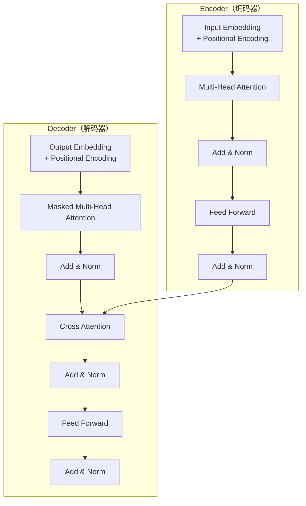

# Transformer 架构详解

> Transformer 是现代大语言模型的基石架构，理解其原理是掌握 LLM 的必经之路。

---

## 一、概念与原理

### 1.1 什么是 Transformer？

Transformer 是 Google 在 2017 年论文《Attention Is All You Need》中提出的神经网络架构，完全基于 **Self-Attention（自注意力）机制**，摒弃了传统的 RNN/CNN 结构。

**核心创新：**
- **Self-Attention**：让模型在处理序列时能够同时关注所有位置
- **并行计算**：相比 RNN 的串行处理，Transformer 可以高度并行化
- **长距离依赖**：直接建模任意两个 token 之间的关系，无信息衰减

### 1.2 架构整体结构



### 1.3 核心组件详解

#### 1.3.1 Self-Attention 机制

**计算步骤：**

```
Input: X ∈ R^(n×d)

Step 1: 生成 Q、K、V
    Q = X · W_Q    (Query)
    K = X · W_K    (Key)
    V = X · W_V    (Value)

Step 2: 计算注意力分数
    Attention(Q, K, V) = softmax(QK^T / √d_k) · V

其中 √d_k 是缩放因子，防止 softmax 进入梯度饱和区
```

**直观理解：**
- **Query**：当前 token "想问什么"
- **Key**：每个 token "能回答什么"
- **Value**：每个 token "实际携带的信息"
- **Attention Score**：Query 和 Key 的匹配程度，决定从每个 Value 取多少信息

#### 1.3.2 Multi-Head Attention

将注意力机制并行执行 h 次，每个 "头" 学习不同的关注模式：

```
MultiHead(Q, K, V) = Concat(head_1, ..., head_h) · W_O

where head_i = Attention(Q·W_Q^i, K·W_K^i, V·W_V^i)
```

**为什么需要多头？**
- 不同头可以捕捉不同的语义关系（语法、指代、语义等）
- 增加模型的表达能力

#### 1.3.3 Position-wise Feed-Forward Network

```
FFN(x) = max(0, x·W_1 + b_1)·W_2 + b_2
```

- 两个线性变换 + ReLU 激活
- 对每个位置独立应用（"Position-wise"）
- 通常中间维度 d_ff = 4d_model

#### 1.3.4 Layer Normalization & Residual Connection

```
Output = LayerNorm(x + Sublayer(x))
```

- **残差连接**：解决深层网络梯度消失问题
- **LayerNorm**：稳定训练，加速收敛

#### 1.3.5 Positional Encoding

由于 Transformer 没有循环结构，需要显式注入位置信息：

```
PE(pos, 2i)   = sin(pos / 10000^(2i/d_model))
PE(pos, 2i+1) = cos(pos / 10000^(2i/d_model))
```

**特点：**
- 每个位置有唯一编码
- 可以处理任意长度序列
- 相对位置可以通过线性变换得到

### 1.4 Encoder-Only vs Decoder-Only vs Encoder-Decoder

| 架构类型 | 代表模型 | 特点 | 适用场景 |
|---------|---------|------|---------|
| **Encoder-Only** | BERT、RoBERTa | 双向注意力，适合理解任务 | 分类、NER、语义相似度 |
| **Decoder-Only** | GPT 系列、LLaMA | 自回归生成，单向注意力 | 文本生成、对话 |
| **Encoder-Decoder** | T5、BART | 编码器双向 + 解码器单向 | 翻译、摘要、改写 |

---

## 二、面试题详解

### 题目 1：Transformer 相比 RNN 的优势是什么？（初级）

**题目描述：**
请对比 Transformer 和 RNN/LSTM，说明 Transformer 的主要优势。

**考察点：**
- 对两种架构的理解深度
- 能否从计算效率、建模能力等角度分析

**详细解答：**

| 维度 | RNN/LSTM | Transformer |
|-----|----------|-------------|
| **并行性** | 序列计算，无法并行 | 完全并行，可充分利用 GPU |
| **长距离依赖** | 信息逐层传递，易衰减 | 直接计算任意位置关系 |
| **计算复杂度** | O(n) 每步，总 O(n) | O(n²) 注意力计算 |
| **位置信息** | 隐式通过顺序传递 | 显式位置编码 |

**关键优势总结：**
1. **并行计算**：RNN 必须按顺序计算，Transformer 可以一次性处理整个序列
2. **长距离依赖**：RNN 中远距离 token 需要经过多步传递，信息易丢失；Transformer 直接计算注意力
3. **可解释性**：注意力权重直观展示模型关注了哪些位置

**代码示例（伪代码对比）：**

```java
/**
 * RNN 串行处理
 * 必须按时间步逐个计算
 */
public class RNNProcessor {
    public List<HiddenState> process(List<Token> tokens) {
        List<HiddenState> states = new ArrayList<>();
        HiddenState prev = initialState;
        
        for (Token token : tokens) {
            // 必须等待上一步完成
            prev = rnnCell(token, prev);
            states.add(prev);
        }
        return states;
    }
}

/**
 * Transformer 并行处理
 * 可以同时计算所有位置的表示
 */
public class TransformerProcessor {
    public Tensor process(List<Token> tokens) {
        // 1. 一次性嵌入所有 token
        Tensor embeddings = embeddingLayer(tokens);  // [batch, seq_len, dim]
        
        // 2. 添加位置编码
        Tensor withPos = embeddings + positionalEncoding;
        
        // 3. 并行通过所有层
        for (TransformerLayer layer : layers) {
            withPos = layer.forward(withPos);  // 整序列并行计算
        }
        
        return withPos;
    }
}
```

---

### 题目 2：Self-Attention 的计算过程是怎样的？（中级）

**题目描述：**
请详细说明 Self-Attention 的计算步骤，并解释为什么要除以 √d_k。

**考察点：**
- 注意力机制的内部计算流程
- 对数值稳定性的理解

**详细解答：**

**计算步骤（以单头为例）：**

```java
/**
 * Self-Attention 计算实现
 */
public class SelfAttention {
    private final Matrix Wq, Wk, Wv;  // 可学习的投影矩阵
    private final double scaleFactor;
    
    public SelfAttention(int dModel, int dK) {
        this.Wq = new Matrix(dModel, dK);
        this.Wk = new Matrix(dModel, dK);
        this.Wv = new Matrix(dModel, dK);
        this.scaleFactor = Math.sqrt(dK);  // √d_k 缩放因子
    }
    
    /**
     * 前向计算
     * @param X 输入矩阵 [seq_len, d_model]
     * @return 注意力输出 [seq_len, d_k]
     */
    public Matrix forward(Matrix X) {
        // Step 1: 线性投影得到 Q、K、V
        Matrix Q = X.multiply(Wq);  // [seq_len, d_k]
        Matrix K = X.multiply(Wk);  // [seq_len, d_k]
        Matrix V = X.multiply(Wv);  // [seq_len, d_k]
        
        // Step 2: 计算注意力分数 Q·K^T
        Matrix scores = Q.multiply(K.transpose());  // [seq_len, seq_len]
        
        // Step 3: 缩放（关键！）
        scores = scores.divide(scaleFactor);  // 除以 √d_k
        
        // Step 4: Softmax 归一化
        Matrix attentionWeights = softmax(scores);  // [seq_len, seq_len]
        
        // Step 5: 加权求和
        Matrix output = attentionWeights.multiply(V);  // [seq_len, d_k]
        
        return output;
    }
}
```

**为什么要除以 √d_k？**

当 d_k 较大时，Q·K^T 的点积值会很大（方差约为 d_k），导致：
1. **Softmax 梯度消失**：输入值过大，softmax 进入饱和区，梯度极小
2. **数值不稳定**：极端值导致计算溢出

除以 √d_k 后，点积的方差被归一化为约 1，保持数值稳定。

**可视化理解：**

```
假设 d_k = 64, √d_k = 8

不缩放：Q·K^T 值范围 [-20, 20] → softmax 梯度接近 0
缩放后：Q·K^T 值范围 [-2.5, 2.5] → softmax 梯度正常
```

---

### 题目 3：Multi-Head Attention 的作用是什么？（中级）

**题目描述：**
为什么 Transformer 使用 Multi-Head Attention 而不是单头注意力？多头之间有什么区别？

**考察点：**
- 多头注意力的设计动机
- 对模型表达能力的影响

**详细解答：**

**设计动机：**

单头注意力只能捕捉一种类型的依赖关系，而语言中存在多种关系：
- **语法关系**：主谓宾结构
- **指代关系**：代词指代
- **语义关系**：同义词、上下位词
- **位置关系**：相邻词关联

**多头机制让不同头学习不同的关注模式。**

**实现代码：**

```java
/**
 * Multi-Head Attention 实现
 */
public class MultiHeadAttention {
    private final int numHeads;
    private final int dModel;
    private final int dK;
    private final List<SelfAttention> heads;
    private final Matrix Wo;  // 输出投影矩阵
    
    public MultiHeadAttention(int numHeads, int dModel) {
        this.numHeads = numHeads;
        this.dModel = dModel;
        this.dK = dModel / numHeads;  // 每个头的维度
        
        // 创建 numHeads 个独立的注意力头
        this.heads = new ArrayList<>();
        for (int i = 0; i < numHeads; i++) {
            heads.add(new SelfAttention(dModel, dK));
        }
        
        this.Wo = new Matrix(dModel, dModel);
    }
    
    public Matrix forward(Matrix X) {
        List<Matrix> headOutputs = new ArrayList<>();
        
        // 并行计算每个头的输出
        for (SelfAttention head : heads) {
            headOutputs.add(head.forward(X));  // [seq_len, d_k]
        }
        
        // 拼接所有头的输出
        Matrix concatenated = concatenate(headOutputs);  // [seq_len, d_model]
        
        // 最终线性投影
        return concatenated.multiply(Wo);  // [seq_len, d_model]
    }
}
```

**实际观察到的不同头的分工：**

| Head | 学习到的模式 | 示例 |
|-----|------------|------|
| Head 1 | 位置相关 | 关注相邻词 |
| Head 2 | 句法关系 | 主语→动词 |
| Head 3 | 指代消解 | 代词→名词 |
| Head 4 | 语义相似 | 同义词关联 |

---

### 题目 4：Transformer 的复杂度分析（高级）

**题目描述：**
请分析 Transformer 的时间和空间复杂度，并与 RNN 对比。为什么 Transformer 适合长序列但计算成本更高？

**考察点：**
- 复杂度分析能力
- 对 Transformer 瓶颈的理解
- 工程优化思维

**详细解答：**

**复杂度对比：**

| 操作 | RNN | Transformer |
|-----|-----|-------------|
| **每层时间** | O(n·d²) | O(n²·d + n·d²) |
| **总时间（L层）** | O(L·n·d²) | O(L·n²·d) |
| **空间** | O(L·d) | O(L·n·d) |
| **自回归生成** | O(1) 每步 | O(n) 每步 |

**关键分析：**

1. **Self-Attention 的 O(n²) 复杂度**
   - 注意力矩阵是 n×n，计算所有位置对的注意力分数
   - 当 n=512 时，需要计算 262K 个注意力分数
   - 这是 Transformer 的主要计算瓶颈

2. **为什么适合长序列？**
   - **路径长度**：任意两个位置只需 1 步（O(1)）就能建立联系
   - **RNN 路径长度**：位置 i 和 j 需要 |i-j| 步
   - 长序列时，RNN 信息衰减严重，Transformer 保持完整

3. **工程优化策略：**

```java
/**
 * 优化策略 1: 稀疏注意力（Sparse Attention）
 * 只关注局部窗口，降低复杂度到 O(n·w)
 */
public class SparseAttention {
    private final int windowSize;
    
    public Matrix forward(Matrix Q, Matrix K, Matrix V) {
        // 只计算窗口内的注意力
        for (int i = 0; i < seqLen; i++) {
            int start = Math.max(0, i - windowSize);
            int end = Math.min(seqLen, i + windowSize);
            // 只关注 [start, end] 范围内的位置
            computeLocalAttention(Q[i], K[start:end], V[start:end]);
        }
    }
}

/**
 * 优化策略 2: Flash Attention
 * 通过分块计算减少 HBM 访问
 */
public class FlashAttention {
    public Matrix forward(Matrix Q, Matrix K, Matrix V) {
        // 将 Q、K、V 分成小块在 SRAM 中计算
        // 避免存储完整的 n×n 注意力矩阵
        for (Block qBlock : Q.blocks()) {
            for (Block kvBlock : KV.blocks()) {
                // 在 SRAM 中计算 softmax 和输出
                onlineSoftmax(qBlock, kvBlock);
            }
        }
    }
}

/**
 * 优化策略 3: KV Cache（推理时）
 * 缓存已计算的 K、V，避免重复计算
 */
public class KVCache {
    private Map<Integer, Matrix> cachedK = new HashMap<>();
    private Map<Integer, Matrix> cachedV = new HashMap<>();
    
    public Matrix forwardStep(Matrix newQ, Matrix newK, Matrix newV, int step) {
        // 只计算新 token 与所有历史 token 的注意力
        // 复用缓存的 K、V
        Matrix allK = concatenate(cachedK.values(), newK);
        Matrix allV = concatenate(cachedV.values(), newV);
        
        Matrix output = attention(newQ, allK, allV);
        
        // 缓存新的 K、V
        cachedK.put(step, newK);
        cachedV.put(step, newV);
        
        return output;
    }
}
```

---

## 三、延伸追问

### 追问 1：为什么 Transformer 使用 LayerNorm 而不是 BatchNorm？

**简要答案：**
- **序列长度不固定**：BatchNorm 需要固定 batch 统计量，NLP 序列长度变化大
- **特征维度独立**：LayerNorm 对每个样本独立归一化，不受 batch 内其他样本影响
- **训练和推理一致**：LayerNorm 不需要维护 running statistics

### 追问 2：Positional Encoding 可以用可学习的参数代替吗？

**简要答案：**
- **可以**：如 BERT 使用可学习的 position embeddings
- **正弦编码的优势**：
  - 可以外推到训练时未见过的长度
  - 蕴含相对位置信息（PE(pos+k) 可由 PE(pos) 线性变换得到）
  - 不需要额外参数

### 追问 3：Decoder 中的 Masked Attention 是什么？为什么要 mask？

**简要答案：**
- **作用**：防止解码时看到未来的 token（信息泄露）
- **实现**：将未来位置的注意力分数设为 -∞（softmax 后变为 0）
- **原因**：自回归生成必须按顺序，每个位置只能依赖已生成的内容

### 追问 4：Transformer 如何解决梯度消失问题？

**简要答案：**
1. **残差连接（Residual Connection）**：直接传递梯度，避免梯度在深层衰减
2. **LayerNorm**：稳定每层的输入分布，保持梯度健康
3. **注意力机制**：直接连接任意位置，缩短梯度传播路径

---

## 四、总结

### 面试回答模板

> Transformer 是一种基于 **Self-Attention** 的神经网络架构，核心优势是**并行计算**和**长距离依赖建模**。
>
> **核心组件：**
> 1. **Self-Attention**：通过 Query、Key、Value 计算注意力权重，让模型关注序列中任意位置
> 2. **Multi-Head**：多个注意力头并行，捕捉不同类型的依赖关系
> 3. **Position Encoding**：注入位置信息，补偿 Attention 的位置无关性
> 4. **残差连接 + LayerNorm**：解决深层网络训练问题
>
> **复杂度：** Self-Attention 是 O(n²)，主要瓶颈是注意力矩阵计算。工程上可用 Sparse Attention、Flash Attention 优化。
>
> **vs RNN：** Transformer 并行度高、长距离依赖强，但计算复杂度更高；RNN 适合短序列、低延迟场景。

### 一句话记忆

| 概念 | 一句话 |
|-----|--------|
| **Transformer** | 用 Attention 代替循环，并行处理序列，直接建模任意位置关系 |
| **Self-Attention** | Q 问 K 答，权重加权 V，除以 √d_k 防梯度消失 |
| **Multi-Head** | 多个头学不同关系，语法、指代、语义各司其职 |
| **复杂度** | 时间 O(n²)，空间 O(n)，长序列友好但计算贵 |

---

## 参考资料

1. Vaswani et al. "Attention Is All You Need" (NeurIPS 2017)
2. Devlin et al. "BERT: Pre-training of Deep Bidirectional Transformers"
3. Brown et al. "Language Models are Few-Shot Learners" (GPT-3)