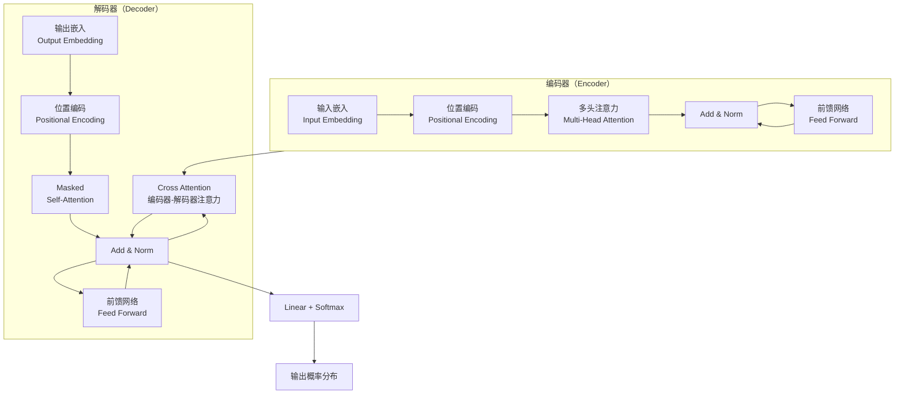
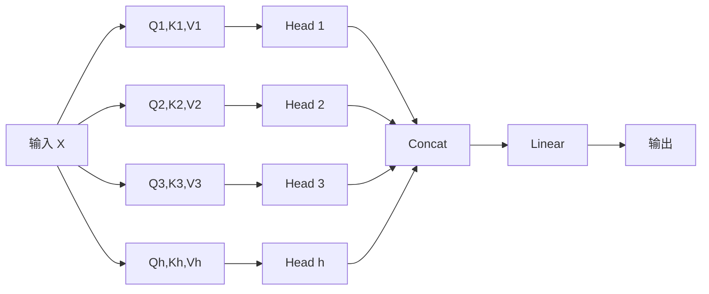
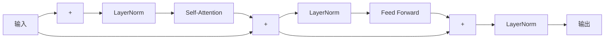
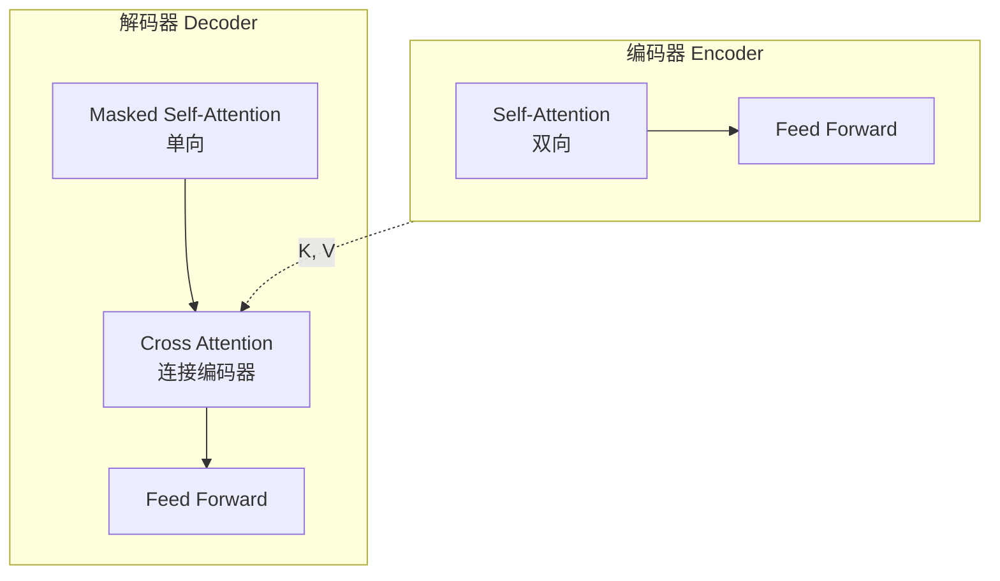

# Transformer 架构详解

> 深入理解 Transformer 的核心设计原理，掌握面试中常见的架构相关问题

---

## 一、概念与原理

### 1.1 什么是 Transformer

Transformer 是一种基于**自注意力机制（Self-Attention）**的深度学习架构，由 Google 在 2017 年的论文《Attention Is All You Need》中提出。它彻底改变了 NLP 领域，成为现代大语言模型（LLM）的基石。

**核心创新**：
- 完全摒弃了 RNN/LSTM 的循环结构，采用**并行计算**
- 引入 **Multi-Head Self-Attention** 机制捕捉全局依赖
- 使用 **Position Encoding** 注入序列位置信息

### 1.2 整体架构



### 1.3 核心组件详解

#### 1.3.1 Self-Attention 机制

Self-Attention 让序列中的每个位置都能**直接关注**到其他所有位置，计算它们之间的相关性权重。

**计算公式**：

$$
\text{Attention}(Q, K, V) = \text{softmax}\left(\frac{QK^T}{\sqrt{d_k}}\right)V
$$

其中：
- $Q$ (Query): 查询向量，表示"我要查什么"
- $K$ (Key): 键向量，表示"我有什么"
- $V$ (Value): 值向量，表示"实际内容"
- $d_k$: Key 向量的维度，用于缩放点积

**计算过程示例**：

```
输入序列: [我, 喜欢, 深度, 学习]

Step 1: 生成 Q, K, V 矩阵
  Q = X · W_Q    (每个词的查询向量)
  K = X · W_K    (每个词的键向量)  
  V = X · W_V    (每个词的值向量)

Step 2: 计算注意力分数
  Scores = Q · K^T / √d_k
  
  结果矩阵 (4x4):
       我    喜欢   深度   学习
  我  [0.4   0.3   0.2   0.1]
  喜欢 [0.2   0.4   0.2   0.2]
  深度 [0.1   0.2   0.4   0.3]
  学习 [0.1   0.2   0.3   0.4]

Step 3: Softmax + 加权求和
  Attention = Softmax(Scores) · V
```

#### 1.3.2 Multi-Head Attention

将注意力机制**并行执行多次**（多个"头"），每个头学习不同的关注模式。



**数学表达**：

$$
\text{MultiHead}(Q, K, V) = \text{Concat}(\text{head}_1, ..., \text{head}_h)W^O
$$

$$
\text{head}_i = \text{Attention}(QW_i^Q, KW_i^K, VW_i^V)
$$

**为什么需要多头？**
- 不同头可以学习不同的语义关系
- 例如：Head 1 关注语法关系，Head 2 关注指代关系，Head 3 关注语义相似性

#### 1.3.3 前馈神经网络（Feed Forward）

每个编码器/解码器层包含一个全连接前馈网络：

$$
\text{FFN}(x) = \max(0, xW_1 + b_1)W_2 + b_2
$$

特点：
- **位置独立**：对每个位置分别应用相同的网络
- **升维再降维**：通常 512 → 2048 → 512
- **ReLU 激活**：引入非线性

#### 1.3.4 Layer Normalization & Residual Connection



**残差连接（Residual Connection）**：
- 解决深层网络的梯度消失问题
- 公式：$\text{Output} = \text{LayerNorm}(x + \text{Sublayer}(x))$

**层归一化（Layer Normalization）**：
- 对每个样本的所有特征进行归一化
- 稳定训练，加速收敛

---

## 二、面试题详解

### 题目 1：Transformer 相比 RNN/LSTM 的优势是什么？

**难度**：初级 ⭐

**考察点**：对序列模型演进的理解，知道 Transformer 的核心优势

#### 参考答案

| 维度 | RNN/LSTM | Transformer |
|------|----------|-------------|
| **并行性** | 序列计算，无法并行 | 完全并行，计算效率高 |
| **长距离依赖** | 梯度消失，难以捕捉 | 直接计算全局依赖，距离无关 |
| **计算复杂度** | O(n) 每步，总 O(n²) | O(n²) 空间复杂度 |
| **位置信息** | 天然有序列顺序 | 需要额外添加位置编码 |

**核心优势总结**：
1. **并行计算**：RNN 必须按顺序处理，Transformer 可以一次性处理整个序列
2. **长距离依赖**：Self-Attention 让任意两个位置直接交互，不受距离限制
3. **可解释性**：注意力权重直观展示了模型关注的位置

> 💡 **面试技巧**：可以补充"这也是 GPT、BERT 等大模型都基于 Transformer 的原因"

---

### 题目 2：Self-Attention 中为什么要除以 √dₖ？

**难度**：中级 ⭐⭐

**考察点**：对注意力机制数学原理的深入理解

#### 参考答案

**原因：防止点积过大导致 Softmax 梯度消失**

当 $d_k$ 较大时，$Q \cdot K^T$ 的点积结果会变得很大：

```
假设 Q 和 K 的分量是独立的随机变量，均值为 0，方差为 1
那么 Q·K 的方差 = d_k × 1 = d_k
标准差 = √d_k
```

**问题**：
- 点积值过大 → Softmax 输入进入饱和区 → 梯度极小 → 难以训练

**解决方案**：
- 除以 √dₖ，将方差缩放回 1
- 保持数值稳定性，避免梯度消失

**代码示意**：

```java
public class ScaledDotProductAttention {
    
    /**
     * 计算缩放点积注意力
     * 
     * @param Q 查询矩阵 [batch, seq_len, d_k]
     * @param K 键矩阵 [batch, seq_len, d_k]
     * @param V 值矩阵 [batch, seq_len, d_v]
     * @param mask 可选的掩码矩阵
     * @return 注意力输出和权重
     */
    public AttentionResult forward(Tensor Q, Tensor K, Tensor V, Tensor mask) {
        int d_k = Q.shape()[2];
        
        // 1. 计算点积: Q · K^T
        Tensor scores = Q.matmul(K.transpose());  // [batch, seq_len, seq_len]
        
        // 2. 缩放: 除以 sqrt(d_k)
        scores = scores.div(Math.sqrt(d_k));
        
        // 3. 应用掩码（如果是解码器的 Masked Attention）
        if (mask != null) {
            scores = scores.add(mask.mul(-1e9));  // 将 mask=1 的位置设为 -∞
        }
        
        // 4. Softmax 得到注意力权重
        Tensor attentionWeights = softmax(scores);
        
        // 5. 加权求和: Attention · V
        Tensor output = attentionWeights.matmul(V);
        
        return new AttentionResult(output, attentionWeights);
    }
    
    private Tensor softmax(Tensor x) {
        // Softmax 实现: exp(x_i) / sum(exp(x_j))
        Tensor expX = x.exp();
        return expX.div(expX.sum(dim=-1, keepdim=true));
    }
}
```

---

### 题目 3：Multi-Head Attention 的作用是什么？为什么要用多个头？

**难度**：中级 ⭐⭐

**考察点**：理解多头注意力的设计动机和实际效果

#### 参考答案

**核心思想**：
> 不同的注意力头可以学习不同的**关注模式**和**语义关系**

**类比理解**：
- 就像多人从不同角度观察同一个场景
- 每个人关注不同的特征：颜色、形状、纹理、空间关系

**具体作用**：

| 头的类型 | 学习的关系 | 示例 |
|---------|-----------|------|
| **语法头** | 句法依赖 | "喜欢" → 指向宾语 "学习" |
| **指代头** | 共指消解 | "它" → 指向 "深度学习" |
| **语义头** | 语义相似 | "开心" ↔ "快乐" |
| **位置头** | 相邻关系 | 关注前后相邻的词 |

**数学优势**：
- 单头注意力的表达能力有限（只有一个加权平均）
- 多头相当于在**不同子空间**分别进行注意力计算
- 最后拼接，相当于整合了多个视角的信息

**实际观察**（来自论文《Attention Is All You Need》的可视化）：
- 不同头确实展现出不同的关注模式
- 有些头关注局部，有些头关注全局
- 有些头呈现明显的语法树结构

---

### 题目 4：Transformer 的 Encoder 和 Decoder 有什么区别？

**难度**：中级 ⭐⭐

**考察点**：理解编码器-解码器架构的设计差异

#### 参考答案



**核心区别**：

| 特性 | Encoder | Decoder |
|------|---------|---------|
| **注意力类型** | Self-Attention（双向） | Masked Self-Attention（单向） |
| **额外注意力** | 无 | Cross Attention（连接 Encoder） |
| **输入** | 源序列 | 已生成的目标序列 |
| **输出** | 上下文表示 | 下一个词的预测 |

**详细说明**：

1. **Encoder 的 Self-Attention 是双向的**
   - 每个位置可以看到整个输入序列的所有位置
   - 适合理解任务（如 BERT）

2. **Decoder 的 Self-Attention 是 Masked（掩码）的**
   - 防止看到未来的信息（自回归生成）
   - 位置 i 只能看到位置 ≤ i 的信息
   - 实现方式：将未来位置设为 -∞

3. **Decoder 有额外的 Cross Attention**
   - 使用 Encoder 输出的 K, V
   - 使用 Decoder 输入的 Q
   - 实现"查询源序列信息"的机制

**代码示意**：

```java
public class TransformerDecoderLayer {
    
    private MultiHeadAttention maskedSelfAttn;
    private MultiHeadAttention crossAttn;
    private FeedForward ffn;
    
    /**
     * 解码器前向传播
     * 
     * @param x 解码器输入 [batch, tgt_len, d_model]
     * @param encoderOutput 编码器输出 [batch, src_len, d_model]
     * @param tgtMask 目标序列掩码（防止看到未来）
     * @return 解码器输出
     */
    public Tensor forward(Tensor x, Tensor encoderOutput, Tensor tgtMask) {
        // 1. Masked Self-Attention
        // 只能关注当前位置及之前的位置
        x = maskedSelfAttn.forward(x, x, x, tgtMask);
        x = layerNorm(x);
        
        // 2. Cross Attention (Encoder-Decoder Attention)
        // Q 来自解码器，K/V 来自编码器
        Tensor encoderK = encoderOutput;  // 编码器输出作为 Key
        Tensor encoderV = encoderOutput;  // 编码器输出作为 Value
        x = crossAttn.forward(x, encoderK, encoderV, null);
        x = layerNorm(x);
        
        // 3. Feed Forward Network
        x = ffn.forward(x);
        x = layerNorm(x);
        
        return x;
    }
}

/**
 * 生成因果掩码（Causal Mask）
 * 用于 Decoder 的 Masked Self-Attention
 */
public class MaskGenerator {
    
    /**
     * 生成下三角掩码
     * 
     * @param size 序列长度
     * @return 掩码矩阵 [size, size]
     *         mask[i][j] = 0 (i >= j, 可以看到)
         mask[i][j] = -inf (i < j, 不可见)
     */
    public static Tensor generateCausalMask(int size) {
        Tensor mask = new Tensor(size, size);
        for (int i = 0; i < size; i++) {
            for (int j = 0; j < size; j++) {
                if (i < j) {
                    mask.set(i, j, Float.NEGATIVE_INFINITY);
                } else {
                    mask.set(i, j, 0);
                }
            }
        }
        return mask;
    }
}
```

---

### 题目 5：为什么 Transformer 需要位置编码（Positional Encoding）？

**难度**：中级 ⭐⭐

**考察点**：理解位置编码的必要性和实现方式

#### 参考答案

**核心问题**：
> Self-Attention 是**位置无关**的（Permutation Invariant）
> 
> "我喜欢猫" 和 "猫喜欢我" 在 Self-Attention 看来是一样的

**解决方案**：
在输入嵌入中加入位置信息，让模型知道每个词的**绝对位置**和**相对位置**

**原始 Transformer 使用正弦/余弦位置编码**：

$$
PE_{(pos, 2i)} = \sin\left(\frac{pos}{10000^{2i/d_{model}}}\right)
$$

$$
PE_{(pos, 2i+1)} = \cos\left(\frac{pos}{10000^{2i/d_{model}}}\right)
$$

**设计优点**：

| 特性 | 说明 |
|------|------|
| **唯一性** | 每个位置有唯一的编码 |
| **有界性** | 值域在 [-1, 1] 之间 |
| **相对位置** | 可以通过线性变换得到相对位置信息 |
| **外推性** | 可以泛化到训练时未见过的长度 |

**现代变体**：
- **Learned Positional Embedding**（BERT）：直接学习位置嵌入
- **Rotary Position Embedding - RoPE**（LLaMA）：旋转位置编码
- **ALiBi**：基于偏置的线性注意力

**代码示意**：

```java
public class PositionalEncoding {
    
    private Tensor pe;  // 预计算的位置编码矩阵
    private int dModel;
    private int maxLen;
    
    public PositionalEncoding(int dModel, int maxLen) {
        this.dModel = dModel;
        this.maxLen = maxLen;
        this.pe = computePE();
    }
    
    /**
     * 计算正弦位置编码
     */
    private Tensor computePE() {
        Tensor pe = new Tensor(maxLen, dModel);
        
        for (int pos = 0; pos < maxLen; pos++) {
            for (int i = 0; i < dModel / 2; i++) {
                double angle = pos / Math.pow(10000, 2.0 * i / dModel);
                pe.set(pos, 2 * i, Math.sin(angle));
                pe.set(pos, 2 * i + 1, Math.cos(angle));
            }
        }
        
        return pe;
    }
    
    /**
     * 将位置编码加到输入嵌入上
     * 
     * @param x 输入嵌入 [batch, seq_len, d_model]
     * @return 加入位置编码后的张量
     */
    public Tensor forward(Tensor x) {
        int seqLen = x.shape()[1];
        // x = x + pe[0:seq_len]
        return x.add(pe.slice(0, seqLen));
    }
}
```

---

## 三、延伸追问

### 追问 1：Transformer 的计算复杂度是多少？如何优化？

**简要答案**：
- Self-Attention: O(n² · d)，其中 n 是序列长度，d 是维度
- 当 n 很大时（如长文档），n² 成为瓶颈

**优化方向**：
| 方法 | 原理 | 代表工作 |
|------|------|----------|
| **稀疏注意力** | 只关注部分位置 | Longformer, BigBird |
| **线性注意力** | 将复杂度降到 O(n) | Performer, Linear Transformer |
| **分块注意力** | 分块处理长序列 | Sparse Transformer |
| **Flash Attention** | IO-aware 优化 | FlashAttention v1/v2 |

---

### 追问 2：BERT 和 GPT 在 Transformer 架构上有什么区别？

**简要答案**：

| 模型 | 架构 | 训练任务 | 应用 |
|------|------|----------|------|
| **BERT** | Encoder-only | Masked Language Model | 理解任务（分类、NER） |
| **GPT** | Decoder-only | Causal Language Model | 生成任务（文本生成） |
| **T5** | Encoder-Decoder | Span Corruption | 翻译、摘要 |

**关键区别**：
- BERT 用双向 Attention，适合理解上下文
- GPT 用因果 Mask，适合自回归生成

---

### 追问 3：LayerNorm 和 BatchNorm 有什么区别？为什么 Transformer 用 LayerNorm？

**简要答案**：

| 特性 | BatchNorm | LayerNorm |
|------|-----------|-----------|
| **归一化维度** | 跨 batch，同特征 | 同样本，跨特征 |
| **序列长度变化** | 不稳定 | 稳定 |
| **适合场景** | CNN | RNN/Transformer |

**Transformer 用 LayerNorm 的原因**：
1. 序列长度可变，BatchNorm 统计不稳定
2. 训练/推理行为一致
3. 残差连接 + LayerNorm 是标准配置

---

## 四、总结

### 面试回答模板

> **Transformer 是一种基于自注意力机制的深度学习架构，核心创新是完全摒弃了 RNN 的循环结构，采用并行计算。**
> 
> **核心组件包括**：
> 1. **Multi-Head Self-Attention**：让序列中任意位置直接交互，捕捉全局依赖
> 2. **Position Encoding**：注入位置信息，弥补 Attention 的位置无关性
> 3. **Feed Forward Network**：对每个位置独立进行非线性变换
> 4. **Residual Connection + LayerNorm**：解决深层网络训练问题
> 
> **相比 RNN 的优势**：并行计算、长距离依赖、训练更快

### 一句话记忆

| 概念 | 一句话 |
|------|--------|
| **Self-Attention** | 让每个词都能"看到"其他所有词，直接计算它们的关系 |
| **Multi-Head** | 多个注意力头从不同角度观察，学习不同的语义关系 |
| **Position Encoding** | 给模型一个"位置感"，让它知道词在句子中的顺序 |
| **Scaled Dot-Product** | 除以 √dₖ 防止点积过大，Softmax 梯度消失 |

### 核心公式速记

```
Attention(Q,K,V) = softmax(Q·K^T / √dₖ) · V

MultiHead = Concat(head₁,...,headₕ) · W^O

FFN(x) = ReLU(x·W₁ + b₁)·W₂ + b₂
```

---

## 参考资料

1. Vaswani et al. "Attention Is All You Need" (NeurIPS 2017)
2. Jay Alammar's Blog: "The Illustrated Transformer"
3. Harvard NLP: "The Annotated Transformer"
