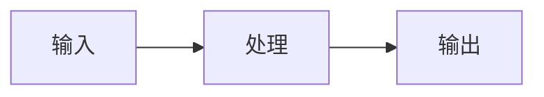

# 内容质量标准

> 定义 AI Agent 面试题库的内容规范和质量要求

---

## 文档结构标准

每个主题文档必须包含以下章节：

```markdown
# 主题标题

## 一、概念与原理
- 核心概念解释
- 原理图解（mermaid 流程图）
- 关键公式（如有）

## 二、面试题详解
每个题目包含：
- 题目描述
- 考察点分析
- 详细解答（原理 + 示例）
- 代码示例（Java 伪代码）

## 三、延伸追问
- 面试官可能的连环追问
- 简要答案要点

## 四、总结
- 面试回答模板
- 一句话记忆口诀
```

---

## 面试题质量标准

### 题目设计原则

| 维度 | 要求 | 示例 |
|------|------|------|
| **难度分层** | 每主题包含初/中/高级题目 | 初级：概念理解；中级：原理分析；高级：工程实践 |
| **考察点明确** | 每题标注考察能力 | "考察点：对两种范式的理解深度，知道各自的适用边界" |
| **答案深度** | 不仅给答案，还要讲清为什么 | 包含原理、对比、适用场景 |
| **代码示例** | 提供 Java 伪代码 | 类定义、关键方法、注释完整 |
| **延伸追问** | 预判面试官的连环追问 | 至少 3 个可能的追问方向 |

### 题目数量建议

| 主题复杂度 | 题目数量 | 难度分布 |
|-----------|----------|----------|
| 简单主题 | 2-3 题 | 1初:1中:1高 或 1初:2中 |
| 中等主题 | 3-4 题 | 1初:2中:1高 |
| 复杂主题 | 4-5 题 | 1初:2中:2高 |

---

## 代码示例标准

### Java 伪代码规范

```java
/**
 * 类功能说明
 * 
 * 使用场景：xxx
 * 核心思想：xxx
 */
public class ExampleAgent {
    
    // 关键配置参数
    private final int maxRetries = 3;
    private final long timeoutMs = 5000;
    
    /**
     * 核心方法说明
     * 
     * @param input 输入参数说明
     * @return 返回值说明
     */
    public Result process(Input input) {
        // 1. 步骤一：xxx
        Step1Result step1 = doStep1(input);
        
        // 2. 步骤二：xxx
        Step2Result step2 = doStep2(step1);
        
        // 3. 返回结果
        return new Result(step2);
    }
    
    /**
     * 辅助方法
     */
    private Step1Result doStep1(Input input) {
        // 实现逻辑...
    }
}
```

### 代码要求

| 要求 | 说明 |
|------|------|
| **完整性** | 包含类定义、关键方法、必要注释 |
| **可读性** | 命名清晰，逻辑分步骤 |
| **实用性** | 可直接用于面试口述 |
| **注释** | 关键逻辑必须有注释 |
| **异常处理** | 展示基本的容错思维 |

---

## 图表规范

### Mermaid 图表

优先使用 mermaid 绘制：
- 流程图（flowchart）
- 时序图（sequenceDiagram）
- 思维导图（mindmap）

示例：
```markdown

```

### 表格

对比类内容必须使用表格：

```markdown
| 维度 | A方案 | B方案 |
|------|-------|-------|
| 优点 | xxx | xxx |
| 缺点 | xxx | xxx |
| 适用 | xxx | xxx |
```

---

## 语言风格

### 中文表达

- 使用专业术语，避免口语化
- 技术名词保持英文（如 LLM、RAG、API）
- 长句拆分，一段一个核心观点

### 格式规范

| 元素 | 格式 |
|------|------|
| 文件标题 | `# 标题` - 一级标题 |
| 章节标题 | `## 一、xxx` - 二级标题，带序号 |
| 小节标题 | `### 1.1 xxx` - 三级标题 |
| 重点强调 | **加粗** 或 `代码块` |
| 引用 | > 引用内容 |
| 提示 | > 💡 **提示**：提示内容 |

---

## 面试回答模板标准

每个主题末尾必须提供：

### 面试回答模板

> 用于面试时的快速回答框架

```markdown
### 面试回答模板

> ReAct 是一种让 LLM **交替进行推理（Thought）和行动（Action）** 的范式...

### 一句话记忆

| 概念 | 一句话 |
|------|--------|
| **ReAct** | 让模型"边想边做"，通过 Thought→Action→Observation 循环解决需要工具的任务 |
| **vs CoT** | CoT 只推理不行动；ReAct 可以调工具获取实时信息，但成本更高 |
```

---

## 质量检查清单

发布前自检：

- [ ] 文档结构完整（概念 → 面试题 → 延伸追问 → 总结）
- [ ] 至少 2 道面试题，包含详细答案
- [ ] 有 Java 代码示例
- [ ] 有 mermaid 图表
- [ ] 有对比表格
- [ ] 有面试回答模板
- [ ] 无错别字，语句通顺
- [ ] 技术概念准确

---

## 示例文档

参考以下已完成的高质量文档：
- [paradigms/react.md](../paradigms/react.md) - 结构完整，内容详实
- [agent/memory-system.md](../agent/memory-system.md) - 层次分明，代码清晰
- [retrieval/bm25.md](../retrieval/bm25.md) - 公式 + 图表 + 对比
