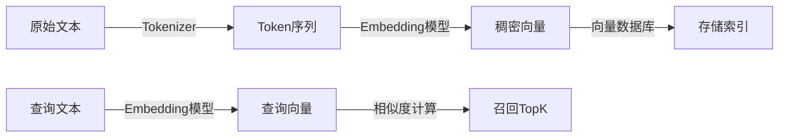
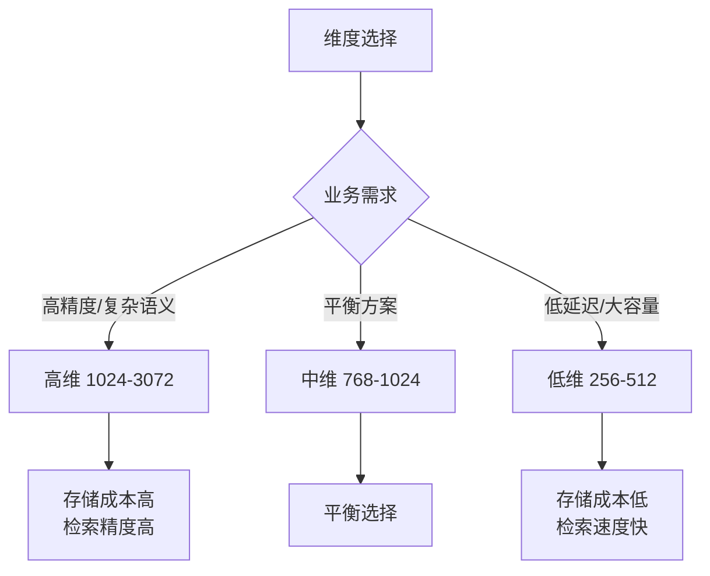
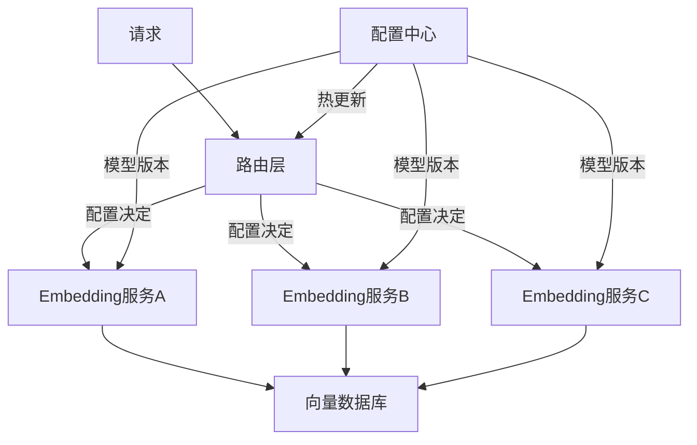
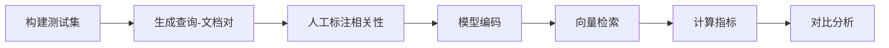

# Embedding 模型选型

> 深入理解 Embedding 模型的原理、选型策略与工程实践

---

## 一、概念与原理

### 1.1 什么是 Embedding

Embedding 是将离散的高维数据（如文本、图像）映射到低维连续向量空间的技术。在 RAG 系统中，Embedding 模型负责将文本转换为向量表示，使得语义相似的文本在向量空间中距离更近。



### 1.2 稠密向量 vs 稀疏向量

| 特性 | 稠密向量 (Dense) | 稀疏向量 (Sparse) |
|------|------------------|-------------------|
| **表示方式** | 低维连续值（如 768维） | 高维离散值（如 30000维） |
| **典型模型** | BERT、OpenAI Embedding | BM25、SPLADE |
| **语义理解** | 强，捕获隐含语义 | 弱，依赖词频匹配 |
| **存储成本** | 低 | 高 |
| **可解释性** | 弱 | 强（关键词可见） |
| **适用场景** | 语义搜索、RAG | 关键词匹配、精确检索 |

### 1.3 相似度计算方法

**余弦相似度（Cosine Similarity）**：

$$
\text{cosine}(A, B) = \frac{A \cdot B}{\|A\| \|B\|} = \frac{\sum_{i=1}^{n} A_i B_i}{\sqrt{\sum_{i=1}^{n} A_i^2} \sqrt{\sum_{i=1}^{n} B_i^2}}
$$

**欧氏距离（Euclidean Distance）**：

$$
d(A, B) = \sqrt{\sum_{i=1}^{n} (A_i - B_i)^2}
$$

**点积（Dot Product）**：

$$
A \cdot B = \sum_{i=1}^{n} A_i B_i
$$

> 💡 **选型建议**：向量已归一化时，余弦相似度 = 点积，计算更快；需要绝对距离时用欧氏距离。

### 1.4 主流 Embedding 模型对比

| 模型 | 维度 | 上下文长度 | 语言支持 | 特点 |
|------|------|-----------|----------|------|
| **text-embedding-3-small** | 1536 | 8192 | 多语言 | OpenAI，性价比高 |
| **text-embedding-3-large** | 3072 | 8192 | 多语言 | OpenAI，质量最优 |
| **BGE-large-zh** | 1024 | 512 | 中文优化 | 智源，中文场景首选 |
| **BGE-m3** | 1024 | 8192 | 多语言 | 支持多语言、长文本 |
| **M3E-base** | 768 | 512 | 中文 | 社区开源，轻量级 |
| **GTE-large** | 1024 | 512 | 多语言 | 阿里，中文表现好 |
| **E5-large** | 1024 | 512 | 英文 | Microsoft，英文场景 |

---

## 二、面试题详解

### 2.1 初级：Embedding 与 One-Hot 编码的区别是什么？

**考察点**：基础概念理解，向量表示的发展

**详细解答**：

| 维度 | One-Hot | Embedding |
|------|---------|-----------|
| **维度** | 高（词表大小） | 低（通常 256-4096） |
| **语义** | 无，正交独立 | 有，相似词距离近 |
| **稀疏性** | 稀疏（只有一个1） | 稠密 |
| **训练** | 无需训练 | 需要预训练 |
| **泛化** | 无法处理未登录词 | 可推断语义 |

**关键理解**：
- One-Hot 把每个词当作独立符号，"国王"和"女王"的距离 = "国王"和"苹果"的距离
- Embedding 通过共现统计学习语义，"国王"-"男人" ≈ "女王"-"女人"（类比关系）

**Java 伪代码**：
```java
/**
 * One-Hot vs Embedding 对比示例
 */
public class VectorComparison {
    
    /**
     * One-Hot 编码：高维稀疏
     */
    public int[] oneHotEncode(String word, Map<String, Integer> vocab) {
        int[] vector = new int[vocab.size()]; // 词表大小，如 50000
        int index = vocab.getOrDefault(word, 0);
        vector[index] = 1; // 只有一位是1
        return vector;
    }
    
    /**
     * Embedding 查询：低维稠密
     */
    public float[] getEmbedding(String text, EmbeddingModel model) {
        // 调用 Embedding API 或本地模型
        // 返回如 768 维的稠密向量
        return model.encode(text); // [0.023, -0.156, 0.891, ...]
    }
}
```

---

### 2.2 中级：如何选择 Embedding 模型的维度？768 vs 1024 vs 1536 有什么差异？

**考察点**：工程权衡能力，对模型容量与性能的理解

**详细解答**：

**维度选择的核心权衡**：



**各维度对比**：

| 维度 | 存储/向量 | 适用场景 | 典型模型 |
|------|----------|----------|----------|
| 256-384 | 1-1.5 KB | 移动端、边缘设备 | GTE-small |
| 512-768 | 2-3 KB | 通用场景，平衡选择 | M3E, E5-base |
| 1024 | 4 KB | 中文场景，高精度 | BGE-large |
| 1536-3072 | 6-12 KB | 多语言、复杂语义 | OpenAI text-embedding-3 |

**选型决策树**：
1. **中文为主** → BGE-large (1024维) 或 GTE-large (1024维)
2. **多语言需求** → text-embedding-3-large (3072维)
3. **成本敏感** → text-embedding-3-small (1536维) 或 M3E (768维)
4. **长文档** → 优先看上下文长度（BGE-m3 支持 8192 tokens）

**Java 伪代码**：
```java
/**
 * Embedding 模型配置与维度选择
 */
public class EmbeddingConfig {
    
    // 不同场景的配置
    public enum EmbeddingProfile {
        // 低成本方案：768维，适合大规模检索
        ECONOMY(768, 512, "m3e-base"),
        
        // 平衡方案：1024维，中文场景
        BALANCED(1024, 512, "bge-large-zh"),
        
        // 高质量方案：1536维，多语言
        PREMIUM(1536, 8192, "text-embedding-3-small"),
        
        // 极致质量：3072维
        ULTRA(3072, 8192, "text-embedding-3-large");
        
        final int dimension;
        final int maxTokens;
        final String modelName;
        
        EmbeddingProfile(int dim, int tokens, String model) {
            this.dimension = dim;
            this.maxTokens = tokens;
            this.modelName = model;
        }
    }
    
    /**
     * 根据数据规模和精度要求选择配置
     */
    public EmbeddingProfile selectProfile(long docCount, boolean needMultilingual) {
        if (docCount > 10_000_000) {
            return needMultilingual ? EmbeddingProfile.PREMIUM : EmbeddingProfile.ECONOMY;
        } else if (docCount > 1_000_000) {
            return EmbeddingProfile.BALANCED;
        }
        return needMultilingual ? EmbeddingProfile.PREMIUM : EmbeddingProfile.BALANCED;
    }
    
    /**
     * 计算存储成本
     */
    public long calculateStorageCost(long docCount, int dimension) {
        // float 占 4 字节
        return docCount * dimension * 4L; // 字节
    }
}
```

---

### 2.3 高级：在 RAG 系统中，如何实现 Embedding 模型的动态切换和热更新？

**考察点**：架构设计能力，工程实践经验

**详细解答**：

**为什么需要动态切换**：
1. **A/B 测试**：对比不同模型的检索效果
2. **灰度发布**：新模型逐步上线，风险可控
3. **多租户**：不同租户使用不同模型
4. **降级策略**：主模型故障时自动切换

**架构设计**：



**关键设计点**：

| 组件 | 职责 | 实现方式 |
|------|------|----------|
| **路由层** | 根据配置分发请求 | Strategy Pattern + 配置中心 |
| **模型服务** | 隔离不同模型实例 | 独立进程/容器 |
| **向量存储** | 支持多版本向量 | 命名空间隔离 |
| **配置中心** | 热更新配置 | Nacos/Apollo/ETCD |

**Java 伪代码**：
```java
/**
 * Embedding 模型动态切换架构
 */
public class EmbeddingRouter {
    
    // 模型实例池
    private final Map<String, EmbeddingModel> modelPool = new ConcurrentHashMap<>();
    
    // 当前活跃模型（原子引用，支持热切换）
    private volatile String activeModelKey = "bge-large";
    
    // 配置监听器
    private final ConfigCenter configCenter;
    
    public EmbeddingRouter(ConfigCenter configCenter) {
        this.configCenter = configCenter;
        // 注册配置变更监听
        configCenter.subscribe("embedding.model", this::onModelConfigChange);
    }
    
    /**
     * 配置变更回调（热更新）
     */
    private void onModelConfigChange(ConfigChangeEvent event) {
        String newModel = event.getNewValue();
        if (!modelPool.containsKey(newModel)) {
            // 懒加载新模型
            loadModel(newModel);
        }
        // 原子切换
        String oldModel = activeModelKey;
        activeModelKey = newModel;
        log.info("模型切换: {} -> {}", oldModel, newModel);
    }
    
    /**
     * 路由到当前活跃模型
     */
    public float[] encode(String text) {
        EmbeddingModel model = modelPool.get(activeModelKey);
        if (model == null) {
            throw new ModelNotAvailableException(activeModelKey);
        }
        return model.encode(text);
    }
    
    /**
     * A/B 测试：按用户ID哈希选择模型
     */
    public float[] encodeWithABTest(String text, String userId) {
        String modelKey = selectModelByUser(userId);
        return modelPool.get(modelKey).encode(text);
    }
    
    private String selectModelByUser(String userId) {
        int hash = userId.hashCode() % 100;
        return hash < 50 ? "model-a" : "model-b"; // 50% 分流
    }
    
    /**
     * 加载新模型（支持优雅启动）
     */
    private void loadModel(String modelKey) {
        ModelConfig config = configCenter.getModelConfig(modelKey);
        EmbeddingModel model = EmbeddingModelFactory.create(config);
        // 预热：加载一些常用查询
        warmup(model);
        modelPool.put(modelKey, model);
    }
    
    private void warmup(EmbeddingModel model) {
        // 预热逻辑，避免冷启动延迟
        List<String> warmupTexts = loadWarmupTexts();
        for (String text : warmupTexts) {
            model.encode(text);
        }
    }
}

/**
 * 向量存储多版本支持
 */
public class VersionedVectorStore {
    
    /**
     * 存储向量时带上模型版本信息
     */
    public void store(String docId, float[] vector, String modelVersion) {
        // 使用命名空间隔离不同版本的向量
        String namespace = "embedding_" + modelVersion;
        // 存储到向量数据库...
    }
    
    /**
     * 检索时指定模型版本
     */
    public List<VectorResult> search(float[] queryVector, String modelVersion, int topK) {
        String namespace = "embedding_" + modelVersion;
        // 在对应命名空间检索
        return vectorDB.search(namespace, queryVector, topK);
    }
}
```

---

### 2.4 高级：如何评估 Embedding 模型的检索效果？有哪些指标和方法？

**考察点**：评估方法论，数据驱动的优化思维

**详细解答**：

**核心评估指标**：

| 指标 | 定义 | 适用场景 |
|------|------|----------|
| **Recall@K** | TopK 中相关文档的比例 | 衡量召回能力 |
| **Precision@K** | TopK 中相关文档占比 | 衡量精确度 |
| **MRR** | 第一个相关文档排名的倒数 | 衡量排序质量 |
| **NDCG** | 考虑相关度等级的累积增益 | 细粒度评估 |
| **MAP** | 平均精度均值 | 综合评估 |

**评估流程**：



**测试集构建**：
1. **正样本**：已知相关的查询-文档对
2. **负样本**：随机采样或难例挖掘
3. **标注等级**：如 0（无关）、1（部分相关）、2（高度相关）

**Java 伪代码**：
```java
/**
 * Embedding 模型评估器
 */
public class EmbeddingEvaluator {
    
    // 测试集：查询 -> 相关文档ID列表
    private final Map<String, List<String>> testSet;
    
    // 文档库：ID -> 内容
    private final Map<String, String> documentCorpus;
    
    /**
     * 执行完整评估
     */
    public EvaluationReport evaluate(EmbeddingModel model) {
        // 1. 编码所有文档
        Map<String, float[]> docEmbeddings = encodeDocuments(model);
        
        // 2. 构建向量索引
        VectorIndex index = buildIndex(docEmbeddings);
        
        // 3. 对每个查询进行评估
        List<QueryResult> results = new ArrayList<>();
        for (String query : testSet.keySet()) {
            float[] queryVector = model.encode(query);
            List<String> retrieved = index.search(queryVector, 10);
            Set<String> relevant = new HashSet<>(testSet.get(query));
            
            results.add(calculateMetrics(retrieved, relevant));
        }
        
        // 4. 汇总指标
        return aggregateMetrics(results);
    }
    
    /**
     * 计算单个查询的指标
     */
    private QueryResult calculateMetrics(List<String> retrieved, Set<String> relevant) {
        QueryResult result = new QueryResult();
        
        // Recall@K
        int hitsAt5 = 0, hitsAt10 = 0;
        for (int i = 0; i < retrieved.size(); i++) {
            if (relevant.contains(retrieved.get(i))) {
                if (i < 5) hitsAt5++;
                hitsAt10++;
            }
        }
        result.recallAt5 = (double) hitsAt5 / relevant.size();
        result.recallAt10 = (double) hitsAt10 / relevant.size();
        
        // MRR
        for (int i = 0; i < retrieved.size(); i++) {
            if (relevant.contains(retrieved.get(i))) {
                result.mrr = 1.0 / (i + 1);
                break;
            }
        }
        
        return result;
    }
    
    /**
     * 模型对比报告
     */
    public ComparisonReport compareModels(List<EmbeddingModel> models) {
        ComparisonReport report = new ComparisonReport();
        
        for (EmbeddingModel model : models) {
            EvaluationReport eval = evaluate(model);
            report.addResult(model.getName(), eval);
        }
        
        // 生成对比表格
        return report;
    }
}

/**
 * 评估结果
 */
public class EvaluationReport {
    double avgRecallAt5;
    double avgRecallAt10;
    double avgMrr;
    double avgPrecisionAt5;
    long latencyMs; // 平均延迟
}
```

---

## 三、延伸追问

### Q1：Embedding 模型和向量数据库的选型应该一起考虑吗？

**简要答案**：
是的，两者紧密相关。考虑点：
1. **索引算法**：HNSW 适合高维稠密向量，倒排索引适合稀疏向量
2. **距离度量**：确保模型和数据库使用相同的相似度计算（cosine/dot/l2）
3. **量化支持**：部分数据库支持 PQ/SCaNN 量化，可降低存储
4. **混合检索**：如需结合 BM25，选支持混合检索的数据库（如 Elasticsearch、Milvus）

### Q2：如何处理超过 Embedding 模型上下文长度的长文档？

**简要答案**：
1. **文本分块**：按段落/句子切分，保持语义完整
2. **滑动窗口**：重叠切分，避免关键信息被截断
3. **层次摘要**：先提取摘要，再对摘要做 Embedding
4. **长文本模型**：选用支持长上下文的模型（如 BGE-m3 支持 8192 tokens）
5. **多向量表示**：一个文档生成多个向量（如每段一个）

### Q3：Embedding 模型微调（Fine-tuning）在什么场景下有必要？

**简要答案**：
1. **领域适配**：医学、法律等专业领域术语理解
2. **任务适配**：特定检索任务（如代码搜索、商品匹配）
3. **语言适配**：低资源语言或小语种优化
4. **数据分布差异**：训练数据与实际数据分布差异大时

**微调方法**：
- **对比学习**：使用正负样本对训练
- **In-batch negatives**：同一 batch 内其他样本作为负例
- **Hard negative mining**：挖掘难例负样本

---

## 四、总结

### 面试回答模板

> Embedding 模型选型需要综合考虑**任务类型、语言需求、精度要求、成本约束**四个维度。中文场景首选 BGE-large 或 GTE-large；多语言需求选 OpenAI text-embedding-3；成本敏感选小维度模型如 M3E。向量维度选择是精度与存储的权衡，768-1024 维是大多数场景的平衡点。工程实现上要考虑动态切换、多版本管理和效果评估机制。

### 一句话记忆

| 概念 | 一句话 |
|------|--------|
| **Embedding** | 把文本变成计算机能计算的语义向量，相似文本距离近 |
| **稠密 vs 稀疏** | 稠密向量语义强适合语义搜索，稀疏向量可解释强适合关键词匹配 |
| **维度选择** | 维度越高语义越丰富，但存储和计算成本也越高 |
| **模型选型** | 中文 BGE、多语言 OpenAI、成本敏感选开源 |
| **相似度计算** | 余弦看方向，欧氏看距离，归一化后两者等价 |

### 面试速查表

```
┌─────────────────────────────────────────────────────────────┐
│  Embedding 模型选型速查                                      │
├─────────────────────────────────────────────────────────────┤
│  中文场景     → BGE-large / GTE-large (1024维)              │
│  多语言       → text-embedding-3-large (3072维)             │
│  成本优先     → text-embedding-3-small / M3E (768维)        │
│  长文本       → BGE-m3 (8192 tokens)                        │
│  边缘部署     → GTE-small / 量化版本 (384维)                │
├─────────────────────────────────────────────────────────────┤
│  评估指标：Recall@K > MRR > NDCG                            │
│  相似度：归一化向量用点积，未归一化用余弦                    │
│  存储：float32 占 4字节/维，可量化为 int8 省 75%             │
└─────────────────────────────────────────────────────────────┘
```

---

**参考文档**：
- [BGE 官方仓库](https://github.com/FlagOpen/FlagEmbedding)
- [OpenAI Embedding 文档](https://platform.openai.com/docs/guides/embeddings)
- [M3E 模型介绍](https://huggingface.co/moka-ai/m3e-base)
