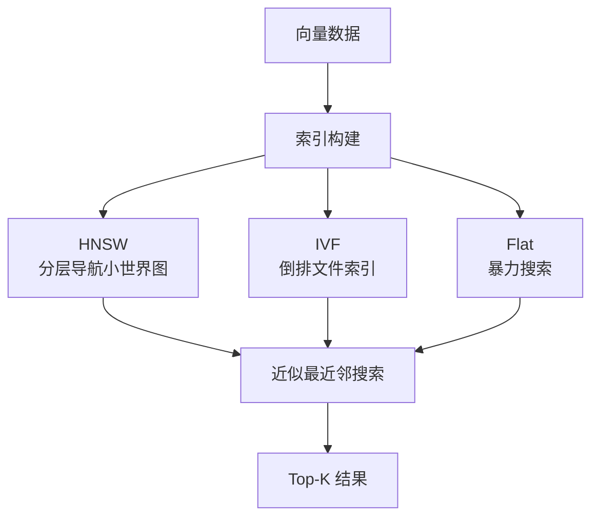
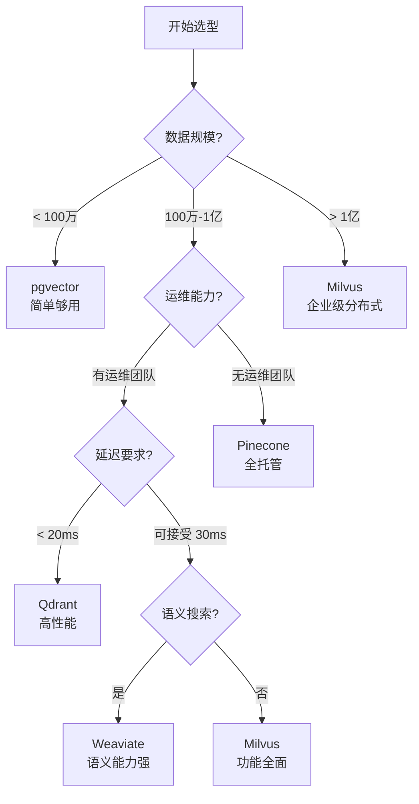

# 向量数据库对比

> 主流向量数据库选型对比：Milvus、Pinecone、Weaviate、Qdrant、pgvector 等

---

## 一、概念与原理

### 1.1 什么是向量数据库

向量数据库（Vector Database）是专门用于存储和检索高维向量数据的数据库系统。在 RAG 场景中，文本、图像等数据通过 Embedding 模型转换为高维向量（通常 768 维或 1024 维），向量数据库负责高效存储这些向量，并提供相似度搜索能力。

### 1.2 核心能力

| 能力 | 说明 |
|------|------|
| **向量存储** | 高效存储百万/亿级高维向量 |
| **相似度检索** | 基于余弦相似度、欧氏距离、点积等度量方式 |
| **近似最近邻（ANN）** | 使用 HNSW、IVF 等算法加速检索 |
| **混合查询** | 支持向量相似度 + 标量过滤的组合查询 |
| **分布式扩展** | 支持水平扩展，处理海量数据 |

### 1.3 ANN 算法原理



**HNSW（Hierarchical Navigable Small World）**：
- 构建多层图结构，上层稀疏、下层密集
- 搜索时从顶层开始，逐层向下导航
- 时间复杂度：O(log N)，召回率 > 95%

---

## 二、主流向量数据库对比

### 2.1 产品概览

| 数据库 | 类型 | 开源 | 部署方式 | 主要特点 |
|--------|------|------|----------|----------|
| **Milvus** | 专用 | ✅ Apache 2.0 | 本地/云/分布式 | 功能最全面，企业级 |
| **Pinecone** | 托管 | ❌ | 纯 SaaS | 零运维，即开即用 |
| **Weaviate** | 专用 | ✅ BSD-3 | 本地/云 | 语义搜索强，GraphQL |
| **Qdrant** | 专用 | ✅ Apache 2.0 | 本地/云 | Rust 实现，高性能 |
| **pgvector** | 扩展 | ✅ PostgreSQL | PostgreSQL 插件 | SQL 生态，简单场景 |
| **Redis** | 扩展 | ✅ BSD | 内存数据库 | 实时性要求高 |
| **Faiss** | 库 | ✅ MIT | 嵌入式 | Meta 出品，需自封装 |

### 2.2 详细对比

#### 性能对比

| 指标 | Milvus | Pinecone | Weaviate | Qdrant | pgvector |
|------|--------|----------|----------|--------|----------|
| **单机 QPS** | 高 | 很高 | 中高 | 很高 | 中 |
| **延迟（P99）** | < 20ms | < 10ms | < 30ms | < 15ms | < 50ms |
| **最大数据量** | 百亿级 | 百亿级 | 十亿级 | 十亿级 | 千万级 |
| **向量维度** | 无限制 | 1536（OpenAI） | 无限制 | 无限制 | 16000 |
| **混合查询** | ✅ | ✅ | ✅ | ✅ | ✅ |
| **多租户** | ✅ | ✅ | ✅ | ✅ | ❌ |

#### 功能对比

| 功能 | Milvus | Pinecone | Weaviate | Qdrant | pgvector |
|------|--------|----------|----------|--------|----------|
| **向量索引** | HNSW/IVF_PQ/FLAT | 自动选择 | HNSW | HNSW | HNSW/IVF |
| **标量过滤** | ✅ 强大 | ✅ 基础 | ✅ 强大 | ✅ 强大 | ✅ SQL |
| **稀疏向量** | ✅ | ❌ | ✅ | ✅ | ❌ |
| **多模态** | ✅ | ❌ | ✅ | ❌ | ❌ |
| **备份恢复** | ✅ | ✅ | ✅ | ✅ | PostgreSQL |
| **RBAC** | ✅ | ✅ | ✅ | ✅ | PostgreSQL |

#### 生态与集成

| 方面 | Milvus | Pinecone | Weaviate | Qdrant | pgvector |
|------|--------|----------|----------|--------|----------|
| **LangChain** | ✅ | ✅ | ✅ | ✅ | ✅ |
| **LlamaIndex** | ✅ | ✅ | ✅ | ✅ | ✅ |
| **Java SDK** | ✅ | ✅ | ✅ | ✅ | JDBC |
| **Python SDK** | ✅ | ✅ | ✅ | ✅ | psycopg2 |
| **云厂商托管** | Zilliz | Pinecone | Weaviate Cloud | Qdrant Cloud | AWS/RDS |

### 2.3 选型决策树



---

## 三、面试题详解

### 题目 1：向量数据库与传统数据库的区别是什么？

**难度**：初级

**考察点**：理解向量数据库的核心定位，知道为什么需要专门的向量数据库。

**详细解答**：

| 维度 | 传统数据库（MySQL/PostgreSQL） | 向量数据库 |
|------|------------------------------|-----------|
| **数据类型** | 标量数据（数字、字符串、时间） | 高维向量（768/1024/4096 维） |
| **查询方式** | 精确匹配、范围查询 | 相似度查询（最近邻） |
| **索引结构** | B+树、哈希 | HNSW、IVF、PQ |
| **查询结果** | 精确结果集 | 近似结果（Top-K） |
| **典型场景** | 事务处理、报表 | RAG、推荐、语义搜索 |

**为什么需要向量数据库**：
1. **维度灾难**：高维向量无法使用传统索引（B+树）
2. **相似度计算**：需要专门的距离度量（余弦、欧氏）
3. **ANN 算法**：近似最近邻算法比暴力搜索快 1000 倍
4. **规模挑战**：亿级向量的高效检索

**一句话总结**：传统数据库擅长"找相等的"，向量数据库擅长"找相似的"。

---

### 题目 2：HNSW 和 IVF 两种索引算法有什么区别？如何选择？

**难度**：中级

**考察点**：理解主流 ANN 算法的原理和适用场景。

**详细解答**：

**HNSW（Hierarchical Navigable Small World）**：

```
原理：构建多层导航图
- 第 0 层：包含所有节点的稠密图
- 第 1 层：包含部分节点的稀疏图
- 第 n 层：最稀疏，用于快速定位

搜索过程：
1. 从最顶层随机入口开始
2. 在当前层找到最近邻
3. 下降到下一层，以上一层结果为起点
4. 重复直到第 0 层，返回 Top-K
```

**IVF（Inverted File Index）**：

```
原理：聚类 + 倒排索引
1. 使用 K-Means 将向量空间划分为 nlist 个簇
2. 每个向量归属到最近的簇中心
3. 查询时：
   - 计算与所有簇中心的距离
   - 选择最近的 nprobe 个簇
   - 只在这 nprobe 个簇内搜索
```

**对比表格**：

| 维度 | HNSW | IVF/IVF_PQ |
|------|------|-----------|
| **内存占用** | 高（需存储图结构） | 低（PQ 可量化压缩） |
| **构建时间** | 较长 | 较短 |
| **查询速度** | 快（O(log N)） | 中等（取决于 nprobe） |
| **召回率** | 高（> 95%） | 可调（依赖 nprobe） |
| **适用场景** | 内存充足、延迟敏感 | 内存受限、数据量大 |

**选择建议**：
- **默认选 HNSW**：召回率高、查询快、实现成熟
- **选 IVF_PQ 当**：内存极度受限（PQ 可压缩 10-20 倍）
- **混合方案**：Milvus 支持 HNSW + PQ 组合

**Java 伪代码示例**：

```java
/**
 * 向量索引配置选择器
 */
public class IndexConfigSelector {
    
    /**
     * 根据场景选择索引配置
     */
    public IndexConfig selectConfig(Scenario scenario) {
        switch (scenario) {
            case HIGH_RECALL_LOW_LATENCY:
                // 高召回 + 低延迟：纯 HNSW
                return IndexConfig.builder()
                    .indexType(IndexType.HNSW)
                    .params(HNSWParams.builder()
                        .M(16)           // 每个节点的最大连接数
                        .efConstruction(200)  // 构建时的搜索深度
                        .ef(128)         // 查询时的搜索深度
                        .build())
                    .build();
                    
            case MEMORY_CONSTRAINED:
                // 内存受限：IVF_PQ
                return IndexConfig.builder()
                    .indexType(IndexType.IVF_PQ)
                    .params(IVFPQParams.builder()
                        .nlist(1024)     // 簇的数量
                        .nprobe(64)      // 查询时搜索的簇数
                        .m(16)           // PQ 分段数
                        .nbits(8)        // 每段量化位数
                        .build())
                    .build();
                    
            case BALANCED:
                // 平衡方案：HNSW + SQ（标量量化）
                return IndexConfig.builder()
                    .indexType(IndexType.HNSW_SQ)
                    .params(HNSWSQParams.builder()
                        .M(16)
                        .sqType(ScalarQuantType.INT8)
                        .build())
                    .build();
        }
        throw new IllegalArgumentException("Unknown scenario");
    }
}
```

---

### 题目 3：在 RAG 系统中，如何选择向量数据库？请给出选型框架。

**难度**：高级

**考察点**：具备工程实践能力，能够根据业务需求做出合理的技术选型。

**详细解答**：

**选型维度框架**：

```
1. 数据规模维度
   ├── < 100万：pgvector / Faiss
   ├── 100万-1000万：Qdrant / Weaviate
   └── > 1000万：Milvus / Pinecone

2. 延迟要求维度
   ├── P99 < 10ms：Pinecone / Qdrant（内存型）
   ├── P99 < 50ms：Milvus / Weaviate
   └── 可接受 100ms+：pgvector

3. 运维能力维度
   ├── 无运维团队：Pinecone / 托管服务
   ├── 小团队：Qdrant / Weaviate（单节点）
   └── 有专业运维：Milvus（自托管）

4. 功能需求维度
   ├── 需要多租户：Milvus / Pinecone
   ├── 需要稀疏向量：Milvus / Weaviate
   ├── 需要 GraphQL：Weaviate
   └── 需要 SQL 生态：pgvector

5. 成本维度
   ├── 预算充足：Pinecone（按量付费）
   ├── 成本敏感：开源方案 + 自托管
   └── 已有 PostgreSQL：pgvector（零额外成本）
```

**典型场景推荐**：

| 场景 | 推荐方案 | 理由 |
|------|----------|------|
| **初创公司 MVP** | pgvector | 已有 PostgreSQL，零额外成本 |
| **企业级 RAG** | Milvus | 功能全面，支持分布式扩展 |
| **无运维团队** | Pinecone | 全托管，自动扩缩容 |
| **高性能要求** | Qdrant | Rust 实现，内存效率高 |
| **语义搜索为主** | Weaviate | 内置向量化模块，GraphQL 友好 |

**Java 集成示例（Milvus）**：

```java
/**
 * Milvus 向量数据库服务封装
 */
@Service
public class MilvusVectorService {
    
    private final MilvusClient client;
    private final String collectionName = "document_embeddings";
    
    public MilvusVectorService(@Value("${milvus.host}") String host,
                               @Value("${milvus.port}") int port) {
        ConnectParam connectParam = ConnectParam.newBuilder()
            .withHost(host)
            .withPort(port)
            .build();
        this.client = new MilvusServiceClient(connectParam);
    }
    
    /**
     * 创建集合（相当于关系库的表）
     */
    public void createCollection() {
        // 定义字段
        FieldType idField = FieldType.newBuilder()
            .withName("id")
            .withDataType(DataType.Int64)
            .withPrimaryKey(true)
            .withAutoID(true)
            .build();
            
        FieldType embeddingField = FieldType.newBuilder()
            .withName("embedding")
            .withDataType(DataType.FloatVector)
            .withDimension(1536)  // OpenAI ada-002 维度
            .build();
            
        FieldType contentField = FieldType.newBuilder()
            .withName("content")
            .withDataType(DataType.VarChar)
            .withMaxLength(65535)
            .build();
        
        CreateCollectionParam createParam = CreateCollectionParam.newBuilder()
            .withCollectionName(collectionName)
            .withFieldTypes(Arrays.asList(idField, embeddingField, contentField))
            .build();
            
        R<RpcStatus> response = client.createCollection(createParam);
        if (response.getStatus() != R.Status.Success.getCode()) {
            throw new RuntimeException("Failed to create collection");
        }
        
        // 创建 HNSW 索引
        CreateIndexParam indexParam = CreateIndexParam.newBuilder()
            .withCollectionName(collectionName)
            .withFieldName("embedding")
            .withIndexType(IndexType.HNSW)
            .withMetricType(MetricType.COSINE)
            .withExtraParam("{\"M\":16,\"efConstruction\":200}")
            .build();
            
        client.createIndex(indexParam);
    }
    
    /**
     * 向量相似度搜索（RAG 检索核心）
     */
    public List<SearchResult> searchSimilarDocuments(float[] queryVector, 
                                                      int topK,
                                                      String filter) {
        // 构建搜索参数
        SearchParam searchParam = SearchParam.newBuilder()
            .withCollectionName(collectionName)
            .withMetricType(MetricType.COSINE)
            .withTopK(topK)
            .withVectors(Collections.singletonList(queryVector))
            .withVectorFieldName("embedding")
            .withExpr(filter)  // 标量过滤，如："category == 'tech'"
            .withParams("{\"ef\":64}")  // HNSW 搜索深度
            .withOutFields(Arrays.asList("id", "content", "score"))
            .build();
        
        R<SearchResults> response = client.search(searchParam);
        
        // 解析结果
        List<SearchResult> results = new ArrayList<>();
        SearchResultsWrapper wrapper = new SearchResultsWrapper(response.getData().getResults());
        
        for (int i = 0; i < wrapper.getRowCount(); i++) {
            SearchResult result = new SearchResult();
            result.setId((Long) wrapper.getFieldData("id", i).get(0));
            result.setContent((String) wrapper.getFieldData("content", i).get(0));
            result.setScore((Float) wrapper.getIDScore(i).get(0));
            results.add(result);
        }
        
        return results;
    }
}
```

---

## 四、延伸追问

### 追问 1：如果向量数据库查询召回率不够，有哪些优化手段？

**简要答案**：
1. **调整索引参数**：增大 HNSW 的 `ef` 或 IVF 的 `nprobe`
2. **多路召回**：向量检索 + 关键词检索（BM25），结果融合
3. **重排序（Rerank）**：粗排用向量，精排用 Cross-Encoder
4. **查询扩展**：HyDE（假设文档嵌入）生成伪文档再检索
5. **数据分片**：按类别/时间分片，减少搜索空间

### 追问 2：pgvector 和专用向量数据库相比，最大的局限性是什么？

**简要答案**：
1. **性能瓶颈**：PostgreSQL 的存储引擎不适合高维向量索引
2. **扩展性**：单机架构，难以处理十亿级数据
3. **ANN 算法**：仅支持基础 HNSW/IVF，缺少高级优化
4. **功能缺失**：无多租户、无稀疏向量、无分布式
5. **适用场景**：适合 < 100万 向量的简单场景

### 追问 3：向量数据库的数据更新策略有哪些？如何设计？

**简要答案**：
1. **实时写入**：小批量增量写入，适合低延迟场景
2. **批量导入**：大规模数据使用 bulk import，重建索引
3. **软删除**：标记删除，定期清理，避免索引碎片
4. **版本控制**：保留多版本向量，支持 A/B 测试
5. **冷热分离**：热数据内存索引，冷数据磁盘存储

---

## 五、总结

### 面试回答模板

> 向量数据库选型需要综合考虑**数据规模、延迟要求、运维能力、功能需求和成本**五个维度。对于企业级 RAG 系统，推荐 Milvus（功能全面、支持分布式）；对于快速验证 MVP，pgvector 零成本接入；对于无运维团队，Pinecone 全托管省心。索引算法首选 HNSW，召回率和性能平衡较好。

### 一句话记忆

| 数据库 | 一句话定位 |
|--------|-----------|
| **Milvus** | 企业级首选，功能最全，支持分布式 |
| **Pinecone** | 全托管 SaaS，零运维，即开即用 |
| **Weaviate** | 语义搜索强，GraphQL 接口友好 |
| **Qdrant** | Rust 高性能，内存效率优 |
| **pgvector** | PostgreSQL 插件，简单场景够用 |

### 核心口诀

> **规模小用 pgvector，规模大用 Milvus；要省心选 Pinecone，要性能选 Qdrant。**
