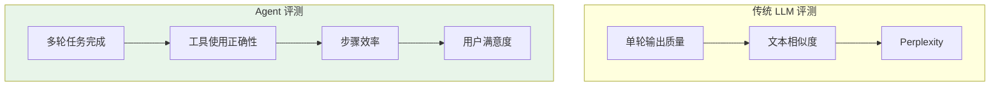
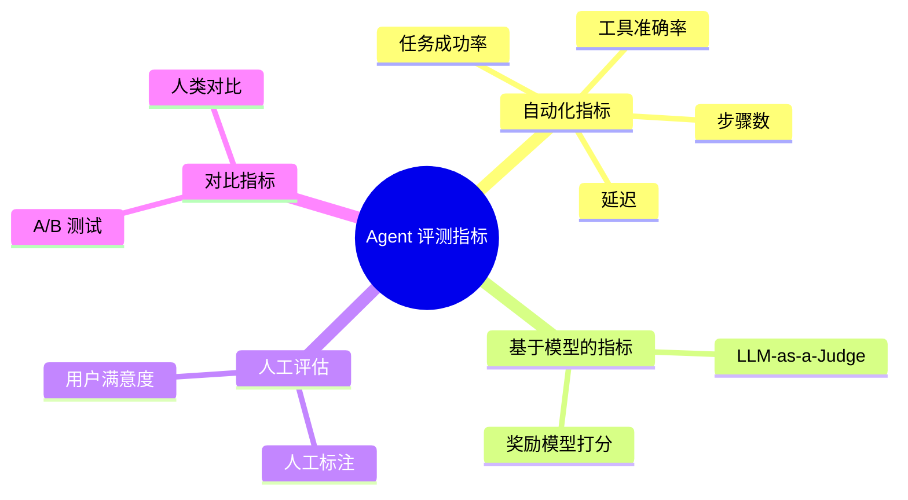
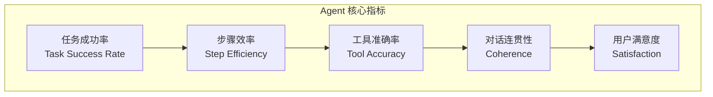
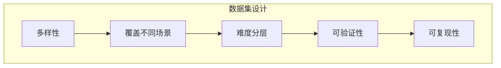
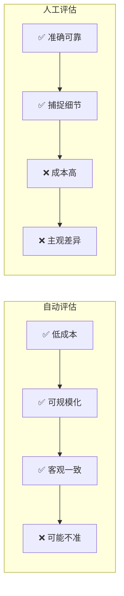

# Agent 评测指标

> 如何评估 AI Agent 的效果：任务完成率、步骤效率、用户满意度

---

## 一、概念与原理

### 1.1 为什么需要 Agent 评测？

**核心挑战：**
- Agent 是**多步骤、多工具、多轮对话**的复杂系统
- 传统 LLM 评测（如 perplexity、BLEU）不够用
- 需要评估**端到端任务完成能力**



### 1.2 Agent 评测维度

| 维度 | 说明 | 关键问题 |
|------|------|----------|
| **任务完成** | 是否达成目标 | 任务成功了吗？ |
| **步骤效率** | 用了多少步 | 有没有走弯路？ |
| **工具使用** | 工具调用是否正确 | 调用了对的工具吗？参数对吗？ |
| **对话质量** | 交互是否自然 | 回复是否相关、连贯？ |
| **安全性** | 是否有害输出 | 有没有泄露敏感信息？ |
| **用户体验** | 用户是否满意 | 用户愿意再用吗？ |

### 1.3 评测指标分类



---

## 二、面试题详解

### 题目 1：Agent 评测与传统 LLM 评测有什么区别？需要关注哪些特殊指标？

#### 考察点
- Agent 与 LLM 的差异
- 评测维度设计
- 指标选择

#### 详细解答

**核心区别：**

| 维度 | LLM 评测 | Agent 评测 |
|------|----------|------------|
| **任务类型** | 单轮生成 | 多轮交互 |
| **评估对象** | 文本质量 | 任务完成 |
| **输出形式** | 纯文本 | 文本 + 工具调用 |
| **上下文** | 单轮 | 多轮对话历史 |
| **终止条件** | 生成结束 | 任务完成/失败 |

**Agent 特殊指标：**



**1. 任务成功率（Task Success Rate）**

```
定义：成功完成任务的比例

计算：
Success Rate = 成功任务数 / 总任务数

判断标准：
- 硬标准：是否达到目标状态（如预订成功）
- 软标准：人工/模型判断是否完成

示例：
- 预订酒店任务：100 个任务，85 个成功预订
- Success Rate = 85%
```

**2. 步骤效率（Step Efficiency）**

```
定义：完成任务所需的步骤数

计算：
- 平均步骤数：Avg Steps = 总步骤数 / 任务数
- 最优步骤比：实际步骤 / 理论最优步骤

示例：
- 查询天气任务：
  - 理论最优：2 步（理解意图 → 调用 API）
  - Agent 实际：5 步（多轮确认）
  - 效率比：5/2 = 2.5（越接近 1 越好）
```

**3. 工具准确率（Tool Accuracy）**

```
定义：工具调用的正确性

计算：
- 工具选择准确率：正确选择工具 / 总工具调用
- 参数准确率：参数正确的调用 / 总调用

示例：
- 100 次工具调用：
  - 正确选择工具：92 次（92%）
  - 参数完全正确：85 次（85%）
```

**Java 伪代码（指标计算）：**

```java
public class AgentMetrics {
    
    /**
     * 任务成功率
     */
    public double taskSuccessRate(List<TaskResult> results) {
        long successCount = results.stream()
            .filter(TaskResult::isSuccess)
            .count();
        return (double) successCount / results.size();
    }
    
    /**
     * 平均步骤数
     */
    public double averageSteps(List<TaskResult> results) {
        return results.stream()
            .mapToInt(TaskResult::getStepCount)
            .average()
            .orElse(0);
    }
    
    /**
     * 工具调用准确率
     */
    public double toolAccuracy(List<ToolCall> calls) {
        long correctCount = calls.stream()
            .filter(ToolCall::isCorrect)
            .count();
        return (double) correctCount / calls.size();
    }
    
    /**
     * 综合评分
     */
    public double compositeScore(TaskResult result) {
        double successWeight = 0.5;
        double efficiencyWeight = 0.3;
        double toolWeight = 0.2;
        
        double successScore = result.isSuccess() ? 1.0 : 0.0;
        double efficiencyScore = 1.0 / (1.0 + result.getStepCount() / result.getOptimalSteps());
        double toolScore = result.getToolAccuracy();
        
        return successScore * successWeight 
             + efficiencyScore * efficiencyWeight 
             + toolScore * toolWeight;
    }
}
```

---

### 题目 2：如何设计 Agent 的评测数据集？需要考虑哪些因素？

#### 考察点
- 数据集设计
- 评测场景覆盖
- 难度分层

#### 详细解答

**评测数据集设计原则：**



**1. 场景覆盖**

| 场景类型 | 示例 | 占比 |
|----------|------|------|
| **单工具简单任务** | 查天气、算数学 | 30% |
| **多工具组合任务** | 查天气 + 推荐穿衣 | 40% |
| **多轮对话任务** | 预订酒店（多轮确认） | 20% |
| **边界/异常场景** | 工具失败、用户打断 | 10% |

**2. 难度分层**

```
Level 1（简单）：单轮、单工具、明确意图
- "北京今天天气怎么样？"
- 预期：1-2 步完成

Level 2（中等）：多轮、单工具、需确认
- "帮我订个酒店"
- 预期：3-5 步，需要确认地点、时间、预算

Level 3（困难）：多工具、复杂推理
- "我下周三去北京出差，帮我安排行程"
- 预期：5-10 步，涉及机票、酒店、日程多个工具

Level 4（极难）：开放域、长对话
- "帮我规划一次日本自由行"
- 预期：10+ 步，多轮交互，复杂规划
```

**3. 数据格式**

```json
{
  "task_id": "hotel_booking_001",
  "level": 2,
  "category": "hotel_booking",
  "user_query": "帮我订个北京的酒店",
  "context": {
    "user_profile": {"location": "上海", "budget": "500-800"},
    "current_date": "2024-03-30"
  },
  "expected_tools": ["search_hotel", "book_hotel"],
  "expected_steps": 4,
  "success_criteria": {
    "hotel_booked": true,
    "city": "北京",
    "check_in": "2024-03-31"
  },
  "evaluation": {
    "auto_check": true,
    "human_check": false
  }
}
```

**4. 可验证性设计**

```
自动验证：
- 工具调用记录是否匹配预期
- 最终状态是否满足成功条件
- 步骤数是否在合理范围

人工验证（抽样）：
- 对话是否自然
- 是否有更好的解决路径
- 用户体验评分
```

---

### 题目 3：Agent 评测中，自动评估和人工评估各有什么优缺点？如何平衡？

#### 考察点
- 评估方法对比
- 成本与质量权衡
- 混合评估策略

#### 详细解答

**对比分析：**



**详细对比：**

| 维度 | 自动评估 | 人工评估 |
|------|----------|----------|
| **成本** | ✅ 低 | ❌ 高（需要标注员） |
| **速度** | ✅ 实时 | ❌ 慢（需要人工时间） |
| **一致性** | ✅ 客观稳定 | ⚠️ 主观差异 |
| **准确性** | ⚠️ 可能误判 | ✅ 准确可靠 |
| **细节捕捉** | ❌ 难捕捉细微差别 | ✅ 能发现细节问题 |
| **可扩展** | ✅ 容易扩展 | ❌ 难扩展 |
| **适用场景** | 大规模快速评估 | 小样本精细评估 |

**混合评估策略：**

```
1. 自动评估先行（100% 样本）
   - 快速筛选明显失败/成功的案例
   - 计算基础指标

2. 人工抽样复核（10-20% 样本）
   - 边界案例（自动评估不确定）
   - 随机抽样验证自动评估准确性
   - 新类型任务（自动评估未覆盖）

3. LLM-as-a-Judge 辅助（50-80% 样本）
   - 比纯规则自动评估更准确
   - 比人工评估成本低
   - 需要校准与人工评估的一致性
```

**成本效益分析：**

```
场景：10,000 个 Agent 对话需要评估

方案 A：纯人工
- 成本：10,000 × 5分钟 × $0.5/分钟 = $2,500
- 时间：10,000 × 5分钟 = 833 小时

方案 B：自动 + 人工抽样 10%
- 自动：$0（脚本运行）
- 人工：1,000 × 5分钟 × $0.5 = $250
- 时间：83 小时
- 节省：90% 成本和时间

方案 C：LLM-as-Judge + 人工抽样 5%
- LLM：10,000 × $0.01 = $100
- 人工：500 × 5分钟 × $0.5 = $125
- 总计：$225
- 时间：42 小时
```

---

## 三、总结

### 面试回答模板

> Agent 评测需要关注**任务完成率、步骤效率、工具准确率、用户满意度**四个核心维度。
>
> **与传统 LLM 评测的区别**：Agent 是多轮交互系统，需要评估端到端任务完成能力，而非单轮文本质量。
>
> **自动 vs 人工评估**：自动评估成本低、可规模化，但可能不准确；人工评估准确但成本高。实践中采用**自动评估先行 + 人工抽样复核**的混合策略。
>
> **数据集设计**：需要覆盖多样场景、难度分层、确保可验证性。

### 一句话记忆

| 概念 | 一句话 |
|------|--------|
| **任务成功率** | 核心指标，是否达成目标 |
| **步骤效率** | 走没走弯路，用了多少步 |
| **工具准确率** | 调用的工具对不对，参数准不准 |
| **自动评估** | 快但可能不准，适合大规模筛选 |
| **人工评估** | 准但成本高，适合精细验证 |

---

> 💡 **提示**：Agent 评测是工程落地的关键环节，好的评估体系是迭代优化的基础。
