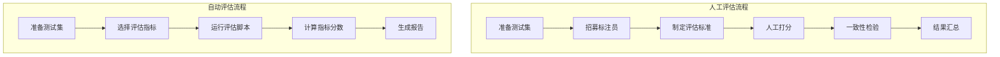
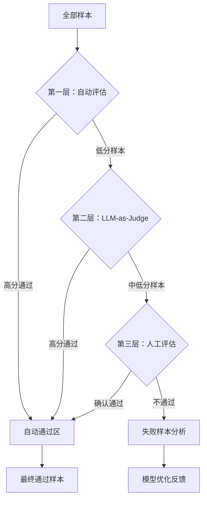

# 人工评估 vs 自动评估

> 面试常考：两种评估方式的对比、适用场景、优缺点分析

---

## 一、概念与原理

### 1.1 什么是人工评估（Human Evaluation）

人工评估是指由人类标注员或领域专家对模型输出进行主观判断和打分的过程。

**核心特点：**
- **主观性强**：依赖人类对"好"的定义和理解
- **成本高**：需要招募、培训标注员
- **质量可控**：可通过多轮审核保证准确性
- **灵活性高**：可评估难以量化的维度（如创造性、流畅度）

### 1.2 什么是自动评估（Automatic Evaluation）

自动评估是指使用算法或模型自动计算评估指标，无需人工介入。

**核心特点：**
- **效率高**：可批量处理大量数据
- **成本低**：一次开发，重复使用
- **客观一致**：同一输入始终产生相同分数
- **局限性**：只能评估可量化的维度

### 1.3 评估流程对比



---

## 二、面试题详解

### 题目 1（初级）

**Q: 人工评估和自动评估的主要区别是什么？各自适用于什么场景？**

**考察点：** 对两种评估方式本质差异的理解，以及场景选择能力。

**详细解答：**

| 维度 | 人工评估 | 自动评估 |
|------|----------|----------|
| **评估主体** | 人类标注员/专家 | 算法/程序 |
| **成本** | 高（人力+时间） | 低（计算资源） |
| **速度** | 慢（每人每天数百条） | 快（每秒数千条） |
| **主观性** | 高（不同人标准可能不同） | 低（结果可复现） |
| **覆盖维度** | 广（创造性、语义理解等） | 窄（可量化指标） |
| **一致性** | 需通过培训、多轮标注保证 | 天然一致 |

**适用场景：**

| 场景 | 推荐方式 | 原因 |
|------|----------|------|
| 模型上线前的最终验收 | 人工评估 | 确保质量，发现自动指标遗漏的问题 |
| 日常迭代快速验证 | 自动评估 | 快速反馈，支持高频迭代 |
| 评估创造性/开放性任务 | 人工评估 | 自动指标难以衡量"好不好" |
| 大规模A/B测试 | 自动评估 | 样本量大，人工成本不可接受 |
| 对齐人类偏好（RLHF） | 人工评估 | 需要人类反馈作为训练信号 |

---

### 题目 2（中级）

**Q: 为什么说 BLEU、ROUGE 等传统自动指标在评估 LLM 时存在局限性？如何解决？**

**考察点：** 对传统 NLP 评估指标局限性的理解，以及现代 LLM 评估的改进思路。

**详细解答：**

**传统指标的局限性：**

1. **基于 n-gram 匹配**
   - BLEU/ROUGE 计算候选文本与参考文本的 n-gram 重叠
   - **问题**：LLM 生成多样化，正确答案不止一种，n-gram 匹配会惩罚合理的同义表达

2. **需要参考答案**
   - 必须有标准答案（reference）才能计算
   - **问题**：开放域对话、创意写作等任务难以准备完整参考答案

3. **无法评估语义**
   - 只关注表面词重叠，不理解语义
   - **问题**："模型表现很好"和"模型性能优异"语义相同但 BLEU 得分低

4. **忽视上下文连贯性**
   - 逐句计算，不关注对话或篇章级别的连贯性

**解决方案：**

| 方案 | 原理 | 代表指标/方法 |
|------|------|---------------|
| **Embedding-based** | 用语义向量计算相似度 | BERTScore、MoverScore |
| **LLM-as-a-Judge** | 用更强的 LLM 评判 | GPT-4 打分、Pairwise Comparison |
| **Reference-free** | 无需参考答案 | 困惑度、Self-BLEU、多样性指标 |
| **Human-in-the-loop** | 人工+自动结合 | 自动初筛 + 人工复审 |

**Java 伪代码示例：**

```java
/**
 * 评估策略选择器
 * 
 * 根据任务类型和阶段选择合适的评估方式
 */
public class EvaluationStrategySelector {
    
    /**
     * 选择评估策略
     * 
     * @param taskType 任务类型
     * @param stage 开发阶段
     * @return 推荐的评估策略
     */
    public EvaluationStrategy selectStrategy(TaskType taskType, DevStage stage) {
        // 1. 创意类任务必须人工评估
        if (taskType == TaskType.CREATIVE_WRITING || 
            taskType == TaskType.OPEN_DIALOGUE) {
            return EvaluationStrategy.HUMAN_EVALUATION;
        }
        
        // 2. 上线前最终验收必须人工评估
        if (stage == DevStage.PRE_RELEASE) {
            return EvaluationStrategy.HUMAN_EVALUATION;
        }
        
        // 3. 日常迭代使用自动评估
        if (stage == DevStage.DAILY_ITERATION) {
            return EvaluationStrategy.AUTOMATIC_EVALUATION;
        }
        
        // 4. 默认使用混合策略
        return EvaluationStrategy.HYBRID;
    }
    
    /**
     * 混合评估：自动初筛 + 人工复审
     */
    public EvaluationResult hybridEvaluate(List<ModelOutput> outputs) {
        // 1. 自动评估快速筛选
        List<ModelOutput> candidates = outputs.stream()
            .filter(o -> autoEvaluator.score(o) > THRESHOLD)
            .collect(Collectors.toList());
        
        // 2. 人工评估重点样本
        return humanEvaluator.evaluate(candidates);
    }
}
```

---

### 题目 3（中级）

**Q: 如何保证人工评估的质量和一致性？**

**考察点：** 人工评估的工程实践，质量管控方法。

**详细解答：**

**保证一致性的关键措施：**

1. **制定详细评估标准（Guideline）**
   ```markdown
   示例：对话质量评分标准
   - 5分：回复完全理解用户意图，信息准确，表达自然流畅
   - 4分：回复基本正确，但存在轻微冗余或不够自然
   - 3分：回复部分正确，存在明显问题但整体可用
   - 2分：回复存在严重错误，但仍有部分正确信息
   - 1分：回复完全错误或与问题无关
   ```

2. **标注员培训与考核**
   - 提供标准案例集（gold set）
   - 新标注员需通过一致性测试（与标准答案吻合度 > 80%）

3. **多轮标注与一致性检验**
   - 每个样本至少 2-3 人独立标注
   - 计算标注员间一致性（Cohen's Kappa、Fleiss' Kappa）

4. **定期校准与反馈**
   - 每周抽查标注结果
   - 对分歧大的案例进行讨论校准

**Java 伪代码示例：**

```java
/**
 * 人工评估质量控制器
 */
public class HumanEvaluationQualityController {
    
    private static final double KAPPA_THRESHOLD = 0.7;
    
    /**
     * 计算标注员间一致性（Cohen's Kappa）
     * 
     * @param annotations 多个标注员的标注结果
     * @return Kappa 系数
     */
    public double calculateCohensKappa(List<List<Integer>> annotations) {
        // 1. 计算观察一致率
        double observedAgreement = calculateObservedAgreement(annotations);
        
        // 2. 计算期望一致率（随机情况下的一致率）
        double expectedAgreement = calculateExpectedAgreement(annotations);
        
        // 3. 计算 Kappa
        return (observedAgreement - expectedAgreement) / (1 - expectedAgreement);
    }
    
    /**
     * 质量检查：Kappa 是否达标
     */
    public boolean isQualityAcceptable(List<List<Integer>> annotations) {
        double kappa = calculateCohensKappa(annotations);
        return kappa >= KAPPA_THRESHOLD;
    }
    
    /**
     * 处理分歧样本：取多数投票或专家仲裁
     */
    public int resolveDisagreement(List<Integer> ratings) {
        // 多数投票
        Map<Integer, Integer> countMap = new HashMap<>();
        for (int rating : ratings) {
            countMap.merge(rating, 1, Integer::sum);
        }
        
        return countMap.entrySet().stream()
            .max(Map.Entry.comparingByValue())
            .map(Map.Entry::getKey)
            .orElseThrow();
    }
}
```

---

### 题目 4（高级）

**Q: 在实际项目中，如何设计一个成本可控、质量可靠的混合评估方案？**

**考察点：** 工程实践能力，成本与质量的平衡设计。

**详细解答：**

**分层评估架构：**



**成本优化策略：**

| 策略 | 原理 | 成本节省 |
|------|------|----------|
| **分层过滤** | 自动评估过滤明显好坏样本，人工只评估边界样本 | 节省 60-80% 人工 |
| **主动学习** | 优先评估模型不确定性高的样本 | 同样预算获得更多信息 |
| **众包+专家** | 简单判断用众包，复杂判断用专家 | 降低单位样本成本 |
| **采样评估** | 大规模任务只评估代表性样本 | 统计推断整体质量 |

**Java 伪代码示例：**

```java
/**
 * 分层混合评估系统
 * 
 * 设计目标：在保证质量的前提下最小化人工成本
 */
public class TieredHybridEvaluationSystem {
    
    private final AutoEvaluator autoEvaluator;
    private final LLMJudge llmJudge;
    private final HumanEvaluator humanEvaluator;
    
    // 阈值配置
    private static final double AUTO_PASS_THRESHOLD = 0.9;
    private static final double AUTO_FAIL_THRESHOLD = 0.3;
    private static final double LLM_PASS_THRESHOLD = 0.7;
    
    /**
     * 分层评估流程
     */
    public EvaluationResult evaluate(List<ModelOutput> outputs) {
        List<ModelOutput> humanReviewQueue = new ArrayList<>();
        int autoPassed = 0, autoFailed = 0;
        
        // 第一层：自动评估
        for (ModelOutput output : outputs) {
            double autoScore = autoEvaluator.score(output);
            
            if (autoScore >= AUTO_PASS_THRESHOLD) {
                // 高分自动通过
                autoPassed++;
                output.setFinalScore(autoScore);
                output.setEvaluationSource(EvaluationSource.AUTO);
            } else if (autoScore <= AUTO_FAIL_THRESHOLD) {
                // 低分自动失败
                autoFailed++;
                output.setFinalScore(autoScore);
                output.setEvaluationSource(EvaluationSource.AUTO);
            } else {
                // 边界样本进入第二层
                humanReviewQueue.add(output);
            }
        }
        
        // 第二层：LLM-as-Judge（可选，用于进一步过滤）
        List<ModelOutput> finalHumanQueue = new ArrayList<>();
        for (ModelOutput output : humanReviewQueue) {
            double llmScore = llmJudge.evaluate(output);
            if (llmScore >= LLM_PASS_THRESHOLD) {
                output.setFinalScore(llmScore);
                output.setEvaluationSource(EvaluationSource.LLM_JUDGE);
            } else {
                finalHumanQueue.add(output);
            }
        }
        
        // 第三层：人工评估（成本最高，样本最少）
        Map<String, HumanEvaluationResult> humanResults = humanEvaluator.evaluate(finalHumanQueue);
        
        // 汇总统计
        return EvaluationResult.builder()
            .totalSamples(outputs.size())
            .autoEvaluated(autoPassed + autoFailed)
            .llmEvaluated(humanReviewQueue.size() - finalHumanQueue.size())
            .humanEvaluated(finalHumanQueue.size())
            .humanCostSavings(calculateSavings(outputs.size(), finalHumanQueue.size()))
            .build();
    }
    
    /**
     * 计算成本节省比例
     */
    private double calculateSavings(int total, int humanEvaluated) {
        // 假设人工评估成本是自动评估的 100 倍
        double fullHumanCost = total * 100.0;
        double actualCost = (total - humanEvaluated) * 1.0 + humanEvaluated * 100.0;
        return (fullHumanCost - actualCost) / fullHumanCost;
    }
}

/**
 * 评估来源枚举
 */
enum EvaluationSource {
    AUTO,       // 自动评估
    LLM_JUDGE,  // LLM 评判
    HUMAN       // 人工评估
}
```

---

## 三、延伸追问

### 追问 1：如何评估评估方法本身的好坏？

**简要答案：**
- **人工 vs 自动相关性**：计算自动指标与人工评分的相关性（Pearson/Spearman）
- **区分度**：好的评估方法应能区分不同质量水平的模型
- **鲁棒性**：对输入扰动（如错别字、语序调整）的敏感度适中
- **效率**：评估成本与信息增益的比值

### 追问 2：LLM-as-a-Judge 相比传统自动指标有什么优势和风险？

**简要答案：**

| 维度 | 优势 | 风险 |
|------|------|------|
| **语义理解** | 能理解深层语义，不依赖词重叠 | 可能存在位置偏见、长度偏见 |
| **灵活性** | 可评估开放性任务 | 评估标准可能随模型版本变化 |
| **成本** | 比人工便宜，比传统指标贵 | API 成本累积可能很高 |
| **一致性** | 比人工更一致 | 可能存在系统性偏见 |

**缓解风险的方法：**
- 使用多个 LLM 投票
- 定期用人工评估校准 LLM 评判标准
- 设计结构化的评估 prompt，减少随机性

### 追问 3：在 RLHF（基于人类反馈的强化学习）中，人工评估扮演什么角色？

**简要答案：**
- **核心作用**：提供奖励信号（Reward Model 的训练数据）
- **具体形式**：标注员对模型输出的偏好排序（A > B）
- **质量要求**：需要高度一致，因为噪声会被奖励模型放大
- **规模要求**：通常需要数万到数十万条偏好数据
- **挑战**：偏好主观性强，不同标注员标准可能冲突

---

## 四、总结

### 面试回答模板

> 人工评估和自动评估是 AI 系统评估的两个核心手段。**自动评估**成本低、速度快，适合日常迭代和大规模筛选；**人工评估**质量高、覆盖维度广，适合最终验收和主观性强的任务。
>
> 在实际工程中，我推荐采用**分层混合评估**方案：先用自动指标快速过滤明显好坏样本，再用 LLM-as-a-Judge 处理中等难度样本，最后只对边界样本进行人工评估。这样可以在保证质量的同时，将人工成本降低 60-80%。
>
> 需要注意的是，传统指标如 BLEU、ROUGE 在评估 LLM 时存在明显局限，因为它们只关注词重叠而忽视语义。现代做法更倾向于使用 Embedding-based 指标（如 BERTScore）或 LLM-as-a-Judge 方法。

### 一句话记忆

| 概念 | 一句话 |
|------|--------|
| **人工评估** | 质量高、成本高，适合最终验收和主观任务 |
| **自动评估** | 效率高、成本低，适合日常迭代和快速反馈 |
| **混合评估** | 分层过滤，用自动评估覆盖大部分样本，人工只处理边界情况 |
| **LLM-as-a-Judge** | 介于两者之间，比自动指标更懂语义，比人工更快更便宜 |

---

## 参考资料

1. [BLEU: a Method for Automatic Evaluation of Machine Translation](https://aclanthology.org/P02-1040/)
2. [BERTScore: Evaluating Text Generation with BERT](https://arxiv.org/abs/1904.09675)
3. [Judging LLM-as-a-Judge with MT-Bench and Chatbot Arena](https://arxiv.org/abs/2306.05685)
4. [RLHF: Scaling Language Models with RL](https://arxiv.org/abs/2203.02155)