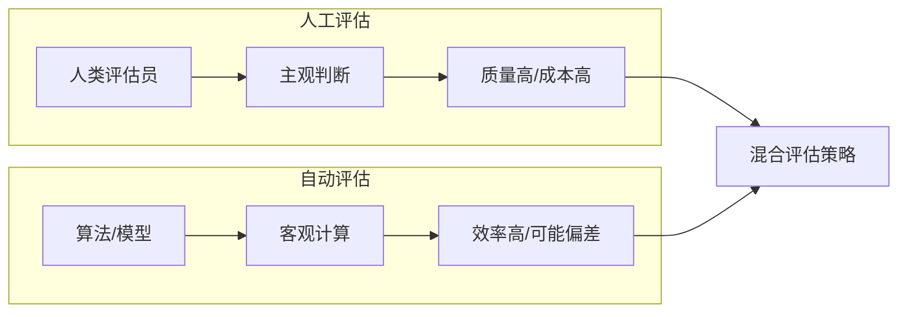
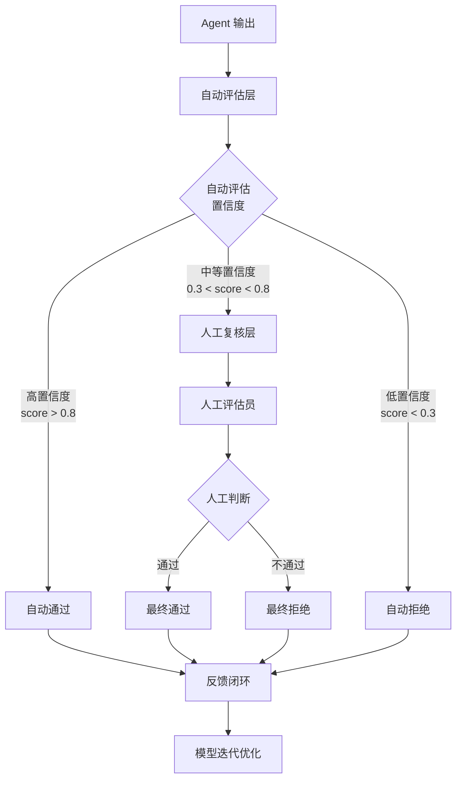

# 人工评估 vs 自动评估

> 探讨 AI Agent 系统评估的两种范式：人工评估的精准性与自动评估的效率如何取舍与结合

---

## 一、概念与原理

### 1.1 人工评估（Human Evaluation）

人工评估是指由人类评估员对 AI Agent 的输出进行主观判断和打分的过程。

**核心特点：**
- **主观性强**：基于人类直觉和经验判断
- **成本高**：需要招募、培训评估员，按量付费
- **速度慢**：无法实时反馈，通常以小时或天为单位
- **质量可控**：可通过多轮审核、校准机制保证质量

**常见形式：**
| 形式 | 说明 | 适用场景 |
|------|------|----------|
| 绝对打分 | 1-5 分制或 Likert 量表 | 整体质量评估 |
| 相对比较 | A/B 对比，选出更好答案 | 模型迭代对比 |
| 细粒度标注 | 对回答的多个维度分别打分 | 问题诊断分析 |
| 人工审核 | 通过/不通过的二元判断 | 安全合规检查 |

### 1.2 自动评估（Automated Evaluation）

自动评估是指通过算法、规则或模型自动计算评估指标的过程。

**核心特点：**
- **客观性强**：基于预定义规则或模型计算
- **成本低**：一次性开发，边际成本趋近于零
- **速度快**：毫秒级响应，可实时反馈
- **覆盖面广**：可大规模批量评估

**常见形式：**
| 形式 | 说明 | 代表指标 |
|------|------|----------|
| 规则匹配 | 基于正则、关键词匹配 | 准确率、召回率 |
| 参考对比 | 与标准答案对比计算相似度 | BLEU、ROUGE |
| 模型评分 | 使用 LLM 作为评判器 | LLM-as-a-Judge |
| 指标计算 | 基于任务完成度计算 | 任务成功率、F1 |

### 1.3 评估范式对比



**核心差异对比表：**

| 维度 | 人工评估 | 自动评估 |
|------|----------|----------|
| **评估主体** | 人类专家/众包工人 | 算法/规则/模型 |
| **成本结构** | 高边际成本（按量付费） | 高固定成本（开发投入） |
| **响应速度** | 小时级~天级 | 毫秒级~秒级 |
| **主观性** | 高（依赖个人判断） | 低（基于客观指标） |
| **可解释性** | 强（可追问原因） | 弱（黑盒模型） |
| **覆盖范围** | 受人力限制 | 可大规模扩展 |
| **偏见风险** | 评估员偏见 | 指标设计偏见 |
| **适用场景** | 最终质量把关、复杂场景 | 快速迭代、A/B 测试 |

---

## 二、面试题详解

### 题目 1（初级）：人工评估和自动评估各有什么优缺点？什么时候应该选择人工评估？

**考察点：** 对两种评估范式的基本理解，能够根据场景做出合理选择

#### 详细解答

**人工评估的优缺点：**

| 优点 | 缺点 |
|------|------|
| 能捕捉语义细微差别 | 成本高，难以规模化 |
| 可评估创造性和合理性 | 存在评估员间差异（Inter-annotator Agreement 问题） |
| 适合开放式、主观性强的任务 | 反馈周期长，不适合快速迭代 |
| 可发现自动评估遗漏的问题 | 可能存在评估疲劳和偏见 |

**自动评估的优缺点：**

| 优点 | 缺点 |
|------|------|
| 成本低，可大规模运行 | 难以评估语义质量和创造性 |
| 反馈及时，支持快速迭代 | 指标可能与人类感知不一致 |
| 结果可复现，一致性高 | 对开放式任务评估能力有限 |
| 可集成到 CI/CD 流程 | 指标设计本身可能存在缺陷 |

**选择人工评估的典型场景：**

1. **最终质量把关**：产品上线前的最终审核
2. **复杂主观任务**：创意写作、多轮对话质量评估
3. **基准测试建立**：建立自动评估的"黄金标准"
4. **指标验证**：验证自动评估指标与人类判断的相关性
5. **安全合规检查**：涉及敏感内容的审核

**Java 伪代码示例 - 评估决策器：**

```java
/**
 * 评估策略决策器
 * 
 * 根据任务特性选择人工或自动评估策略
 */
public class EvaluationStrategySelector {
    
    /**
     * 选择评估策略
     * 
     * @param taskType 任务类型
     * @param budget 预算限制
     * @param timeConstraint 时间约束（小时）
     * @param sampleSize 样本数量
     * @return 推荐的评估策略
     */
    public EvaluationStrategy selectStrategy(
            TaskType taskType, 
            double budget, 
            int timeConstraint, 
            int sampleSize) {
        
        // 1. 高风险任务必须人工评估
        if (taskType.isHighRisk()) {
            return EvaluationStrategy.HUMAN_REQUIRED;
        }
        
        // 2. 主观性强且样本量小的任务优先人工评估
        if (taskType.isSubjective() && sampleSize < 100) {
            return EvaluationStrategy.HUMAN_PREFERRED;
        }
        
        // 3. 时间紧迫时优先自动评估
        if (timeConstraint < 24) {
            return EvaluationStrategy.AUTOMATED;
        }
        
        // 4. 预算充足且样本量大时采用混合策略
        if (budget > 10000 && sampleSize > 1000) {
            return EvaluationStrategy.HYBRID;
        }
        
        // 5. 默认使用自动评估
        return EvaluationStrategy.AUTOMATED;
    }
    
    /**
     * 混合评估策略配置
     */
    public HybridConfig createHybridConfig(int totalSamples) {
        return HybridConfig.builder()
            // 自动评估覆盖全部样本
            .automatedCoverage(1.0)
            // 人工评估抽样 5% 进行校准
            .humanSampleRate(0.05)
            // 人工评估样本量至少 50
            .minHumanSamples(50)
            .build();
    }
}

/**
 * 评估策略枚举
 */
public enum EvaluationStrategy {
    HUMAN_REQUIRED,    // 必须人工评估
    HUMAN_PREFERRED,   // 优先人工评估
    AUTOMATED,         // 自动评估
    HYBRID             // 混合策略
}
```

---

### 题目 2（中级）：如何建立自动评估指标与人工评估之间的相关性？请说明具体方法

**考察点：** 评估体系建设能力，理解如何验证自动评估的有效性

#### 详细解答

建立自动评估与人工评估相关性的核心目标是：**证明自动指标能够可靠地预测人类对质量的判断**。

**具体方法与步骤：**

**Step 1: 构建评估数据集**
```
1. 收集多样化的样本（覆盖不同质量层级）
2. 确保样本量足够（通常每个子集 100-500 条）
3. 标注人工评估分数（建议多评估员独立标注）
```

**Step 2: 计算人工评估的一致性**

使用 Inter-Annotator Agreement (IAA) 衡量人工评估的可靠性：

| 指标 | 适用场景 | 计算公式 |
|------|----------|----------|
| Cohen's Kappa | 两个评估员 | κ = (Po - Pe) / (1 - Pe) |
| Fleiss' Kappa | 多个评估员 | 扩展的 Kappa 统计 |
| Krippendorff's Alpha | 多评估员、多类别 | 更通用的 IAA 指标 |

**Java 伪代码示例 - IAA 计算：**

```java
/**
 * 评估员一致性计算器
 */
public class InterAnnotatorAgreementCalculator {
    
    /**
     * 计算 Cohen's Kappa（两个评估员）
     * 
     * @param annotator1 评估员1的标注结果
     * @param annotator2 评估员2的标注结果
     * @return Kappa 值 (-1 到 1，>0.6 表示较好一致性)
     */
    public double calculateCohensKappa(int[] annotator1, int[] annotator2) {
        // 1. 计算观察一致率 Po
        int agreements = 0;
        for (int i = 0; i < annotator1.length; i++) {
            if (annotator1[i] == annotator2[i]) {
                agreements++;
            }
        }
        double po = (double) agreements / annotator1.length;
        
        // 2. 计算期望一致率 Pe
        Map<Integer, Double> dist1 = calculateDistribution(annotator1);
        Map<Integer, Double> dist2 = calculateDistribution(annotator2);
        
        double pe = 0.0;
        for (Integer category : dist1.keySet()) {
            pe += dist1.get(category) * dist2.getOrDefault(category, 0.0);
        }
        
        // 3. 计算 Kappa
        return (po - pe) / (1 - pe);
    }
    
    /**
     * 解释 Kappa 结果
     */
    public String interpretKappa(double kappa) {
        if (kappa < 0) return "一致性比随机还差";
        if (kappa < 0.2) return "轻微一致";
        if (kappa < 0.4) return "一般一致";
        if (kappa < 0.6) return "中等一致";
        if (kappa < 0.8) return "较强一致";
        return "几乎完全一致";
    }
}
```

**Step 3: 计算自动指标与人工评分的相关性**

| 相关性指标 | 适用场景 | 说明 |
|------------|----------|------|
| Pearson r | 连续变量，线性关系 | 最常用，-1 到 1 |
| Spearman ρ | 有序变量，非线性单调关系 | 对异常值鲁棒 |
| Kendall τ | 小样本，有序变量 | 更保守的估计 |

**Step 4: 设定相关性阈值**

```
强相关: r > 0.7  → 自动指标可独立使用
中等相关: 0.5 < r < 0.7  → 需人工抽样验证
弱相关: r < 0.5  → 自动指标不可靠，需重新设计
```

**Step 5: 建立分层评估体系**

```java
/**
 * 分层评估体系
 */
public class TieredEvaluationSystem {
    
    /**
     * 根据相关性系数选择评估层级
     */
    public EvaluationTier selectTier(String metricName, double correlation) {
        if (correlation > 0.7) {
            // 高相关性：自动评估为主
            return EvaluationTier.AUTOMATED_FIRST;
        } else if (correlation > 0.5) {
            // 中等相关性：混合策略
            return EvaluationTier.HYBRID;
        } else {
            // 低相关性：人工评估为主
            return EvaluationTier.HUMAN_FIRST;
        }
    }
    
    /**
     * 执行分层评估
     */
    public EvaluationResult evaluate(AgentOutput output, EvaluationTier tier) {
        switch (tier) {
            case AUTOMATED_FIRST:
                // 自动评估全覆盖，人工抽检 1%
                return runAutomatedWithSpotCheck(output, 0.01);
            case HYBRID:
                // 自动评估 + 人工抽样 10%
                return runHybridEvaluation(output, 0.10);
            case HUMAN_FIRST:
                // 人工评估为主，自动评估辅助
                return runHumanFirstEvaluation(output);
            default:
                throw new IllegalArgumentException("Unknown tier");
        }
    }
}
```

---

### 题目 3（高级）：设计一个 Agent 系统的混合评估流水线，要求兼顾效率和准确性

**考察点：** 系统工程能力，能够设计可落地的评估架构

#### 详细解答

**混合评估流水线设计：**



**流水线核心组件：**

| 组件 | 功能 | 实现要点 |
|------|------|----------|
| **自动评估层** | 快速初筛，计算置信度 | 多指标融合，异常检测 |
| **置信度路由** | 根据分数分流到不同处理路径 | 动态阈值调整 |
| **人工复核层** | 处理边界案例 | 优先级队列，专家分配 |
| **反馈闭环** | 收集结果用于模型优化 | 数据沉淀，持续学习 |

**Java 伪代码示例 - 完整流水线实现：**

```java
/**
 * 混合评估流水线
 * 
 * 兼顾效率和准确性的分层评估架构
 */
public class HybridEvaluationPipeline {
    
    private final AutomatedEvaluator autoEvaluator;
    private final HumanEvaluationQueue humanQueue;
    private final FeedbackLoop feedbackLoop;
    
    // 动态阈值配置
    private double highConfidenceThreshold = 0.8;
    private double lowConfidenceThreshold = 0.3;
    
    /**
     * 执行评估
     */
    public EvaluationResult evaluate(AgentOutput output) {
        // 1. 自动评估层
        AutomatedResult autoResult = autoEvaluator.evaluate(output);
        double confidence = autoResult.getConfidenceScore();
        
        // 2. 置信度路由
        if (confidence > highConfidenceThreshold) {
            // 高置信度：自动通过
            return EvaluationResult.builder()
                .status(EvaluationStatus.AUTO_APPROVED)
                .autoScore(autoResult.getScore())
                .confidence(confidence)
                .build();
                
        } else if (confidence < lowConfidenceThreshold) {
            // 低置信度：自动拒绝，但记录用于分析
            feedbackLoop.recordRejection(output, autoResult);
            return EvaluationResult.builder()
                .status(EvaluationStatus.AUTO_REJECTED)
                .autoScore(autoResult.getScore())
                .confidence(confidence)
                .build();
                
        } else {
            // 中等置信度：人工复核
            return routeToHumanEvaluation(output, autoResult);
        }
    }
    
    /**
     * 路由到人工评估
     */
    private EvaluationResult routeToHumanEvaluation(
            AgentOutput output, 
            AutomatedResult autoResult) {
        
        // 创建人工评估任务
        HumanEvaluationTask task = HumanEvaluationTask.builder()
            .output(output)
            .autoResult(autoResult)
            .priority(calculatePriority(autoResult))
            .createdAt(Instant.now())
            .build();
        
        // 加入队列
        humanQueue.submit(task);
        
        // 返回待审核状态
        return EvaluationResult.builder()
            .status(EvaluationStatus.PENDING_HUMAN_REVIEW)
            .autoScore(autoResult.getScore())
            .taskId(task.getId())
            .build();
    }
    
    /**
     * 处理人工评估结果（回调）
     */
    public void onHumanEvaluationComplete(
            String taskId, 
            HumanEvaluationResult humanResult) {
        
        // 1. 更新评估结果
        EvaluationResult finalResult = EvaluationResult.builder()
            .status(humanResult.isApproved() ? 
                EvaluationStatus.HUMAN_APPROVED : 
                EvaluationStatus.HUMAN_REJECTED)
            .autoScore(humanResult.getAutoScore())
            .humanScore(humanResult.getScore())
            .humanFeedback(humanResult.getFeedback())
            .build();
        
        // 2. 记录到反馈闭环
        feedbackLoop.recordEvaluation(humanResult.getOutput(), finalResult);
        
        // 3. 触发阈值自适应调整
        adjustThresholdsIfNeeded();
    }
    
    /**
     * 自适应阈值调整
     * 
     * 根据人工与自动评估的一致性动态调整阈值
     */
    private void adjustThresholdsIfNeeded() {
        FeedbackStats stats = feedbackLoop.getRecentStats(100);
        
        // 如果高置信度区间的误判率 > 5%，提高阈值
        if (stats.getHighConfidenceErrorRate() > 0.05) {
            highConfidenceThreshold = Math.min(0.95, highConfidenceThreshold + 0.02);
        }
        
        // 如果低置信度区间有较多被人工通过的案例，降低阈值
        if (stats.getLowConfidencePassRate() > 0.3) {
            lowConfidenceThreshold = Math.max(0.1, lowConfidenceThreshold - 0.02);
        }
    }
    
    /**
     * 计算优先级（用于人工队列排序）
     */
    private int calculatePriority(AutomatedResult autoResult) {
        // 置信度越接近 0.5，优先级越高（最需要人工判断）
        double distanceFromMid = Math.abs(autoResult.getConfidenceScore() - 0.5);
        return (int) ((0.5 - distanceFromMid) * 100);
    }
}
```

**关键设计要点：**

1. **分层分流**：高/低置信度自动处理，仅边界案例送人工
2. **动态阈值**：根据历史数据自适应调整分流阈值
3. **优先级队列**：人工评估资源有限，优先处理最有价值的案例
4. **反馈闭环**：人工结果回流，用于优化自动评估模型

---

## 三、延伸追问

### 追问 1：如何处理人工评估员之间的标注不一致问题？

**简要答案要点：**
- **校准阶段**：正式标注前进行多轮校准，统一标准
- **多评估员投票**：每个样本由 3-5 人评估，取多数意见
- **质量监控**：计算每个评估员的 IAA，淘汰低质量标注者
- **争议仲裁**：对分歧大的样本引入专家仲裁

### 追问 2：BLEU、ROUGE 等传统 NLP 指标在 Agent 评估中有什么局限性？

**简要答案要点：**
- **语义盲区**：只关注 n-gram 匹配，不理解语义
- **多样性惩罚**：对合理但表述不同的答案打低分
- **无法评估推理过程**：只对比最终输出，不评估中间步骤
- **参考依赖**：需要高质量参考答案，Agent 任务往往没有标准答案

### 追问 3：LLM-as-a-Judge 相比传统自动评估有什么优势和风险？

**简要答案要点：**

**优势：**
- 能理解语义，评估开放式回答
- 可评估推理过程的合理性
- 无需预定义参考答案

**风险：**
- 位置偏见（Position Bias）：倾向于选择第一个或特定位置的答案
- 自我偏好：对自己生成的内容打分偏高
- 长度偏见：倾向于更长的回答
- 需要持续验证与人工评估的一致性

---

## 四、总结

### 面试回答模板

> 人工评估和自动评估各有优劣，实际工程中通常采用**分层混合策略**：
> 
> 1. **自动评估**覆盖全量数据，用于快速迭代和回归测试
> 2. **人工评估**聚焦边界案例和最终质量把关
> 3. 通过**相关性分析**建立两套评估体系的映射关系
> 4. 构建**反馈闭环**，用人工结果持续优化自动评估模型
> 
> 核心原则是：**用自动评估追求效率，用人工评估保证质量上限**。

### 一句话记忆

| 概念 | 一句话 |
|------|--------|
| **人工评估** | 精准但昂贵，适合最终把关和复杂场景 |
| **自动评估** | 高效但可能偏差，适合快速迭代和大规模筛选 |
| **混合评估** | 自动初筛 + 人工复核，兼顾效率与质量 |
| **IAA** | 评估员一致性，人工评估质量的"体检报告" |
| **相关性验证** | 证明自动指标能预测人类判断的"桥梁" |

---

## 质量检查清单

- [x] 文档结构完整（概念 → 面试题 → 延伸追问 → 总结）
- [x] 3 道面试题，包含详细答案（初级、中级、高级各 1 题）
- [x] 有 Java 代码示例（评估决策器、IAA 计算、分层体系、流水线）
- [x] 有 mermaid 图表（评估范式对比、混合流水线）
- [x] 有对比表格（评估形式、优缺点、相关性指标等）
- [x] 有面试回答模板
- [x] 一句话记忆口诀
