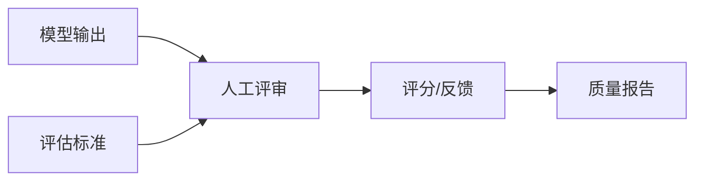
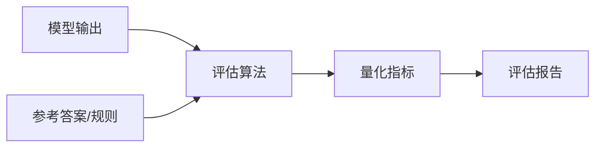
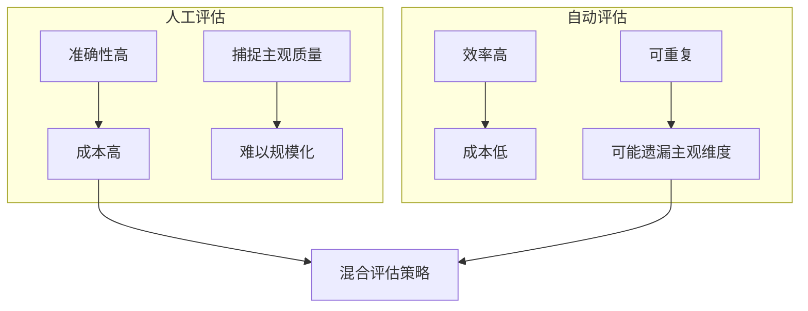
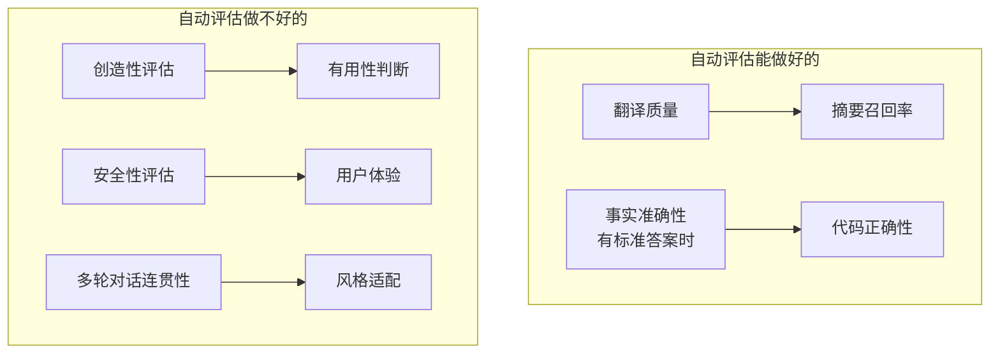

# 人工评估 vs 自动评估

> 深入理解 AI Agent 和 LLM 系统的两种评估范式：人工评估的准确性与自动评估的效率如何权衡？

---

## 一、概念与原理

### 1.1 评估的本质

AI Agent 的评估是衡量系统输出质量的过程，核心要解决三个问题：
- **对不对**（Correctness）：输出是否准确、符合事实
- **好不好**（Quality）：输出是否流畅、有用、符合预期
- **稳不稳**（Robustness）：在不同输入下表现是否一致

### 1.2 人工评估（Human Evaluation）

人工评估是由人类评审员对模型输出进行质量判断的方法。

**核心原理：**
- 人类作为"黄金标准"（Ground Truth）
- 基于主观判断和领域知识进行评估
- 可以捕捉难以量化的质量维度（如创造性、有用性）



**常见人工评估方法：**

| 方法 | 说明 | 适用场景 |
|------|------|----------|
| **绝对评分** | 按 Likert 量表（1-5分）打分 | 单一输出质量评估 |
| **成对比较** | A vs B，选择更好的 | 模型对比、A/B测试 |
| **Elo 评分** | 基于多次对战计算排名 | 多模型排行榜 |
| **人工标注** | 标注正确性、幻觉等标签 | 构建评估数据集 |

### 1.3 自动评估（Automatic Evaluation）

自动评估是通过算法和指标自动计算输出质量的方法。

**核心原理：**
- 使用可计算的指标量化质量
- 基于规则、参考答案或模型判断
- 追求高效率和可重复性



**常见自动评估指标：**

| 类别 | 指标 | 说明 |
|------|------|------|
| **文本相似度** | BLEU、ROUGE、METEOR | 与参考答案的 n-gram 重叠 |
| **语义相似度** | BERTScore、MoverScore | 基于 embedding 的语义匹配 |
| **任务指标** | Accuracy、F1、Exact Match | 针对具体任务的指标 |
| **模型评估** | LLM-as-a-Judge | 使用更强模型进行评估 |

### 1.4 两种评估的对比



| 维度 | 人工评估 | 自动评估 |
|------|----------|----------|
| **准确性** | ⭐⭐⭐⭐⭐ 能捕捉细微差别 | ⭐⭐⭐ 依赖指标设计 |
| **成本** | ⭐ 人力成本高 | ⭐⭐⭐⭐⭐ 计算成本低 |
| **速度** | ⭐ 慢（需人工时间） | ⭐⭐⭐⭐⭐ 实时/批量 |
| **可重复性** | ⭐⭐ 存在主观差异 | ⭐⭐⭐⭐⭐ 完全一致 |
| **主观维度** | ⭐⭐⭐⭐⭐ 可评估创造性、有用性 | ⭐⭐ 难以量化 |
| **规模化** | ⭐ 难以大规模扩展 | ⭐⭐⭐⭐⭐ 易于扩展 |
| **一致性** | ⭐⭐ 评审员间存在差异 | ⭐⭐⭐⭐⭐ 完全一致 |

---

## 二、面试题详解

### 题目 1（初级）：人工评估和自动评估各有什么优缺点？什么时候应该选择人工评估？

**考察点：** 对两种评估方法的基本理解，以及适用场景的判断能力。

**详细解答：**

**人工评估的优缺点：**

优点：
1. **准确性高**：人类可以理解语境、捕捉细微差别
2. **评估维度全**：可以评估创造性、有用性、安全性等主观维度
3. **可发现新问题**：评审员能发现未预料到的问题类型

缺点：
1. **成本高**：需要支付评审员费用，时间成本高
2. **难以规模化**：受限于人力资源
3. **一致性差**：不同评审员标准可能不一致
4. **存在偏见**：评审员可能有个人偏见

**自动评估的优缺点：**

优点：
1. **效率高**：可以实时评估、批量处理
2. **成本低**：计算成本远低于人工成本
3. **可重复**：相同输入永远产生相同结果
4. **易于集成**：可嵌入 CI/CD 流程

缺点：
1. **指标局限**：难以捕捉主观质量
2. **需要参考答案**：很多指标依赖标准答案
3. **可能误判**：对语义相近但表述不同的答案可能误判

**选择人工评估的场景：**
- 产品上线前的最终质量把关
- 评估指标设计阶段（确定自动评估标准）
- 需要评估主观维度（创造性、有用性、用户满意度）
- 自动评估指标与人工判断存在较大分歧时
- 构建黄金标准数据集

**Java 伪代码示例：**

```java
/**
 * 评估策略选择器
 * 
 * 根据评估目标选择合适的评估方法
 */
public class EvaluationStrategySelector {
    
    /**
     * 选择评估策略
     * 
     * @param requireSubjectiveQuality 是否需要评估主观质量
     * @param hasReferenceAnswer 是否有参考答案
     * @param budget 预算限制
     * @param timeline 时间要求
     * @return 推荐的评估策略
     */
    public EvaluationStrategy selectStrategy(
            boolean requireSubjectiveQuality,
            boolean hasReferenceAnswer,
            Budget budget,
            Timeline timeline) {
        
        // 需要主观质量评估 → 优先人工
        if (requireSubjectiveQuality) {
            if (budget.allowsHumanEvaluation()) {
                return EvaluationStrategy.HUMAN_PRIMARY;
            }
            // 预算不足时，使用 LLM-as-a-Judge 作为折中
            return EvaluationStrategy.LLM_AS_JUDGE;
        }
        
        // 有参考答案且时间紧 → 自动评估
        if (hasReferenceAnswer && timeline.isUrgent()) {
            return EvaluationStrategy.AUTOMATIC;
        }
        
        // 预算充足且追求准确 → 混合评估
        if (budget.allowsHybrid()) {
            return EvaluationStrategy.HYBRID;
        }
        
        return EvaluationStrategy.AUTOMATIC;
    }
}

enum EvaluationStrategy {
    HUMAN_PRIMARY,    // 人工为主
    AUTOMATIC,        // 自动为主
    LLM_AS_JUDGE,     // LLM评估
    HYBRID           // 混合评估
}
```

---

### 题目 2（中级）：BLEU、ROUGE 等自动评估指标有什么局限性？为什么它们不能完全替代人工评估？

**考察点：** 对经典 NLP 评估指标原理的理解，以及指标局限性的深入认识。

**详细解答：**

**BLEU 的局限性：**

1. **n-gram 匹配局限**：
   - 只关注词序列匹配，不理解语义
   - 同义词替换会被惩罚（如"好"vs"优秀"）
   - 语序变化可能被过度惩罚

2. **无参考答案时无法使用**：
   - 开放式生成任务（如对话、创意写作）没有标准答案
   - 多个正确答案可能表述完全不同

3. **对流畅度不敏感**：
   - 语法错误但 n-gram 匹配仍可能得高分
   - 无法评估逻辑连贯性

**ROUGE 的局限性：**

1. **召回率偏向**：
   - ROUGE 侧重召回，可能鼓励冗余输出
   - 长文本可能得分虚高

2. **同样不理解语义**：
   - 基于词重叠，与 BLEU 类似的问题

**为什么不能完全替代人工评估：**



**具体例子：**

| 场景 | 自动评估 | 人工评估 |
|------|----------|----------|
| 创意写作 | BLEU=0（无标准答案） | 人类可评估创意性 |
| 对话系统 | 无法评估对话流畅度 | 人类可判断是否自然 |
| 安全评估 | 关键词匹配易漏检 | 人类理解隐含风险 |

**Java 伪代码示例：**

```java
/**
 * 评估指标局限性分析器
 * 
 * 分析自动评估指标在特定场景下的适用性
 */
public class MetricLimitationAnalyzer {
    
    private final Set<String> semanticMetrics = Set.of("BERTScore", "MoverScore");
    private final Set<String> ngramMetrics = Set.of("BLEU", "ROUGE");
    
    /**
     * 分析指标适用性
     * 
     * @param metric 指标名称
     * @param taskType 任务类型
     * @param hasReference 是否有参考答案
     * @return 适用性报告
     */
    public ApplicabilityReport analyze(String metric, TaskType taskType, boolean hasReference) {
        List<String> limitations = new ArrayList<>();
        List<String> recommendations = new ArrayList<>();
        
        // 无参考答案时的局限
        if (!hasReference) {
            limitations.add("该指标需要参考答案，不适用于开放式生成任务");
            recommendations.add("考虑使用 LLM-as-a-Judge 或人工评估");
        }
        
        // n-gram 指标的局限
        if (ngramMetrics.contains(metric)) {
            limitations.add("不理解语义，同义词替换会被惩罚");
            limitations.add("无法评估流畅度和逻辑连贯性");
            
            if (taskType == TaskType.CREATIVE_WRITING) {
                limitations.add("创意写作无标准答案，该指标完全失效");
            }
            if (taskType == TaskType.DIALOGUE) {
                limitations.add("无法评估多轮对话的连贯性");
            }
            
            recommendations.add("配合语义相似度指标（如 BERTScore）使用");
            recommendations.add("关键场景必须引入人工评估");
        }
        
        // 语义指标的局限
        if (semanticMetrics.contains(metric)) {
            limitations.add("虽理解语义，但无法评估创造性和有用性");
            recommendations.add("用于初筛，最终质量仍需人工确认");
        }
        
        return new ApplicabilityReport(metric, limitations, recommendations);
    }
}

enum TaskType {
    TRANSLATION,
    SUMMARIZATION,
    CREATIVE_WRITING,
    DIALOGUE,
    QUESTION_ANSWERING
}
```

---

### 题目 3（高级）：如何设计一个混合评估系统，在保证评估质量的同时控制成本？

**考察点：** 系统设计和工程实践能力，能否在实际约束下设计可行的评估方案。

**详细解答：**

**混合评估的核心思想：**

```mermaid
flowchart TB
    subgraph 第一层：自动评估过滤
        A1[规则过滤] --> A2[快速指标筛选]
        A2 --> A3[通过：进入下一层]
        A2 --> A4[明显错误：直接拒绝]
    end
    
    subgraph 第二层：LLM评估
        B1[LLM-as-a-Judge] --> B2[中等置信度：人工抽检]
        B1 --> B3[高置信度：自动通过]
        B1 --> B4[低置信度：人工评估]
    end
    
    subgraph 第三层：人工评估
        C1[专业评审员] --> C2[黄金标准标注]
        C1 --> C3[争议仲裁]
    end
    
    A3 --> B1
    B2 --> C1
    B4 --> C1
```

**分层评估策略：**

| 层级 | 方法 | 成本 | 处理比例 | 目的 |
|------|------|------|----------|------|
| **L1** | 规则/简单指标 | 极低 | 100% | 过滤明显错误 |
| **L2** | LLM-as-a-Judge | 低 | 30-50% | 自动评估中等难度样本 |
| **L3** | 人工评估 | 高 | 5-10% | 处理关键/争议样本 |

**具体实现策略：**

1. **主动学习（Active Learning）**：
   - 自动评估识别"不确定"样本
   - 优先将不确定样本送人工评估
   - 用人工结果持续改进自动评估

2. **置信度阈值动态调整**：
   - 高置信度（>0.9）：自动通过
   - 中置信度（0.5-0.9）：人工抽检
   - 低置信度（<0.5）：必须人工评估

3. **分层抽样**：
   - 按风险等级分层
   - 高风险场景（医疗、金融）增加人工比例
   - 低风险场景（娱乐、闲聊）减少人工比例

**Java 伪代码示例：**

```java
/**
 * 混合评估系统
 * 
 * 三层评估架构：自动过滤 -> LLM评估 -> 人工评估
 */
public class HybridEvaluationSystem {
    
    private final RuleBasedFilter ruleFilter;
    private final LLMJudge llmJudge;
    private final HumanEvaluationQueue humanQueue;
    
    // 置信度阈值配置
    private final double HIGH_CONFIDENCE_THRESHOLD = 0.9;
    private final double LOW_CONFIDENCE_THRESHOLD = 0.5;
    
    /**
     * 执行混合评估
     * 
     * @param output 模型输出
     * @param context 评估上下文
     * @return 评估结果
     */
    public EvaluationResult evaluate(ModelOutput output, EvaluationContext context) {
        
        // Layer 1: 规则过滤（100%样本）
        RuleCheckResult ruleResult = ruleFilter.check(output);
        if (ruleResult.hasCriticalError()) {
            return EvaluationResult.fail("Critical error detected by rules", 
                                        ConfidenceLevel.AUTOMATIC);
        }
        
        // Layer 2: LLM评估
        LLMJudgeResult llmResult = llmJudge.evaluate(output, context);
        double confidence = llmResult.getConfidence();
        
        // 高置信度：自动通过
        if (confidence >= HIGH_CONFIDENCE_THRESHOLD && llmResult.isPass()) {
            return EvaluationResult.pass("LLM high confidence", 
                                        ConfidenceLevel.AUTOMATIC);
        }
        
        // 低置信度或失败：必须人工评估
        if (confidence < LOW_CONFIDENCE_THRESHOLD || !llmResult.isPass()) {
            HumanTask humanTask = HumanTask.builder()
                .output(output)
                .llmJudgement(llmResult)
                .priority(TaskPriority.HIGH)
                .build();
            humanQueue.submit(humanTask);
            return EvaluationResult.pending("Queued for human evaluation");
        }
        
        // 中等置信度：抽样人工评估
        if (shouldSampleForHuman(context)) {
            HumanTask sampleTask = HumanTask.builder()
                .output(output)
                .llmJudgement(llmResult)
                .priority(TaskPriority.NORMAL)
                .isSample(true)
                .build();
            humanQueue.submit(sampleTask);
        }
        
        return EvaluationResult.pass("LLM evaluation with sampling", 
                                    ConfidenceLevel.SEMI_AUTOMATIC);
    }
    
    /**
     * 判断是否需要进行人工抽检
     */
    private boolean shouldSampleForHuman(EvaluationContext context) {
        // 根据风险等级调整抽样率
        RiskLevel risk = context.getRiskLevel();
        double sampleRate = switch (risk) {
            case CRITICAL -> 0.5;  // 高风险：50%抽检
            case HIGH -> 0.2;      // 中高风险：20%抽检
            case MEDIUM -> 0.05;   // 中等风险：5%抽检
            case LOW -> 0.01;      // 低风险：1%抽检
        };
        return Math.random() < sampleRate;
    }
}

enum ConfidenceLevel {
    AUTOMATIC,      // 完全自动
    SEMI_AUTOMATIC, // 自动+抽检
    HUMAN_REVIEW    // 人工评估
}
```

**成本优化策略：**

| 策略 | 说明 | 预期节省 |
|------|------|----------|
| **智能路由** | 简单样本自动过，复杂样本送人工 | 60-70% |
| **众包+专家** | 初筛用众包，争议用专家 | 50% |
| **增量评估** | 只评估变更部分 | 30-40% |
| **A/B测试** | 小样本人工评估验证自动指标 | 20-30% |

---

## 三、延伸追问

### 追问 1：如果人工评估和自动评估结果不一致，应该相信哪个？

**简要答案要点：**

1. **优先相信人工评估**：人工是黄金标准，自动评估只是近似
2. **分析不一致原因**：
   - 自动指标设计缺陷？
   - 人工评审员错误？
   - 评估标准理解不一致？
3. **建立校准机制**：
   - 定期对比人工和自动评估结果
   - 用人工结果调整自动评估阈值
   - 建立"不一致样本"分析流程

### 追问 2：LLM-as-a-Judge 算是人工评估还是自动评估？它解决了什么问题，又带来了什么新问题？

**简要答案要点：**

**定位**：介于两者之间，属于"自动化的主观评估"

**解决的问题：**
- 传统指标不理解语义的问题
- 无需参考答案即可评估
- 成本远低于人工评估

**新问题：**
- **位置偏见**：LLM 倾向于给第一个答案更高分
- **长度偏见**：倾向于更长的回答
- **自我提升**：可能偏爱与自己风格相似的输出
- **成本**：虽然比人工便宜，但比传统指标贵

### 追问 3：在实时在线系统中，如何实现低延迟的质量评估？

**简要答案要点：**

1. **预计算+缓存**：常见查询的评估结果缓存
2. **流式评估**：边生成边评估，不等完整输出
3. **异步评估**：主流程快速响应，评估异步进行
4. **轻量级指标**：在线用轻量指标，离线用完整评估
5. **采样评估**：非全量，按比例抽样评估

---

## 四、总结

### 面试回答模板

> 人工评估和自动评估是 AI Agent 质量保障的两个支柱。**自动评估追求效率，人工评估追求准确**。在实际工程中，应该采用分层混合策略：用规则过滤明显错误，用 LLM 评估中等难度样本，用人工评估关键和争议样本。关键是要建立自动评估与人工评估的校准机制，持续用人工结果改进自动指标。

### 一句话记忆

| 概念 | 一句话 |
|------|--------|
| **人工评估** | 准确但昂贵，是黄金标准但难以规模化 |
| **自动评估** | 高效但局限，适合快速反馈和大规模筛选 |
| **混合评估** | 分层过滤，用成本换质量，用智能路由优化资源分配 |
| **LLM-as-a-Judge** | 自动化的主观评估， bridge the gap 但需注意偏见 |

### 关键决策树

```
需要评估 AI Agent 输出质量？
├── 有标准答案？
│   ├── 是 → 使用 BLEU/ROUGE + BERTScore
│   └── 否 → 继续判断
├── 需要评估主观质量（创造性/有用性）？
│   ├── 是 → 使用 LLM-as-a-Judge 或人工
│   └── 否 → 使用规则/简单指标
├── 预算充足？
│   ├── 是 → 人工评估为主，自动为辅
│   └── 否 → 自动评估为主，人工抽检
└── 高风险场景？
    ├── 是 → 必须人工把关
    └── 否 → 可依赖自动评估
```
