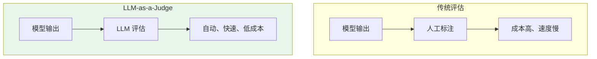
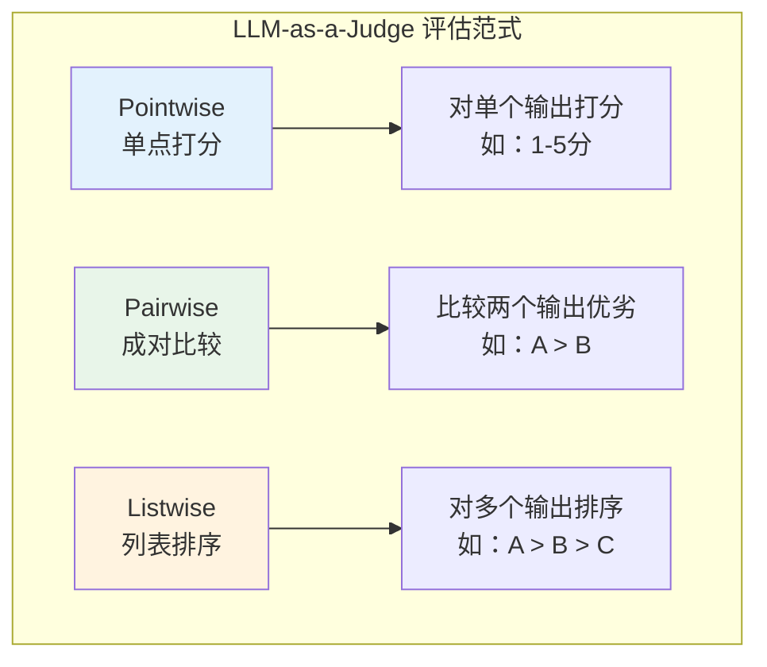
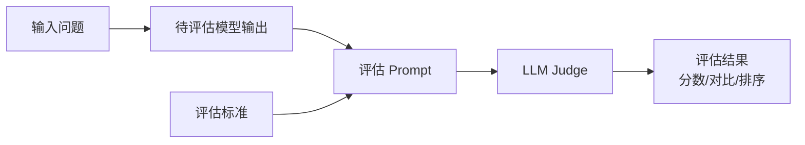
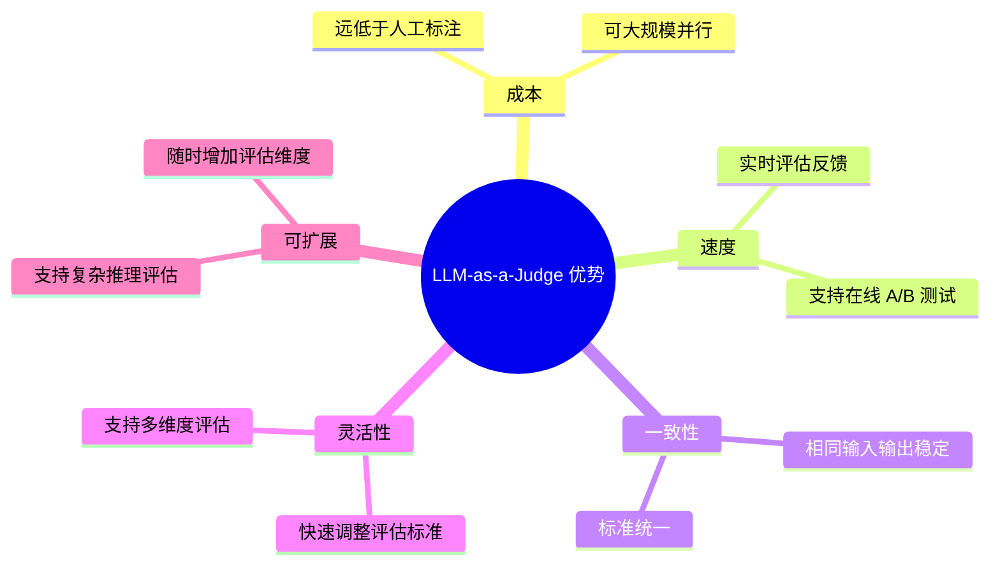
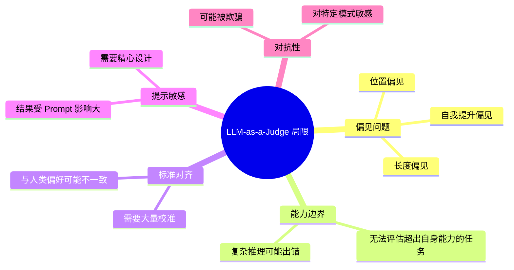
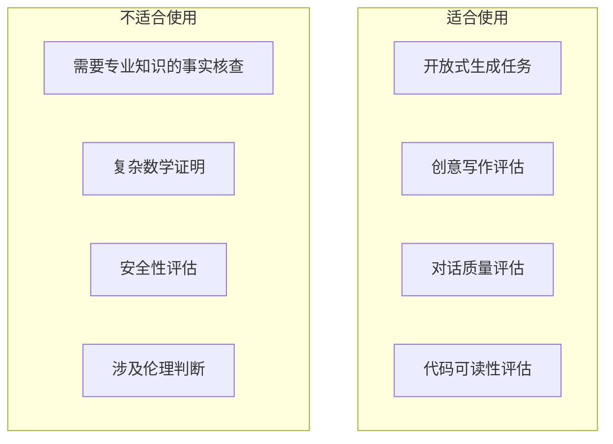
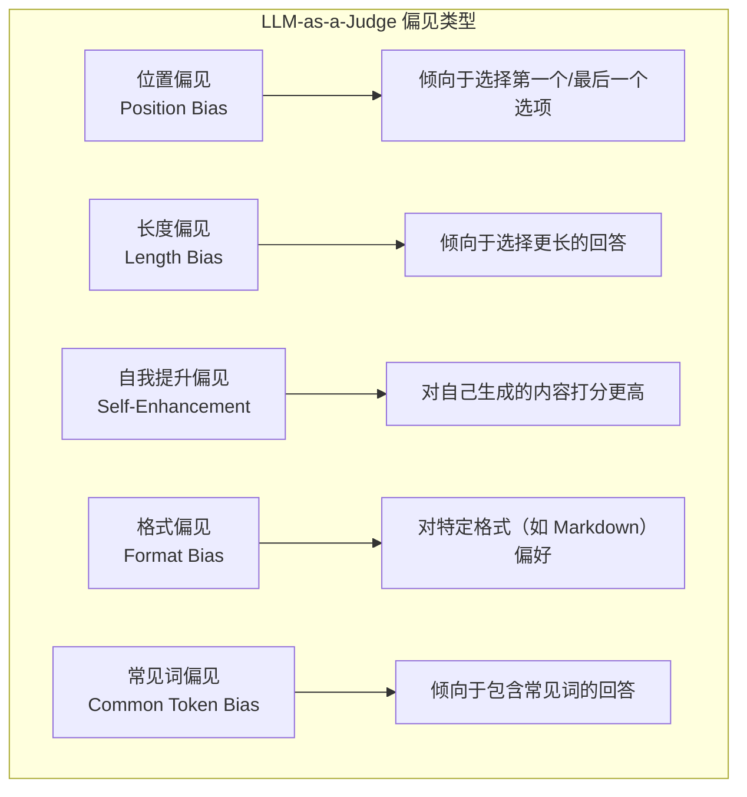
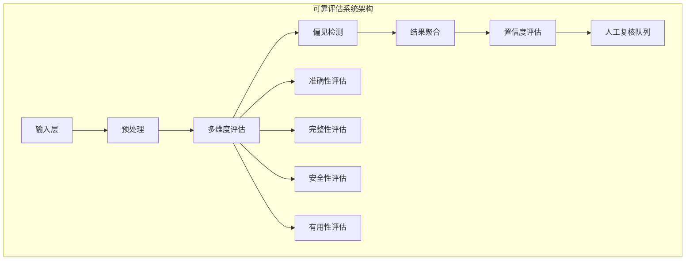
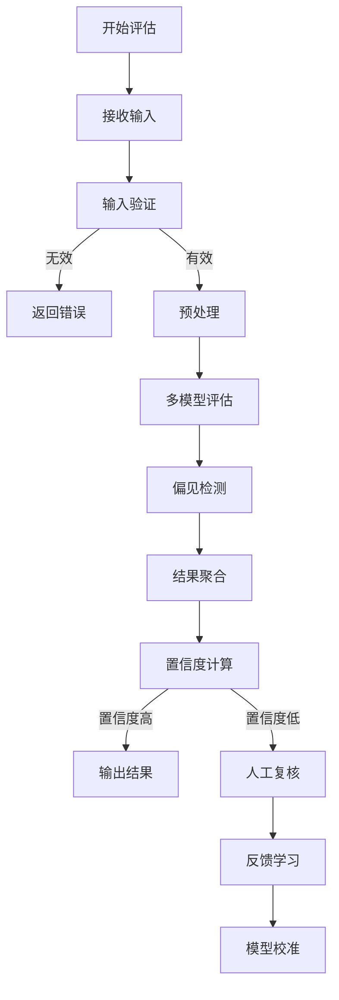

# LLM-as-a-Judge 详解

> 用大模型评估大模型：原理、方法、偏见与校准

---

## 一、概念与原理

### 1.1 什么是 LLM-as-a-Judge？

**LLM-as-a-Judge** 是指使用大语言模型（LLM）作为评估者，对其他模型的输出进行自动评估和打分的方法。



### 1.2 为什么需要 LLM-as-a-Judge？

**传统评估的挑战：**

| 挑战 | 说明 |
|------|------|
| **人工成本高** | 专业标注员费用昂贵 |
| **速度慢** | 人工评估无法实时反馈 |
| **一致性差** | 不同标注员标准不一 |
| **规模化难** | 难以处理海量评估需求 |

**LLM 评估的优势：**

| 优势 | 说明 |
|------|------|
| **成本低** | 调用 API 费用远低于人工 |
| **速度快** | 可并行处理大量样本 |
| **一致性好** | 相同输入输出稳定 |
| **易扩展** | 随时增加评估维度 |

### 1.3 评估范式



---

## 二、面试题详解

### 题目 1：LLM-as-a-Judge 的基本原理是什么？有哪些常用的评估范式？

#### 考察点
- LLM 评估原理
- 评估范式对比
- 适用场景

#### 详细解答

**基本原理：**



**核心思想：** 利用 LLM 的理解和推理能力，根据预设的评估标准对模型输出进行判断。

**三种评估范式对比：**

| 范式 | 输入 | 输出 | 适用场景 | 优点 | 缺点 |
|------|------|------|---------|------|------|
| **Pointwise** | 问题 + 单个回答 | 分数（1-5） | 绝对质量评估 | 直观、可量化 | 标准难统一 |
| **Pairwise** | 问题 + 两个回答 | A > B / B > A / 平 | 模型对比 | 相对判断更简单 | 无法传递性 |
| **Listwise** | 问题 + N 个回答 | 排序列表 | 多模型排名 | 全局最优 | 复杂度高 |

**Pointwise 示例：**

```
【评估 Prompt】
请评估以下回答的质量，从 1-5 分打分：

问题：什么是机器学习？
回答：机器学习是人工智能的一个分支，让计算机通过数据学习规律...

评估维度：
1. 准确性（是否事实正确）
2. 完整性（是否全面）
3. 清晰度（是否易懂）

请输出：{"score": 4, "reason": "..."}
```

**Pairwise 示例：**

```
【评估 Prompt】
请比较以下两个回答，判断哪个更好：

问题：解释什么是区块链

回答 A：区块链是一种分布式账本技术...
回答 B：区块链就是比特币背后的技术...

请输出：{"winner": "A", "reason": "回答 A 更全面准确..."}
```

**Java 伪代码：**

```java
/**
 * LLM-as-a-Judge 评估器
 * 
 * 核心思想：使用 LLM 自动评估模型输出质量
 */
public class LLMJudge {
    
    private final LLMClient llm;
    private final ObjectMapper objectMapper;
    
    /**
     * Pointwise 评估：单点打分
     */
    public PointwiseResult evaluatePointwise(String question, String answer, 
                                              EvaluationCriteria criteria) {
        // 构建评估 Prompt
        String prompt = buildPointwisePrompt(question, answer, criteria);
        
        // 调用 LLM 评估
        String response = llm.complete(prompt);
        
        // 解析结果
        return parsePointwiseResult(response);
    }
    
    /**
     * Pairwise 评估：成对比较
     */
    public PairwiseResult evaluatePairwise(String question, String answerA, 
                                            String answerB) {
        String prompt = buildPairwisePrompt(question, answerA, answerB);
        String response = llm.complete(prompt);
        return parsePairwiseResult(response);
    }
    
    /**
     * Listwise 评估：列表排序
     */
    public ListwiseResult evaluateListwise(String question, 
                                           List<String> answers) {
        String prompt = buildListwisePrompt(question, answers);
        String response = llm.complete(prompt);
        return parseListwiseResult(response);
    }
    
    /**
     * 构建 Pointwise Prompt
     */
    private String buildPointwisePrompt(String question, String answer, 
                                        EvaluationCriteria criteria) {
        return String.format("""
            你是一位专业的评估专家。请评估以下回答的质量。
            
            【问题】
            %s
            
            【回答】
            %s
            
            【评估维度】
            %s
            
            请以 JSON 格式输出评估结果：
            {
                "score": <1-5的整数>,
                "dimension_scores": {
                    "accuracy": <1-5>,
                    "completeness": <1-5>,
                    "clarity": <1-5>
                },
                "reason": "<评估理由>",
                "suggestions": "<改进建议>"
            }
            """, question, answer, criteria.toDescription());
    }
    
    /**
     * 构建 Pairwise Prompt
     */
    private String buildPairwisePrompt(String question, String answerA, 
                                       String answerB) {
        return String.format("""
            请比较以下两个回答，判断哪个更好。
            
            【问题】
            %s
            
            【回答 A】
            %s
            
            【回答 B】
            %s
            
            请从以下维度比较：
            1. 准确性：哪个回答更准确？
            2. 完整性：哪个回答更全面？
            3. 有用性：哪个回答对用户更有帮助？
            
            请以 JSON 格式输出：
            {
                "winner": "<A/B/tie>",
                "reason": "<详细理由>",
                "dimension_comparison": {
                    "accuracy": "<A/B/tie>",
                    "completeness": "<A/B/tie>",
                    "helpfulness": "<A/B/tie>"
                }
            }
            """, question, answerA, answerB);
    }
}

/**
 * 评估结果类
 */
@Data
class PointwiseResult {
    private int score;                          // 总分
    private Map<String, Integer> dimensionScores;  // 各维度分数
    private String reason;                      // 评估理由
    private String suggestions;                 // 改进建议
}

@Data
class PairwiseResult {
    private String winner;                      // A / B / tie
    private String reason;                      // 评估理由
    private Map<String, String> dimensionComparison;  // 各维度对比
}

@Data
class ListwiseResult {
    private List<Integer> ranking;              // 排序索引
    private Map<Integer, String> reasons;       // 各位置理由
}
```

---

### 题目 2：LLM-as-a-Judge 有哪些优势和局限性？

#### 考察点
- 优劣势分析
- 适用边界
- 工程实践认知

#### 详细解答

**优势：**



**详细优势：**

| 优势 | 说明 | 对比人工评估 |
|------|------|-------------|
| **成本低** | API 调用费用约 $0.001-0.01/样本 | 人工 $0.5-2/样本 |
| **速度快** | 毫秒级响应 | 人工分钟级 |
| **一致性好** | 相同输入输出 100% 一致 | 人工一致性 70-90% |
| **可扩展** | 随时增加新维度 | 需要重新培训标注员 |
| **复杂推理** | 可评估逻辑推理能力 | 需要专业标注员 |

**局限性：**



**详细局限：**

| 局限 | 说明 | 影响 |
|------|------|------|
| **位置偏见** | 倾向于选择第一个或最后一个选项 | 影响 Pairwise 评估准确性 |
| **长度偏见** | 倾向于选择更长的回答 | 可能偏好冗长而非精炼 |
| **自我提升** | 对自己生成的内容打分更高 | 影响公平性 |
| **能力边界** | 无法评估超出自身能力的任务 | 如数学证明、专业领域 |
| **提示敏感** | 结果严重依赖 Prompt 设计 | 需要大量实验调优 |

**适用边界：**



**Java 伪代码（偏见检测）：**

```java
/**
 * LLM-as-a-Judge 偏见检测与缓解
 */
public class JudgeBiasDetector {
    
    /**
     * 检测位置偏见
     * 方法：交换 A/B 位置，检查结果是否一致
     */
    public PositionBiasResult detectPositionBias(String question, 
                                                  String answerA, 
                                                  String answerB) {
        // 原始顺序评估
        PairwiseResult result1 = judge.evaluatePairwise(question, answerA, answerB);
        
        // 交换顺序评估
        PairwiseResult result2 = judge.evaluatePairwise(question, answerB, answerA);
        
        // 检查一致性
        boolean consistent = checkConsistency(result1, result2);
        
        return new PositionBiasResult(consistent, result1, result2);
    }
    
    /**
     * 检测长度偏见
     * 方法：比较不同长度回答的评分
     */
    public LengthBiasResult detectLengthBias(List<EvaluationSample> samples) {
        Map<Integer, Double> lengthScoreMap = new HashMap<>();
        
        for (EvaluationSample sample : samples) {
            int length = sample.getAnswer().length();
            double score = sample.getScore();
            
            // 按长度分组统计
            int lengthBucket = length / 100 * 100;  // 100字符分桶
            lengthScoreMap.merge(lengthBucket, score, Double::sum);
        }
        
        // 分析分数与长度的相关性
        double correlation = calculateCorrelation(lengthScoreMap);
        boolean hasBias = Math.abs(correlation) > 0.3;
        
        return new LengthBiasResult(hasBias, correlation, lengthScoreMap);
    }
    
    /**
     * 缓解位置偏见：随机打乱顺序
     */
    public PairwiseResult evaluateWithPositionDebias(String question, 
                                                      String answerA, 
                                                      String answerB) {
        // 随机决定顺序
        boolean swap = Math.random() < 0.5;
        String first = swap ? answerB : answerA;
        String second = swap ? answerA : answerB;
        
        PairwiseResult result = judge.evaluatePairwise(question, first, second);
        
        // 如果打乱了顺序，需要反转结果
        if (swap) {
            String winner = result.getWinner();
            if ("A".equals(winner)) {
                result.setWinner("B");
            } else if ("B".equals(winner)) {
                result.setWinner("A");
            }
        }
        
        return result;
    }
    
    /**
     * 自我提升偏见检测
     * 比较 LLM 对自己生成内容 vs 其他模型内容的评分
     */
    public SelfEnhancementBiasResult detectSelfEnhancementBias(
            List<EvaluationSample> selfGenerated,
            List<EvaluationSample> otherGenerated) {
        
        double selfAvgScore = selfGenerated.stream()
            .mapToDouble(EvaluationSample::getScore)
            .average()
            .orElse(0);
        
        double otherAvgScore = otherGenerated.stream()
            .mapToDouble(EvaluationSample::getScore)
            .average()
            .orElse(0);
        
        double bias = selfAvgScore - otherAvgScore;
        boolean hasBias = bias > 0.5;  // 阈值可调整
        
        return new SelfEnhancementBiasResult(hasBias, bias, selfAvgScore, otherAvgScore);
    }
}
```

---

### 题目 3：LLM-as-a-Judge 存在哪些偏见？如何检测和校准？

#### 考察点
- 偏见类型识别
- 检测方法
- 校准策略

#### 详细解答

**主要偏见类型：**



**1. 位置偏见（Position Bias）**

```
现象：
- 当 A 在前时，选择 A 的概率是 65%
- 当 B 在前时，选择 B 的概率是 60%

检测方法：
1. 准备 N 组样本
2. 每组分别按 AB 和 BA 顺序评估
3. 统计一致性

缓解策略：
- 随机打乱顺序
- 多次评估取平均
- 使用位置无关的 Prompt
```

**2. 长度偏见（Length Bias）**

```
现象：
- 长回答平均得分 4.2
- 短回答平均得分 3.5
- 即使短回答质量更高

检测方法：
- 计算回答长度与分数的相关系数
- 相关系数 > 0.3 认为存在偏见

缓解策略：
- 在 Prompt 中强调"简洁优先"
- 对长度进行归一化
- 训练时加入长度控制样本
```

**3. 自我提升偏见（Self-Enhancement Bias）**

```
现象：
- GPT-4 评估自己生成的内容：平均 4.3 分
- GPT-4 评估 Claude 生成的内容：平均 3.8 分
- 即使两者质量相当

检测方法：
- 让模型评估自己和竞争对手的输出
- 比较分数分布

缓解策略：
- 使用第三方模型评估
- 盲评（隐藏模型来源）
- 多模型投票
```

**偏见检测与校准方法：**

| 偏见类型 | 检测方法 | 校准策略 |
|---------|---------|---------|
| **位置偏见** | 交换顺序对比 | 随机顺序、多次平均 |
| **长度偏见** | 长度-分数相关性分析 | 长度归一化、强调简洁 |
| **自我提升** | 自评 vs 他评对比 | 盲评、第三方评估 |
| **格式偏见** | 不同格式对比测试 | 格式标准化 |
| **常见词偏见** | 罕见词回答评分分析 | 词汇多样性奖励 |

**Java 伪代码（校准框架）：**

```java
/**
 * LLM-as-a-Judge 校准框架
 */
public class JudgeCalibrator {
    
    private final LLMJudge judge;
    private CalibrationConfig config;
    
    /**
     * 系统偏见检测
     */
    public BiasReport detectSystematicBiases(List<TestSample> samples) {
        BiasReport report = new BiasReport();
        
        // 1. 位置偏见检测
        report.setPositionBias(detectPositionBias(samples));
        
        // 2. 长度偏见检测
        report.setLengthBias(detectLengthBias(samples));
        
        // 3. 格式偏见检测
        report.setFormatBias(detectFormatBias(samples));
        
        return report;
    }
    
    /**
     * 基于校准数据的分数调整
     */
    public double calibrateScore(double rawScore, SampleFeatures features) {
        double calibratedScore = rawScore;
        
        // 长度偏见校正
        if (config.isAdjustForLength()) {
            double lengthPenalty = calculateLengthPenalty(features.getLength());
            calibratedScore -= lengthPenalty;
        }
        
        // 格式偏见校正
        if (config.isAdjustForFormat()) {
            double formatBonus = calculateFormatBonus(features.getFormat());
            calibratedScore += formatBonus;
        }
        
        // 限制在有效范围
        return Math.max(1, Math.min(5, calibratedScore));
    }
    
    /**
     * 人类对齐校准
     * 使用人类标注数据训练校准模型
     */
    public void trainHumanAlignmentModel(List<HumanLabel> labels) {
        // 特征：LLM 评分、长度、格式、复杂度等
        // 目标：人类评分
        
        List<FeatureVector> features = new ArrayList<>();
        List<Double> humanScores = new ArrayList<>();
        
        for (HumanLabel label : labels) {
            FeatureVector fv = extractFeatures(label.getSample());
            features.add(fv);
            humanScores.add(label.getHumanScore());
        }
        
        // 训练线性回归或神经网络校准模型
        this.alignmentModel = trainRegressionModel(features, humanScores);
    }
    
    /**
     * 使用校准模型预测
     */
    public double predictHumanAlignedScore(Sample sample) {
        FeatureVector features = extractFeatures(sample);
        return alignmentModel.predict(features);
    }
    
    /**
     * 多模型集成评估（减少单一模型偏见）
     */
    public EnsembleResult ensembleEvaluate(String question, String answer,
                                           List<LLMJudge> judges) {
        List<Double> scores = new ArrayList<>();
        List<String> reasons = new ArrayList<>();
        
        for (LLMJudge j : judges) {
            PointwiseResult result = j.evaluatePointwise(question, answer, criteria);
            scores.add((double) result.getScore());
            reasons.add(result.getReason());
        }
        
        // 计算统计量
        double meanScore = scores.stream().mapToDouble(Double::doubleValue).average().orElse(0);
        double stdDev = calculateStdDev(scores);
        
        // 如果方差大，说明模型间分歧大，需要人工介入
        boolean needsHumanReview = stdDev > 1.0;
        
        return new EnsembleResult(meanScore, stdDev, scores, reasons, needsHumanReview);
    }
}

/**
 * 校准配置
 */
@Data
class CalibrationConfig {
    private boolean adjustForLength;      // 是否校正长度偏见
    private boolean adjustForFormat;      // 是否校正格式偏见
    private boolean adjustForPosition;    // 是否校正位置偏见
    private double lengthPenaltyFactor;   // 长度惩罚因子
}

/**
 * 偏见检测报告
 */
@Data
class BiasReport {
    private PositionBiasResult positionBias;
    private LengthBiasResult lengthBias;
    private FormatBiasResult formatBias;
    private boolean hasSignificantBias;
}
```

---

### 题目 4：如何设计一个可靠的 LLM-as-a-Judge 评估系统？

#### 考察点
- 系统设计能力
- 可靠性保障
- 工程实践

#### 详细解答

**可靠评估系统设计：**



**设计原则：**

| 原则 | 说明 | 实现方式 |
|------|------|---------|
| **多维度** | 不只看单一指标 | 准确性、完整性、安全性、有用性 |
| **多模型** | 不依赖单一 Judge | 3-5 个模型投票 |
| **偏见检测** | 自动识别偏见 | 位置、长度、格式检测 |
| **置信度** | 评估结果可信度 | 方差分析、一致性检查 |
| **可解释** | 结果可追溯 | 保留评估理由和证据 |
| **可校准** | 与人类对齐 | 定期用人工标注校准 |

**评估流程：**



**Java 伪代码（完整系统）：**

```java
/**
 * 可靠的 LLM-as-a-Judge 评估系统
 */
public class ReliableJudgeSystem {
    
    private final List<LLMJudge> judges;           // 多个评估模型
    private final BiasDetector biasDetector;       // 偏见检测器
    private final Calibrator calibrator;           // 校准器
    private final HumanReviewQueue reviewQueue;    // 人工复核队列
    
    /**
     * 执行可靠评估
     */
    public ReliableEvaluationResult evaluate(EvaluationRequest request) {
        // 1. 输入验证
        ValidationResult validation = validateInput(request);
        if (!validation.isValid()) {
            return ReliableEvaluationResult.error(validation.getErrors());
        }
        
        // 2. 预处理
        ProcessedInput processed = preprocess(request);
        
        // 3. 多模型评估
        List<EvaluationResult> modelResults = new ArrayList<>();
        for (LLMJudge judge : judges) {
            EvaluationResult result = judge.evaluate(processed);
            modelResults.add(result);
        }
        
        // 4. 偏见检测
        BiasReport biasReport = biasDetector.detect(modelResults);
        
        // 5. 结果聚合
        AggregatedResult aggregated = aggregateResults(modelResults, biasReport);
        
        // 6. 置信度评估
        ConfidenceScore confidence = calculateConfidence(aggregated, modelResults);
        
        // 7. 决定是否人工复核
        boolean needsHumanReview = shouldTriggerHumanReview(confidence, biasReport);
        
        if (needsHumanReview) {
            reviewQueue.submit(request, aggregated, confidence);
        }
        
        // 8. 应用校准
        CalibratedResult calibrated = calibrator.apply(aggregated);
        
        return new ReliableEvaluationResult(
            calibrated,
            confidence,
            biasReport,
            needsHumanReview
        );
    }
    
    /**
     * 结果聚合策略
     */
    private AggregatedResult aggregateResults(List<EvaluationResult> results, 
                                               BiasReport biasReport) {
        // 如果检测到位置偏见，使用去偏聚合
        if (biasReport.hasPositionBias()) {
            return aggregateWithPositionDebias(results);
        }
        
        // 默认：加权平均
        return aggregateWithWeightedAverage(results);
    }
    
    /**
     * 加权平均聚合
     */
    private AggregatedResult aggregateWithWeightedAverage(List<EvaluationResult> results) {
        Map<String, Double> weights = getJudgeWeights();  // 基于历史准确性
        
        double weightedScore = 0;
        double totalWeight = 0;
        
        for (EvaluationResult result : results) {
            double weight = weights.getOrDefault(result.getJudgeId(), 1.0);
            weightedScore += result.getScore() * weight;
            totalWeight += weight;
        }
        
        double finalScore = weightedScore / totalWeight;
        
        // 收集所有理由
        List<String> allReasons = results.stream()
            .map(EvaluationResult::getReason)
            .collect(Collectors.toList());
        
        return new AggregatedResult(finalScore, allReasons);
    }
    
    /**
     * 置信度计算
     */
    private ConfidenceScore calculateConfidence(AggregatedResult aggregated,
                                                 List<EvaluationResult> results) {
        List<Double> scores = results.stream()
            .map(r -> (double) r.getScore())
            .collect(Collectors.toList());
        
        // 计算方差
        double variance = calculateVariance(scores);
        double stdDev = Math.sqrt(variance);
        
        // 计算一致性（众数占比）
        double agreement = calculateAgreement(results);
        
        // 综合置信度
        double confidence = agreement * (1 - Math.min(1, stdDev / 2));
        
        return new ConfidenceScore(confidence, variance, agreement);
    }
    
    /**
     * 判断是否触发人工复核
     */
    private boolean shouldTriggerHumanReview(ConfidenceScore confidence, 
                                              BiasReport biasReport) {
        // 置信度低于阈值
        if (confidence.getScore() < 0.7) {
            return true;
        }
        
        // 检测到严重偏见
        if (biasReport.hasSignificantBias()) {
            return true;
        }
        
        // 方差过大（模型分歧严重）
        if (confidence.getVariance() > 1.5) {
            return true;
        }
        
        return false;
    }
}

/**
 * 评估请求
 */
@Data
class EvaluationRequest {
    private String question;
    private String answer;
    private EvaluationCriteria criteria;
    private Map<String, Object> metadata;
}

/**
 * 可靠评估结果
 */
@Data
class ReliableEvaluationResult {
    private CalibratedResult result;      // 校准后的结果
    private ConfidenceScore confidence;   // 置信度
    private BiasReport biasReport;        // 偏见报告
    private boolean needsHumanReview;     // 是否需要人工复核
    private List<String> warnings;        // 警告信息
}
```

---

## 三、延伸追问

### 追问 1：LLM-as-a-Judge 与人工评估的一致性如何？如何提升一致性？

**一致性水平：**

```
研究表明：
- GPT-4 与人类评估的一致性：70-85%
- 人类标注员之间的一致性：75-90%
- GPT-4 接近人类标注员水平
```

**提升一致性的方法：**

1. **Prompt 工程**
   - 提供详细的评估标准
   - 包含 Few-shot 示例
   - 使用结构化输出格式

2. **人类校准**
   - 用人工标注数据训练校准模型
   - 定期更新校准参数

3. **多模型投票**
   - 多个 Judge 模型投票
   - 减少单一模型的偏差

4. **迭代优化**
   - 分析不一致案例
   - 优化评估 Prompt

### 追问 2：LLM-as-a-Judge 在哪些场景下会失效？

**失效场景：**

| 场景 | 原因 | 替代方案 |
|------|------|---------|
| **专业领域事实核查** | 超出训练知识范围 | 领域专家评估 |
| **复杂数学证明** | 推理能力有限 | 形式化验证 |
| **安全性评估** | 可能遗漏安全风险 | 红队测试 |
| **伦理道德判断** | 价值观差异 | 多元利益相关者评估 |
| **多模态内容** | 纯文本模型无法处理 | 多模态模型评估 |

### 追问 3：如何评估 LLM-as-a-Judge 自身的质量？

**评估方法：**

1. **与人类对比**
   - 计算一致性指标（Cohen's Kappa）
   - 分析分歧案例

2. **对抗测试**
   - 构造边界案例
   - 测试偏见程度

3. **稳定性测试**
   - 相同输入多次评估
   - 检查输出方差

4. **校准度评估**
   - 预测分数与实际质量的对应关系
   - 可靠性图（Reliability Diagram）

---

## 四、总结

### 面试回答模板

> LLM-as-a-Judge 是使用大模型自动评估其他模型输出的方法，主要范式包括 Pointwise（单点打分）、Pairwise（成对比较）和 Listwise（列表排序）。
>
> **优势**：成本低、速度快、一致性好、易扩展。
> **局限**：存在位置偏见、长度偏见、自我提升偏见，能力有边界，提示敏感。
>
> **校准方法**：检测偏见（交换顺序、相关性分析）、人类对齐校准、多模型集成。
>
> **可靠系统设计**：多维度评估、多模型投票、偏见检测、置信度评估、人工复核机制。

### 一句话记忆

| 概念 | 一句话 |
|------|--------|
| **LLM-as-a-Judge** | 用大模型评估大模型，自动、快速、低成本 |
| **Pointwise** | 单点打分，适合绝对质量评估 |
| **Pairwise** | 成对比较，适合模型对比 |
| **位置偏见** | 倾向于选择第一个/最后一个选项 |
| **长度偏见** | 倾向于选择更长的回答 |
| **校准** | 让 LLM 评估与人类偏好对齐 |

---

> 💡 **提示**：LLM-as-a-Judge 是大模型时代的重要评估手段，理解其偏见和校准方法是面试重点。
