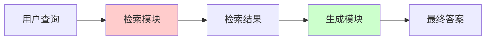
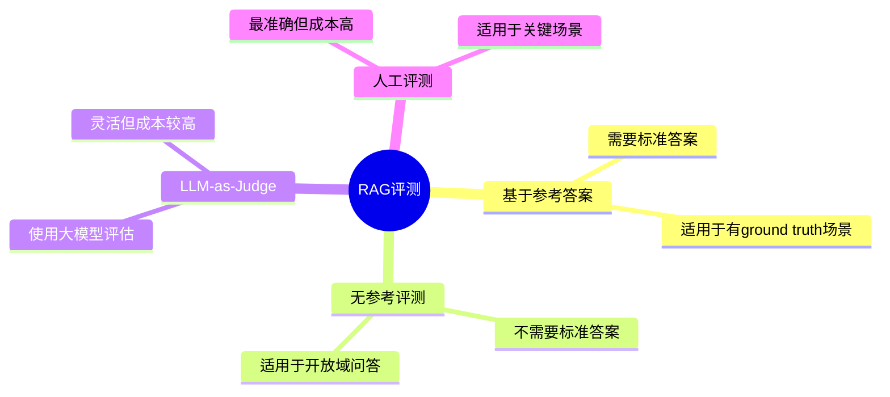
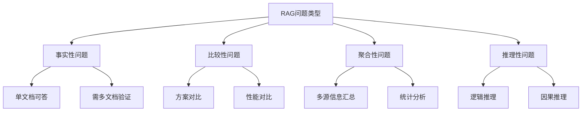

# RAG 评测指标

> 全面解析 RAG 系统的评测方法与指标体系

---

## 一、概念与原理

### 1.1 什么是 RAG 评测

RAG（Retrieval-Augmented Generation）评测是衡量检索增强生成系统质量的系统性方法。与单一 LLM 评测不同，RAG 评测需要同时关注**检索质量**和**生成质量**两个维度。



### 1.2 评测维度划分

| 维度 | 关注点 | 典型指标 |
|------|--------|----------|
| **检索质量** | 召回相关文档的能力 | Recall@K、MRR、NDCG |
| **生成质量** | 答案的准确性与有用性 | BLEU、ROUGE、BERTScore |
| **端到端质量** | 整体系统表现 | Answer Relevance、Faithfulness |
| **效率指标** | 系统性能 | 延迟、吞吐量、成本 |

### 1.3 评测方法分类



---

## 二、面试题详解

### 题目 1：RAG 系统有哪些核心评测维度？

**难度**：初级  
**考察点**：对 RAG 评测体系的整体理解

#### 详细解答

RAG 系统的评测需要从四个核心维度展开：

**1. 检索质量（Retrieval Quality）**

评估检索模块能否找到相关文档：
- **Recall@K**：Top-K 结果中相关文档的比例
- **Precision@K**：Top-K 结果中相关文档的精确率
- **MRR（Mean Reciprocal Rank）**：首个相关文档排名的倒数均值
- **NDCG（Normalized Discounted Cumulative Gain）**：考虑排序位置的加权指标

**2. 生成质量（Generation Quality）**

评估 LLM 生成答案的质量：
- **事实准确性**：答案是否与检索内容一致
- **完整性**：是否覆盖用户问题的所有方面
- **流畅性**：语言表达是否自然通顺
- **相关性**：是否直接回答用户问题

**3. 端到端质量（End-to-End Quality）**

评估整个 RAG 流程的输出：
- **Answer Relevance**：答案与问题的相关度
- **Context Relevance**：检索上下文与问题的相关度
- **Faithfulness**：答案对检索内容的忠实度
- **Answer Correctness**：答案的正确性

**4. 系统性能（System Performance）**

评估工程实现指标：
- **Latency**：端到端响应延迟
- **Throughput**：系统吞吐量
- **Cost**：每次查询的成本
- **Cache Hit Rate**：缓存命中率

#### Java 伪代码示例

```java
/**
 * RAG 评测框架核心类
 * 
 * 使用场景：对 RAG 系统进行多维度评测
 * 核心思想：分离检索评测和生成评测，支持组合评估
 */
public class RAGEvaluator {
    
    private final RetrieverEvaluator retrieverEval;
    private final GeneratorEvaluator generatorEval;
    private final EndToEndEvaluator e2eEval;
    
    /**
     * 执行完整评测
     * 
     * @param testCases 测试用例列表
     * @return 综合评测报告
     */
    public EvaluationReport evaluate(List<TestCase> testCases) {
        EvaluationReport report = new EvaluationReport();
        
        for (TestCase testCase : testCases) {
            // 1. 执行检索
            RetrieveResult retrieveResult = retriever.retrieve(testCase.getQuery());
            
            // 2. 评测检索质量
            RetrievalMetrics retrievalMetrics = retrieverEval.evaluate(
                retrieveResult, testCase.getGroundTruthDocs());
            report.addRetrievalMetrics(retrievalMetrics);
            
            // 3. 执行生成
            String answer = generator.generate(
                testCase.getQuery(), retrieveResult.getDocuments());
            
            // 4. 评测生成质量
            GenerationMetrics genMetrics = generatorEval.evaluate(
                answer, testCase.getGroundTruthAnswer());
            report.addGenerationMetrics(genMetrics);
            
            // 5. 端到端评测
            EndToEndMetrics e2eMetrics = e2eEval.evaluate(
                testCase.getQuery(), answer, retrieveResult.getDocuments());
            report.addEndToEndMetrics(e2eMetrics);
        }
        
        return report.aggregate();
    }
}
```

---

### 题目 2：解释 RAGAS 框架中的四个核心指标

**难度**：中级  
**考察点**：对 RAGAS 评测框架的理解

#### 详细解答

RAGAS（Retrieval-Augmented Generation Assessment）是专门为 RAG 系统设计的无参考评测框架，包含四个核心指标：

**1. Faithfulness（忠实度）**

衡量生成答案是否忠实于检索到的上下文，检测幻觉。

计算公式：
```
Faithfulness = |可验证的陈述数| / |总陈述数|
```

评估方法：
- 将答案拆分为独立陈述
- 检查每个陈述是否能从上下文中推断
- 使用 LLM 进行自动验证

**2. Answer Relevancy（答案相关性）**

衡量答案与问题的相关程度。

评估方法：
- 根据答案生成潜在问题
- 计算生成问题与原始问题的相似度
- 使用嵌入向量计算语义相似度

**3. Context Relevancy（上下文相关性）**

衡量检索到的上下文与问题的相关程度。

计算公式：
```
Context Relevancy = |相关句子数| / |总句子数|
```

**4. Context Recall（上下文召回率）**

衡量检索上下文是否包含回答问题的所有必要信息。

评估方法（需要参考答案）：
- 将参考答案拆分为陈述
- 检查每个陈述是否能从上下文中推断
- 计算可推断陈述的比例

#### 指标对比表

| 指标 | 是否需要参考答案 | 评测对象 | 主要用途 |
|------|------------------|----------|----------|
| Faithfulness | 否 | 生成答案 | 检测幻觉 |
| Answer Relevancy | 否 | 生成答案 | 评估相关性 |
| Context Relevancy | 否 | 检索结果 | 评估检索质量 |
| Context Recall | 是 | 检索结果 | 评估召回能力 |

#### Java 伪代码示例

```java
/**
 * RAGAS 评测器实现
 * 
 * 使用场景：无参考场景下的 RAG 系统评测
 * 核心思想：利用 LLM 进行自动化指标计算
 */
public class RAGASEvaluator {
    
    private final LLMClient llmClient;
    private final EmbeddingClient embeddingClient;
    
    /**
     * 计算 Faithfulness（忠实度）
     * 
     * 步骤：
     * 1. 从答案中提取陈述
     * 2. 验证每个陈述是否能从上下文中推断
     * 3. 计算比例
     */
    public double calculateFaithfulness(String answer, List<String> contexts) {
        // 1. 提取陈述
        List<String> statements = extractStatements(answer);
        
        // 2. 验证每个陈述
        int verifiedCount = 0;
        String contextText = String.join("\n", contexts);
        
        for (String statement : statements) {
            String prompt = buildVerificationPrompt(statement, contextText);
            String verdict = llmClient.generate(prompt);
            if (verdict.trim().equalsIgnoreCase("YES")) {
                verifiedCount++;
            }
        }
        
        // 3. 返回忠实度分数
        return statements.isEmpty() ? 0.0 : 
               (double) verifiedCount / statements.size();
    }
    
    /**
     * 计算 Answer Relevancy（答案相关性）
     * 
     * 步骤：
     * 1. 根据答案生成潜在问题
     * 2. 计算与原始问题的相似度
     */
    public double calculateAnswerRelevancy(String question, String answer) {
        // 1. 生成潜在问题
        String genPrompt = "根据以下答案，生成3个可能的问题：\n" + answer;
        String generatedQuestions = llmClient.generate(genPrompt);
        List<String> questions = parseQuestions(generatedQuestions);
        
        // 2. 计算嵌入相似度
        double totalSimilarity = 0;
        float[] questionEmbedding = embeddingClient.embed(question);
        
        for (String genQuestion : questions) {
            float[] genEmbedding = embeddingClient.embed(genQuestion);
            totalSimilarity += cosineSimilarity(questionEmbedding, genEmbedding);
        }
        
        return totalSimilarity / questions.size();
    }
    
    /**
     * 计算 Context Relevancy（上下文相关性）
     */
    public double calculateContextRelevancy(String question, List<String> contexts) {
        int relevantSentences = 0;
        int totalSentences = 0;
        
        for (String context : contexts) {
            List<String> sentences = splitIntoSentences(context);
            totalSentences += sentences.size();
            
            for (String sentence : sentences) {
                String prompt = buildRelevancePrompt(question, sentence);
                String verdict = llmClient.generate(prompt);
                if (verdict.trim().equalsIgnoreCase("RELEVANT")) {
                    relevantSentences++;
                }
            }
        }
        
        return totalSentences == 0 ? 0.0 : 
               (double) relevantSentences / totalSentences;
    }
}
```

---

### 题目 3：如何设计一个完整的 RAG 评测数据集？

**难度**：高级  
**考察点**：工程实践能力，评测体系设计

#### 详细解答

设计 RAG 评测数据集需要考虑数据质量、覆盖度和实用性三个维度。

**1. 数据集构成要素**

一个完整的 RAG 评测数据集应包含：

| 字段 | 说明 | 示例 |
|------|------|------|
| query | 用户问题 | "什么是向量数据库？" |
| ground_truth_docs | 相关文档ID列表 | ["doc_001", "doc_015"] |
| ground_truth_answer | 标准答案 | "向量数据库是一种..." |
| query_type | 问题类型 | factoid/comparison/aggregative |
| difficulty | 难度等级 | easy/medium/hard |
| domain | 领域标签 | tech/medical/legal |

**2. 问题类型设计**



**3. 数据构建流程**

```
1. 文档收集 → 2. 问题生成 → 3. 答案标注 → 4. 质量验证 → 5. 数据集发布
```

**问题生成策略**：
- **人工标注**：质量最高但成本高
- **LLM 辅助生成**：使用 Prompt 引导 LLM 基于文档生成问题
- **真实用户查询**：收集实际业务场景中的问题

**4. 质量验证方法**

- **一致性检查**：同一问题多次标注的一致性
- **难度分级**：根据所需文档数量和推理复杂度分级
- **覆盖率检查**：确保覆盖所有文档类型和主题

#### Java 伪代码示例

```java
/**
 * RAG 评测数据集构建器
 * 
 * 使用场景：自动化构建 RAG 评测数据集
 * 核心思想：结合 LLM 生成和人工校验
 */
public class RAGEvaluationDatasetBuilder {
    
    private final LLMClient llmClient;
    private final DocumentCorpus corpus;
    
    /**
     * 基于文档生成评测样本
     * 
     * @param document 源文档
     * @param numQuestions 生成问题数量
     * @return 评测样本列表
     */
    public List<EvaluationSample> generateSamples(
            Document document, int numQuestions) {
        
        List<EvaluationSample> samples = new ArrayList<>();
        
        // 1. 生成问题
        String prompt = buildQuestionGenerationPrompt(document.getContent(), numQuestions);
        String generated = llmClient.generate(prompt);
        List<QuestionCandidate> candidates = parseGeneratedQuestions(generated);
        
        for (QuestionCandidate candidate : candidates) {
            // 2. 生成答案
            String answerPrompt = buildAnswerPrompt(
                candidate.getQuestion(), document.getContent());
            String answer = llmClient.generate(answerPrompt);
            
            // 3. 确定问题类型和难度
            QueryType queryType = classifyQueryType(candidate.getQuestion());
            Difficulty difficulty = assessDifficulty(
                candidate.getQuestion(), document.getContent());
            
            // 4. 构建样本
            EvaluationSample sample = EvaluationSample.builder()
                .query(candidate.getQuestion())
                .groundTruthDocs(Collections.singletonList(document.getId()))
                .groundTruthAnswer(answer)
                .queryType(queryType)
                .difficulty(difficulty)
                .domain(document.getDomain())
                .build();
            
            samples.add(sample);
        }
        
        return samples;
    }
    
    /**
     * 数据集质量验证
     */
    public ValidationReport validateDataset(List<EvaluationSample> dataset) {
        ValidationReport report = new ValidationReport();
        
        // 1. 检查答案一致性
        for (EvaluationSample sample : dataset) {
            ConsistencyScore score = checkAnswerConsistency(sample);
            report.addConsistencyScore(score);
        }
        
        // 2. 检查覆盖率
        CoverageMetrics coverage = calculateCoverage(dataset, corpus);
        report.setCoverageMetrics(coverage);
        
        // 3. 难度分布
        Map<Difficulty, Long> difficultyDist = dataset.stream()
            .collect(Collectors.groupingBy(
                EvaluationSample::getDifficulty, Collectors.counting()));
        report.setDifficultyDistribution(difficultyDist);
        
        return report;
    }
    
    private QueryType classifyQueryType(String question) {
        String prompt = "判断以下问题类型（factoid/comparison/aggregative/reasoning）：\n" + question;
        String result = llmClient.generate(prompt);
        return QueryType.fromString(result.trim());
    }
    
    private Difficulty assessDifficulty(String question, String context) {
        // 基于问题长度、所需推理步骤等评估难度
        int reasoningSteps = estimateReasoningSteps(question, context);
        if (reasoningSteps <= 1) return Difficulty.EASY;
        if (reasoningSteps <= 3) return Difficulty.MEDIUM;
        return Difficulty.HARD;
    }
}

/**
 * 评测样本数据类
 */
@Data
@Builder
public class EvaluationSample {
    private String query;
    private List<String> groundTruthDocs;
    private String groundTruthAnswer;
    private QueryType queryType;
    private Difficulty difficulty;
    private String domain;
}

enum QueryType {
    FACTOID, COMPARISON, AGGREGATIVE, REASONING
}

enum Difficulty {
    EASY, MEDIUM, HARD
}
```

---

## 三、延伸追问

### 追问 1：RAGAS 指标和传统 NLP 指标（BLEU、ROUGE）有什么区别？

**简要答案**：
- **BLEU/ROUGE**：基于 n-gram 匹配，需要参考答案，关注词汇重叠
- **RAGAS**：基于语义理解，部分指标无需参考答案，关注事实忠实度和相关性
- **适用场景**：BLEU 适合机器翻译；RAGAS 更适合 RAG 的事实性评估

### 追问 2：如何处理 RAG 评测中的边界情况（如检索不到相关文档）？

**简要答案**：
1. **定义明确行为**：系统应返回"无法找到相关信息"而非编造答案
2. **单独评测**：将"无相关文档"情况作为特殊测试用例
3. **指标调整**：Faithfulness 在这种场景下应接近 1（模型诚实承认不知道）
4. **Fallback 机制**：评测系统是否有合理的降级策略

### 追问 3：在实际生产中，如何持续监控 RAG 系统质量？

**简要答案**：
1. **在线指标**：延迟、错误率、用户反馈（👍/👎）
2. **离线评测**：定期用评测集跑批处理
3. **A/B 测试**：新旧版本对比
4. **人工抽检**：关键场景人工审核
5. **用户满意度**：NPS、CSAT 调研

---

## 四、总结

### 面试回答模板

> RAG 评测需要从**检索质量**、**生成质量**、**端到端质量**和**系统性能**四个维度展开。常用指标包括传统的 Recall@K、Precision，以及 RAGAS 框架的 Faithfulness、Answer Relevancy 等。RAGAS 的优势在于无需参考答案即可评估，特别适合开放域场景。

### 一句话记忆

| 概念 | 一句话 |
|------|--------|
| **Faithfulness** | 答案是否忠于检索内容，检测幻觉的关键指标 |
| **RAGAS** | 专为 RAG 设计的无参考评测框架，四大指标覆盖忠实度、相关性和召回 |
| **Context Recall** | 检索是否找回了回答问题的全部必要信息 |

### 核心要点速查

```
检索评测：Recall@K、MRR、NDCG
生成评测：BLEU、ROUGE、BERTScore
端到端：Faithfulness、Relevancy、Correctness
RAGAS：无参考、LLM-as-Judge、四维度
```

---

> 💡 **提示**：RAG 评测是一个快速发展的领域，建议关注最新的研究进展，如 DeepEval、TruLens 等新兴评测框架。
