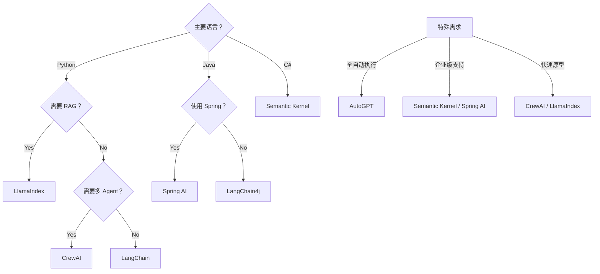
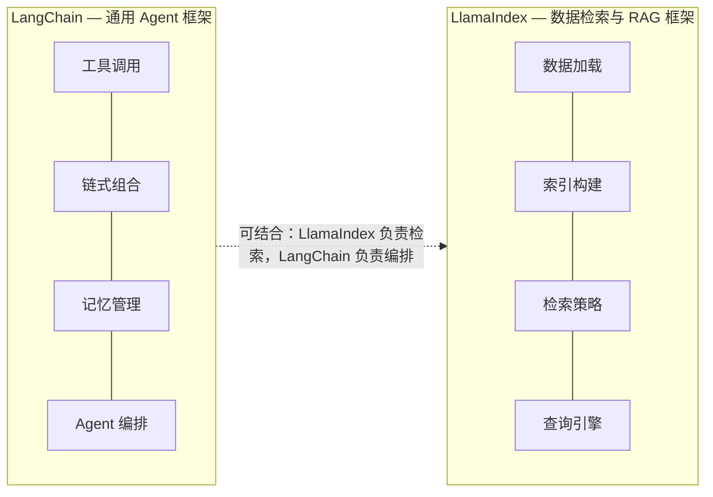
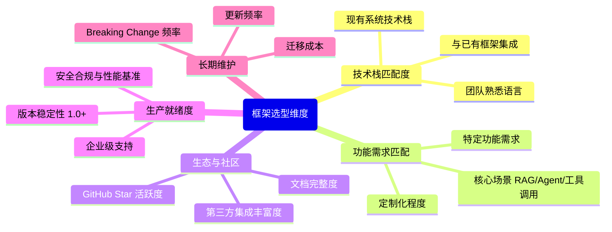

# AI Agent 开发框架

主流 Agent 开发框架对比、选型决策树与面试题详解。

## 内容索引

| 章节 | 内容 |
|------|------|
| [一、主流框架对比](#一主流框架对比) | 8 大框架特点与适用场景 |
| [二、框架选择决策树](#二框架选择决策树) | 按语言和场景快速选型 |
| [三、核心概念对比](#三核心概念对比) | 组件抽象与代码风格 |
| [四、面试题详解](#四面试题详解) | LangChain vs LlamaIndex、选型维度分析 |
| [五、延伸追问](#五延伸追问) | Chain vs Agent、性能、扩展性 |

---

## 一、主流框架对比

| 框架 | 语言 | 特点 | 适用场景 | 学习曲线 |
|------|------|------|----------|----------|
| **LangChain** | Python/JS | 生态最丰富，组件化设计 | 通用 Agent 开发 | 中等 |
| **LlamaIndex** | Python | 专注 RAG，数据检索强 | 知识库问答 | 低 |
| **AutoGPT** | Python | 全自动执行，目标驱动 | 自主任务执行 | 中等 |
| **CrewAI** | Python | 多 Agent 协作框架 | 团队协作场景 | 低 |
| **Semantic Kernel** | C#/Python/Java | 微软出品，企业级 | 企业应用 | 中等 |
| **Spring AI** | Java | Spring 生态集成 | Java 企业开发 | 低（会 Spring） |
| **LangChain4j** | Java | LangChain Java 移植 | Java 开发者 | 中等 |
| **OpenClaw** | 多语言 | 个人自动化助手 | 日常自动化 | 低 |

## 二、框架选择决策树



## 三、核心概念对比

### 3.1 组件抽象

| 概念 | LangChain | LlamaIndex | Spring AI |
|------|-----------|------------|-----------|
| **模型封装** | LLM / ChatModel | LLM | ChatClient |
| **提示模板** | PromptTemplate | Prompt | PromptTemplate |
| **工具** | Tool / Function | Tool | FunctionCallback |
| **记忆** | Memory | ChatMemory | Memory |
| **链** | Chain | QueryEngine | Chain |
| **索引** | VectorStore | Index | VectorStore |

### 3.2 代码风格对比

**LangChain (Python):**
```python
from langchain import OpenAI, LLMChain, PromptTemplate
from langchain.memory import ConversationBufferMemory

template = """{history}
Human: {input}
AI:"""

prompt = PromptTemplate(
    input_variables=["history", "input"],
    template=template
)

memory = ConversationBufferMemory()
llm = OpenAI()
chain = LLMChain(llm=llm, prompt=prompt, memory=memory)

result = chain.predict(input="Hello")
```

**Spring AI (Java):**
```java
@Bean
ChatClient chatClient(ChatClient.Builder builder) {
    return builder
        .defaultSystem("You are a helpful assistant")
        .defaultAdvisors(
            new MessageChatMemoryAdvisor(new InMemoryChatMemory())
        )
        .build();
}

// 使用
String response = chatClient.prompt()
    .user("Hello")
    .call()
    .content();
```

## 四、面试题详解

### 题目 1：LangChain 和 LlamaIndex 的核心区别是什么？什么时候选哪个？

#### 考察点
- 框架定位理解
- 技术选型能力
- 场景分析

#### 详细解答

**核心定位差异：**



**选择建议：**

| 场景 | 推荐框架 | 原因 |
|------|----------|------|
| 需要调用多种工具 | LangChain | 工具生态更丰富 |
| 主要做文档问答 | LlamaIndex | 检索能力更强 |
| 复杂 Agent 编排 | LangChain | Chain 和 Agent 抽象更完善 |
| 大规模数据索引 | LlamaIndex | 索引优化更好 |
| 两者都需要 | 两者结合 | LlamaIndex 做检索，LangChain 做编排 |

**结合使用示例：**

```python
from llama_index import VectorStoreIndex, SimpleDirectoryReader
from langchain.agents import Tool, AgentExecutor
from langchain import OpenAI

# LlamaIndex 负责检索
documents = SimpleDirectoryReader('data').load_data()
index = VectorStoreIndex.from_documents(documents)
query_engine = index.as_query_engine()

# LangChain 负责 Agent 编排
tools = [
    Tool(
        name="DocumentSearch",
        func=lambda q: query_engine.query(q),
        description="搜索文档知识库"
    )
]

agent = initialize_agent(tools, OpenAI(), agent="zero-shot-react-description")
```

---

### 题目 2：如何选择合适的 Agent 框架？需要考虑哪些因素？

#### 考察点
- 系统性思考
- 技术评估能力
- 工程实践经验

#### 详细解答

**选型维度：**



**评分表示例：**

| 维度 | LangChain | LlamaIndex | Spring AI | 权重 |
|------|-----------|------------|-----------|------|
| 功能匹配 | 9 | 7 | 8 | 30% |
| 技术栈 | 6 | 6 | 10 | 25% |
| 生态社区 | 10 | 8 | 6 | 20% |
| 生产就绪 | 7 | 8 | 9 | 15% |
| 长期维护 | 8 | 8 | 9 | 10% |
| **加权总分** | **8.1** | **7.3** | **8.6** | - |

---

## 五、延伸追问

1. **"LangChain 的 Chain 和 Agent 有什么区别？"**
   - Chain：固定的执行流程，输入→处理→输出
   - Agent：动态决策，根据输入决定调用哪些工具

2. **"框架的抽象层会不会带来性能损耗？"**
   - 会有一定开销，但通常不是瓶颈
   - 主要开销在 LLM 调用，框架开销可忽略
   - 极端性能场景可以考虑直接调用 API

3. **"如果框架不满足需求，如何扩展？"**
   - 大多数框架都支持自定义组件
   - 可以继承基类实现自己的 Tool/Chain/Agent
   - 或者直接调用底层 API
