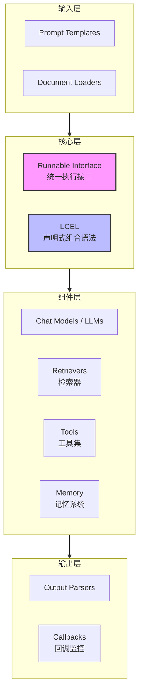
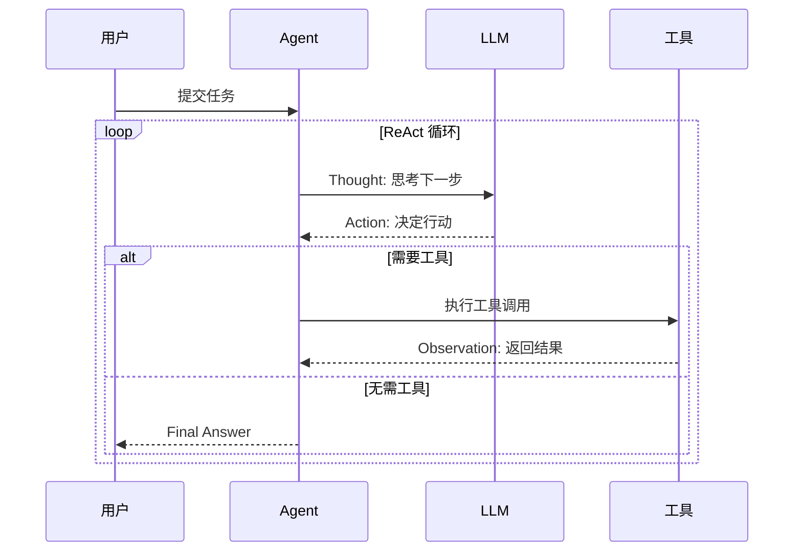

# LangChain 深度解析

> 全面解析 LangChain 框架的核心架构、设计原理与工程实践

---

## 一、概念与原理

### 1.1 LangChain 是什么

LangChain 是一个用于开发 LLM 应用的 Python/JS 框架，提供模块化组件来构建复杂的 AI 应用。其核心设计哲学是**"可组合性"**——通过原子化组件的灵活组合，实现从简单 Prompt 到复杂 Agent 系统的各种应用场景。

### 1.2 核心架构



### 1.3 核心组件详解

| 组件 | 职责 | 关键类/接口 | 使用场景 |
|------|------|-------------|----------|
| **Chat Models** | 封装 LLM 调用 | `BaseChatModel`, `ChatOpenAI` | 对话、文本生成 |
| **Prompt Templates** | 模板化 Prompt 管理 | `ChatPromptTemplate` | 动态参数注入 |
| **Output Parsers** | 结构化输出解析 | `StrOutputParser`, `JsonOutputParser` | JSON/结构化提取 |
| **Document Loaders** | 数据源接入 | `PyPDFLoader`, `WebBaseLoader` | RAG 文档加载 |
| **Text Splitters** | 文档分块 | `RecursiveCharacterTextSplitter` | 长文档处理 |
| **Embeddings** | 文本向量化 | `OpenAIEmbeddings` | 语义检索 |
| **Vector Stores** | 向量存储 | `Chroma`, `FAISS` | 相似度搜索 |
| **Retrievers** | 检索逻辑封装 | `VectorStoreRetriever` | 上下文获取 |
| **Tools** | 外部工具封装 | `BaseTool`, `@tool` 装饰器 | Agent 工具调用 |
| **Memory** | 对话历史管理 | `ConversationBufferMemory` | 多轮对话 |
| **Chains** | 组件组合执行 | `LLMChain`, `RetrievalQA` | 工作流编排 |
| **Agents** | 自主决策执行 | `AgentExecutor`, `create_react_agent` | 复杂任务处理 |

### 1.4 Runnable 与 LCEL

**Runnable 接口**是 LangChain 的核心抽象：

```python
# Runnable 核心方法
interface Runnable {
    invoke(input) -> output        # 同步调用
    batch(inputs) -> outputs       # 批量处理
    stream(input) -> Iterator      # 流式输出
    ainvoke(input) -> output       # 异步调用
}
```

**LCEL** 是声明式组合语法：

```python
chain = (
    PromptTemplate.from_template("回答: {question}") 
    | ChatOpenAI() 
    | StrOutputParser()
)
```

### 1.5 Agent 执行流程



---

## 二、面试题详解

### 题目 1（初级）：Runnable 接口是什么？解决了什么问题？

**考察点**：核心架构理解、接口抽象、统一调用方式

**解答**：

Runnable 是 LangChain 的核心抽象，定义统一执行契约：
- **标准化**：所有组件实现相同接口
- **统一方法**：`invoke()`、`batch()`、`stream()`、`ainvoke()`
- **可组合**：通过 `|` 操作符链式组合

**解决的问题**：
1. 调用方式混乱（`predict()`、`run()` 等不统一）
2. 组件难以无缝衔接
3. 流式/异步支持不一致

```java
public interface Runnable<Input, Output> {
    Output invoke(Input input);
    List<Output> batch(List<Input> inputs);
    Iterator<Output> stream(Input input);
    
    default <NextOutput> Runnable<Input, NextOutput> andThen(
            Runnable<Output, NextOutput> next) {
        return input -> next.invoke(this.invoke(input));
    }
}
```

---

### 题目 2（中级）：LCEL 与传统 Chain 写法的对比

**考察点**：声明式编程、代码可维护性、运行时特性

**对比**：

| 维度 | 传统 Chain | LCEL |
|------|-----------|------|
| 写法 | 命令式，显式步骤 | 声明式，管道组合 |
| 可读性 | 步骤分散 | 流程清晰 |
| 流式支持 | 需额外实现 | 自动支持 |
| 异步支持 | 需额外实现 | 自动支持 |
| 调试 | 需跟踪各步骤 | 内置回调追踪 |

```java
// LCEL 风格 - 声明式
Runnable<Map<String, Object>, String> chain = 
    promptTemplate
        .andThen(chatModel)
        .andThen(outputParser);

// 使用
String result = chain.invoke(Map.of("question", "什么是RAG?"));
```

---

### 题目 3（中级）：ReAct Agent 的执行流程

**考察点**：Agent 架构、ReAct 范式、Tool 调用

**核心组件**：
1. **Agent**: 决策大脑，决定下一步 Action
2. **Tools**: 可用工具集
3. **AgentExecutor**: 执行循环

**执行流程**：
1. Thought → 2. Action → 3. Observation → 循环直到 Final Answer

```java
public class ReActAgent {
    private ChatOpenAI llm;
    private List<Tool> tools;
    private int maxIterations = 10;
    
    public String execute(String task) {
        StringBuilder scratchpad = new StringBuilder();
        
        for (int i = 0; i < maxIterations; i++) {
            // Thought: LLM 思考
            String prompt = buildPrompt(task, scratchpad.toString());
            String output = llm.invoke(prompt);
            
            // 解析 Action
            Action action = parseAction(output);
            if (action.isFinalAnswer()) {
                return action.getAnswer();
            }
            
            // 执行 Tool
            Tool tool = findTool(action.getToolName());
            String observation = tool.execute(action.getToolInput());
            
            // 更新 scratchpad
            scratchpad.append(formatStep(action, observation));
        }
        return "达到最大迭代次数";
    }
}
```

---

### 题目 4（高级）：如何设计一个支持流式输出的 RAG Chain？

**考察点**：流式架构、RAG 实现、性能优化

**设计要点**：
1. **文档加载与分块**：使用递归字符分割器
2. **向量化存储**：Embedding + VectorStore
3. **检索增强**：相似度搜索获取上下文
4. **流式生成**：逐 token 返回，提升用户体验

```java
/**
 * 流式 RAG Chain 实现
 */
public class StreamingRAGChain implements Runnable<String, Iterator<String>> {
    
    private VectorStore vectorStore;
    private ChatOpenAI llm;
    private int topK = 4;
    
    @Override
    public Iterator<String> stream(String question) {
        // 1. 检索相关文档
        List<Document> docs = vectorStore.similaritySearch(question, topK);
        String context = formatDocuments(docs);
        
        // 2. 构建 Prompt
        String prompt = buildRAGPrompt(context, question);
        
        // 3. 流式调用 LLM
        return llm.stream(prompt);
    }
    
    private String buildRAGPrompt(String context, String question) {
        return String.format("""
            基于以下上下文回答问题：
            
            上下文：
            %s
            
            问题：%s
            
            请基于上下文回答，如果上下文不包含答案，请说"我不知道"。
            """, context, question);
    }
}
```

---

## 三、延伸追问

### 追问 1：LangChain 的 Memory 是如何工作的？有哪些类型？

**简要答案**：
- **BufferMemory**: 保存完整对话历史
- **BufferWindowMemory**: 只保留最近 k 轮对话
- **SummaryMemory**: 用 LLM 总结历史，节省 token
- **VectorStoreMemory**: 将历史向量化存储，支持语义检索

### 追问 2：LangChain 的 Tool 如何定义？Agent 如何选择 Tool？

**简要答案**：
- Tool 通过 `@tool` 装饰器或继承 `BaseTool` 定义
- Agent 通过 LLM 生成 Action，包含 tool name 和 input
- 使用 `ToolBinding` 将工具描述注入 Prompt，让 LLM 自主选择

### 追问 3：LangChain 的 Callback 系统有什么作用？

**简要答案**：
- 监控链执行过程（日志、追踪）
- 实现流式输出的 token 级回调
- 集成 LangSmith 进行调试和评估
- 支持自定义回调处理（如计费统计）

---

## 四、总结

### 面试回答模板

> LangChain 是一个 LLM 应用开发框架，核心设计是**可组合性**。它通过 **Runnable** 接口统一所有组件的调用方式，使用 **LCEL** 声明式语法组合链式流程。主要组件包括：Chat Models（模型封装）、Prompt Templates（模板管理）、Document Loaders（数据接入）、Vector Stores（向量存储）、Retrievers（检索逻辑）、Tools（外部工具）、Memory（对话记忆）、Chains（流程编排）、Agents（自主决策）。
> 
> Agent 采用 **ReAct** 范式，通过 Thought→Action→Observation 循环完成任务。框架的优势在于组件标准化、流式/异步自动支持、调试追踪完善。

### 一句话记忆

| 概念 | 一句话 |
|------|--------|
| **Runnable** | 统一接口，让所有组件用同一种方式调用和组合 |
| **LCEL** | 声明式管道语法，让复杂链路的构建像搭积木一样简单 |
| **Agent** | 让 LLM 拥有"手"，可以调用工具完成复杂任务 |
| **RAG** | 给 LLM 装上"外脑"，基于私有知识回答问题 |

---

## 参考文档

- [LangChain 官方文档](https://python.langchain.com/)
- [LCEL 概念指南](https://python.langchain.com/docs/concepts/lcel)
- [Runnable 接口规范](https://python.langchain.com/docs/concepts/runnables)
