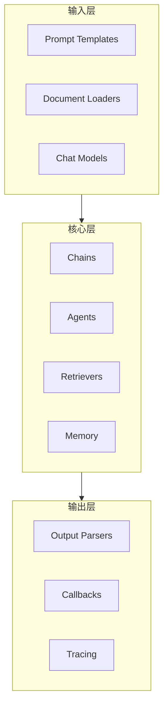
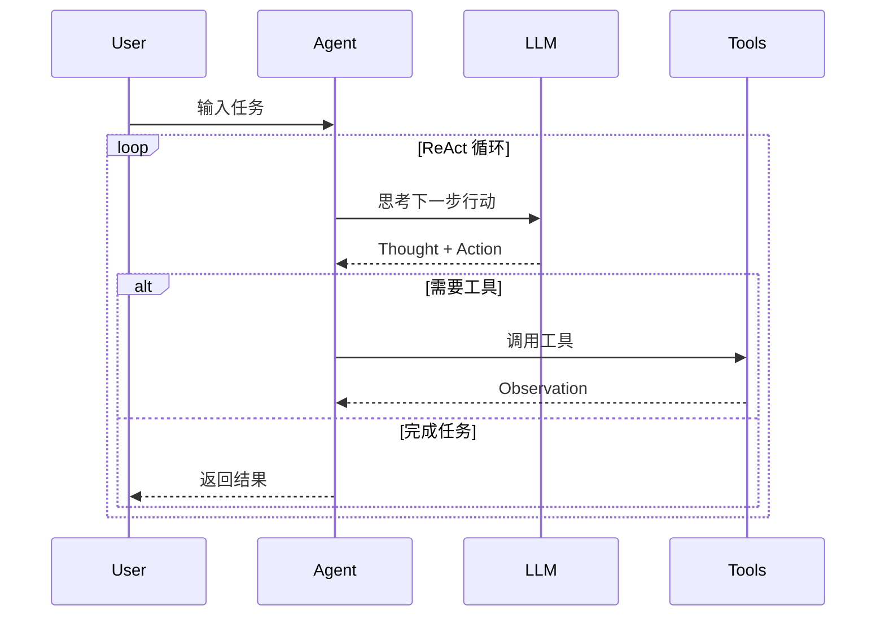
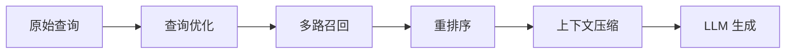

# LangChain 深度解析

> 全面解析 LangChain 框架的核心概念、架构设计与工程实践

---

## 一、概念与原理

### 1.1 什么是 LangChain

LangChain 是一个用于开发 LLM 应用程序的 Python/JS 框架，由 Harrison Chase 于 2022 年创建。它提供了一套模块化组件，帮助开发者快速构建基于大模型的应用。

**核心定位**：
- 不是模型本身，而是**模型之上的编排层**
- 提供标准化接口，降低不同模型/组件的切换成本
- 通过链式调用（Chain）实现复杂工作流

### 1.2 核心架构



### 1.3 六大核心组件

| 组件 | 作用 | 类比 |
|------|------|------|
| **Model I/O** | 统一模型调用接口 | 数据库连接池 |
| **Prompts** | 提示词模板化管理 | JSP/Thymeleaf |
| **Chains** | 组件链式组合 | Spring Integration |
| **Agents** | 动态决策执行 | 工作流引擎 |
| **Memory** | 对话状态管理 | Session/Cache |
| **Retrieval** | 文档检索增强 | 搜索引擎 |

---

## 二、面试题详解

### 题目 1：LangChain 的 Chain 是什么？有哪些常见类型？

**难度**：初级 ⭐

**考察点**：对 LangChain 核心抽象的理解

**详细解答**：

Chain 是 LangChain 的核心概念，表示**一系列组件的组合调用**。每个 Chain 接收输入，经过处理后产生输出，可以将多个 Chain 串联形成复杂工作流。

**常见 Chain 类型**：

```java
/**
 * LangChain Chain 类型对比
 */
public class ChainTypes {
    
    /**
     * 1. LLMChain - 最基础的链
     * 输入 -> PromptTemplate -> LLM -> 输出
     */
    public String llmChain(String input) {
        // PromptTemplate template = PromptTemplate.from("翻译以下文本: {input}");
        // return llm.predict(template.format(input));
        return "基础链：模板 + LLM 调用";
    }
    
    /**
     * 2. SequentialChain - 顺序执行多个链
     * 前一个链的输出作为后一个链的输入
     */
    public String sequentialChain(String topic) {
        // Chain1: 生成标题
        // Chain2: 根据标题写大纲
        // Chain3: 根据大纲写文章
        return "顺序链：Chain1 -> Chain2 -> Chain3";
    }
    
    /**
     * 3. RouterChain - 路由链，根据输入选择不同子链
     */
    public String routerChain(String question) {
        // 先判断问题类型：技术/产品/运营
        // 然后路由到对应的专家链
        if (question.contains("技术")) {
            return "技术专家链处理";
        } else if (question.contains("产品")) {
            return "产品专家链处理";
        }
        return "通用链处理";
    }
    
    /**
     * 4. RetrievalQA Chain - RAG 问答链
     */
    public String retrievalQA(String question) {
        // 1. 从向量库检索相关文档
        // List<Document> docs = retriever.getRelevantDocuments(question);
        // 2. 将文档作为上下文，让 LLM 回答
        // return qaChain.run(question, docs);
        return "检索增强问答链";
    }
}
```

**一句话总结**：Chain 是 LangChain 的"乐高积木"，通过组合不同 Chain 构建复杂应用。

---

### 题目 2：LangChain 的 Agent 是如何工作的？与 Chain 有什么区别？

**难度**：中级 ⭐⭐

**考察点**：理解 Agent 的动态决策机制，以及与静态 Chain 的本质区别

**详细解答**：

**核心区别**：

| 维度 | Chain | Agent |
|------|-------|-------|
| **执行方式** | 预定义流程，静态执行 | 动态决策，根据输入选择工具 |
| **灵活性** | 低，流程固定 | 高，可自适应调整 |
| **适用场景** | 流程明确的任务 | 需要推理决策的复杂任务 |
| **调用次数** | 通常单次 LLM 调用 | 可能多次调用（ReAct 循环） |

**Agent 工作原理**：



```java
/**
 * LangChain Agent 执行流程
 */
public class AgentExecutor {
    
    private final List<Tool> tools;
    private final ChatModel llm;
    private final int maxIterations = 10;
    
    /**
     * Agent 执行入口
     */
    public AgentResult execute(String input) {
        List<BaseMessage> memory = new ArrayList<>();
        memory.add(new HumanMessage(input));
        
        for (int i = 0; i < maxIterations; i++) {
            // 1. LLM 思考下一步
            AgentAction action = llm.plan(memory, tools);
            
            if (action.isFinish()) {
                // 任务完成，返回结果
                return AgentResult.success(action.getOutput());
            }
            
            // 2. 执行工具调用
            Tool tool = findTool(action.getToolName());
            String observation = tool.run(action.getToolInput());
            
            // 3. 将观察结果加入记忆
            memory.add(new AIMessage(action.getLog()));
            memory.add(new ToolMessage(observation, action.getToolName()));
        }
        
        return AgentResult.error("超过最大迭代次数");
    }
    
    private Tool findTool(String name) {
        return tools.stream()
            .filter(t -> t.getName().equals(name))
            .findFirst()
            .orElseThrow(() -> new ToolNotFoundException(name));
    }
}
```

**关键概念**：
- **AgentAction**：LLM 决定的下一步行动（调用哪个工具）
- **AgentFinish**：任务完成，返回最终结果
- **AgentExecutor**：执行引擎，管理 ReAct 循环

---

### 题目 3：LangChain 的 Memory 组件有哪些类型？如何实现多轮对话？

**难度**：中级 ⭐⭐

**考察点**：对对话状态管理的理解，不同 Memory 类型的适用场景

**详细解答**：

**Memory 类型对比**：

| 类型 | 存储内容 | 适用场景 | 特点 |
|------|----------|----------|------|
| **BufferMemory** | 原始对话历史 | 短对话 | 简单直接，上下文长时 token 消耗大 |
| **BufferWindowMemory** | 最近 k 轮对话 | 中等长度对话 | 滑动窗口，控制上下文长度 |
| **SummaryMemory** | 对话摘要 | 长对话 | 用 LLM 总结，节省 token |
| **VectorStoreMemory** | 向量检索历史 | 超长对话 | 检索相关历史，而非全部 |
| **EntityMemory** | 实体信息 | 需要记住用户偏好 | 提取关键实体，结构化存储 |

```java
/**
 * LangChain Memory 实现示例
 */
public class MemoryExamples {
    
    /**
     * BufferWindowMemory - 保留最近 k 轮对话
     */
    public class BufferWindowMemory implements BaseMemory {
        private final int k;  // 保留轮数
        private final List<BaseMessage> buffer = new ArrayList<>();
        
        @Override
        public void saveContext(Map<String, Object> inputs, Map<String, Object> outputs) {
            buffer.add(new HumanMessage(inputs.get("input").toString()));
            buffer.add(new AIMessage(outputs.get("output").toString()));
            
            // 只保留最近 2k 条消息（k 轮对话）
            while (buffer.size() > k * 2) {
                buffer.remove(0);
            }
        }
        
        @Override
        public List<BaseMessage> loadMemoryVariables() {
            return new ArrayList<>(buffer);
        }
    }
    
    /**
     * SummaryMemory - 对话摘要
     */
    public class SummaryMemory implements BaseMemory {
        private String summary = "";
        private final ChatModel llm;
        
        @Override
        public void saveContext(Map<String, Object> inputs, Map<String, Object> outputs) {
            String newLine = String.format("Human: %s\nAI: %s", 
                inputs.get("input"), outputs.get("output"));
            
            // 让 LLM 更新摘要
            String prompt = String.format(
                "基于当前摘要和新的对话，生成新的摘要。\n\n当前摘要: %s\n\n新对话: %s",
                summary, newLine
            );
            summary = llm.predict(prompt);
        }
        
        @Override
        public Map<String, Object> loadMemoryVariables() {
            Map<String, Object> vars = new HashMap<>();
            vars.put("history", summary);
            return vars;
        }
    }
}
```

**多轮对话实现要点**：
1. **选择合适的 Memory 类型** - 根据对话长度和场景
2. **控制上下文长度** - 避免超过模型上下文限制
3. **关键信息提取** - 对于长对话，考虑提取关键实体而非存储全部历史

---

### 题目 4：LangChain 的 RAG 实现中，如何优化检索效果？

**难度**：高级 ⭐⭐⭐

**考察点**：RAG 工程实践经验，检索优化的实际手段

**详细解答**：

LangChain 提供多层次的 RAG 优化方案：



**1. 查询优化（Query Transformation）**：

```java
/**
 * 查询优化策略
 */
public class QueryOptimization {
    
    /**
     * HyDE - 假设文档嵌入
     * 生成假设答案，用答案去检索
     */
    public List<Document> hydeRetrieve(String query) {
        // 1. 生成假设答案
        String hypotheticalDoc = llm.predict(
            "请回答以下问题，生成一段简洁的答案:\n" + query
        );
        
        // 2. 用假设答案做向量检索
        return vectorStore.similaritySearch(hypotheticalDoc, 5);
    }
    
    /**
     * 查询重写 - 扩展查询词
     */
    public List<String> queryExpansion(String query) {
        String prompt = String.format(
            "请为以下查询生成3个语义相似的变体，用于检索:\n查询: %s\n变体:", 
            query
        );
        String result = llm.predict(prompt);
        // 解析结果，返回多个查询变体
        return Arrays.asList(result.split("\\n"));
    }
}
```

**2. 多路召回（Ensemble Retrieval）**：

```java
/**
 * 多路召回 - 结合稀疏和稠密检索
 */
public class EnsembleRetriever implements BaseRetriever {
    
    private final BaseRetriever bm25Retriever;    // 稀疏检索
    private final BaseRetriever vectorRetriever;  // 稠密检索
    
    @Override
    public List<Document> getRelevantDocuments(String query) {
        // 1. 两路分别召回
        List<Document> bm25Docs = bm25Retriever.getRelevantDocuments(query);
        List<Document> vectorDocs = vectorRetriever.getRelevantDocuments(query);
        
        // 2. RRF 融合排序
        return reciprocalRankFusion(bm25Docs, vectorDocs);
    }
    
    /**
     * RRF (Reciprocal Rank Fusion) 算法
     */
    private List<Document> reciprocalRankFusion(List<Document>... docLists) {
        Map<String, Double> scores = new HashMap<>();
        int k = 60; // RRF 常数
        
        for (List<Document> docs : docLists) {
            for (int i = 0; i < docs.size(); i++) {
                String id = docs.get(i).getId();
                double score = 1.0 / (k + i + 1);
                scores.merge(id, score, Double::sum);
            }
        }
        
        // 按分数排序返回
        return scores.entrySet().stream()
            .sorted(Map.Entry.<String, Double>comparingByValue().reversed())
            .map(e -> findDocById(e.getKey()))
            .collect(Collectors.toList());
    }
}
```

**3. 重排序（Reranking）**：

```java
/**
 * 使用重排序模型优化检索结果
 */
public class RerankRetriever {
    
    private final BaseRetriever baseRetriever;
    private final Reranker reranker;  // 如 Cohere Rerank
    
    public List<Document> retrieve(String query, int topK) {
        // 1. 先召回更多候选（如 top 20）
        List<Document> candidates = baseRetriever.getRelevantDocuments(query, 20);
        
        // 2. 用重排序模型精排
        List<ScoredDocument> scored = reranker.rerank(query, candidates);
        
        // 3. 返回 topK
        return scored.stream()
            .sorted(Comparator.comparing(ScoredDocument::getScore).reversed())
            .limit(topK)
            .map(ScoredDocument::getDocument)
            .collect(Collectors.toList());
    }
}
```

**4. 上下文压缩（Contextual Compression）**：

```java
/**
 * 上下文压缩 - 只保留相关段落
 */
public class ContextualCompressionRetriever {
    
    /**
     * 提取文档中与查询相关的片段
     */
    public List<Document> compress(String query, List<Document> docs) {
        List<Document> compressed = new ArrayList<>();
        
        for (Document doc : docs) {
            // 将长文档分块
            List<String> chunks = splitIntoChunks(doc.getContent(), 200);
            
            // 筛选与查询相关的块
            for (String chunk : chunks) {
                double relevance = calculateRelevance(query, chunk);
                if (relevance > 0.7) {
                    compressed.add(new Document(chunk, doc.getMetadata()));
                }
            }
        }
        
        return compressed;
    }
}
```

---

## 三、延伸追问

### 追问 1：LangChain 的 LCEL（LangChain Expression Language）是什么？有什么优势？

**简要答案**：
- LCEL 是 LangChain 的声明式组合语法，用 `|` 操作符连接组件
- 优势：代码简洁、自动支持流式输出、异步执行、并行调用
- 示例：`chain = prompt | llm | output_parser`

### 追问 2：LangChain 和 LlamaIndex 在 RAG 方面有什么核心区别？

**简要答案**：
- **LangChain**：通用框架，RAG 是其中一个功能，更灵活但配置复杂
- **LlamaIndex**：RAG 专用，内置更多检索优化策略，开箱即用
- 选型：快速原型用 LlamaIndex，复杂定制用 LangChain

### 追问 3：生产环境中使用 LangChain 有什么坑需要注意？

**简要答案**：
1. **版本兼容性**：0.1.x 到 0.2.x 有大量 breaking changes
2. **性能开销**：Chain 的抽象层带来额外延迟，高频场景考虑原生调用
3. **错误处理**：Agent 循环可能陷入死循环，必须设置 max_iterations
4. **Token 消耗**：Memory 管理不当容易导致上下文溢出

---

## 四、总结

### 面试回答模板

> LangChain 是一个 LLM 应用开发框架，核心概念包括：
> 
> 1. **Chain**：组件的链式组合，实现复杂工作流
> 2. **Agent**：动态决策，根据输入选择工具执行
> 3. **Memory**：对话状态管理，支持多种存储策略
> 4. **Retrieval**：RAG 检索增强，提供多路召回、重排序等优化手段
> 
> 它的优势是模块化程度高，可以快速组合不同组件；劣势是抽象层带来性能开销，且版本迭代较快。

### 一句话记忆

| 概念 | 一句话 |
|------|--------|
| **Chain** | 组件乐高积木，通过组合构建复杂工作流 |
| **Agent** | 让 LLM 自己决定调用什么工具，实现动态决策 |
| **Memory** | 对话的"短期记忆"，需要主动管理避免溢出 |
| **LCEL** | 用管道符 `\|` 连接组件，声明式定义执行流程 |

### 适用场景

- ✅ 快速原型开发
- ✅ 需要多组件组合的复杂工作流
- ✅ 需要切换不同模型/组件的场景
- ⚠️ 超高并发、低延迟场景需评估性能
- ❌ 简单单轮对话可能过度设计
