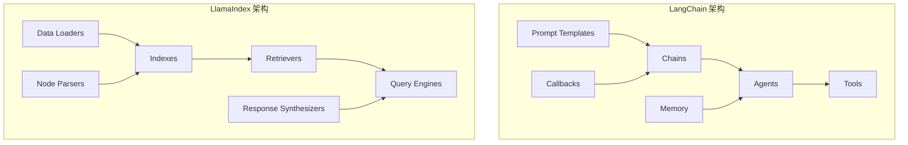
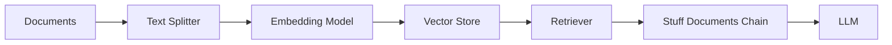
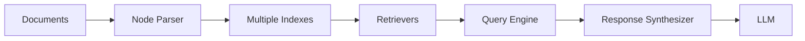
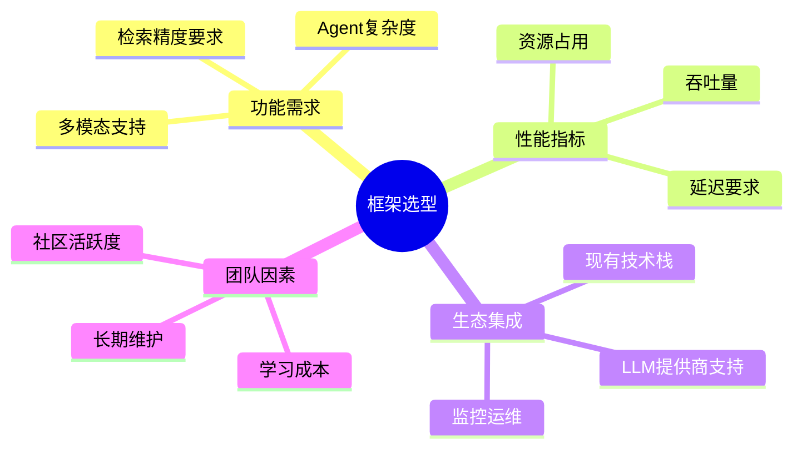

# LangChain vs LlamaIndex 深度对比

> 两大主流 AI Agent 开发框架的核心差异、适用场景与选型指南

---

## 一、概念与原理

### 1.1 框架定位差异

| 维度 | LangChain | LlamaIndex |
|------|-----------|------------|
| **核心定位** | 通用 LLM 应用编排框架 | 数据检索与知识增强框架 |
| **设计哲学** | "链式"思维：将 LLM 调用串联成工作流 | "索引"思维：先建索引，再智能检索 |
| **主要场景** | Agent 构建、工具调用、复杂工作流 | RAG、知识库问答、文档理解 |
| **学习曲线** | 较陡（概念多、抽象层多） | 较平缓（围绕索引和检索展开） |

### 1.2 架构对比



### 1.3 核心抽象对比

| LangChain 核心概念 | 对应 LlamaIndex 概念 | 说明 |
|-------------------|---------------------|------|
| Chain | Query Engine | 执行逻辑封装 |
| Agent | Agent (Beta) | 自主决策执行 |
| Tool | Tool/Function | 外部能力调用 |
| Memory | Chat Engine | 上下文管理 |
| Document Loader | Data Connector | 数据加载 |
| Vector Store | Vector Store | 向量存储（共用） |
| Retriever | Retriever | 检索器（概念相似） |

---

## 二、面试题详解

### 题目 1：LangChain 和 LlamaIndex 的核心区别是什么？各自适合什么场景？

**难度：** ⭐⭐ 初级

**考察点：** 对两个框架设计哲学的理解，能够根据场景做出技术选型

#### 详细解答

**核心区别：**

1. **LangChain 是"编排框架"**
   - 关注如何将多个 LLM 调用、工具调用串联成完整工作流
   - 强调 Agent 的自主决策能力
   - 提供丰富的集成（100+ 工具、多种 LLM 提供商）

2. **LlamaIndex 是"检索框架"**
   - 关注如何高效地从私有数据中提取相关信息
   - 强调索引构建和智能检索策略
   - 在 RAG 场景下提供更细粒度的控制

**适用场景对比：**

| 场景 | 推荐框架 | 原因 |
|------|---------|------|
| 多步骤 Agent 工作流 | LangChain | 原生支持 ReAct、Plan-and-Solve 等范式 |
| 企业知识库问答 | LlamaIndex | 索引类型丰富，检索策略优化 |
| 需要调用多个 API 的工具型 Agent | LangChain | Tool 生态更丰富 |
| 结构化数据（表格、PDF）检索 | LlamaIndex | 节点解析器更强大 |
| 快速原型开发 | 两者皆可 | LangChain 模板多，LlamaIndex 上手快 |
| 生产级 RAG 系统 | LlamaIndex | 检索准确率和可观测性更好 |

**代码示例：**

```java
/**
 * 框架选型决策示例
 * 
 * 场景：构建一个客服 Agent，需要：
 * 1. 查询订单状态（API 调用）
 * 2. 检索产品知识（RAG）
 * 3. 多轮对话管理
 */
public class FrameworkSelectionExample {
    
    /**
     * LangChain 方案 - 适合工具调用为主
     */
    public class LangChainApproach {
        
        public void implement() {
            // 1. 定义工具
            Tool[] tools = {
                new OrderQueryTool(),      // 查询订单
                new ProductSearchTool(),   // 产品搜索（内部可用 LlamaIndex）
                new RefundPolicyTool()     // 退款政策
            };
            
            // 2. 创建 Agent
            Agent agent = OpenAIFunctionsAgent.builder()
                .tools(tools)
                .memory(ConversationBufferMemory.builder().build())
                .build();
            
            // 3. 执行
            AgentExecutor executor = AgentExecutor.builder()
                .agent(agent)
                .tools(tools)
                .build();
            
            executor.run("我的订单 #12345 什么时候到？");
        }
    }
    
    /**
     * LlamaIndex 方案 - 适合知识检索为主
     */
    public class LlamaIndexApproach {
        
        public void implement() {
            // 1. 加载和索引文档
            SimpleDirectoryReader reader = new SimpleDirectoryReader("docs/");
            List<Document> documents = reader.loadData();
            
            // 2. 构建向量索引
            VectorStoreIndex index = VectorStoreIndex.builder()
                .documents(documents)
                .build();
            
            // 3. 创建查询引擎（可集成 Function Calling）
            QueryEngine queryEngine = index.asQueryEngine(
                QueryEngineConfig.builder()
                    .similarityTopK(5)
                    .responseMode(ResponseMode.COMPACT)
                    .build()
            );
            
            // 4. 查询
            Response response = queryEngine.query("退货政策是什么？");
        }
    }
}
```

---

### 题目 2：在 RAG 应用中，LangChain 和 LlamaIndex 的检索实现有何不同？

**难度：** ⭐⭐⭐ 中级

**考察点：** 对 RAG 检索机制的深度理解，框架内部实现差异

#### 详细解答

**LangChain 的 RAG 实现：**



特点：
1. **链式组合**：通过 `RetrievalQA` 或 `ConversationalRetrievalChain` 封装
2. **灵活但抽象**：可替换任意组件，但默认配置较简单
3. **检索策略**：主要依赖向量相似度，高级策略需要手动配置

**LlamaIndex 的 RAG 实现：**



特点：
1. **索引中心**：多种索引类型（Vector、List、Tree、Keyword Table）
2. **检索策略丰富**：
   - 默认检索（向量相似度）
   - 路由检索（Router）
   - 融合检索（Fusion）
   - 递归检索（Recursive）
3. **响应合成**：多种模式（Refine、Compact、Tree Summarize）

**关键差异对比表：**

| 特性 | LangChain | LlamaIndex |
|------|-----------|------------|
| 文档切分 | TextSplitter（较简单） | NodeParser（更细粒度，支持元数据） |
| 索引类型 | 主要是 VectorStore | Vector、List、Tree、Keyword、Composable |
| 检索策略 | 基础相似度搜索 | 路由、融合、递归、子问题查询 |
| 查询转换 | 需手动实现 | 内置 HyDE、查询重写、子问题分解 |
| 响应合成 | Stuff/Map-Reduce/Refine | Compact/Refine/Tree Summarize/Accumulate |
| 可观测性 | LangSmith（外部） | 内置回调和事件系统 |

**代码示例：**

```java
/**
 * RAG 检索策略对比实现
 */
public class RAGComparison {
    
    /**
     * LangChain RAG 实现
     */
    public void langChainRAG() {
        // 1. 加载文档
        DocumentLoader loader = new DirectoryLoader("./docs");
        List<Document> docs = loader.load();
        
        // 2. 切分
        TextSplitter splitter = RecursiveCharacterTextSplitter.builder()
            .chunkSize(1000)
            .chunkOverlap(200)
            .build();
        List<Document> chunks = splitter.splitDocuments(docs);
        
        // 3. 存入向量库
        VectorStore vectorStore = ChromaVectorStore.builder()
            .embeddingFunction(new OpenAIEmbeddings())
            .build();
        vectorStore.addDocuments(chunks);
        
        // 4. 创建检索链
        RetrievalQAChain chain = RetrievalQAChain.builder()
            .llm(new ChatOpenAI())
            .retriever(vectorStore.asRetriever(5))
            .chainType("stuff")  // 或 map_reduce, refine
            .build();
        
        // 5. 查询
        String result = chain.run("什么是 RAG？");
    }
    
    /**
     * LlamaIndex RAG 实现 - 高级检索策略
     */
    public void llamaIndexAdvancedRAG() {
        // 1. 加载和解析
        SimpleDirectoryReader reader = new SimpleDirectoryReader("./docs");
        List<Document> documents = reader.loadData();
        
        // 2. 高级节点解析（带元数据）
        SentenceWindowNodeParser parser = SentenceWindowNodeParser.builder()
            .windowSize(3)
            .build();
        List<BaseNode> nodes = parser.getNodesFromDocuments(documents);
        
        // 3. 构建向量索引
        VectorStoreIndex index = VectorStoreIndex.builder()
            .nodes(nodes)
            .build();
        
        // 4. 配置高级检索器 - 融合检索
        BaseRetriever vectorRetriever = index.asRetriever(
            RetrieverConfig.builder().similarityTopK(5).build()
        );
        
        // 5. 查询引擎带查询转换（HyDE）
        QueryEngine queryEngine = index.asQueryEngine(
            QueryEngineConfig.builder()
                .retriever(vectorRetriever)
                .queryTransform(new HyDEQueryTransform())
                .responseSynthesizer(new CompactAndRefine())
                .build()
        );
        
        // 6. 查询
        Response response = queryEngine.query("解释 RAG 的工作原理");
    }
}
```

---

### 题目 3：如何在生产环境中评估和选择这两个框架？需要考虑哪些因素？

**难度：** ⭐⭐⭐⭐ 高级

**考察点：** 工程实践能力，对框架生态、性能、维护性的综合考量

#### 详细解答

**评估维度框架：**



**详细评估表：**

| 评估维度 | LangChain | LlamaIndex | 建议 |
|---------|-----------|------------|------|
| **Agent 复杂度** | ⭐⭐⭐⭐⭐ | ⭐⭐⭐ | 复杂多工具 Agent 选 LangChain |
| **检索准确率** | ⭐⭐⭐ | ⭐⭐⭐⭐⭐ | 高精度 RAG 选 LlamaIndex |
| **延迟性能** | ⭐⭐⭐ | ⭐⭐⭐⭐ | LlamaIndex 检索优化更好 |
| **框架稳定性** | ⭐⭐⭐ | ⭐⭐⭐⭐⭐ | LangChain 版本变动较大 |
| **社区生态** | ⭐⭐⭐⭐⭐ | ⭐⭐⭐⭐ | LangChain 生态更丰富 |
| **文档质量** | ⭐⭐⭐ | ⭐⭐⭐⭐⭐ | LlamaIndex 文档更清晰 |
| **企业支持** | ⭐⭐⭐⭐ | ⭐⭐⭐⭐ | 都有商业版本 |

**生产环境考量：**

1. **版本稳定性**
   - LangChain：0.1 → 0.2 有较大 Breaking Changes
   - LlamaIndex：API 相对稳定，但也在快速迭代

2. **监控与可观测性**
   - LangChain：LangSmith 提供完整追踪（付费）
   - LlamaIndex：内置回调系统，可集成任意监控

3. **性能优化**
   - LangChain：需要手动优化各组件
   - LlamaIndex：内置多种优化策略（节点后处理、查询缓存等）

4. **混合使用策略**

```java
/**
 * 生产环境混合架构示例
 * 
 * 结合两者优势：
 * - LlamaIndex 负责高质量 RAG 检索
 * - LangChain 负责复杂 Agent 编排
 */
public class HybridProductionArchitecture {
    
    private final QueryEngine llamaIndexQueryEngine;
    private final Agent langChainAgent;
    
    public HybridProductionArchitecture() {
        // 1. 使用 LlamaIndex 构建高质量知识检索
        this.llamaIndexQueryEngine = buildLlamaIndexRAG();
        
        // 2. 使用 LangChain 构建 Agent，集成 LlamaIndex 作为工具
        this.langChainAgent = buildLangChainAgentWithRAGTool();
    }
    
    private QueryEngine buildLlamaIndexRAG() {
        // 高级 RAG 配置
        VectorStoreIndex index = loadOrBuildIndex();
        return index.asQueryEngine(
            QueryEngineConfig.builder()
                .retriever(new AutoMergingRetriever(index))
                .nodePostprocessors(Arrays.asList(
                    new SimilarityPostprocessor(0.7),  // 相似度过滤
                    new PrevNextNodePostprocessor()     // 上下文增强
                ))
                .responseSynthesizer(new CompactAndRefine())
                .build()
        );
    }
    
    private Agent buildLangChainAgentWithRAGTool() {
        // 将 LlamaIndex 查询引擎包装为 LangChain Tool
        Tool knowledgeBaseTool = new Tool() {
            @Override
            public String run(String query) {
                Response response = llamaIndexQueryEngine.query(query);
                return response.getResponse();
            }
            
            @Override
            public String getName() { return "knowledge_base_search"; }
            
            @Override
            public String getDescription() { 
                return "搜索内部知识库，回答产品相关问题"; 
            }
        };
        
        // 构建 Agent
        return OpenAIFunctionsAgent.builder()
            .tools(new Tool[]{knowledgeBaseTool, new OrderQueryTool()})
            .memory(new ConversationBufferWindowMemory(10))
            .build();
    }
    
    /**
     * 处理用户查询
     */
    public String processUserQuery(String userInput) {
        // Agent 决定是否需要检索知识库
        return langChainAgent.run(userInput);
    }
}
```

---

## 三、延伸追问

### 追问 1：LangChain 的 LCEL（LangChain Expression Language）是什么？解决了什么问题？

**简要答案：**
- LCEL 是声明式组合语言，用管道符 `|` 连接组件
- 解决了传统 Chain 类继承复杂、难以定制的问题
- 支持流式输出、并行执行、可观测性注入
- 示例：`chain = prompt | model | output_parser`

### 追问 2：LlamaIndex 的 Index 和 Query Engine 是什么关系？

**简要答案：**
- Index 是数据索引（存储），Query Engine 是查询接口（执行）
- 一个 Index 可以创建多个不同配置的 Query Engine
- 类似数据库中 Table 和 Query 的关系

### 追问 3：两个框架在流式输出（Streaming）方面支持如何？

**简要答案：**
- LangChain：通过 `StreamingStdOutCallbackHandler` 和 `astream` 方法支持
- LlamaIndex：通过 `streaming=true` 参数和事件回调支持
- 两者都支持 Token 级流式输出，可集成 SSE 推送到前端

### 追问 4：如果要实现一个多 Agent 协作系统，你会如何设计？

**简要答案：**
- LangChain：使用 `MultiAgent` 或 `CrewAI`（基于 LangChain）
- LlamaIndex：使用 `AgentRunner` + `MultiAgent`（较新功能）
- 或混合：LlamaIndex 做知识检索，LangChain/CrewAI 做 Agent 编排

---

## 四、总结

### 面试回答模板

> **一句话概括：** LangChain 是"流程编排器"，适合构建复杂 Agent 工作流；LlamaIndex 是"检索专家"，适合构建高质量 RAG 系统。
>
> **选型口诀：**
> - 多工具、多步骤、要 Agent → LangChain
> - 重检索、求准确、建知识库 → LlamaIndex
> - 两者结合 → LlamaIndex 做 RAG，LangChain 做编排

### 一句话记忆

| 概念 | 一句话 |
|------|--------|
| **LangChain** | 把 LLM 调用串联成链，让 Agent 能思考、能行动 |
| **LlamaIndex** | 先建索引再检索，让 LLM 能用上私有数据 |
| **选型原则** | 重流程选 LangChain，重检索选 LlamaIndex，生产环境可混用 |

### 面试速答 Checklist

- [ ] 明确两者定位差异（编排 vs 检索）
- [ ] 举例说明适用场景（Agent vs RAG）
- [ ] 提及架构抽象（Chain/Agent vs Index/Query Engine）
- [ ] 说明生产环境考量（稳定性、生态、混合使用）
- [ ] 展示代码理解（能写出伪代码结构）

---

> 💡 **面试官提示：** 这道题考察的是候选人的技术广度和架构思维。优秀的回答应该不仅说出区别，还能结合实际场景给出选型建议，甚至提出混合架构方案。
