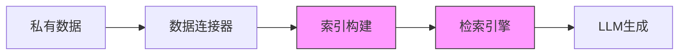
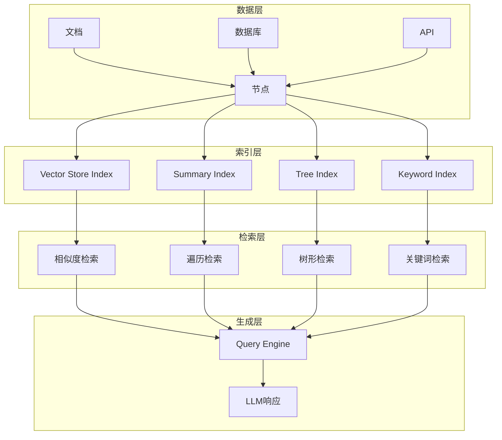
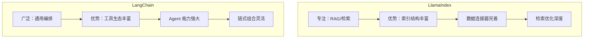
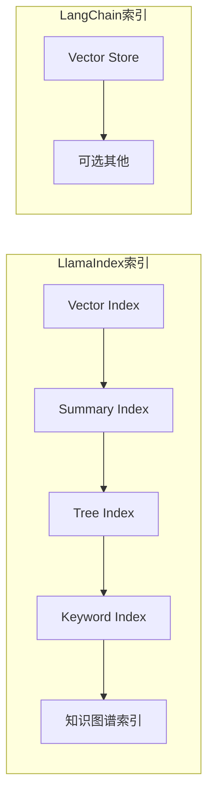
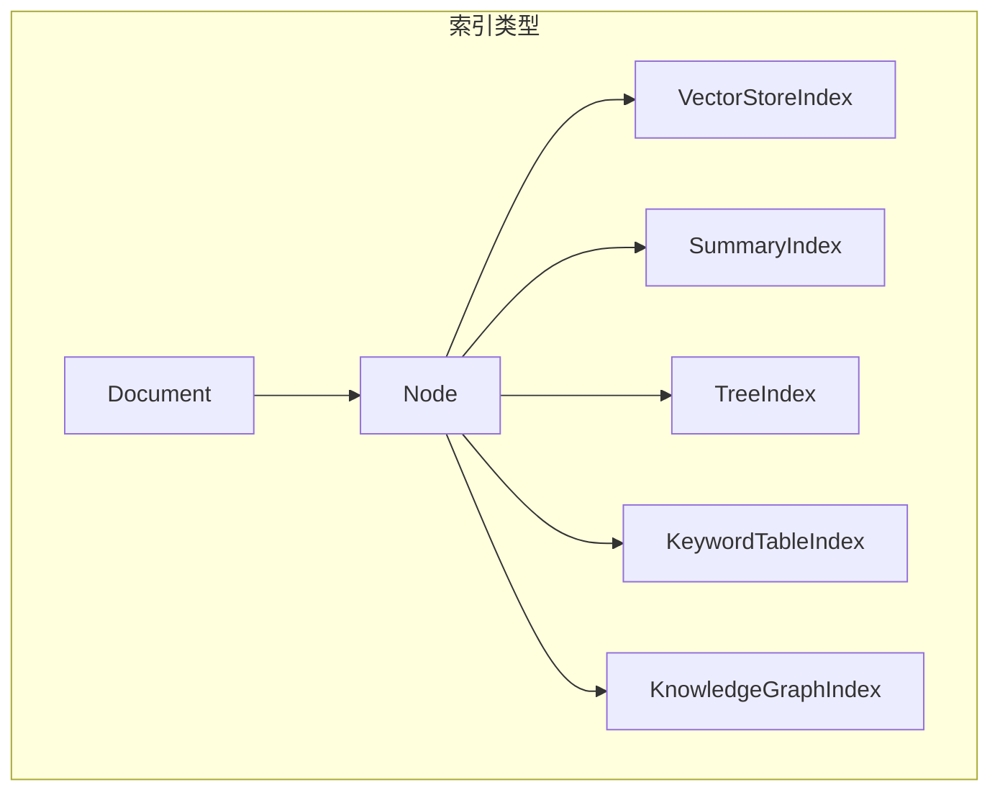
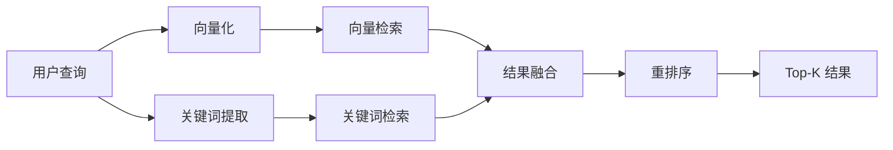
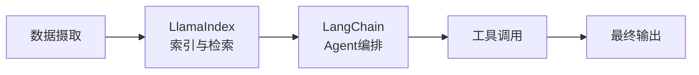

# LlamaIndex 深度解析

> 专为数据增强型 AI 应用设计的 LLM 编排框架，与 LangChain 相比有何独特优势？

---

## 一、概念与原理

### 1.1 LlamaIndex 是什么

LlamaIndex（原名 GPT Index）是一个专注于**数据索引和检索**的 LLM 编排框架。它的核心使命是：

> 将私有数据连接到大型语言模型

与 LangChain 的"万能工具箱"定位不同，LlamaIndex 更专注于 **RAG（检索增强生成）** 场景，提供从数据摄取到检索生成的完整链路。



### 1.2 核心架构



### 1.3 核心概念

| 概念 | 说明 | 类比 |
|------|------|------|
| **Document** | 原始数据单元，如一个 PDF、网页 | 一本书 |
| **Node** | 文档的切片，索引的基本单位 | 书中的章节 |
| **Index** | 节点的索引结构 | 书的目录 |
| **Retriever** | 从索引中检索相关节点 | 按目录找章节 |
| **Query Engine** | 检索+生成的完整流程 | 问答机器人 |
| **Chat Engine** | 支持多轮对话的查询引擎 | 对话机器人 |

### 1.4 LlamaIndex vs LangChain



| 维度 | LlamaIndex | LangChain |
|------|------------|-----------|
| **核心定位** | 数据索引与检索 | 通用 LLM 编排 |
| **RAG 深度** | ⭐⭐⭐⭐⭐ 专业级 | ⭐⭐⭐ 通用级 |
| **Agent 能力** | ⭐⭐ 基础支持 | ⭐⭐⭐⭐⭐ 强大 |
| **工具生态** | ⭐⭐ 较少 | ⭐⭐⭐⭐⭐ 丰富 |
| **学习曲线** | 较平缓 | 较陡峭 |
| **索引类型** | 丰富（10+种） | 基础（向量索引为主） |
| **数据连接器** | 150+ 种 | 较多但分散 |

---

## 二、面试题详解

### 题目 1（初级）：LlamaIndex 和 LangChain 有什么区别？什么场景下应该选择 LlamaIndex？

**考察点：** 对两个主流框架的理解，以及根据场景选择合适工具的能力。

**详细解答：**

**核心区别：**

1. **设计哲学不同**：
   - **LlamaIndex**："数据优先"，专注于解决"如何让 LLM 理解私有数据"
   - **LangChain**："链式编排"，专注于解决"如何组合各种能力完成复杂任务"

2. **索引能力对比**：



**选择 LlamaIndex 的场景：**

| 场景 | 原因 |
|------|------|
| **企业知识库问答** | 需要处理大量文档，需要多种索引策略 |
| **结构化数据查询** | 需要 SQL/知识图谱索引 |
| **分层检索需求** | 需要 Summary → Chunk 的分层检索 |
| **数据连接器需求** | 需要直接连接 Notion、Confluence 等数据源 |
| **检索优化深度需求** | 需要 rerank、hybrid search 等高级检索 |

**选择 LangChain 的场景：**

| 场景 | 原因 |
|------|------|
| **复杂 Agent 系统** | 需要多工具调用、复杂决策逻辑 |
| **通用 LLM 应用** | 不只是 RAG，还需要多种能力组合 |
| **快速原型验证** | 需要丰富的预置组件 |
| **工具集成复杂** | 需要集成大量第三方工具 |

**Java 伪代码示例：**

```java
/**
 * 框架选择决策器
 * 
 * 根据项目需求推荐合适的 LLM 框架
 */
public class FrameworkSelector {
    
    /**
     * 选择框架
     * 
     * @param requirements 项目需求
     * @return 推荐框架及原因
     */
    public FrameworkRecommendation select(ProjectRequirements requirements) {
        int llamaIndexScore = 0;
        int langChainScore = 0;
        List<String> llamaIndexReasons = new ArrayList<>();
        List<String> langChainReasons = new ArrayList<>();
        
        // RAG 深度需求
        if (requirements.needsAdvancedRag()) {
            llamaIndexScore += 3;
            llamaIndexReasons.add("需要高级 RAG 能力（多种索引、检索优化）");
        }
        
        // Agent 复杂度
        if (requirements.needsComplexAgent()) {
            langChainScore += 3;
            langChainReasons.add("需要复杂 Agent 编排能力");
        }
        
        // 数据源多样性
        if (requirements.hasMultipleDataSources()) {
            llamaIndexScore += 2;
            llamaIndexReasons.add("需要丰富的数据连接器");
        }
        
        // 工具调用需求
        if (requirements.needsToolCalling()) {
            langChainScore += 2;
            langChainReasons.add("需要丰富的工具生态");
        }
        
        // 分层索引需求
        if (requirements.needsHierarchicalIndex()) {
            llamaIndexScore += 2;
            llamaIndexReasons.add("需要树形/分层索引结构");
        }
        
        // 做出推荐
        if (llamaIndexScore > langChainScore) {
            return new FrameworkRecommendation(
                Framework.LLAMA_INDEX,
                llamaIndexReasons,
                Confidence.HIGH
            );
        } else if (langChainScore > llamaIndexScore) {
            return new FrameworkRecommendation(
                Framework.LANGCHAIN,
                langChainReasons,
                Confidence.HIGH
            );
        } else {
            // 可以组合使用
            return new FrameworkRecommendation(
                Framework.HYBRID,
                List.of("两者优势可以互补，LlamaIndex 负责 RAG，LangChain 负责 Agent"),
                Confidence.MEDIUM
            );
        }
    }
}

enum Framework {
    LLAMA_INDEX,
    LANGCHAIN,
    HYBRID
}
```

---

### 题目 2（中级）：LlamaIndex 支持哪些索引类型？分别适用于什么场景？

**考察点：** 对 LlamaIndex 核心索引结构的深入理解。

**详细解答：**

**主要索引类型：**



**1. VectorStoreIndex（向量索引）**

```python
# 最常用，基于语义相似度检索
index = VectorStoreIndex(nodes)
retriever = index.as_retriever(similarity_top_k=5)
```

- **原理**：将节点编码为向量，基于余弦相似度检索
- **适用**：语义搜索、语义相似问答
- **优势**：理解语义，不限于关键词匹配
- **局限**：需要向量数据库，对精确匹配支持一般

**2. SummaryIndex（摘要索引）**

```python
# 适合需要遍历所有内容的场景
index = SummaryIndex(nodes)
retriever = index.as_retriever(retriever_mode='all')  # 返回所有节点
```

- **原理**：简单的列表结构，支持遍历或 LLM 筛选
- **适用**：节点数量少、需要综合所有信息的场景
- **优势**：简单直接，不会遗漏信息
- **局限**：节点多时上下文超限

**3. TreeIndex（树形索引）**

```python
# 分层检索，从摘要到细节
index = TreeIndex(nodes, children_per_parent=3)
retriever = index.as_retriever(retriever_mode='select_leaf')
```

- **原理**：构建树形结构，父节点是子节点的摘要
- **适用**：大规模文档、需要分层检索
- **优势**：支持从粗到细的检索策略
- **局限**：构建成本较高

**4. KeywordTableIndex（关键词索引）**

```python
# 基于关键词的精确匹配
index = KeywordTableIndex(nodes)
retriever = index.as_retriever(retriever_mode='simple')
```

- **原理**：提取关键词建立倒排索引
- **适用**：需要精确关键词匹配的场景
- **优势**：精确匹配，无需向量计算
- **局限**：无法理解语义

**5. KnowledgeGraphIndex（知识图谱索引）**

```python
# 构建知识图谱，支持关系查询
index = KnowledgeGraphIndex(nodes)
retriever = index.as_retriever(retriever_mode='hybrid')
```

- **原理**：从文本中提取实体和关系构建图谱
- **适用**：结构化知识查询、关系推理
- **优势**：支持复杂关系查询
- **局限**：构建成本高，需要实体识别

**索引选择决策表：**

| 场景 | 推荐索引 | 原因 |
|------|----------|------|
| 通用语义搜索 | VectorStoreIndex | 语义理解能力强 |
| 小规模文档集 | SummaryIndex | 简单，不会遗漏 |
| 大规模分层文档 | TreeIndex | 支持分层检索 |
| 精确关键词匹配 | KeywordTableIndex | 精确度高 |
| 关系型知识 | KnowledgeGraphIndex | 支持关系推理 |
| 混合需求 | 组合索引 | 各取所长 |

**Java 伪代码示例：**

```java
/**
 * LlamaIndex 索引选择器
 * 
 * 根据数据特征和查询需求选择最优索引类型
 */
public class IndexTypeSelector {
    
    /**
     * 选择索引类型
     * 
     * @param dataCharacteristics 数据特征
     * @param queryPattern 查询模式
     * @return 推荐的索引配置
     */
    public IndexConfig select(DataCharacteristics data, QueryPattern query) {
        
        // 知识图谱场景
        if (data.hasRichRelationships() && query.needsRelationTraversal()) {
            return IndexConfig.builder()
                .type(IndexType.KNOWLEDGE_GRAPH)
                .retrieverMode("hybrid")
                .reason("数据关系丰富，需要关系推理")
                .build();
        }
        
        // 大规模分层文档
        if (data.getNodeCount() > 1000 && data.isHierarchical()) {
            return IndexConfig.builder()
                .type(IndexType.TREE)
                .retrieverMode("select_leaf")
                .reason("大规模分层文档，需要树形索引")
                .build();
        }
        
        // 精确关键词查询
        if (query.isKeywordBased() && !query.needsSemanticUnderstanding()) {
            return IndexConfig.builder()
                .type(IndexType.KEYWORD_TABLE)
                .retrieverMode("simple")
                .reason("精确关键词匹配，无需语义理解")
                .build();
        }
        
        // 小规模全量检索
        if (data.getNodeCount() < 100) {
            return IndexConfig.builder()
                .type(IndexType.SUMMARY)
                .retrieverMode("all")
                .reason("节点数量少，适合全量遍历")
                .build();
        }
        
        // 默认：向量索引
        return IndexConfig.builder()
            .type(IndexType.VECTOR_STORE)
            .retrieverMode("similarity")
            .similarityTopK(5)
            .reason("通用语义搜索场景")
            .build();
    }
}

enum IndexType {
    VECTOR_STORE,
    SUMMARY,
    TREE,
    KEYWORD_TABLE,
    KNOWLEDGE_GRAPH
}

class IndexConfig {
    private IndexType type;
    private String retrieverMode;
    private int similarityTopK;
    private String reason;
    
    public static IndexConfig builder() { return new IndexConfig(); }
    public IndexConfig type(IndexType t) { this.type = t; return this; }
    public IndexConfig retrieverMode(String mode) { this.retrieverMode = mode; return this; }
    public IndexConfig similarityTopK(int k) { this.similarityTopK = k; return this; }
    public IndexConfig reason(String r) { this.reason = r; return this; }
    public IndexConfig build() { return this; }
}
```

---

### 题目 3（高级）：如何在 LlamaIndex 中实现混合检索（Hybrid Retrieval）？如何优化检索效果？

**考察点：** 对高级 RAG 技术的理解，以及检索优化的工程能力。

**详细解答：**

**混合检索的核心思想：**



**混合检索的实现方式：**

**1. 向量 + 关键词混合**

```python
from llama_index.core.retrievers import QueryFusionRetriever

# 创建多个检索器
vector_retriever = index.as_retriever(similarity_top_k=10)
keyword_retriever = keyword_index.as_retriever(similarity_top_k=10)

# 融合检索
retriever = QueryFusionRetriever(
    [vector_retriever, keyword_retriever],
    similarity_top_k=5,
    num_queries=1,  # 是否生成多查询变体
    mode="reciprocal_rerank"  # 融合算法
)
```

**2. 多索引查询**

```python
from llama_index.tools import RetrieverTool
from llama_index.agent import OpenAIAgent

# 为不同索引创建工具
tools = [
    RetrieverTool.from_defaults(
        vector_index.as_retriever(),
        name="semantic_search",
        description="用于语义相关的查询"
    ),
    RetrieverTool.from_defaults(
        kg_index.as_retriever(),
        name="knowledge_graph",
        description="用于关系型查询"
    ),
]

# Agent 自动选择使用哪个索引
agent = OpenAIAgent.from_tools(tools)
```

**检索优化策略：**

| 优化技术 | 说明 | 效果 |
|----------|------|------|
| **Query Rewriting** | 用 LLM 重写/扩展查询 | 提升召回率 |
| **HyDE** | 生成假设文档再检索 | 解决词汇不匹配 |
| **Reranking** | 使用 Cross-Encoder 重排 | 提升精确率 |
| **Metadata Filtering** | 按元数据预过滤 | 减少检索范围 |
| **Hierarchical Retrieval** | 分层检索 | 处理大规模数据 |

**Java 伪代码示例：**

```java
/**
 * 混合检索引擎
 * 
 * 结合多种检索策略，实现最优检索效果
 */
public class HybridRetrievalEngine {
    
    private final VectorRetriever vectorRetriever;
    private final KeywordRetriever keywordRetriever;
    private final Reranker reranker;
    private final QueryRewriter queryRewriter;
    
    /**
     * 执行混合检索
     * 
     * @param query 用户查询
     * @param config 检索配置
     * @return 检索结果
     */
    public RetrievalResult retrieve(String query, RetrievalConfig config) {
        
        // Step 1: 查询重写
        List<String> queryVariants = queryRewriter.rewrite(query);
        
        // Step 2: 多路召回
        Set<Node> candidateNodes = new HashSet<>();
        
        // 向量检索
        if (config.isEnableVectorSearch()) {
            for (String variant : queryVariants) {
                List<Node> vectorResults = vectorRetriever.search(variant, config.getVectorTopK());
                candidateNodes.addAll(vectorResults);
            }
        }
        
        // 关键词检索
        if (config.isEnableKeywordSearch()) {
            List<Node> keywordResults = keywordRetriever.search(query, config.getKeywordTopK());
            candidateNodes.addAll(keywordResults);
        }
        
        // Step 3: 结果融合（RRF 算法）
        Map<Node, Double> fusedScores = reciprocalRankFusion(
            vectorRetriever.getLastResults(),
            keywordRetriever.getLastResults()
        );
        
        // Step 4: 重排序
        List<Node> rerankedNodes;
        if (config.isEnableReranking()) {
            rerankedNodes = reranker.rerank(query, new ArrayList<>(candidateNodes), config.getFinalTopK());
        } else {
            rerankedNodes = fusedScores.entrySet().stream()
                .sorted(Map.Entry.<Node, Double>comparingByValue().reversed())
                .limit(config.getFinalTopK())
                .map(Map.Entry::getKey)
                .collect(Collectors.toList());
        }
        
        return new RetrievalResult(rerankedNodes, fusedScores);
    }
    
    /**
     * RRF (Reciprocal Rank Fusion) 融合算法
     * 
     * 公式：score = Σ(1 / (k + rank))
     * k 通常取 60
     */
    private Map<Node, Double> reciprocalRankFusion(List<Node>... resultLists) {
        final int K = 60;
        Map<Node, Double> scores = new HashMap<>();
        
        for (List<Node> results : resultLists) {
            for (int i = 0; i < results.size(); i++) {
                Node node = results.get(i);
                int rank = i + 1;
                scores.merge(node, 1.0 / (K + rank), Double::sum);
            }
        }
        
        return scores;
    }
}

class RetrievalConfig {
    private boolean enableVectorSearch = true;
    private boolean enableKeywordSearch = true;
    private boolean enableReranking = true;
    private int vectorTopK = 20;
    private int keywordTopK = 20;
    private int finalTopK = 5;
    
    // getters and setters...
}
```

**检索效果评估：**

```java
/**
 * 检索效果评估器
 */
public class RetrievalEvaluator {
    
    /**
     * 计算检索指标
     */
    public RetrievalMetrics evaluate(List<QueryTestCase> testCases) {
        double totalRecall = 0;
        double totalPrecision = 0;
        double totalMRR = 0;
        
        for (QueryTestCase testCase : testCases) {
            List<Node> results = retrievalEngine.retrieve(testCase.getQuery());
            Set<Node> relevantNodes = testCase.getRelevantNodes();
            
            // Recall@K
            int relevantRetrieved = (int) results.stream()
                .filter(relevantNodes::contains)
                .count();
            double recall = (double) relevantRetrieved / relevantNodes.size();
            totalRecall += recall;
            
            // Precision@K
            double precision = (double) relevantRetrieved / results.size();
            totalPrecision += precision;
            
            // MRR (Mean Reciprocal Rank)
            double mrr = 0;
            for (int i = 0; i < results.size(); i++) {
                if (relevantNodes.contains(results.get(i))) {
                    mrr = 1.0 / (i + 1);
                    break;
                }
            }
            totalMRR += mrr;
        }
        
        int n = testCases.size();
        return new RetrievalMetrics(
            totalRecall / n,
            totalPrecision / n,
            totalMRR / n
        );
    }
}

class RetrievalMetrics {
    private final double recall;
    private final double precision;
    private final double mrr;
    
    public RetrievalMetrics(double recall, double precision, double mrr) {
        this.recall = recall;
        this.precision = precision;
        this.mrr = mrr;
    }
    
    public double getF1() {
        return 2 * (precision * recall) / (precision + recall);
    }
}
```

---

## 三、延伸追问

### 追问 1：LlamaIndex 的数据连接器（Data Connector）有什么优势？能连接哪些数据源？

**简要答案要点：**

**优势：**
1. **开箱即用**：150+ 种数据源连接器，无需自己开发
2. **统一抽象**：不同数据源使用统一接口
3. **增量更新**：支持增量索引，避免全量重建
4. **元数据保留**：自动保留文件元数据（路径、时间等）

**支持的数据源：**
- **文件系统**：PDF、Word、Markdown、CSV、JSON
- **云存储**：S3、GCS、Azure Blob
- **协作工具**：Notion、Confluence、Google Docs
- **数据库**：PostgreSQL、MySQL、MongoDB
- **知识库**：GitHub、GitLab、Jira
- **消息平台**：Slack、Discord

### 追问 2：LlamaIndex 的节点解析器（Node Parser）有哪些策略？如何选择？

**简要答案要点：**

**解析策略：**

| 解析器 | 策略 | 适用场景 |
|--------|------|----------|
| **SimpleNodeParser** | 固定长度切分 | 通用场景 |
| **SentenceWindowNodeParser** | 按句子切分，保留上下文窗口 | 需要上下文理解的场景 |
| **HierarchicalNodeParser** | 分层切分（大→中→小） | 需要多粒度检索 |
| **SemanticSplitterNodeParser** | 按语义边界切分 | 避免切断语义单元 |

**选择建议：**
- 代码文档 → SemanticSplitter（避免切断函数）
- 论文/报告 → Hierarchical（支持摘要+细节检索）
- 聊天记录 → SentenceWindow（保留对话上下文）
- 通用文档 → Simple（简单高效）

### 追问 3：LlamaIndex 和 LangChain 可以一起使用吗？如何组合？

**简要答案要点：**

**可以组合使用**，优势互补：



**组合方式：**
1. **LlamaIndex 作为检索工具**：将 LlamaIndex 的 Query Engine 包装为 LangChain Tool
2. **LangChain 负责 Agent 逻辑**：使用 LangChain 的 Agent 框架调用 LlamaIndex 检索
3. **数据层用 LlamaIndex，编排层用 LangChain**

**代码示例：**
```python
from llama_index.core.tools import QueryEngineTool
from langchain.agents import OpenAIFunctionsAgent

# LlamaIndex 提供检索能力
query_engine = index.as_query_engine()
tool = QueryEngineTool.from_defaults(query_engine)

# LangChain 负责 Agent 编排
agent = OpenAIFunctionsAgent.from_llm_and_tools(llm, [tool])
```

---

## 四、总结

### 面试回答模板

> LlamaIndex 是一个专注于 RAG 场景的 LLM 编排框架，与 LangChain 的通用定位不同，它在**数据索引和检索**方面更加专业。LlamaIndex 提供了丰富的索引类型（向量、摘要、树形、知识图谱等），150+ 种数据连接器，以及完善的检索优化工具（混合检索、重排序、查询重写等）。如果项目核心是**企业知识库问答**，LlamaIndex 是更好的选择；如果需要**复杂的 Agent 编排**，则 LangChain 更合适。两者也可以组合使用，LlamaIndex 负责 RAG，LangChain 负责 Agent。

### 一句话记忆

| 概念 | 一句话 |
|------|--------|
| **LlamaIndex** | 专注 RAG 的数据索引框架，"把私有数据连到 LLM" |
| **VectorStoreIndex** | 最常用，基于语义相似度检索 |
| **TreeIndex** | 分层索引，适合大规模文档的粗到细检索 |
| **混合检索** | 向量+关键词+重排序，多路召回提升效果 |
| **vs LangChain** | LlamaIndex 专精 RAG，LangChain 擅长通用编排 |

### 索引选择速查表

```
需要构建索引？
├── 需要关系推理？
│   └── 是 → KnowledgeGraphIndex
├── 大规模分层文档？
│   └── 是 → TreeIndex
├── 精确关键词匹配？
│   └── 是 → KeywordTableIndex
├── 节点数量 < 100？
│   └── 是 → SummaryIndex
└── 默认 → VectorStoreIndex
```
