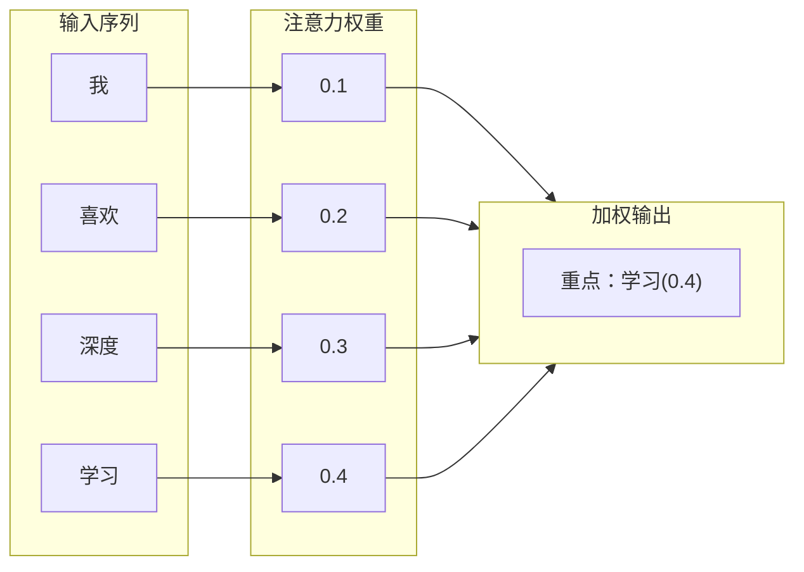
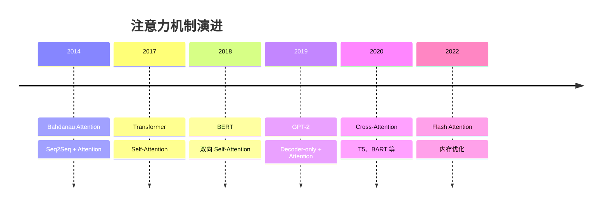
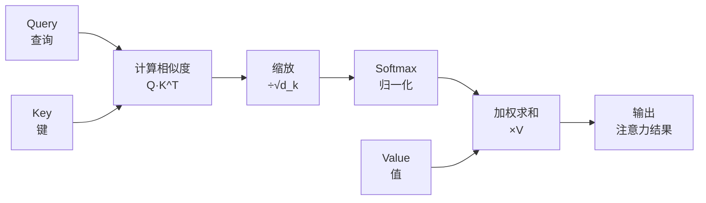
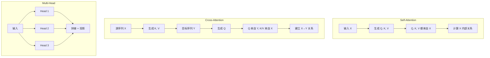
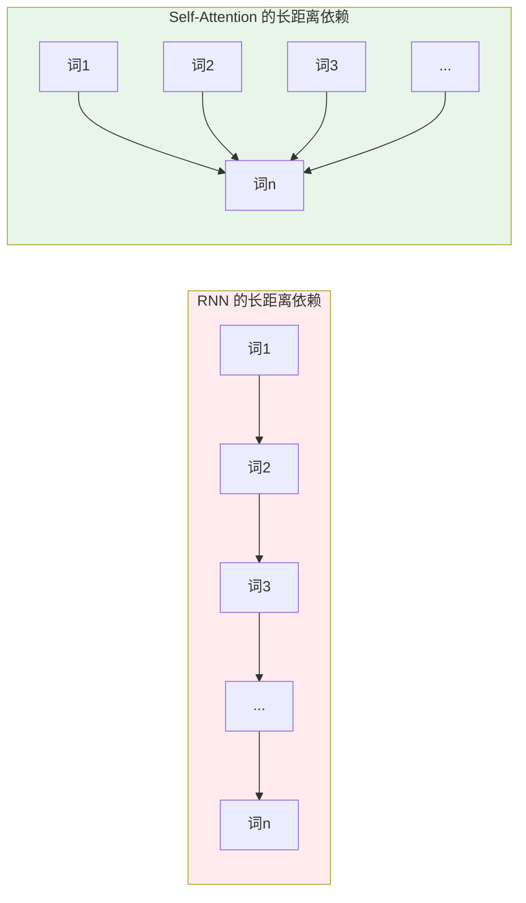

# 注意力机制详解

> Self-Attention、Cross-Attention、Multi-Head Attention 深度解析

---

## 一、概念与原理

### 1.1 什么是注意力机制？

**注意力机制（Attention Mechanism）** 源于人类视觉注意力——当我们看东西时，会**重点关注**某些区域，而**忽略**其他区域。

**核心思想：**
- 给输入的不同部分分配不同的权重
- 重要的部分权重高，不重要的部分权重低
- 让模型学会"关注什么"



### 1.2 注意力机制的发展



### 1.3 注意力机制的通用形式

**通用公式：**

$$\text{Attention}(Q, K, V) = \text{softmax}\left(\frac{QK^T}{\sqrt{d_k}}\right)V$$

**三个核心概念：**

| 概念 | 含义 | 作用 |
|------|------|------|
| **Query (Q)** | 查询 | "我要查什么" |
| **Key (K)** | 键 | "我有什么" |
| **Value (V)** | 值 | "实际内容是什么" |

**计算过程：**



---

## 二、面试题详解

### 题目 1：Self-Attention、Cross-Attention 和 Multi-Head Attention 有什么区别？

#### 考察点
- 三种注意力机制的理解
- 应用场景区分
- 计算方式对比

#### 详细解答

**核心区别：**

| 类型 | Q 来源 | K/V 来源 | 应用场景 | 特点 |
|------|--------|----------|----------|------|
| **Self-Attention** | 输入本身 | 输入本身 | Encoder、Decoder | 建模内部依赖 |
| **Cross-Attention** | 目标序列 | 源序列 | Encoder-Decoder | 建立源-目标关系 |
| **Multi-Head** | 多个子空间 | 多个子空间 | 所有 Transformer | 增强表达能力 |

**详细对比：**



**1. Self-Attention（自注意力）**

```
输入：X = [x1, x2, x3, x4]

Q = X · W_q
K = X · W_k  
V = X · W_v

Attention = softmax(QK^T / √d) · V

特点：
- 每个位置都能看到其他所有位置
- 建模序列内部的依赖关系
- "我喜欢苹果" → "我"和"喜欢"相关，"喜欢"和"苹果"相关
```

**2. Cross-Attention（交叉注意力）**

```
输入：
- 源序列 X（Encoder 输出）
- 目标序列 Y（Decoder 输入）

Q = Y · W_q          ← 来自目标
K = X · W_k          ← 来自源
V = X · W_v          ← 来自源

Attention = softmax(QK^T / √d) · V

特点：
- 建立源序列和目标序列的关系
- 翻译任务：源语言 → 目标语言
- "I love you" → "我" 关注 "I"
```

**3. Multi-Head Attention（多头注意力）**

```
不是独立的注意力类型，而是对 Self/Cross 的增强

h 个注意力头并行计算：
head_i = Attention(QW_i^Q, KW_i^K, VW_i^V)

MultiHead = Concat(head_1, ..., head_h) · W^O

特点：
- 每个头学习不同的子空间
- 增强模型表达能力
- 可以捕获不同类型的关系
```

**Java 伪代码对比：**

```java
public class AttentionTypes {
    
    /**
     * Self-Attention: Q, K, V 都来自同一个输入
     */
    public Matrix selfAttention(Matrix X) {
        Matrix Q = X.multiply(W_q);
        Matrix K = X.multiply(W_k);
        Matrix V = X.multiply(W_v);
        
        return attention(Q, K, V);
    }
    
    /**
     * Cross-Attention: Q 来自目标，K/V 来自源
     */
    public Matrix crossAttention(Matrix source, Matrix target) {
        Matrix Q = target.multiply(W_q);    // 来自目标
        Matrix K = source.multiply(W_k);    // 来自源
        Matrix V = source.multiply(W_v);    // 来自源
        
        return attention(Q, K, V);
    }
    
    /**
     * Multi-Head: 多个注意力头并行
     */
    public Matrix multiHeadAttention(Matrix X) {
        Matrix[] heads = new Matrix[numHeads];
        
        for (int i = 0; i < numHeads; i++) {
            Matrix Q = X.multiply(W_q[i]);
            Matrix K = X.multiply(W_k[i]);
            Matrix V = X.multiply(W_v[i]);
            heads[i] = attention(Q, K, V);
        }
        
        Matrix concat = concatenate(heads);
        return concat.multiply(W_o);
    }
    
    private Matrix attention(Matrix Q, Matrix K, Matrix V) {
        Matrix scores = Q.multiply(K.transpose()).divide(Math.sqrt(d_k));
        Matrix weights = softmax(scores);
        return weights.multiply(V);
    }
}
```

---

### 题目 2：Self-Attention 为什么能捕捉长距离依赖？与 RNN 相比有什么优势？

#### 考察点
- 长距离依赖建模
- 与 RNN 的对比
- 计算复杂度分析

#### 详细解答

**长距离依赖问题：**



**RNN 的问题：**

```
长距离依赖：词1 → 词100

RNN:
ht = f(ht-1, xt)
词1 的信息要经过 99 步传递才能到达词100
→ 梯度消失/爆炸
→ 信息丢失

数学上：
∂L/∂h1 = ∂L/∂h100 · ∏(∂hi/∂hi-1)
连乘 99 个小于 1 的数 → 趋近于 0
```

**Self-Attention 的优势：**

```
任意两个位置直接连接：

位置 i 和位置 j 的关系：
score = qi · kj / √d

无论 i 和 j 相距多远，计算复杂度都是 O(1)
没有梯度传播路径，直接计算

数学上：
∂L/∂xi 直接通过 attention weight 传播
没有连乘，梯度稳定
```

**对比：**

| 维度 | RNN | Self-Attention |
|------|-----|----------------|
| **长距离依赖** | ❌ 梯度消失 | ✅ 直接连接 |
| **计算复杂度** | O(n) 步 | O(1) 步，O(n²) 计算 |
| **并行性** | ❌ 串行 | ✅ 完全并行 |
| **局部性** | 天然局部 | 需要位置编码 |
| **显存** | O(n) | O(n²) |

**实际例子：**

```
句子："虽然今天下雨，但是我依然决定出门跑步，因为昨天答应了朋友"

RNN 处理：
"虽然" → "今天" → "下雨" → ... → "答应了" → "朋友"
"虽然" 的信息经过 15+ 步才到 "但是"，可能已经丢失

Self-Attention 处理：
"但是" 可以直接 attend 到 "虽然"
"答应了" 可以直接 attend 到 "昨天"
距离都是 O(1)
```

**Java 伪代码：**

```java
public class LongRangeDependency {
    
    /**
     * RNN：长距离依赖通过隐藏状态传递
     */
    public Matrix rnnForward(Matrix[] inputs) {
        Matrix hidden = initializeHidden();
        
        for (Matrix input : inputs) {
            // 每步只依赖前一步
            hidden = tanh(input.multiply(W_x).add(hidden.multiply(W_h));
        }
        
        return hidden;  // 词1的信息经过多次传递
    }
    
    /**
     * Self-Attention：任意位置直接连接
     */
    public Matrix selfAttentionForward(Matrix[] inputs) {
        Matrix X = stack(inputs);  // [n, d]
        
        Matrix Q = X.multiply(W_q);  // [n, d]
        Matrix K = X.multiply(W_k);  // [n, d]
        
        // 任意两个位置直接计算
        Matrix scores = Q.multiply(K.transpose());  // [n, n]
        // scores[i][j] = 位置 i 对位置 j 的注意力
        
        // 位置 0 可以直接 attend 到位置 99，O(1)
        // 没有梯度传播路径
        
        Matrix weights = softmax(scores);
        return weights.multiply(X.multiply(W_v));
    }
}
```

---

### 题目 3：Attention 中的 Masked Attention 是什么？为什么要用 Mask？

#### 考察点
- Masked Attention 原理
- 因果性约束
#### 详细解答


**为什么需要 Mask？**

Decoder 在训练时会一次性看到完整目标序列，但推理时是自回归生成（每次只生成一个 token）。为了保持一致性，训练时需要"假装"只能看到已生成的部分。

**Causal Mask（因果掩码）：**

```
注意力矩阵（4x4）：
      位置0  位置1  位置2  位置3
位置0   [1     0     0     0]   ← 只能看自己
位置1   [1     1     0     0]   ← 看位置0,1
位置2   [1     1     1     0]   ← 看位置0,1,2
位置3   [1     1     1     1]   ← 看全部

1 = 允许关注，0 = 禁止（mask 为 -∞）
```

**实现方式：**

```java
public Matrix applyCausalMask(Matrix scores) {
    int n = scores.rows;
    
    // 创建上三角掩码
    for (int i = 0; i < n; i++) {
        for (int j = i + 1; j < n; j++) {
            scores.set(i, j, Double.NEGATIVE_INFINITY);
        }
    }
    
    return softmax(scores);  // 被 mask 的位置 softmax 后为 0
}
```

---

## 三、总结

### 面试回答模板

> 注意力机制通过 Query、Key、Value 计算加权平均，让模型关注重要信息。
>
> **Self-Attention**：Q/K/V 都来自同一序列，建模内部依赖。
> **Cross-Attention**：Q 来自目标，K/V 来自源，建立源-目标关系。
> **Multi-Head**：多组注意力并行，增强表达能力。
>
> 相比 RNN，Self-Attention 可以 O(1) 建模长距离依赖，但计算复杂度为 O(n²)。

### 一句话记忆

| 概念 | 一句话 |
|------|--------|
| **Self-Attention** | 自己关注自己，建模序列内部关系 |
| **Cross-Attention** | 你问我答，建立源-目标映射 |
| **Multi-Head** | 多视角并行，捕获多元关系 |
| **Causal Mask** | 只看过去，保证生成因果性 |

---

> 💡 **提示**：注意力机制是 Transformer 的核心，理解 Q/K/V 和 Mask 是面试必考点。

        