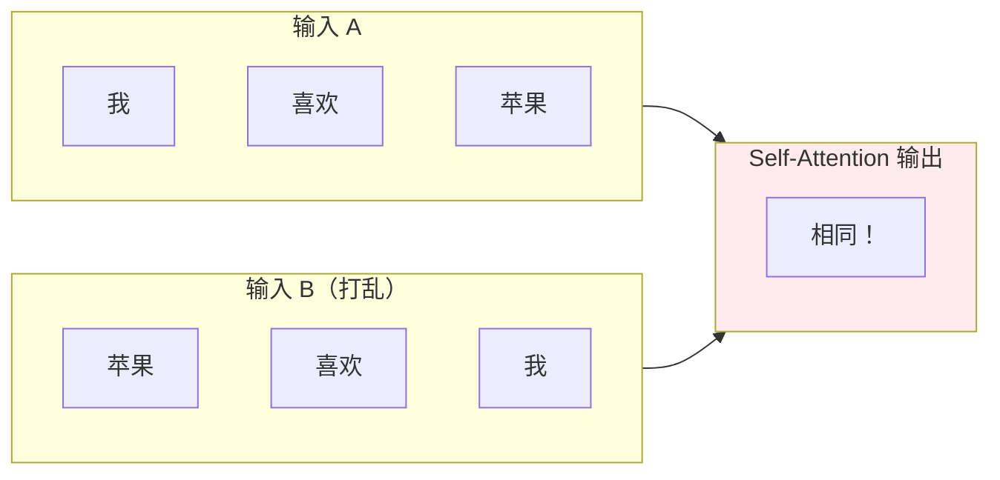
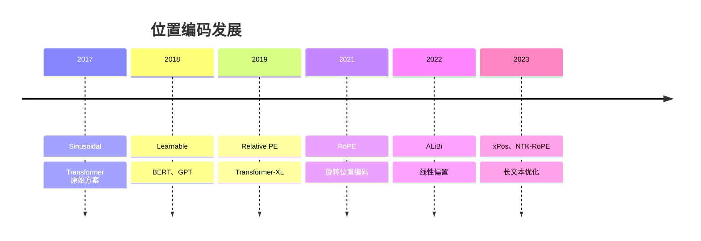
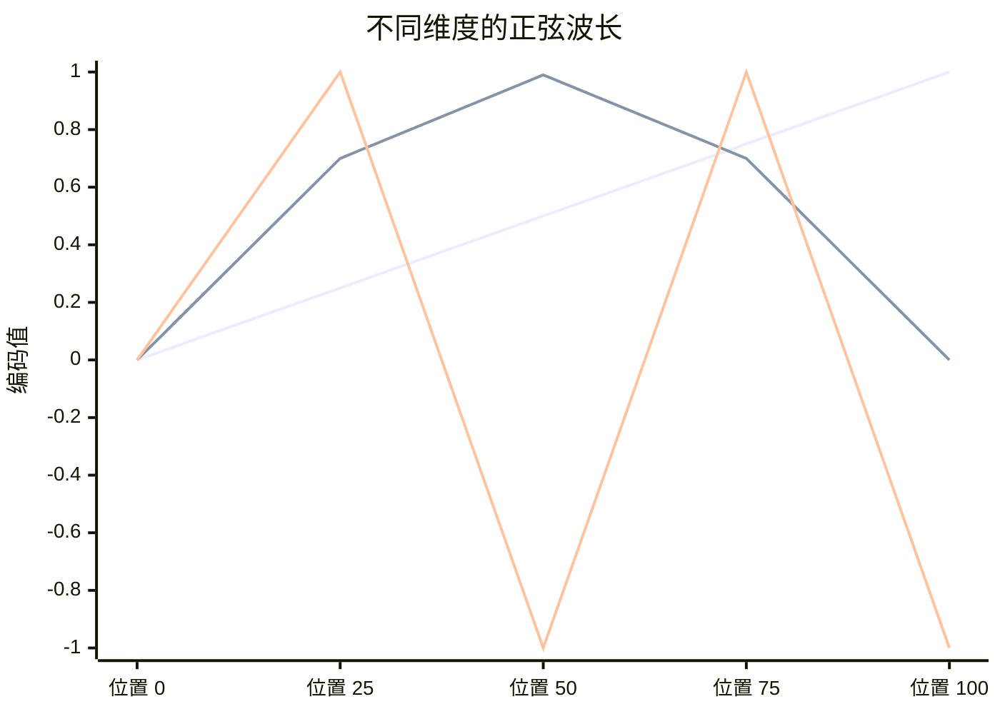
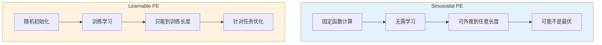
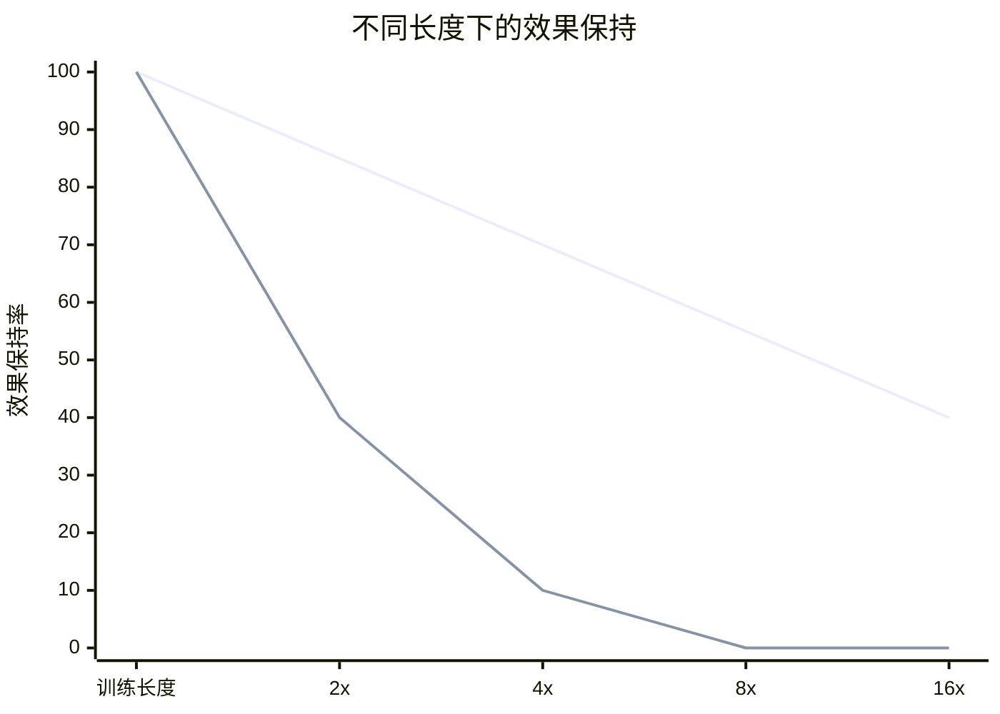
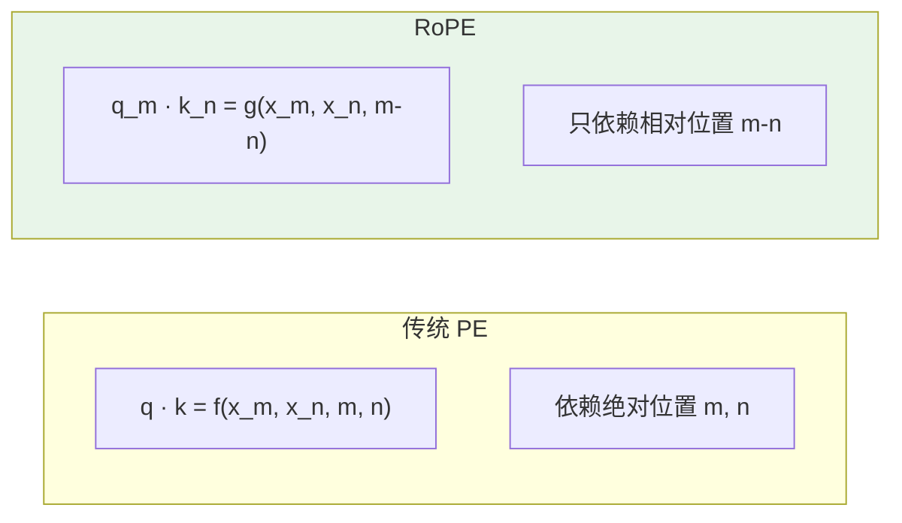

# 位置编码详解

> Transformer 位置编码原理与实现：Sinusoidal、Learnable、RoPE、ALiBi

---

## 一、概念与原理

### 1.1 为什么需要位置编码？

**核心问题：Self-Attention 是位置无关的（Permutation Invariant）**



**问题：**
- "我喜欢苹果" 和 "苹果喜欢我" 在 Self-Attention 看来是一样的
- 但语义完全不同！

**解决方案：位置编码（Positional Encoding）**

给每个位置注入唯一的位置信息，让模型感知顺序。

### 1.2 位置编码方案演进



### 1.3 方案对比

| 方案 | 类型 | 外推性 | 计算 | 代表模型 |
|------|------|--------|------|----------|
| **Sinusoidal** | 绝对 | ⚠️ 中等 | ✅ 简单 | 原始 Transformer |
| **Learnable** | 绝对 | ❌ 差 | ✅ 简单 | BERT、GPT-2 |
| **Relative PE** | 相对 | ✅ 好 | ⚠️ 复杂 | Transformer-XL |
| **RoPE** | 相对 | ✅ 好 | ✅ 简单 | LLaMA、PaLM |
| **ALiBi** | 相对 | ✅ 极好 | ✅ 最简单 | MPT、BLOOM |

---

## 二、面试题详解

### 题目 1：Sinusoidal 位置编码的公式是什么？为什么用正弦/余弦？

#### 考察点
- Sinusoidal 编码原理
- 公式推导
- 设计优势

#### 详细解答

**公式：**

$$PE_{(pos, 2i)} = \sin\left(\frac{pos}{10000^{2i/d_{model}}}\right)$$

$$PE_{(pos, 2i+1)} = \cos\left(\frac{pos}{10000^{2i/d_{model}}}\right)$$

**参数说明：**

| 符号 | 含义 | 示例值 |
|------|------|--------|
| `pos` | 词在序列中的位置 | 0, 1, 2, ..., n |
| `i` | 维度索引 | 0, 1, 2, ..., d/2-1 |
| `d_model` | 模型维度 | 512, 768, 1024 |
| `10000` | 温度系数 | 控制波长范围 |

**为什么用正弦/余弦？**



**核心优势：**

1. **唯一性**：每个位置有唯一的编码
2. **有界性**：值域 [-1, 1]，不会爆炸
3. **相对位置可推导**：
   ```
   sin(pos + k) 可以用 sin(pos) 和 cos(pos) 线性表示
   → 模型可以学习相对位置关系
   ```
4. **可外推**：可以泛化到训练时未见过的长度

**波长分析：**

```
维度 i 的波长 = 2π × 10000^(2i/d)

i = 0:    波长 ≈ 2π × 1 = 6.28      (低频，变化慢)
i = d/4:  波长 ≈ 2π × 100 = 628     (中频)
i = d/2:  波长 ≈ 2π × 10000 = 62831 (高频，变化快)

→ 不同维度编码不同尺度的位置信息
```

**Java 伪代码：**

```java
public class SinusoidalPositionalEncoding {
    
    private final int d_model;
    private final int max_len;
    private final Matrix pe;  // 预计算的位置编码 [max_len, d_model]
    
    public SinusoidalPositionalEncoding(int d_model, int max_len) {
        this.d_model = d_model;
        this.max_len = max_len;
        this.pe = new Matrix(max_len, d_model);
        
        // 预计算位置编码
        for (int pos = 0; pos < max_len; pos++) {
            for (int i = 0; i < d_model; i += 2) {
                // 计算角度
                double angle = pos / Math.pow(10000, 2.0 * i / d_model);
                
                // 偶数维度用 sin
                pe.set(pos, i, Math.sin(angle));
                
                // 奇数维度用 cos
                if (i + 1 < d_model) {
                    pe.set(pos, i + 1, Math.cos(angle));
                }
            }
        }
    }
    
    /**
     * 将位置编码加到输入嵌入上
     * @param x 输入 [batch, seq_len, d_model]
     * @return 加上位置编码后的输出
     */
    public Tensor addPositionalEncoding(Tensor x) {
        int seq_len = x.shape[1];
        
        // 取前 seq_len 个位置编码
        Tensor pe_slice = pe.slice(0, seq_len);  // [seq_len, d_model]
        
        // 广播加法: [batch, seq_len, d_model] + [seq_len, d_model]
        return x.add(pe_slice);
    }
}
```

---

### 题目 2：可学习位置编码（Learnable PE）和 Sinusoidal 有什么区别？各有什么优缺点？

#### 考察点
- 两种方案的对比
- 优缺点分析
- 适用场景

#### 详细解答

**方案对比：**



**详细对比：**

| 维度 | Sinusoidal | Learnable |
|------|------------|-----------|
| **实现** | 固定函数 | 可训练参数 |
| **参数量** | 0 | max_len × d_model |
| **训练** | 无需学习 | 需要学习 |
| **外推性** | ✅ 好 | ❌ 差 |
| **灵活性** | ⚠️ 固定模式 | ✅ 任务自适应 |
| **优化** | ⚠️ 可能次优 | ✅ 可达最优 |
| **代表模型** | 原始 Transformer | BERT、GPT-2 |

**外推性问题（Learnable 的致命伤）：**

```
训练时：最大长度 512
PE 参数：[512, d_model]

推理时：长度 1000
→ 位置 512-999 没有对应的 PE 参数！
→ 只能随机初始化或用位置 511 的 PE
→ 效果急剧下降

Sinusoidal 没有这个问题：
→ 公式可以计算任意位置的编码
→ 训练长度 512，推理长度 2000 也没问题
```

**实际表现：**



**Java 伪代码（Learnable）：**

```java
public class LearnablePositionalEncoding {
    
    private final int d_model;
    private final int max_len;
    private final Parameter pe;  // 可训练参数 [max_len, d_model]
    
    public LearnablePositionalEncoding(int d_model, int max_len) {
        this.d_model = d_model;
        this.max_len = max_len;
        
        // 随机初始化位置编码参数
        this.pe = new Parameter(max_len, d_model);
        initializeUniform(pe, -0.02, 0.02);
    }
    
    public Tensor forward(Tensor x) {
        int seq_len = x.shape[1];
        
        if (seq_len > max_len) {
            throw new RuntimeException(
                "序列长度 " + seq_len + " 超过最大长度 " + max_len
            );
        }
        
        // 取对应长度的位置编码
        Tensor pe_slice = pe.slice(0, seq_len);  // [seq_len, d_model]
        
        return x.add(pe_slice);
    }
}
```

---

### 题目 3：RoPE（旋转位置编码）是什么？相比传统方案有什么优势？

#### 考察点
- RoPE 原理
- 旋转矩阵
- 相对位置建模

#### 详细解答

**核心思想：**

```
传统方案：位置编码加到输入上
x_pe = x + PE(pos)

RoPE：通过旋转矩阵注入位置信息
q_rot = R(pos) · q
k_rot = R(pos) · k
```

**旋转矩阵：**

对于二维向量，旋转角度 θ：

$$R(\theta) = \begin{bmatrix} \cos\theta & -\sin\theta \\ \sin\theta & \cos\theta \end{bmatrix}$$

**RoPE 计算：**

```
对于位置 m 的 query 向量 q：

将 q 分成 d/2 对，每对 [q_2i, q_2i+1] 旋转角度 m·θ_i

[q_2i  ]   [cos(m·θ_i)  -sin(m·θ_i)]   [q_2i  ]
[q_2i+1] = [sin(m·θ_i)   cos(m·θ_i)] · [q_2i+1]

其中 θ_i = 10000^(-2i/d)
```

**为什么 RoPE 好？**



**核心优势：**

1. **相对位置内积保持**
   ```
   q_m · k_n 只依赖于 (m-n)，不依赖于 m 和 n 本身
   → 更好的相对位置建模
   ```

2. **长文本外推性好**
   ```
   训练长度 2048，推理长度 8192
   RoPE 的效果保持远超其他方案
   ```

3. **与 Attention 完美融合**
   ```
   位置信息直接融入 q/k 计算
   不需要额外的加法操作
   ```

**代表模型：**
- LLaMA、LLaMA-2
- PaLM、PaLM-2
- ChatGLM
- 大多数现代开源大模型

**Java 伪代码：**

```java
public class RoPE {
    
    private final int d_model;
    private final double[] theta;  // 每对维度的旋转角度基数
    
    public RoPE(int d_model) {
        this.d_model = d_model;
        this.theta = new double[d_model / 2];
        
        // 计算每对维度的旋转角度基数
        for (int i = 0; i < d_model / 2; i++) {
            theta[i] = Math.pow(10000, -2.0 * i / d_model);
        }
    }
    
    /**
     * 应用旋转位置编码
     * @param x 输入向量 [batch, seq_len, d_model]
     * @param positions 位置索引 [seq_len]
     * @return 旋转后的向量
     */
    public Tensor apply(Tensor x, int[] positions) {
        int batch = x.shape[0];
        int seq_len = x.shape[1];
        Tensor output = x.copy();
        
        for (int b = 0; b < batch; b++) {
            for (int pos_idx = 0; pos_idx < seq_len; pos_idx++) {
                int m = positions[pos_idx];  // 当前位置
                
                // 对每对维度应用旋转
                for (int i = 0; i < d_model / 2; i++) {
                    double angle = m * theta[i];
                    double cos = Math.cos(angle);
                    double sin = Math.sin(angle);
                    
                    int idx1 = 2 * i;
                    int idx2 = 2 * i + 1;
                    
                    double x1 = x.get(b, pos_idx, idx1);
                    double x2 = x.get(b, pos_idx, idx2);
                    
                    // 旋转
                    output.set(b, pos_idx, idx1, x1 * cos - x2 * sin);
                    output.set(b, pos_idx, idx2, x1 * sin + x2 * cos);
                }
            }
        }
        
        return output;
    }
}
```

---

## 三、总结

### 面试回答模板

> 位置编码解决 Transformer 位置无关的问题，让模型感知序列顺序。
>
> **Sinusoidal**：固定正弦/余弦函数，可外推，但可能不是最优。
> **Learnable**：可训练参数，针对任务优化，但无法外推。
> **RoPE**：旋转位置编码，通过旋转矩阵注入位置，相对位置内积保持，外推性好，是现代大模型主流方案。
>
> 选择建议：长文本场景优先 RoPE 或 ALiBi，短文本可用 Learnable。

### 一句话记忆

| 方案 | 一句话 |
|------|--------|
| **Sinusoidal** | 正弦余弦固定算，可外推但非最优 |
| **Learnable** | 参数训练任务优，超长序列就抓瞎 |
| **RoPE** | 旋转矩阵融 QK，相对位置内积佳 |
| **ALiBi** | 线性偏置最简单，超长外推它最行 |

---

> 💡 **提示**：RoPE 是现代大模型的标配，理解旋转矩阵和相对位置建模是面试重点。