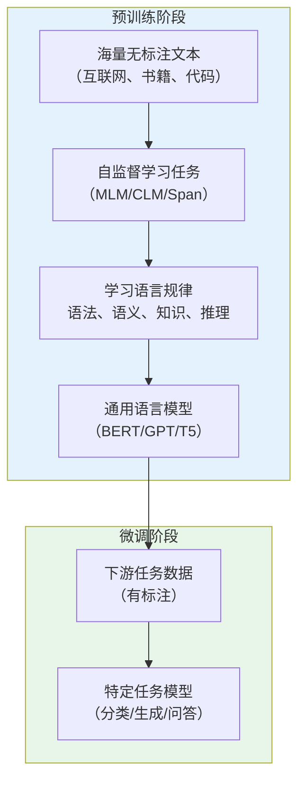
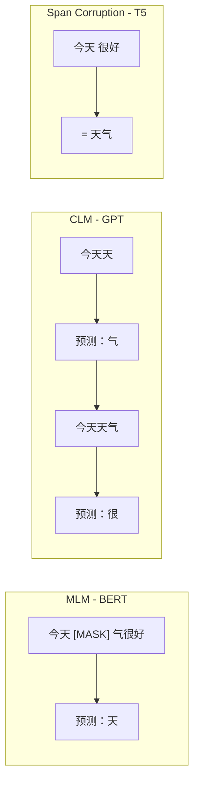
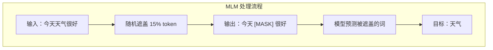
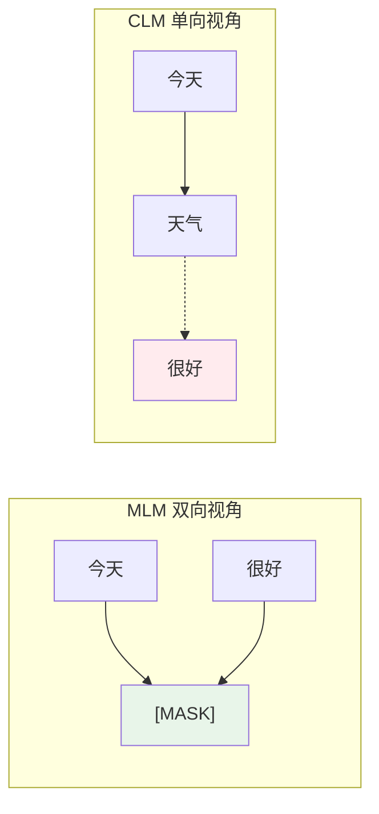
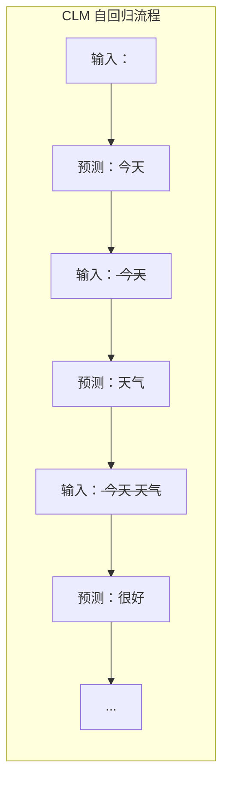

# 预训练任务详解

> MLM、CLM、Span Corruption 等大模型预训练核心任务

---

## 一、概念与原理

### 1.1 什么是预训练？

**预训练（Pre-training）** 是大语言模型的第一阶段训练，通过在海量无标注文本上学习语言规律，让模型获得通用的语言理解和生成能力。



### 1.2 预训练任务分类

| 任务类型 | 代表模型 | 核心思想 | 特点 |
|---------|---------|---------|------|
| **MLM** (Masked Language Model) | BERT、RoBERTa | 遮盖部分 token，预测原词 | 双向编码，适合理解任务 |
| **CLM** (Causal Language Model) | GPT 系列 | 自回归预测下一个 token | 单向生成，适合生成任务 |
| **Span Corruption** | T5、UL2 | 遮盖连续片段，生成完整文本 | 编码器-解码器，灵活统一 |

### 1.3 三种任务对比



---

## 二、面试题详解

### 题目 1：MLM（Masked Language Model）的原理是什么？为什么 BERT 选择 MLM？

#### 考察点
- MLM 机制理解
- 与 CLM 的对比
- 双向编码的优势

#### 详细解答

**MLM 原理：**



**具体实现：**

```
原始句子：今天天气很好，我想去公园散步

遮盖策略（15% 概率）：
- 80% 概率 → [MASK]：今天 [MASK] 很好
- 10% 概率 → 随机词：今天 苹果 很好  
- 10% 概率 → 不变：今天 天气 很好

模型输入：今天 [MASK] 很好，我想去公园散步
模型输出：天气
```

**为什么 BERT 选择 MLM？**

| 优势 | 说明 |
|------|------|
| **双向上下文** | 预测时可以同时看到左右两边的信息 |
| **深层语义** | 必须理解完整句子才能预测 |
| **适合理解任务** | 分类、抽取等 NLU 任务效果好 |

**与 CLM 的对比：**



**MLM 的优势场景：**
- 文本分类（情感分析、主题分类）
- 命名实体识别（NER）
- 问答系统（抽取式）
- 句子相似度判断

**Java 伪代码：**

```java
/**
 * MLM 数据预处理
 * 
 * 核心思想：随机遮盖 15% 的 token，让模型预测原词
 */
public class MLMPreprocessor {
    
    private final double maskRatio = 0.15;      // 遮盖比例
    private final double maskTokenRatio = 0.8;  // 80% 用 [MASK] 替换
    private final double randomTokenRatio = 0.1; // 10% 用随机词替换
    
    /**
     * 对输入句子进行 MLM 遮盖
     * @param tokens 原始 token 列表
     * @return 遮盖后的结果
     */
    public MLMResult maskTokens(List<String> tokens) {
        int n = tokens.size();
        int maskCount = (int) (n * maskRatio);
        
        // 随机选择要遮盖的位置
        List<Integer> maskPositions = randomSample(n, maskCount);
        
        List<String> maskedTokens = new ArrayList<>(tokens);
        List<MaskLabel> labels = new ArrayList<>();
        
        for (int pos : maskPositions) {
            String originalToken = tokens.get(pos);
            double rand = Math.random();
            
            if (rand < maskTokenRatio) {
                // 80% 概率替换为 [MASK]
                maskedTokens.set(pos, "[MASK]");
            } else if (rand < maskTokenRatio + randomTokenRatio) {
                // 10% 概率替换为随机词
                maskedTokens.set(pos, getRandomToken());
            }
            // 10% 概率保持不变
            
            // 记录标签（始终预测原词）
            labels.add(new MaskLabel(pos, originalToken));
        }
        
        return new MLMResult(maskedTokens, labels);
    }
    
    /**
     * MLM 损失计算
     */
    public double calculateMLMLoss(Matrix predictions, List<MaskLabel> labels) {
        double loss = 0;
        
        for (MaskLabel label : labels) {
            int pos = label.position;
            String targetToken = label.token;
            int targetId = vocab.getId(targetToken);
            
            // 取出该位置的预测分布 [vocab_size]
            Matrix pred = predictions.row(pos);
            
            // 交叉熵损失
            loss += crossEntropy(pred, targetId);
        }
        
        return loss / labels.size();
    }
}

/**
 * MLM 结果
 */
@Data
class MLMResult {
    private List<String> maskedTokens;  // 遮盖后的 token 序列
    private List<MaskLabel> labels;      // 被遮盖的位置和原词
}

@Data
class MaskLabel {
    private int position;   // 被遮盖的位置
    private String token;   // 原词
}
```

---

### 题目 2：CLM（Causal Language Model）的原理是什么？为什么 GPT 系列使用 CLM？

#### 考察点
- CLM 机制理解
- 自回归生成原理
- 与 MLM 的优劣对比

#### 详细解答

**CLM 原理：**



**核心思想：** 从左到右逐个预测，每个位置只能看到前面的信息。

**数学表达：**

$$P(x_1, x_2, ..., x_n) = \prod_{i=1}^{n} P(x_i | x_1, x_2, ..., x_{i-1})$$

**Masked Self-Attention 实现：**

```
注意力矩阵（因果掩码）：
      今天  天气  很好  。
今天  [1    0    0    0]   ← 只能看自己
天气  [1    1    0    0]   ← 能看"今天"和"天气"
很好  [1    1    1    0]   ← 能看"今天天气很好"
  。  [1    1    1    1]   ← 能看全部

1 = 允许关注，0 = 禁止（mask 为 -∞）
```

**为什么 GPT 选择 CLM？**

| 优势 | 说明 |
|------|------|
| **天然适合生成** | 自回归方式与人类写作一致 |
| **统一框架** | 训练和推理方式相同 |
| **可扩展性强** | 容易扩展到超长文本 |
| **涌现能力** | 大模型展现出 In-context Learning |

**CLM 的优势场景：**
- 文本生成（文章、代码、对话）
- 机器翻译（自回归解码）
- 摘要生成
- 对话系统

**CLM vs MLM：**

| 维度 | CLM (GPT) | MLM (BERT) |
|------|-----------|------------|
| **编码方向** | 单向（左→右） | 双向 |
| **适合任务** | 生成任务 | 理解任务 |
| **训练效率** | 每个位置都预测 | 只预测 15% |
| **上下文利用** | 只能看左边 | 能看两边 |
| **代表模型** | GPT-3/4、LLaMA | BERT、RoBERTa |

**Java 伪代码：**

```java
/**
 * CLM 自回归生成
 * 
 * 核心思想：从左到右逐个预测，使用因果掩码防止看到未来信息
 */
public class CLMGenerator {
    
    private final TransformerModel model;
    private final Tokenizer tokenizer;
    private final int maxLength;
    
    /**
     * 生成文本（自回归）
     * @param prompt 输入提示
     * @param maxNewTokens 最大生成 token 数
     * @return 生成的文本
     */
    public String generate(String prompt, int maxNewTokens) {
        List<Integer> inputIds = tokenizer.encode(prompt);
        
        for (int i = 0; i < maxNewTokens; i++) {
            // 1. 准备输入（当前已生成的所有 token）
            int[] currentInput = inputIds.stream().mapToInt(Integer::intValue).toArray();
            
            // 2. 前向传播（带因果掩码）
            Matrix logits = model.forwardWithCausalMask(currentInput);
            
            // 3. 取最后一个位置的预测 [vocab_size]
            Matrix lastLogits = logits.row(logits.rows - 1);
            
            // 4. 采样下一个 token
            int nextToken = sample(lastLogits, temperature=0.8);
            
            // 5. 添加到序列
            inputIds.add(nextToken);
            
            // 6. 检查结束符
            if (nextToken == tokenizer.eosTokenId()) {
                break;
            }
        }
        
        return tokenizer.decode(inputIds);
    }
    
    /**
     * 带因果掩码的前向传播
     */
    public Matrix forwardWithCausalMask(int[] inputIds) {
        // 1. Embedding
        Matrix hidden = embedding(inputIds);
        
        // 2. 多层 Transformer（每层都应用因果掩码）
        for (TransformerLayer layer : layers) {
            hidden = layer.forward(hidden, causalMask=true);
        }
        
        // 3. 输出投影到词表
        return hidden.multiply(outputProjection);
    }
}

/**
 * 因果掩码生成
 */
public class CausalMask {
    
    /**
     * 生成因果掩码矩阵
     * @param