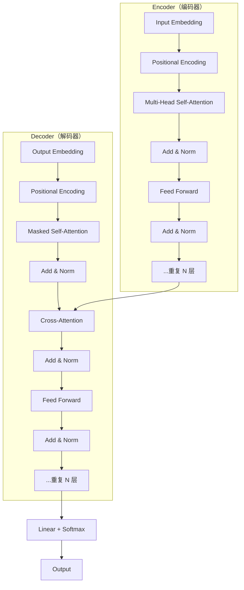
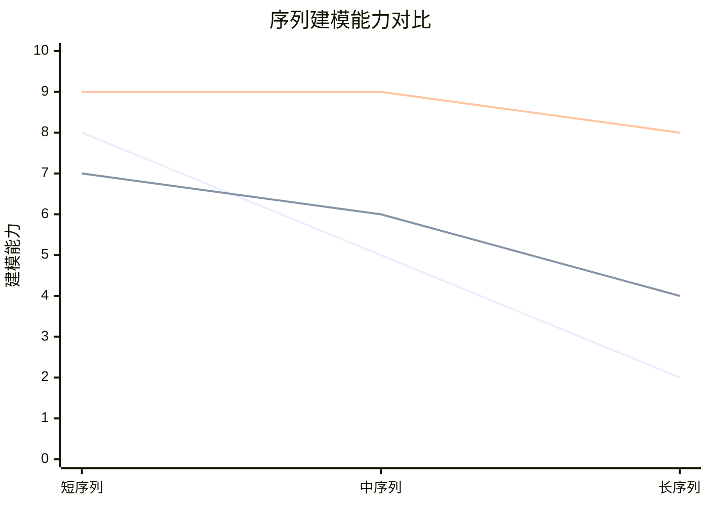
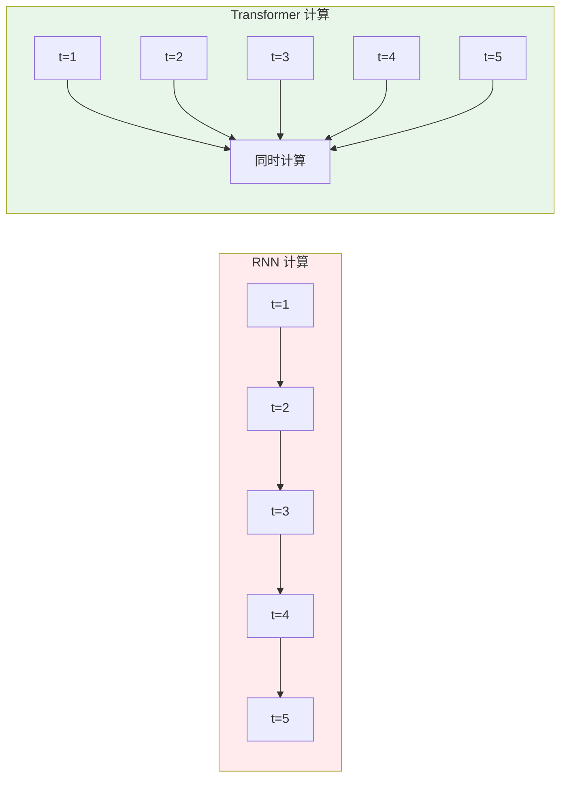
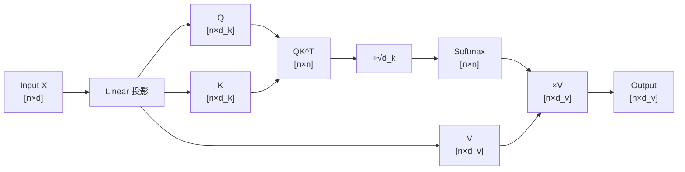
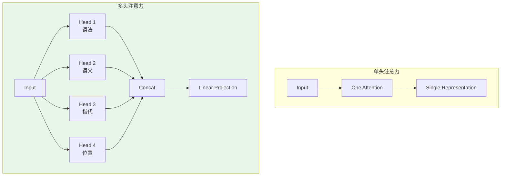
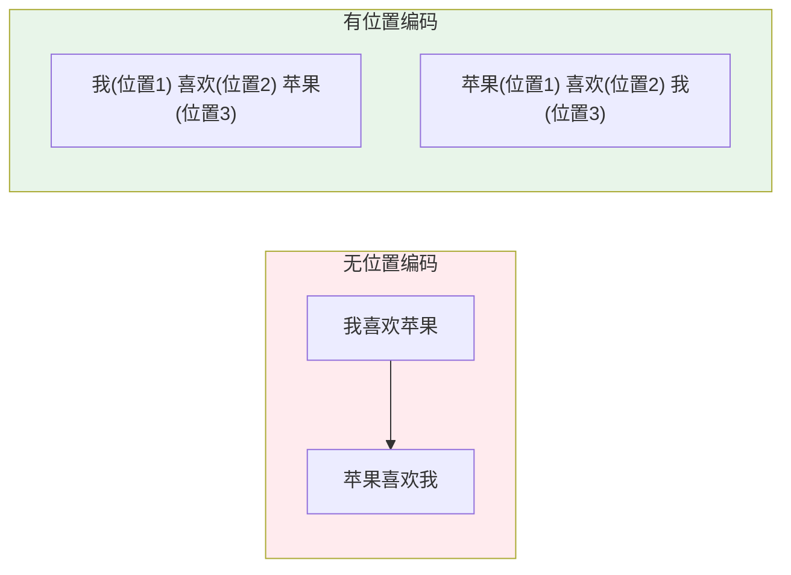
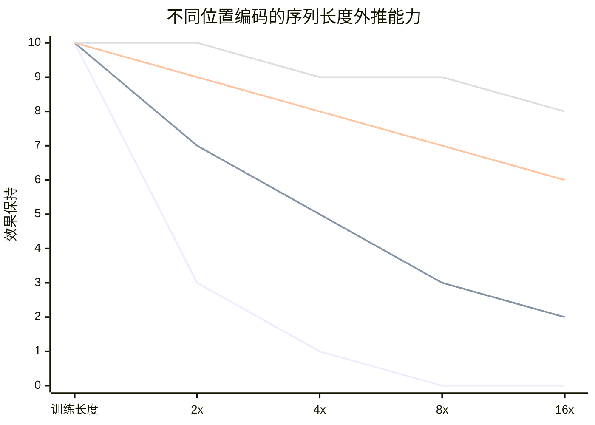

# Transformer 架构详解

> 大模型底层原理，AI Agent 面试必考基础

---

## 一、概念与原理

### 1.1 什么是 Transformer？

**Transformer** 是 Google 在 2017 年提出的深度学习架构，论文《Attention Is All You Need》彻底改变了 NLP 领域。

**核心创新：**
- ❌ 摒弃了 RNN/LSTM 的循环结构
- ✅ 完全基于 **Self-Attention（自注意力）** 机制
- ✅ 支持并行计算，训练效率大幅提升
- ✅ 长距离依赖建模能力强

### 1.2 整体架构



**原始 Transformer 结构：**
- **Encoder**：6 层，每层包含 Multi-Head Attention + Feed Forward
- **Decoder**：6 层，每层包含 Masked Self-Attention + Cross-Attention + Feed Forward

### 1.3 核心组件

| 组件 | 功能 | 关键特性 |
|------|------|----------|
| **Self-Attention** | 计算序列中每个位置与其他位置的相关性 | 并行计算、全局依赖 |
| **Multi-Head** | 多组注意力并行，捕获不同子空间信息 | 增强表达能力 |
| **Feed Forward** | 对每个位置独立进行非线性变换 | 增加模型容量 |
| **Layer Norm** | 归一化，稳定训练 | 加速收敛 |
| **Residual** | 残差连接，缓解梯度消失 | 支持深层网络 |
| **Positional Encoding** | 注入位置信息 | 弥补无循环结构的缺陷 |

### 1.4 与 RNN/CNN 的对比



| 维度 | RNN | CNN | Transformer |
|------|-----|-----|-------------|
| **并行性** | ❌ 序列计算 | ⚠️ 局部并行 | ✅ 完全并行 |
| **长距离依赖** | ❌ 梯度消失 | ⚠️ 感受野受限 | ✅ 直接连接 |
| **训练速度** | ❌ 慢 | ⚠️ 中等 | ✅ 快 |
| **位置信息** | ✅ 天然有序 | ⚠️ 需特殊设计 | ⚠️ 需位置编码 |
| **计算复杂度** | O(n) | O(n log n) | O(n²) |

---

## 二、面试题详解

### 题目 1：Transformer 为什么比 RNN 快？并行计算是如何实现的？

#### 考察点
- 对两种架构计算方式的理解
- 并行计算原理
- 时间复杂度分析

#### 详细解答

**核心原因：Self-Attention 的并行性**



**RNN 的串行瓶颈：**
```
ht = f(ht-1, xt)  // 必须等待 ht-1 计算完成
```
- 每个时间步依赖前一个时间步的隐藏状态
- 无法并行，只能顺序计算
- 时间复杂度：O(n) 步，每步 O(d)

**Transformer 的并行优势：**
```
Attention(Q, K, V) = softmax(QK^T / √d) V
```
- Q、K、V 矩阵可以同时计算
- 矩阵乘法天然适合 GPU 并行
- 整个序列一次性处理

**复杂度对比：**

| 操作 | RNN | Transformer |
|------|-----|-------------|
| 训练（每步） | O(1) 步，O(d²) 计算 | O(1) 步，O(n²·d) 计算 |
| 训练（整体） | O(n) 步 | O(1) 步 |
| 推理（每步） | O(1) 步 | O(n) 步（需缓存 KV）|

> 💡 **关键点**：Transformer 训练时完全并行，推理时通过 KV Cache 优化

**Java 伪代码示意：**

```java
public class TransformerEncoder {
    
    /**
     * 并行计算 Self-Attention
     * 输入: [batch_size, seq_len, hidden_dim]
     * 输出: [batch_size, seq_len, hidden_dim]
     */
    public Tensor selfAttention(Tensor input) {
        // 1. 并行生成 Q、K、V（矩阵乘法，GPU 并行）
        Tensor Q = linearQuery(input);  // [B, n, d]
        Tensor K = linearKey(input);    // [B, n, d]
        Tensor V = linearValue(input);  // [B, n, d]
        
        // 2. 并行计算注意力分数（矩阵乘法）
        Tensor scores = Q.matmul(K.transpose());  // [B, n, n]
        scores = scores.divide(Math.sqrt(d_k));
        scores = softmax(scores);
        
        // 3. 并行加权求和
        Tensor output = scores.matmul(V);  // [B, n, d]
        
        return output;
    }
}
```

---

### 题目 2：Self-Attention 的计算过程是怎样的？时间复杂度是多少？

#### 考察点
- Self-Attention 机制原理
- 矩阵运算过程
- 复杂度分析

#### 详细解答

**计算步骤：**



**公式：**

$$\text{Attention}(Q, K, V) = \text{softmax}\left(\frac{QK^T}{\sqrt{d_k}}\right)V$$

**详细计算流程：**

| 步骤 | 计算 | 维度变化 | 复杂度 |
|------|------|----------|--------|
| 1. 线性投影 | $Q = XW^Q$, $K = XW^K$, $V = XW^V$ | $[n×d] \to [n×d_k]$ | $O(3 \cdot n \cdot d \cdot d_k)$ |
| 2. 计算注意力分数 | $S = QK^T$ | $[n×d_k] \cdot [d_k×n] \to [n×n]$ | $O(n^2 \cdot d_k)$ |
| 3. 缩放 | $S = S / \sqrt{d_k}$ | $[n×n]$ | $O(n^2)$ |
| 4. Softmax | $A = \text{softmax}(S)$ | $[n×n]$ | $O(n^2)$ |
| 5. 加权求和 | $O = AV$ | $[n×n] \cdot [n×d_v] \to [n×d_v]$ | $O(n^2 \cdot d_v)$ |
| 6. 输出投影 | $\text{Output} = OW^O$ | $[n×d_v] \to [n×d]$ | $O(n \cdot d_v \cdot d)$ |

**总时间复杂度：$O(n^2 \cdot d)$**

- $n$：序列长度
- $d$：模型维度
- $n^2$：来自注意力矩阵的计算

**空间复杂度：$O(n^2)$**
- 需要存储 $n \times n$ 的注意力矩阵

**为什么除以 $\sqrt{d_k}$？**

```
当 d_k 较大时，QK^T 的方差会变大
→ softmax 进入梯度饱和区（极值接近 0 或 1）
→ 梯度消失

除以 √d_k 可以将方差缩放回 1
→ softmax 分布更平滑
→ 梯度更稳定
```

**Java 伪代码：**

```java
public class SelfAttention {
    
    private final int d_k;
    private final Matrix W_q, W_k, W_v, W_o;
    
    /**
     * Self-Attention 计算
     * @param X 输入矩阵 [n, d]
     * @return 输出矩阵 [n, d]
     */
    public Matrix forward(Matrix X) {
        int n = X.rows;
        
        // Step 1: 线性投影得到 Q, K, V
        Matrix Q = X.multiply(W_q);  // [n, d_k]
        Matrix K = X.multiply(W_k);  // [n, d_k]
        Matrix V = X.multiply(W_v);  // [n, d_v]
        
        // Step 2: 计算注意力分数 QK^T / sqrt(d_k)
        Matrix scores = Q.multiply(K.transpose());  // [n, n]
        scores = scores.divide(Math.sqrt(d_k));
        
        // Step 3: Softmax
        Matrix attentionWeights = softmax(scores);  // [n, n]
        
        // Step 4: 加权求和
        Matrix output = attentionWeights.multiply(V);  // [n, d_v]
        
        // Step 5: 输出投影
        return output.multiply(W_o);  // [n, d]
    }
    
    /**
     * Softmax 按行计算
     */
    private Matrix softmax(Matrix x) {
        // 每行减去最大值，防止数值溢出
        // 计算 exp
        // 每行除以行和
        // ...
    }
}
```

---

### 题目 3：Multi-Head Attention 的作用是什么？为什么要用多个头？

#### 考察点
- Multi-Head 机制理解
- 表达能力分析
- 工程实现

#### 详细解答

**核心思想：**



**为什么需要多头？**

| 原因 | 说明 |
|------|------|
| **多子空间学习** | 不同头关注不同的特征子空间（语法、语义、指代等） |
| **增强表达能力** | 单头容量有限，多头可以学习更丰富的模式 |
| **关注不同位置** | 不同头可以关注不同距离的特征 |
| **类似集成学习** | 多个弱学习器组合成强学习器 |

**计算过程：**

```
head_i = Attention(XW_i^Q, XW_i^K, XW_i^V)

MultiHead(X) = Concat(head_1, ..., head_h) W^O
```

**维度设置（以 base 模型为例）：**

| 参数 | 数值 | 说明 |
|------|------|------|
| 模型维度 d_model | 512 | 输入/输出维度 |
| 头数 h | 8 | 并行注意力头数 |
| 每头维度 d_k | 64 | d_model / h = 512 / 8 |
| 每头维度 d_v | 64 | 通常 d_k = d_v |

**为什么 d_k = d_model / h？**

```
目标：保持计算量与单头相当

单头：Q, K, V 都是 [n × d_model]
多头：每个头的 Q, K, V 是 [n × (d_model/h)]
      h 个头并行计算

总参数量：h × (d_model × d_model/h) = d_model²
与单头相同！
```

**Java 伪代码：**

```java
public class MultiHeadAttention {
    
    private final int numHeads;      // 头数，如 8
    private final int d_model;       // 模型维度，如 512
    private final int d_k;           // 每头维度，如 64
    
    private final Matrix[] W_q;      // 每个头的 W_q
    private final Matrix[] W_k;      // 每个头的 W_k
    private final Matrix[] W_v;      // 每个头的 W_v
    private final Matrix W_o;        // 输出投影
    
    public MultiHeadAttention(int numHeads, int d_model) {
        this.numHeads = numHeads;
        this.d_model = d_model;
        this.d_k = d_model / numHeads;
        
        // 初始化每个头的投影矩阵
        this.W_q = new Matrix[numHeads];
        this.W_k = new Matrix[numHeads];
        this.W_v = new Matrix[numHeads];
        
        for (int i = 0; i < numHeads; i++) {
            W_q[i] = initializeMatrix(d_model, d_k);
            W_k[i] = initializeMatrix(d_model, d_k);
            W_v[i] = initializeMatrix(d_model, d_k);
        }
        
        this.W_o = initializeMatrix(d_model, d_model);
    }
    
    public Matrix forward(Matrix X) {
        Matrix[] heads = new Matrix[numHeads];
        
        // 并行计算每个头的注意力
        for (int i = 0; i < numHeads; i++) {
            Matrix Q = X.multiply(W_q[i]);  // [n, d_k]
            Matrix K = X.multiply(W_k[i]);  // [n, d_k]
            Matrix V = X.multiply(W_v[i]);  // [n, d_k]
            
            heads[i] = selfAttention(Q, K, V);  // [n, d_k]
        }
        
        // 拼接所有头 [n, d_k × h] = [n, d_model]
        Matrix concat = concatenate(heads);  // [n, d_model]
        
        // 最终线性投影
        return concat.multiply(W_o);  // [n, d_model]
    }
    
    private Matrix selfAttention(Matrix Q, Matrix K, Matrix V) {
        Matrix scores = Q.multiply(K.transpose()).divide(Math.sqrt(d_k));
        Matrix weights = softmax(scores);
        return weights.multiply(V);
    }
}
```

---

### 题目 4：为什么 Transformer 需要位置编码？有哪些实现方式？

#### 考察点
- 位置编码的必要性
- 不同位置编码方案的对比
- RoPE 等现代方案

#### 详细解答

**为什么需要位置编码？**



**核心问题：**
- Self-Attention 是**位置无关**的（permutation invariant）
- 输入序列打乱顺序，输出完全相同
- 但语言中**顺序很重要**："我喜欢苹果" ≠ "苹果喜欢我"

**解决方案：位置编码**

向输入注入位置信息，让模型感知词的顺序。

**位置编码方案对比：**

| 方案 | 原理 | 优点 | 缺点 | 代表模型 |
|------|------|------|------|----------|
| **绝对位置编码** | 每个位置一个唯一向量 | 简单直观 | 无法处理超长序列 | 原始 Transformer |
| **可学习位置编码** | 把位置编码当参数训练 | 灵活 | 需要固定最大长度 | BERT |
| **相对位置编码** | 编码位置间的相对距离 | 外推性好 | 计算复杂 | Transformer-XL |
| **RoPE** | 旋转位置编码 | 相对位置内积保持 | 稍复杂 | LLaMA、GPT-Neo |
| **ALiBi** | 基于距离的偏置 | 训练短、推理长 | 效果略降 | MPT |

**原始 Transformer 的 Sinusoidal 位置编码：**

$$PE_{(pos, 2i)} = \sin\left(\frac{pos}{10000^{2i/d_{model}}}\right)$$

$$PE_{(pos, 2i+1)} = \cos\left(\frac{pos}{10000^{2i/d_{model}}}\right)$$

**特点：**
- 每个维度使用不同频率的正弦/余弦
- 可以外推到训练时未见过的长度
- 相对位置可以通过线性变换得到

**RoPE（旋转位置编码）原理：**

```
把 query/key 向量旋转角度 m·θ，其中 m 是位置

旋转矩阵：
[cos(mθ)  -sin(mθ)]
[sin(mθ)   cos(mθ)]

特点：
- 内积只依赖于相对位置 (m-n)
- 可以外推到任意长度
- 现代大模型主流方案
```

**不同方案的序列长度支持：**



**Java 伪代码：**

```java
public class PositionalEncoding {
    
    private final int d_model;
    private final int max_len;
    private final Matrix pe;  // 预计算的位置编码矩阵
    
    /**
     * Sinusoidal 位置编码
     */
    public PositionalEncoding(int d_model, int max_len) {
        this.d_model = d_model;
        this.max_len = max_len;
        this.pe = new Matrix(max_len, d_model);
        
        // 预计算位置编码
        for (int pos = 0; pos < max_len; pos++) {
            for (int i = 0; i < d_model; i += 2) {
                double angle = pos / Math.pow(10000, 2.0 * i / d_model);
                pe.set(pos, i, Math.sin(angle));
                if (i + 1 < d_model) {
                    pe.set(pos, i + 1, Math.cos(angle));
                }
            }
        }
    }
    
    /**
     * 将位置编码加到输入上
     * @param x 输入 [batch, seq_len, d_model]
     * @return 加上位置编码后的输出
     */
    public Tensor addPositionalEncoding(Tensor x) {
        int seq_len = x.shape[1];
        
        // 取前 seq_len 个位置编码
        Tensor pe_slice = pe.slice(0, seq_len);  // [seq_len, d_model]
        
        // 广播加法
        return x.add(pe_slice);  // [batch, seq_len, d_model]
    }
}

/**
 * RoPE 旋转位置编码（简化版）
 */
public class RoPE {
    
    private final int d_model;
    private final double[] theta;  // 每个维度的旋转角度基数
    
    public RoPE(int d_model) {
        this.d_model = d_model;
        this.theta = new double[d_model / 2];
        
        // 计算每个维度的旋转角度基数
        for (int i = 0; i < d_model / 2; i++) {
            theta[i] = Math.pow(10000, -2.0 * i / d_model);
        }
    }
    
    /**
     * 应用旋转位置编码
     * @param x 输入向量 [batch, seq_len, d_model]
     * @param positions 位置索引 [seq_len]
     * @return 旋转后的向量
     */
    public Tensor apply(Tensor x, int[] positions) {
        // 将相邻两个维度作为一对，应用旋转
        // 对于位置 m，旋转角度为 m * theta[i]
        // ...
        return rotated;
    }
}
```

---

## 三、延伸追问

### 追问 1：Transformer 的 Encoder 和 Decoder 有什么区别？

**核心区别：**

| 特性 | Encoder | Decoder |
|------|---------|---------|
| **注意力类型** | Self-Attention | Masked Self-Attention + Cross-Attention |
| **输入** | 源序列 | 目标序列（已生成部分）|
| **掩码** | 无 | 因果掩码（只能看左边）|
| **与 Encoder 交互** | 无 | Cross-Attention 接收 Encoder 输出 |
| **典型应用** | 文本理解、分类 | 文本生成、翻译 |

**为什么 Decoder 需要 Masked Self-Attention？**

```
训练时：Decoder 一次性看到完整目标序列
        但预测位置 i 时，只能使用位置 < i 的信息
        
        通过上三角掩码实现：
        [1 0 0 0]
        [1 1 0 0]  ← 位置 1 只能看到位置 0,1
        [1 1 1 0]  ← 位置 2 只能看到位置 0,1,2
        [1 1 1 1]
        
推理时：自回归生成，每次只生成一个 token
        天然满足因果性
```

---

### 追问 2：Transformer 的训练和推理效率如何？有什么优化方法？

**训练效率：**
- ✅ 完全并行，GPU 利用率高
- ❌ 内存占用大（O(n²) 的注意力矩阵）
- ❌ 长序列时显存爆炸

**推理效率：**
- ❌ 自回归生成，只能串行
- ✅ KV Cache 避免重复计算

**优化方法：**

| 优化 | 原理 | 效果 |
|------|------|------|
| **KV Cache** | 缓存已计算的 K、V | 推理速度提升 10x+ |
| **Flash Attention** | 分块计算，减少内存访问 | 训练速度提升 2-4x |
| **Gradient Checkpointing** | 重计算代替存储 | 显存减少 50%+ |
| **Mixed Precision** | FP16/BF16 训练 | 显存减少 50%，速度提升 |

---

### 追问 3：为什么现在的大模型大多是 Decoder-only（如 GPT）而不是 Encoder-Decoder（如 T5）？

**趋势变化：**
- 早期：Encoder-Decoder（翻译任务主导）
- 现在：Decoder-only（生成任务主导）

**原因：**

1. **生成任务主导**
   - 聊天、写作、代码生成都是生成任务
   - Decoder-only 更适合自回归生成

2. **训练效率**
   - Decoder-only 可以用更大的 batch size
   - 不需要配对的源-目标序列

3. **能力涌现**
   - 大 Decoder-only 模型展现出强大的 zero-shot 能力
   - In-context learning 效果好

4. **简化架构**
   - 不需要复杂的 Cross-Attention
   - 工程实现更简单

**Encoder-Decoder 仍有优势的场景：**
- 机器翻译（明确的一对多映射）
- 文本摘要（有明确输入输出）
- 需要编码器理解 + 解码器生成的任务

---

## 四、总结

### 面试回答模板

> Transformer 是一种完全基于 Self-Attention 的深度学习架构，摒弃了 RNN 的循环结构，实现了完全并行计算。
>
> **核心组件**：Multi-Head Self-Attention 捕获全局依赖，Feed Forward 增加非线性，Layer Norm 和残差连接稳定训练，位置编码注入顺序信息。
>
> **与 RNN 对比**：训练时 Transformer 可以并行处理整个序列，复杂度 O(n²·d)；RNN 必须串行计算，复杂度 O(n·d²)。但 Transformer 的 O(n²) 内存复杂度限制了长序列处理。
>
> **位置编码**：原始 Transformer 使用 Sinusoidal 编码，现代大模型多用 RoPE（旋转位置编码），具有更好的外推能力。

### 一句话记忆

| 概念 | 一句话 |
|------|--------|
| **Transformer** | 用 Attention 代替循环，实现并行计算和长距离依赖建模 |
| **Self-Attention** | 计算序列中每个位置与其他所有位置的相关性，O(n²) 复杂度 |
| **Multi-Head** | 多组注意力并行，学习不同子空间的特征模式 |
| **位置编码** | 给模型注入顺序信息，RoPE 是现代大模型的主流方案 |
| **Encoder vs Decoder** | Encoder 双向理解，Decoder 单向生成，现在大模型多为 Decoder-only |

---

> 💡 **提示**：Transformer 是大模型的基石，深入理解 Self-Attention 和位置编码是面试的核心考点。
