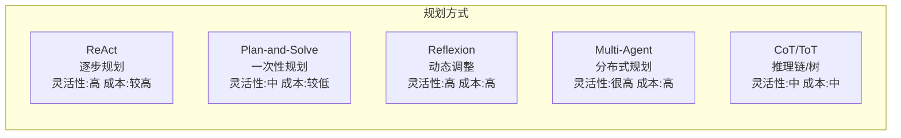

# Agent 开发范式

本目录收录 AI Agent 开发中常用的设计范式及其面试题。

## 范式索引

| 范式 | 核心思想 | 适用场景 | 面试热度 |
|------|----------|----------|----------|
| [ReAct](./react.md) | 推理+行动交替执行 | 通用多步任务 | ⭐⭐⭐⭐⭐ |
| [Plan-and-Solve](./plan-and-solve.md) | 先规划后执行 | 任务明确的场景 | ⭐⭐⭐⭐ |
| [Reflexion](./reflexion.md) | 自我反思学习 | 易出错任务 | ⭐⭐⭐⭐ |
| [Multi-Agent](./multi-agent.md) | 多智能体协作 | 复杂分工任务 | ⭐⭐⭐⭐⭐ |
| [CoT/ToT](./cot-tot.md) | 链式/树式推理 | 数学逻辑推理 | ⭐⭐⭐⭐ |

## 范式对比总览

## 面试常考组合

1. **ReAct vs Plan-and-Solve**: 什么时候选哪个？
2. **Multi-Agent 通信机制**: 如何设计 Agent 间的协作？
3. **Reflexion 记忆设计**: 短期记忆 vs 长期记忆
4. **ToT 搜索策略**: BFS vs DFS vs Beam Search
