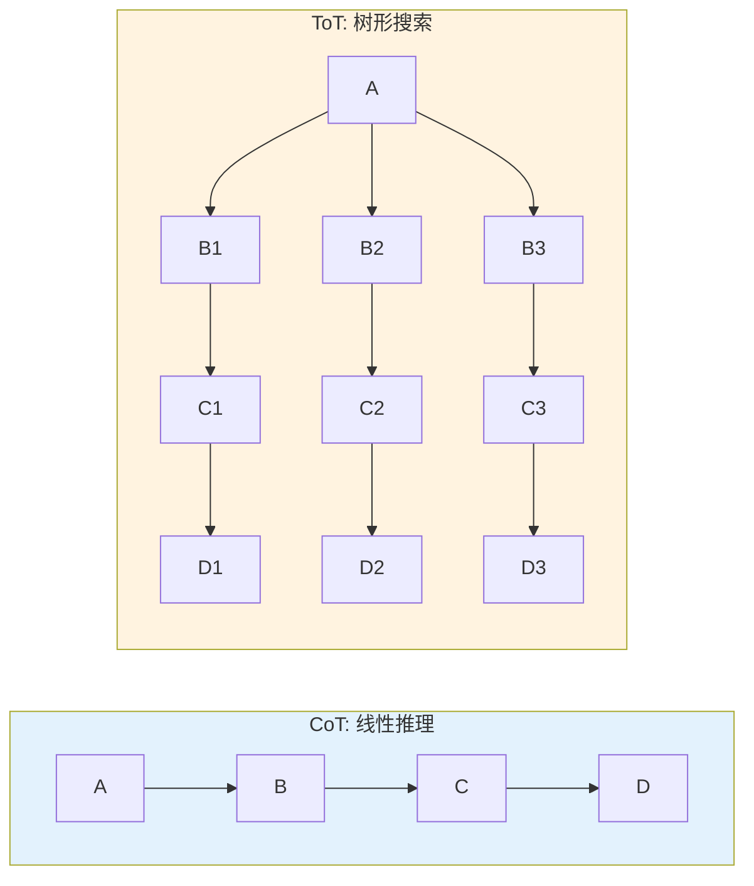
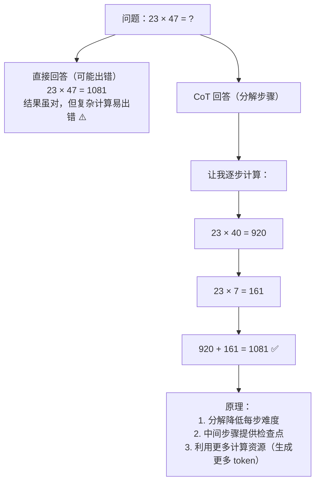
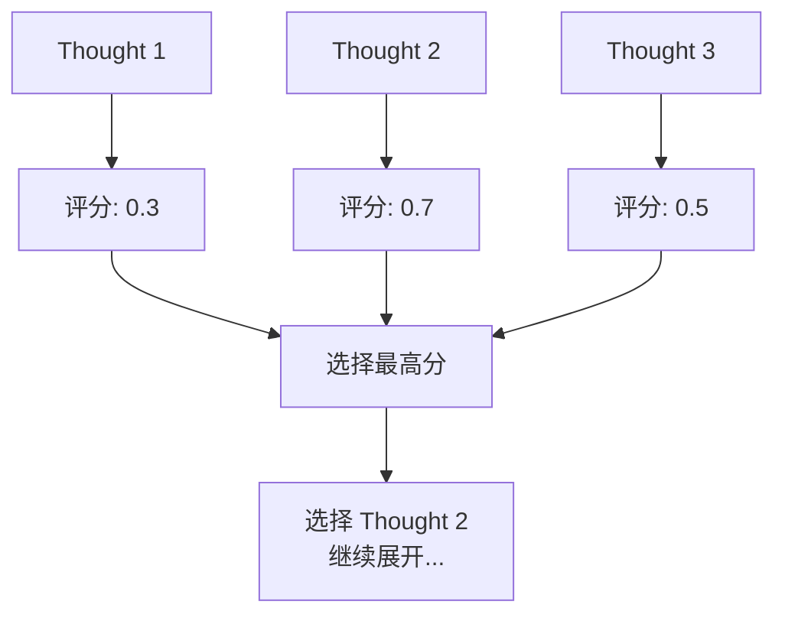
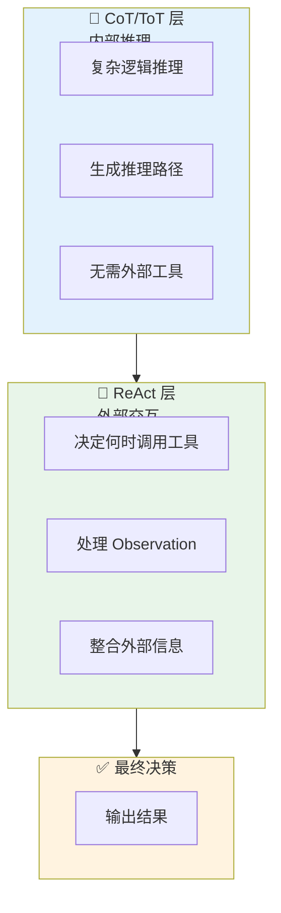

# Chain-of-Thought / Tree-of-Thought 详解

## 一、概念与原理

### 1.1 Chain-of-Thought (CoT)

**CoT** 是一种通过提示让模型**逐步推理**的技术。核心思想是让模型在给出最终答案前，先生成中间的推理步骤。

**经典 Prompt：**
```
Let's think step by step.
```

### 1.2 Tree-of-Thought (ToT)

**ToT** 在 CoT 基础上进一步扩展，允许模型**探索多条推理路径**，像树一样进行搜索，而不是单一路径。



评估后选择最优路径

### 1.3 变体对比

| 变体 | 核心思想 | 适用场景 |
|------|----------|----------|
| **Zero-shot CoT** | 直接加"Let's think step by step" | 通用推理任务 |
| **Few-shot CoT** | 提供推理示例 | 需要特定推理格式 |
| **Self-Consistency** | 多次采样，取多数答案 | 答案不稳定的任务 |
| **Auto-CoT** | 自动构建示例 | 示例难以人工编写 |
| **ToT-BFS** | 广度优先搜索 | 需要评估中间状态 |
| **ToT-DFS** | 深度优先搜索 | 需要深入探索 |

---

## 二、面试题详解

### 题目 1：CoT 为什么能提升模型推理能力？原理是什么？

#### 考察点
- 对 LLM 工作机制的理解
- Prompt Engineering 原理
- 计算资源利用

#### 详细解答

**核心原理：分解 + 中间监督**



**为什么有效？**

1. **任务分解（Decomposition）**
   - 复杂问题 → 多个简单子问题
   - 每步只需处理有限信息
   - 降低认知负荷

2. **中间监督（Intermediate Supervision）**
   - 每步都有明确的输出
   - 错误可以在中间步骤被发现
   - 避免错误累积到最终答案

3. **计算资源利用**
   ```
   直接回答：输入 10 tokens → 输出 5 tokens
   CoT 回答：输入 10 tokens → 输出 50 tokens
   
   更多的生成 = 更多的"思考时间"
   ```

4. **激活相关知识**
   - 逐步推理激活了相关的数学/逻辑知识
   - 类似人类解题时的"草稿纸"过程

**实验数据（来自 Google CoT 论文）：**

| 模型 | 直接回答 | CoT 回答 | 提升 |
|------|----------|----------|------|
| PaLM 540B | 33% | 57% | +24% |
| GPT-3.5 | 55% | 78% | +23% |

---

### 题目 2：ToT 的评估函数（Evaluator）如何设计？有哪些策略？

#### 考察点
- 搜索算法理解
- 评估指标设计
- 启发式函数

#### 详细解答

**评估函数的作用：**



**评估策略：**

**1. 基于规则的评估**

```python
# 数学问题：检查中间步骤是否正确
def evaluate_math_step(step: str, problem: str) -> float:
    """
    评估数学推理步骤的质量
    """
    score = 0.0
    
    # 检查是否包含计算过程
    if contains_calculation(step):
        score += 0.3
    
    # 检查计算是否正确（用计算器验证）
    if verify_calculation(step):
        score += 0.5
    
    # 检查是否朝着解题方向前进
    if is_progressing_toward_solution(step, problem):
        score += 0.2
    
    return score
```

**2. 基于 LLM 的评估**

```python
# 用另一个 LLM 评估
EVALUATION_PROMPT = """
请评估以下推理步骤的质量：

问题：{problem}
当前步骤：{step}

请从以下维度评分（1-10分）：
1. 逻辑合理性：步骤是否符合逻辑？
2. 正确性：推理是否正确？
3. 有用性：是否朝着解决问题前进？

输出格式：
逻辑合理性: X
正确性: Y
有用性: Z
总分: (X+Y+Z)/3
"""

def llm_evaluate(step: str, problem: str) -> float:
    response = llm.complete(EVALUATION_PROMPT.format(
        problem=problem,
        step=step
    ))
    return parse_score(response)
```

**3. 基于环境反馈的评估**

```python
# 编程任务：运行代码看结果
def evaluate_code_step(code: str, test_cases: List[TestCase]) -> float:
    """
    评估代码生成步骤
    """
    passed = 0
    for test in test_cases:
        try:
            result = execute_code(code, test.input)
            if result == test.expected:
                passed += 1
        except Exception:
            pass
    
    return passed / len(test_cases)
```

**4. 多维度综合评估**

```java
public class ToTEvaluator {
    
    public EvaluationResult evaluate(Thought thought, Problem problem) {
        double logicScore = evaluateLogic(thought);
        double progressScore = evaluateProgress(thought, problem);
        double noveltyScore = evaluateNovelty(thought);  // 避免重复思路
        double coherenceScore = evaluateCoherence(thought);
        
        // 加权综合
        double totalScore = 
            logicScore * 0.3 +
            progressScore * 0.4 +
            noveltyScore * 0.2 +
            coherenceScore * 0.1;
        
        return new EvaluationResult(totalScore, 
            Map.of("logic", logicScore, 
                   "progress", progressScore,
                   "novelty", noveltyScore));
    }
}
```

**搜索策略对比：**

| 策略 | 适用场景 | 优点 | 缺点 |
|------|----------|------|------|
| **BFS** | 需要全局最优 | 能找到最优解 | 内存消耗大 |
| **DFS** | 需要深入探索 | 内存友好 | 可能陷入局部最优 |
| **Beam Search** | 平衡效率和质量 | 可控的复杂度 | 可能错过好路径 |
| **MCTS** | 不确定性高 | 平衡探索和利用 | 实现复杂 |

---

### 题目 3：CoT/ToT 和 ReAct 如何结合使用？各自负责什么？

#### 考察点
- 范式组合能力
- 架构设计
- 实际应用经验

#### 详细解答

**组合架构：**



**具体实现：**

```java
public class HybridAgent {
    
    /**
     * CoT/ToT 负责内部推理
     */
    public ReasoningChain internalReasoning(String problem) {
        // 使用 ToT 生成多条推理路径
        List<ThoughtNode> candidates = generateThoughtCandidates(problem);
        
        // 评估选择最佳路径
        ThoughtNode bestPath = selectBestPath(candidates);
        
        return extractReasoningChain(bestPath);
    }
    
    /**
     * ReAct 负责外部交互
     */
    public String run(String task) {
        String currentState = task;
        
        for (int step = 0; step < MAX_STEPS; step++) {
            // 1. 内部推理（CoT/ToT）
            ReasoningChain reasoning = internalReasoning(currentState);
            
            // 2. 决策是否需要工具
            ActionDecision decision = decideAction(reasoning);
            
            if (decision.needsTool()) {
                // 3. ReAct 模式：执行工具
                String observation = executeTool(decision.getTool(), 
                                                  decision.getInput());
                currentState = updateState(currentState, observation);
            } else {
                // 4. 直接给出答案
                return reasoning.getConclusion();
            }
        }
        
        return "达到最大步数";
    }
}
```

**使用场景示例：**

**场景：复杂数据分析任务**

```
问题："分析我司 Q1 销售数据，找出增长最快的产品线，
      并预测 Q2 趋势"

分工：

【CoT/ToT 负责】
- 设计分析思路：
  1. 计算各产品线同比增长率
  2. 对比环比变化
  3. 识别增长驱动因素
  4. 建立预测模型

【ReAct 负责】
- 调用数据库查询销售数据
- 调用计算工具做统计分析
- 调用可视化工具生成图表
- 整合结果生成报告
```

**优势：**

| 层面 | 负责 | 优势 |
|------|------|------|
| CoT/ToT | 纯推理 | 不依赖外部，快速迭代思路 |
| ReAct | 工具调用 | 获取实时、准确的外部数据 |
| 组合 | 完整方案 | 既有深度推理，又有准确数据 |

---

## 三、延伸追问

1. **"CoT 对哪些类型的任务最有效？哪些任务无效？"**
   - 有效：数学、逻辑推理、多步骤决策
   - 无效：纯知识问答、情感分析、简单分类

2. **"ToT 的搜索宽度/深度如何设置？"**
   - 宽度：根据评估函数质量，质量好可以窄一些
   - 深度：根据问题复杂度，复杂问题需要更深
   - 可以用动态调整：前期宽搜索，后期深挖掘

3. **"Self-Consistency 和 ToT 有什么区别？"**
   - Self-Consistency：多条路径独立采样，最后投票
   - ToT：路径之间有依赖，形成树结构，中间有评估
