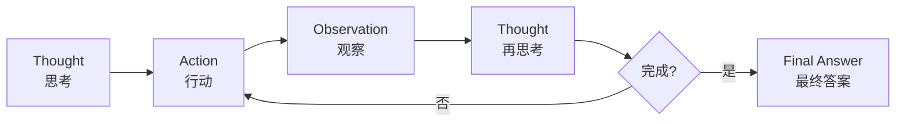
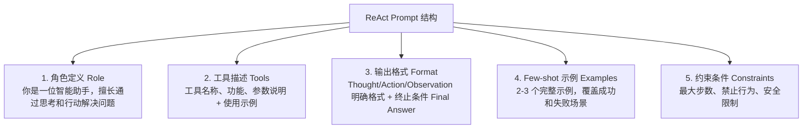

# ReAct 范式详解

## 一、概念与原理

### 1.1 什么是 ReAct？

**ReAct** = **Re**asoning + **Act**ing

由 Google Research 在 2022 年提出，核心思想是让大语言模型（LLM）**交替进行推理（Thought）和行动（Action）**，通过观察（Observation）反馈来逐步完成任务。

### 1.2 执行循环



### 1.3 为什么有效？

| 优势 | 说明 |
|------|------|
| **可解释性** | 每一步都有清晰的推理过程 |
| **错误恢复** | 通过 Observation 及时发现问题 |
| **工具集成** | 自然融入外部工具调用 |
| **人机协作** | 人类可以介入任何步骤 |

---

## 二、面试题详解

### 题目 1：ReAct 和传统的 Chain-of-Thought (CoT) 有什么区别？

#### 考察点
- 对两种范式的理解深度
- 知道各自的适用边界
- 能否结合实际场景选择

#### 详细解答

**核心区别：是否与环境交互**

| 维度 | CoT | ReAct |
|------|-----|-------|
| **核心能力** | 纯推理 | 推理 + 行动 |
| **外部交互** | ❌ 无 | ✅ 有（工具调用） |
| **信息获取** | 依赖预训练知识 | 可实时查询外部数据 |
| **适用场景** | 数学、逻辑题 | 需要实时信息的任务 |
| **成本** | 较低 | 较高（多轮调用） |

**具体例子对比：**

**场景：查询"北京今天天气，并建议穿什么衣服"**

```
【CoT 方式】
Q: 北京今天天气如何？该穿什么衣服？
A: 让我想想... 北京属于温带季风气候，3月份通常...
（❌ 模型只能基于训练数据猜测，可能过时）

【ReAct 方式】
Thought: 我需要查询北京今天的实时天气
Action: weather_api
Action Input: {"city": "北京", "date": "today"}
Observation: {"temp": 15, "weather": "晴", "wind": "3级"}

Thought: 根据天气数据，15度晴天，建议穿...
Final Answer: 建议穿薄外套...
（✅ 基于实时数据给出准确建议）
```

**选择建议：**
- 任务需要**实时数据** → 选 ReAct
- 任务纯靠**逻辑推理** → 选 CoT（成本更低）

---

### 题目 2：ReAct 的优缺点是什么？如何优化其缺点？

#### 考察点
- 系统性思维
- 工程实践经验
- 优化能力

#### 详细解答

**优点：**

1. **可解释性强**
   - 每一步 Thought 都可见
   - 便于调试和审计
   - 用户能理解 AI 的决策过程

2. **容错性好**
   - Observation 提供反馈闭环
   - 发现错误可以及时调整

3. **灵活扩展**
   - 新增工具只需修改 Prompt
   - 无需重新训练模型

**缺点及优化方案：**

| 缺点 | 影响 | 优化方案 |
|------|------|----------|
| **成本高** | 每步都调 LLM | 1. 设置最大步数限制<br>2. 使用小模型生成 Thought<br>3. 缓存常见推理路径 |
| **延迟大** | 多轮串行调用 | 1. 并行执行独立 Action<br>2. 流式输出 Thought<br>3. 预加载常用工具 |
| **易陷入循环** | 反复调用同一工具 | 1. 记录已执行 Action<br>2. 强制 Action 多样性<br>3. 设置工具调用上限 |
| **Prompt 设计难** | 模型不按格式输出 | 1. Few-shot 示例<br>2. 结构化输出（JSON/XML）<br>3. 输出校验和重试 |

**代码层面的优化示例：**

```java
public class OptimizedReActAgent {
    // 1. 防止循环：记录已执行的动作
    private Set<String> executedActions = new HashSet<>();
    
    // 2. 成本控制：动态步数限制
    private int maxSteps;
    private int currentStep = 0;
    
    public String run(String task, int complexity) {
        // 根据任务复杂度动态调整步数
        this.maxSteps = complexity > 5 ? 15 : 8;
        
        while (currentStep < maxSteps) {
            String action = generateAction();
            
            // 3. 防止重复动作
            if (executedActions.contains(action)) {
                action = generateAlternativeAction();
            }
            executedActions.add(action);
            
            // 4. 执行并观察
            String observation = execute(action);
            
            // 5. 检查是否陷入死循环
            if (isStuck(observation)) {
                return handleStuckState();
            }
            
            currentStep++;
        }
    }
}
```

---

### 题目 3：如何设计一个好的 ReAct Prompt？有哪些关键要素？

#### 考察点
- Prompt Engineering 能力
- 对模型行为的理解
- 工程实践经验

#### 详细解答

**关键要素：**



**完整 Prompt 示例：**

```
你是一位智能助手，请通过思考和行动来回答问题。

【可用工具】
1. search(query: string) - 搜索引擎，用于查询实时信息
2. calculator(expression: string) - 计算器，用于数学运算
3. weather(city: string) - 天气查询

【输出格式】
你必须严格按以下格式输出：

Thought: [你的推理过程，说明为什么采取这个行动]
Action: [工具名称，如无工具可调用则写 None]
Action Input: [传递给工具的参数]

或当任务完成时：

Final Answer: [最终答案]

【示例】
问题：北京今天气温多少？如果加10度是多少？

Thought: 我需要先查询北京今天的天气
Action: weather
Action Input: {"city": "北京"}

Observation: {"temperature": 20, "unit": "celsius"}

Thought: 现在需要计算 20 + 10
Action: calculator
Action Input: {"expression": "20 + 10"}

Observation: 30

Thought: 已经得到最终答案
Final Answer: 北京今天气温20度，加10度后是30度。

【约束】
- 最多执行 10 步
- 不要重复调用相同的工具相同的参数
- 如果无法完成任务，说明原因

现在开始回答问题：
{user_question}
```

**进阶技巧：**

1. **动态工具选择**：根据任务类型动态调整可用工具列表
2. **上下文压缩**：长对话时总结历史，避免 Token 超限
3. **错误处理示例**：在 Few-shot 中加入错误恢复的例子

---

### 题目 4：ReAct 中的 Observation 设计有什么讲究？

#### 考察点
- 对反馈机制的理解
- 接口设计能力

#### 详细解答

**Observation 的两层架构**

实际工程中，Observation 存在两个层次，两者设计要求不同：

| 层次 | 对象 | 推荐格式 | 原因 |
|------|------|----------|------|
| **工具 → 框架层**（代码层） | Agent 框架 | 结构化 JSON | 便于程序解析、错误处理、日志记录、字段提取 |
| **框架 → 模型层**（Prompt 层） | LLM 的 Thought 输入 | 自然语言摘要 | LLM 在自然语言上训练，对流畅的语句推理更稳定；原始 JSON 树容易分散注意力或引入噪音 |

> 💡 实践中常见做法：工具返回结构化 JSON，框架层从中提取关键信息，渲染成一句简洁的自然语言注入 Prompt。  
> 例如：框架消费 `{"temperature": 25, "weather": "sunny"}` → 向 LLM 输出 `"北京今日晴天，气温25°C，适合外出"`。

**Observation 的设计原则（适用于两层）：**

| 原则 | 说明 | 正例 | 反例 |
|------|------|------|------|
| **面向下一步决策** | 内容以"模型下一步需要什么"为核心，而非原始数据堆砌 | 自然语言摘要 + 结论 | 直接返回完整 API 响应或原始 HTML |
| **代码层结构化、字段稳定** | 工具返回 JSON，字段命名固定，框架可靠解析 | `{"status": "success", "data": {...}}` | 每次格式随机变化的字符串，程序无法稳定提取 |
| **Prompt 层用自然语言** | 注入 LLM 的内容应是简洁流畅的语句，而非 JSON 树 | `"查询结果：北京25°C晴，数据来源天气API"` | 把原始 JSON 整块粘贴进 Prompt |
| **信息裁剪** | 只保留与当前决策相关的内容，摘要/截断长文本 | 搜索结果返回标题 + 摘要（≤200字） | 直接把整个网页内容喂给模型 |
| **错误可恢复** | 错误信息须包含 `error_code`、`retry_after`、`suggestion`，让模型能自主决策下一步 | `{"error_code": "RATE_LIMIT", "retry_after": 60}` → `"API限流，建议60秒后重试"` | 只返回 `"error"` 或 HTTP 500 |
| **可信度与元数据** | 来源、时效、置信度等元信息随结果一并提供，让模型评估可靠性 | 自然语言中附注 `"数据来源: weather_api，更新于14:30"` | 只有裸数据，模型无法判断时效性 |
| **安全与脱敏** | 返回前过滤敏感字段（密码、Token、手机号、身份证等），防止泄露进入模型上下文 | 只返回 `username`，隐藏 `phone`/`id_card` | 将用户完整档案直接写入 Observation |

> 💡 **一句话总结：好的 Observation，本质上是给下一轮 Thought 使用的高质量上下文**——框架层用结构化 JSON 保证可靠性，Prompt 层用自然语言摘要让模型更好地推理，二者分工而非对立。

**两层设计示例：**

```python
# 工具返回结构化 JSON（框架层消费）
tool_result = {
    "status": "success",
    "data": {"temperature": 25, "weather": "sunny"},
    "metadata": {"source": "weather_api_v2", "timestamp": "2024-03-23T14:30:00Z"}
}

# 框架渲染为自然语言，注入 LLM Prompt（模型层消费）
observation_for_llm = "北京今日晴天，气温25°C（数据来源：weather_api，更新于14:30）"
```

**错误处理设计：**

```python
# 框架层结构化错误
tool_error = {
    "status": "error",
    "error_code": "RATE_LIMIT_EXCEEDED",
    "retry_after": 60
}

# 渲染给 LLM 的自然语言 Observation
observation_for_llm = "天气API调用频率超限，请60秒后重试。"
```

---

## 三、延伸追问

面试官可能会继续追问：

1. **"如果模型不遵循格式输出怎么办？"**
   - 使用结构化输出（OpenAI 的 `response_format: json_object` 或 `json_schema`）约束模型输出格式
   - 在 Prompt 中提供多个 Few-shot 示例，强化格式遵循
   - 在 Agent 框架层加入输出解析器（Output Parser），解析失败时自动触发重试，并在重试 Prompt 中明确指出上一次的格式错误
   - 结合正则表达式或 JSON Schema 做格式校验，超过重试上限时 fallback 到人工处理或降级回答

2. **"ReAct 是否适合所有任务？什么时候不该用？"**
   - **适合**：需要实时信息检索、多工具协同、任务路径不确定、需要可解释推理链的场景
   - **不适合**：
     - 任务目标和路径高度确定（直接 Function Calling 或固定 Pipeline 更高效）
     - 对延迟极度敏感（每步都需 LLM 推理，多轮调用耗时较长）
     - 工具副作用不可逆（如直接写数据库、发邮件），ReAct 的"尝试-观察"模式风险较高
     - 任务可以纯靠模型知识解决（用 CoT 更省成本）

3. **"ReAct 和 Function Calling / Tool Calling 是什么关系？"**
   - **Function Calling** 是 OpenAI 等模型提供的**原生能力**，模型输出结构化 JSON 来描述要调用的函数及参数，由框架负责执行并将结果传回
   - **ReAct** 是一种**范式/框架**，通过 Prompt 引导模型显式输出 `Thought → Action → Observation` 循环，不依赖模型原生能力，任何 LLM 都可实现
   - 两者可以结合：用 Function Calling 执行 Action（更可靠、更结构化），用 ReAct 的 Thought 提供推理透明度
   - 简单来说：Function Calling 解决"怎么调工具"，ReAct 解决"什么时候调、调完怎么想"

4. **"多工具场景下如何做工具选择？"**
   - **Prompt 层**：在系统 Prompt 中为每个工具提供清晰的功能描述和使用边界，模型自行判断
   - **路由层**：先用一个轻量 LLM / 分类器做意图识别，将任务路由到对应工具子集，减少工具列表干扰
   - **排名与过滤**：基于任务 embedding 与工具描述 embedding 的相似度，动态筛选 Top-K 工具注入 Prompt
   - **反馈驱动**：记录每次工具选择的成功率，对低效工具降权或加入使用提示

---

## 四、总结

### 面试回答模板

> ReAct 是一种让 LLM **交替进行推理（Thought）和行动（Action）** 的范式，通过 Observation 形成闭环反馈。相较于 CoT，它能够获取实时外部信息，适合需要工具调用的复杂任务；代价是多轮 LLM 调用带来的成本和延迟。
>
> 工程落地时，核心挑战包括：Prompt 格式稳定性、工具 Observation 设计、防止死循环、以及成本控制。好的 Observation 设计是 ReAct 可靠运行的关键——**工具层返回结构化 JSON 供框架解析和错误处理，框架层将其渲染为简洁的自然语言摘要注入 Prompt**，让模型推理更顺畅，同时附带元数据、支持错误恢复并做好脱敏处理。

### 一句话记忆

| 概念 | 一句话 |
|------|--------|
| **ReAct** | 让模型"边想边做"，通过 Thought→Action→Observation 循环解决需要工具的任务 |
| **vs CoT** | CoT 只推理不行动；ReAct 可以调工具获取实时信息，但成本更高 |
| **Observation 设计** | 框架层用 JSON（可靠解析），Prompt 层用自然语言摘要（模型推理更顺畅），元数据 + 错误可恢复 + 脱敏 |
| **适用边界** | 实时信息 / 多工具 / 路径不确定 → 用 ReAct；确定路径 / 低延迟 / 纯推理 → 不必用 |