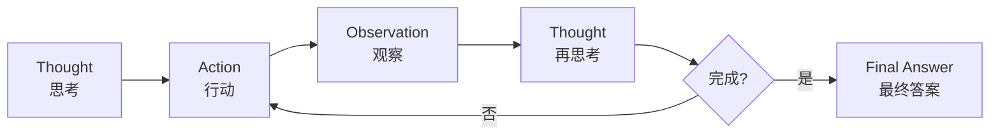
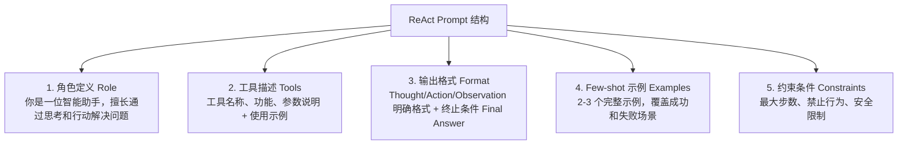

# ReAct 范式详解

## 一、概念与原理

### 1.1 什么是 ReAct？

**ReAct** = **Re**asoning + **Act**ing

由 Google Research 在 2022 年提出，核心思想是让大语言模型（LLM）**交替进行推理（Thought）和行动（Action）**，通过观察（Observation）反馈来逐步完成任务。

### 1.2 执行循环



### 1.3 为什么有效？

| 优势 | 说明 |
|------|------|
| **可解释性** | 每一步都有清晰的推理过程 |
| **错误恢复** | 通过 Observation 及时发现问题 |
| **工具集成** | 自然融入外部工具调用 |
| **人机协作** | 人类可以介入任何步骤 |

---

## 二、面试题详解

### 题目 1：ReAct 和传统的 Chain-of-Thought (CoT) 有什么区别？

#### 考察点
- 对两种范式的理解深度
- 知道各自的适用边界
- 能否结合实际场景选择

#### 详细解答

**核心区别：是否与环境交互**

| 维度 | CoT | ReAct |
|------|-----|-------|
| **核心能力** | 纯推理 | 推理 + 行动 |
| **外部交互** | ❌ 无 | ✅ 有（工具调用） |
| **信息获取** | 依赖预训练知识 | 可实时查询外部数据 |
| **适用场景** | 数学、逻辑题 | 需要实时信息的任务 |
| **成本** | 较低 | 较高（多轮调用） |

**具体例子对比：**

**场景：查询"北京今天天气，并建议穿什么衣服"**

```
【CoT 方式】
Q: 北京今天天气如何？该穿什么衣服？
A: 让我想想... 北京属于温带季风气候，3月份通常...
（❌ 模型只能基于训练数据猜测，可能过时）

【ReAct 方式】
Thought: 我需要查询北京今天的实时天气
Action: weather_api
Action Input: {"city": "北京", "date": "today"}
Observation: {"temp": 15, "weather": "晴", "wind": "3级"}

Thought: 根据天气数据，15度晴天，建议穿...
Final Answer: 建议穿薄外套...
（✅ 基于实时数据给出准确建议）
```

**选择建议：**
- 任务需要**实时数据** → 选 ReAct
- 任务纯靠**逻辑推理** → 选 CoT（成本更低）

---

### 题目 2：ReAct 的优缺点是什么？如何优化其缺点？

#### 考察点
- 系统性思维
- 工程实践经验
- 优化能力

#### 详细解答

**优点：**

1. **可解释性强**
   - 每一步 Thought 都可见
   - 便于调试和审计
   - 用户能理解 AI 的决策过程

2. **容错性好**
   - Observation 提供反馈闭环
   - 发现错误可以及时调整

3. **灵活扩展**
   - 新增工具只需修改 Prompt
   - 无需重新训练模型

**缺点及优化方案：**

| 缺点 | 影响 | 优化方案 |
|------|------|----------|
| **成本高** | 每步都调 LLM | 1. 设置最大步数限制<br>2. 使用小模型生成 Thought<br>3. 缓存常见推理路径 |
| **延迟大** | 多轮串行调用 | 1. 并行执行独立 Action<br>2. 流式输出 Thought<br>3. 预加载常用工具 |
| **易陷入循环** | 反复调用同一工具 | 1. 记录已执行 Action<br>2. 强制 Action 多样性<br>3. 设置工具调用上限 |
| **Prompt 设计难** | 模型不按格式输出 | 1. Few-shot 示例<br>2. 结构化输出（JSON/XML）<br>3. 输出校验和重试 |

**代码层面的优化示例：**

```java
public class OptimizedReActAgent {
    // 1. 防止循环：记录已执行的动作
    private Set<String> executedActions = new HashSet<>();
    
    // 2. 成本控制：动态步数限制
    private int maxSteps;
    private int currentStep = 0;
    
    public String run(String task, int complexity) {
        // 根据任务复杂度动态调整步数
        this.maxSteps = complexity > 5 ? 15 : 8;
        
        while (currentStep < maxSteps) {
            String action = generateAction();
            
            // 3. 防止重复动作
            if (executedActions.contains(action)) {
                action = generateAlternativeAction();
            }
            executedActions.add(action);
            
            // 4. 执行并观察
            String observation = execute(action);
            
            // 5. 检查是否陷入死循环
            if (isStuck(observation)) {
                return handleStuckState();
            }
            
            currentStep++;
        }
    }
}
```

---

### 题目 3：如何设计一个好的 ReAct Prompt？有哪些关键要素？

#### 考察点
- Prompt Engineering 能力
- 对模型行为的理解
- 工程实践经验

#### 详细解答

**关键要素：**



**完整 Prompt 示例：**

```
你是一位智能助手，请通过思考和行动来回答问题。

【可用工具】
1. search(query: string) - 搜索引擎，用于查询实时信息
2. calculator(expression: string) - 计算器，用于数学运算
3. weather(city: string) - 天气查询

【输出格式】
你必须严格按以下格式输出：

Thought: [你的推理过程，说明为什么采取这个行动]
Action: [工具名称，如无工具可调用则写 None]
Action Input: [传递给工具的参数]

或当任务完成时：

Final Answer: [最终答案]

【示例】
问题：北京今天气温多少？如果加10度是多少？

Thought: 我需要先查询北京今天的天气
Action: weather
Action Input: {"city": "北京"}

Observation: {"temperature": 20, "unit": "celsius"}

Thought: 现在需要计算 20 + 10
Action: calculator
Action Input: {"expression": "20 + 10"}

Observation: 30

Thought: 已经得到最终答案
Final Answer: 北京今天气温20度，加10度后是30度。

【约束】
- 最多执行 10 步
- 不要重复调用相同的工具相同的参数
- 如果无法完成任务，说明原因

现在开始回答问题：
{user_question}
```

**进阶技巧：**

1. **动态工具选择**：根据任务类型动态调整可用工具列表
2. **上下文压缩**：长对话时总结历史，避免 Token 超限
3. **错误处理示例**：在 Few-shot 中加入错误恢复的例子

---

### 题目 4：ReAct 中的 Observation 设计有什么讲究？

#### 考察点
- 对反馈机制的理解
- 接口设计能力

#### 详细解答

**Observation 的设计原则：**

| 原则 | 说明 | 反例 |
|------|------|------|
| **信息完整** | 包含模型决策所需的全部信息 | 只返回"成功"，无具体数据 |
| **结构清晰** | 使用结构化格式（JSON） | 大段自然语言，难以解析 |
| **语义明确** | 错误信息要具体 | "出错了" → "API 限流，请 60s 后重试" |
| **长度适中** | 关键信息优先，避免冗余 | 返回整个 HTML 页面 |

**好的 Observation 示例：**

```json
{
  "status": "success",
  "data": {
    "temperature": 25,
    "humidity": 60,
    "weather": "sunny"
  },
  "metadata": {
    "source": "weather_api_v2",
    "timestamp": "2024-03-23T14:30:00Z"
  }
}
```

**错误处理设计：**

```json
{
  "status": "error",
  "error_code": "RATE_LIMIT_EXCEEDED",
  "message": "API 调用频率超限",
  "suggestion": "请等待 60 秒后重试，或降低查询频率",
  "retry_after": 60
}
```

---

## 三、延伸追问

面试官可能会继续追问：

1. **"如果模型不遵循格式输出怎么办？"**
   - 使用结构化输出（OpenAI