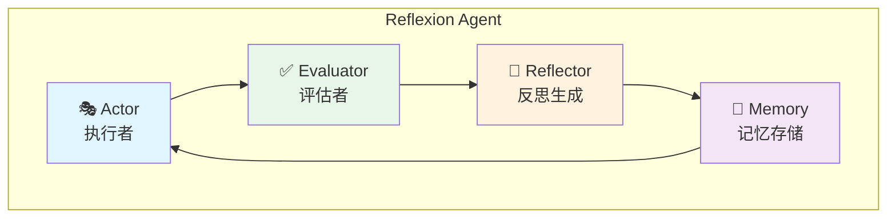
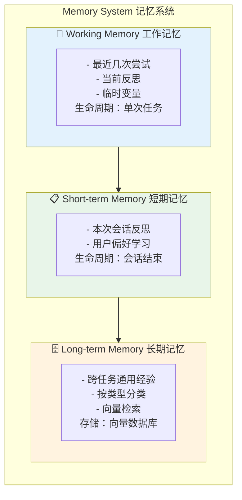
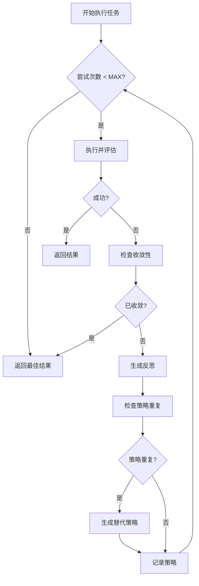
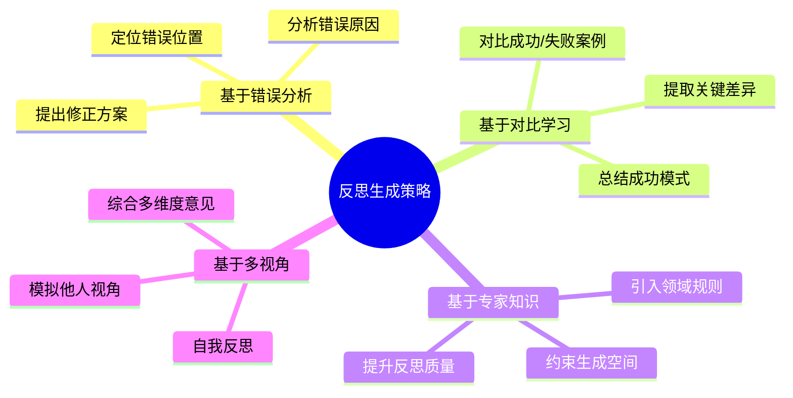
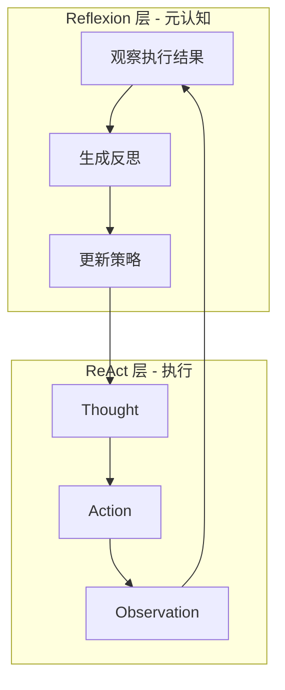
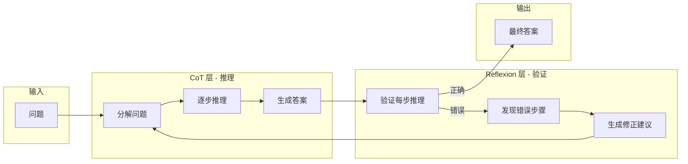

# Reflexion 范式详解

## 一、概念与原理

### 1.1 什么是 Reflexion？

**Reflexion** 是一种让 Agent 具备**自我反思和从错误中学习**能力的范式。它不通过微调模型参数来学习，而是通过**语言反馈**来改进策略。

### 1.2 核心组件



### 1.3 与传统强化学习的区别

| 特性 | Reflexion | RL (强化学习) |
|------|-----------|---------------|
| **学习信号** | 语言反馈 | 数值奖励 |
| **模型更新** | ❌ 不更新参数 | ✅ 更新参数 |
| **样本效率** | 高（零样本） | 低（需要大量样本） |
| **可解释性** | 高（自然语言） | 低（权重变化） |
| **适用模型** | 任意 LLM | 需可训练模型 |

---

## 二、面试题详解

### 题目 1：Reflexion 的记忆机制如何设计？短期记忆和长期记忆有什么区别？

#### 考察点
- 记忆系统设计
- 向量数据库理解
- 工程实现能力

#### 详细解答

**记忆分层架构：**



**具体实现：**

```java
public class ReflexionMemory {
    
    // 1. 工作记忆 - 内存存储
    private Deque<Trial> workingMemory = new ArrayDeque<>();
    private static final int WORKING_MEMORY_SIZE = 5;
    
    // 2. 短期记忆 - 会话级
    private List<Reflection> sessionMemory = new ArrayList<>();
    
    // 3. 长期记忆 - 向量数据库
    private VectorDB longTermMemory;
    
    /**
     * 添加新的尝试到工作记忆
     */
    public void addTrial(Trial trial) {
        workingMemory.addLast(trial);
        if (workingMemory.size() > WORKING_MEMORY_SIZE) {
            // 溢出的转入短期记忆
            Trial old = workingMemory.removeFirst();
            sessionMemory.addAll(old.getReflections());
        }
    }
    
    /**
     * 获取当前任务相关的反思（工作记忆 + 检索长期记忆）
     */
    public List<Reflection> getRelevantReflections(String task) {
        List<Reflection> relevant = new ArrayList<>();
        
        // 1. 加入工作记忆
        workingMemory.forEach(t -> relevant.addAll(t.getReflections()));
        
        // 2. 从短期记忆筛选相关的
        relevant.addAll(sessionMemory.stream()
            .filter(r -> isRelevant(r, task))
            .collect(Collectors.toList()));
        
        // 3. 向量检索长期记忆
        List<Reflection> similar = longTermMemory.similaritySearch(
            task, 
            embeddingModel.embed(task),
            5
        );
        relevant.addAll(similar);
        
        return relevant;
    }
    
    /**
     * 任务结束时，总结并保存到长期记忆
     */
    public void persistReflections(String taskType) {
        // 提取通用经验
        String summary = summarizeReflections(sessionMemory);
        
        Reflection generalReflection = new Reflection(
            "task_type: " + taskType,
            summary,
            sessionMemory
        );
        
        // 存入向量数据库
        longTermMemory.insert(
            generalReflection,
            embeddingModel.embed(summary)
        );
    }
}

class Reflection {
    private String context;      // 产生反思的上下文
    private String content;      // 反思内容
    private List<String> lessons; // 学到的教训
    private String strategy;     // 改进策略
    private long timestamp;
    private int taskType;        // 任务类型标签
}
```

**三种记忆的对比：**

| 维度 | 工作记忆 | 短期记忆 | 长期记忆 |
|------|----------|----------|----------|
| **存储位置** | JVM 内存 | 内存/Redis | 向量数据库 |
| **生命周期** | 单次任务 | 单次会话 | 永久 |
| **检索方式** | 直接访问 | 关键词过滤 | 向量相似度 |
| **内容** | 原始尝试 | 反思记录 | 通用经验 |
| **容量** | 小（最近5次） | 中（会话级） | 大（全历史） |

---

### 题目 2：如何避免 Reflexion 陷入无限循环？

#### 考察点
- 系统鲁棒性设计
- 终止条件设计
- 防循环机制

#### 详细解答

**多层防循环机制：**

```java
public class ReflexionAgent {
    
    // 1. 硬限制
    private static final int MAX_ATTEMPTS = 5;
    
    // 2. 收敛检测
    private ConvergenceDetector convergenceDetector = new ConvergenceDetector();
    
    // 3. 重复检测
    private Set<String> attemptedStrategies = new HashSet<>();
    
    public String run(String task) {
        for (int attempt = 1; attempt <= MAX_ATTEMPTS; attempt++) {
            
            // 1. 执行
            String result = execute(task);
            
            // 2. 评估
            Evaluation eval = evaluate(result);
            if (eval.isSuccess()) {
                return result;
            }
            
            // 3. 检查是否收敛
            if (convergenceDetector.isConverged(result)) {
                logger.warn("检测到收敛停滞，终止重试");
                return "无法收敛到更好结果，最佳尝试：" + convergenceDetector.getBestResult();
            }
            
            // 4. 生成反思
            Reflection reflection = generateReflection(task, result, eval);
            
            // 5. 检查策略是否重复
            String strategyHash = hashStrategy(reflection.getStrategy());
            if (attemptedStrategies.contains(strategyHash)) {
                logger.warn("策略重复，尝试新方向");
                reflection = generateAlternativeReflection(reflection);
            }
            attemptedStrategies.add(strategyHash);
            
            // 6. 调整任务
            task = adjustTask(task, reflection);
        }
        
        return "达到最大尝试次数，最佳结果：" + convergenceDetector.getBestResult();
    }
    
    /**
     * 计算策略的哈希值，用于检测重复
     */
    private String hashStrategy(String strategy) {
        return DigestUtils.sha256Hex(strategy);
    }
}

/**
 * 收敛检测器 - 检测是否陷入停滞
 */
class ConvergenceDetector {
    private List<String> results = new ArrayList<>();
    private String bestResult;
    private double bestScore = Double.MIN_VALUE;
    
    public boolean isConverged(String result) {
        results.add(result);
        
        // 如果结果数量不足，不判断收敛
        if (results.size() < 3) return false;
        
        // 检查最近3次结果是否相似
        int n = results.size();
        String last1 = results.get(n - 1);
        String last2 = results.get(n - 2);
        String last3 = results.get(n - 3);
        
        // 使用编辑距离或语义相似度判断
        double sim12 = calculateSimilarity(last1, last2);
        double sim23 = calculateSimilarity(last2, last3);
        
        // 如果连续结果高度相似，认为已收敛
        if (sim12 > 0.9 && sim23 > 0.9) {
            return true;
        }
        
        // 检查分数是否不再提升
        double currentScore = evaluateResult(result);
        if (currentScore <= bestScore * 1.01) { // 允许1%的浮动
            return true;
        }
        
        if (currentScore > bestScore) {
            bestScore = currentScore;
            bestResult = result;
        }
        
        return false;
    }
    
    private double calculateSimilarity(String s1, String s2) {
        // 可以使用编辑距离、余弦相似度或语义相似度
        // 简化实现：Jaccard相似度
        Set<String> set1 = new HashSet<>(Arrays.asList(s1.split("\\s+")));
        Set<String> set2 = new HashSet<>(Arrays.asList(s2.split("\\s+")));
        
        Set<String> intersection = new HashSet<>(set1);
        intersection.retainAll(set2);
        
        Set<String> union = new HashSet<>(set1);
        union.addAll(set2);
        
        return (double) intersection.size() / union.size();
    }
    
    public String getBestResult() {
        return bestResult;
    }
}
```

**防循环策略总结：**



| 机制 | 作用 | 实现方式 |
|------|------|----------|
| **最大尝试次数** | 硬性止损 | `MAX_ATTEMPTS = 5` |
| **收敛检测** | 检测停滞 | 结果相似度 + 分数停滞 |
| **策略去重** | 避免重复尝试 | HashSet 存储策略指纹 |
| **替代策略生成** | 突破僵局 | 当策略重复时强制换方向 |

---

### 题目 3：Reflexion 的反思生成策略有哪些？如何设计高质量的反思 Prompt？

#### 考察点
- Prompt Engineering 能力
- 反思质量优化
- 工程实践经验

#### 详细解答

**反思生成策略对比：**



**高质量反思 Prompt 设计：**

```java
public class ReflectionPromptBuilder {
    
    /**
     * 构建结构化反思 Prompt
     */
    public static String buildPrompt(Task task, Result result, Evaluation eval) {
        StringBuilder prompt = new StringBuilder();
        
        // 1. 角色设定
        prompt.append("你是一位经验丰富的AI助手，擅长从失败中学习并改进。\n\n");
        
        // 2. 任务背景
        prompt.append("【任务】\n").append(task.getDescription()).append("\n\n");
        
        // 3. 执行过程
        prompt.append("【你的尝试】\n").append(result.getOutput()).append("\n\n");
        
        // 4. 评估反馈
        prompt.append("【评估结果】\n")
              .append("- 成功: ").append(eval.isSuccess() ? "否" : "是").append("\n")
              .append("- 得分: ").append(eval.getScore()).append("/10\n")
              .append("- 问题: ").append(eval.getFeedback()).append("\n\n");
        
        // 5. 历史反思（如果有）
        if (!task.getPreviousReflections().isEmpty()) {
            prompt.append("【之前的反思】\n");
            for (Reflection r : task.getPreviousReflections()) {
                prompt.append("- ").append(r.getContent()).append("\n");
            }
            prompt.append("\n");
        }
        
        // 6. 输出要求
        prompt.append("【请生成反思】\n")
              .append("请分析失败原因，并给出具体的改进策略。按以下格式输出：\n\n")
              .append("1. 错误定位：具体指出哪里出了问题\n")
              .append("2. 根因分析：为什么会出现这个错误\n")
              .append("3. 改进策略：下次如何做得更好（具体可操作）\n")
              .append("4. 验证方法：如何验证改进是否有效\n");
        
        return prompt.toString();
    }
    
    /**
     *  few-shot 示例增强
     */
    public static String buildWithExamples(Task task, Result result, Evaluation eval) {
        String basePrompt = buildPrompt(task, result, eval);
        
        String examples = """
\n【反思示例】\n
示例1（数学计算错误）：
错误定位：在计算 23 × 47 时，将 23 × 40 算成了 820 而非 920\n
根因分析：乘法进位时疏忽，十位数的计算没有正确处理\n
改进策略：\n- 使用竖式计算，每步写下中间结果\n- 计算完成后用逆运算验证（1081 ÷ 23 应该等于 47）\n
验证方法：重新计算并用计算器核对\n
---\n
示例2（逻辑推理错误）：\n错误定位：假设了所有天鹅都是白色的，忽略了黑天鹅的存在\n
根因分析：归纳推理时样本不够全面，存在幸存者偏差\n
改进策略：\n- 寻找反例来验证假设\n- 使用"除非有反例"等限定词\n- 明确说明结论的适用范围\n
验证方法：检查是否有已知的反例或边界情况\n""";
        
        return basePrompt + examples;
    }
}
```

**反思质量评估：**

```java
public class ReflectionQualityChecker {
    
    public QualityScore evaluate(Reflection reflection) {
        int specificity = checkSpecificity(reflection);
        int actionability = checkActionability(reflection);
        int novelty = checkNovelty(reflection, previousReflections);
        int relevance = checkRelevance(reflection, task);
        
        return new QualityScore(specificity, actionability, novelty, relevance);
    }
    
    /**
     * 检查具体性：反思是否具体到可执行
     */
    private int checkSpecificity(Reflection r) {
        // 避免"我需要更仔细"这类空泛反思
        // 偏好"我需要在计算乘法时先估算范围"
        String content = r.getContent();
        
        // 检查是否包含具体动作
        boolean hasAction = content.contains("应该") || 
                           content.contains("需要") ||
                           content.contains("下次");
        
        // 检查是否过于笼统
        boolean isVague = content.contains("更仔细") ||
                         content.contains("更认真") ||
                         content.length() < 20;
        
        if (hasAction && !isVague) return 10;
        if (hasAction) return 7;
        if (!isVague) return 5;
        return 3;
    }
    
    /**
     * 检查可操作性：改进策略是否可执行
     */
    private int checkActionability(Reflection r) {
        String strategy = r.getStrategy();
        
        // 可操作的策略应该包含具体的步骤或方法
        return strategy.split("\\n").length >= 2 ? 10 : 5;
    }
}
```

**反思 Prompt 模板库：**

| 场景 | Prompt 关键要素 |
|------|-----------------|
| **代码生成** | 强调语法检查、边界条件、测试用例 |
| **数学推理** | 强调步骤验证、逆运算检查、估算范围 |
| **逻辑推理** | 强调前提假设、反例寻找、归纳完整性 |
| **文本生成** | 强调风格一致性、事实准确性、结构完整性 |

---

### 题目 4：Reflexion 与其他 Agent 范式（如 ReAct、CoT）如何结合？

#### 考察点
- 范式组合能力
- 架构设计能力
- 复杂系统经验

#### 详细解答

**Reflexion + ReAct 组合架构：**



**具体实现：**

```java
public class ReflexionReActAgent {
    
    private ReActExecutor executor;
    private ReflexionMemory memory;
    private int maxReflectionRounds = 3;
    
    public String solve(String task) {
        // 获取相关历史反思
        List<Reflection> relevant = memory.getRelevantReflections(task);
        
        for (int round = 0; round < maxReflectionRounds; round++) {
            
            // 构建增强的 ReAct Prompt，注入反思经验
            String enhancedPrompt = buildEnhancedPrompt(task, relevant);
            
            // 使用 ReAct 执行
            ReActResult result = executor.execute(enhancedPrompt);
            
            // 评估结果
            Evaluation eval = evaluate(result);
            
            if (eval.isSuccess()) {
                return result.getFinalAnswer();
            }
            
            // 生成反思
            Reflection reflection = generateReflection(task, result, eval);
            
            // 保存反思
            memory.addReflection(reflection);
            
            // 更新相关反思列表
            relevant = memory.getRelevantReflections(task);
        }
        
        return "达到最大反思轮次，未能成功完成";
    }
    
    /**
     * 构建注入反思经验的增强 Prompt
     */
    private String buildEnhancedPrompt(String task, List<Reflection> reflections) {
        StringBuilder prompt = new StringBuilder();
        
        prompt.append("任务：").append(task).append("\n\n");
        
        if (!reflections.isEmpty()) {
            prompt.append("【历史经验】\n");
            prompt.append("根据之前的尝试，请注意以下经验教训：\n");
            for (int i = 0; i < Math.min(reflections.size(), 3); i++) {
                Reflection r = reflections.get(i);
                prompt.append(i + 1).append(". ").append(r.getContent()).append("\n");
            }
            prompt.append("\n");
        }
        
        prompt.append("请按照 ReAct 模式（Thought → Action → Observation）逐步解决。\n");
        
        return prompt.toString();
    }
}
```

**Reflexion + CoT 组合：**



```java
public class ReflexionCoTAgent {
    
    /**
     * CoT 生成 + Reflexion 验证迭代
     */
    public String solveWithVerification(String problem) {
        int maxIterations = 3;
        
        for (int i = 0; i < maxIterations; i++) {
            // 1. CoT 生成推理链
            ChainOfThought cot = generateCoT(problem);
            
            // 2. Reflexion 验证每一步
            List<StepVerification> verifications = new ArrayList<>();
            boolean allCorrect = true;
            
            for (Step step : cot.getSteps()) {
                StepVerification v = verifyStep(step, problem);
                verifications.add(v);
                
                if (!v.isCorrect()) {
                    allCorrect = false;
                    // 生成针对该步骤的反思
                    Reflection stepReflection = generateStepReflection(step, v);
                    
                    // 修正问题描述，加入反思
                    problem = problem + "\n注意：在以下步骤中，" + stepReflection.getContent();
                    break; // 发现错误就停止，重新生成
                }
            }
            
            if (allCorrect) {
                return cot.getFinalAnswer();
            }
        }
        
        return "无法生成正确推理链";
    }
    
    private StepVerification verifyStep(Step step, String problem) {
        // 使用 LLM 或规则验证步骤正确性
        String verificationPrompt = String.format("""
验证以下推理步骤是否正确：

问题：%s

推理步骤：%s

请判断：
1. 该步骤逻辑是否正确？
2. 计算是否正确（如果是数学问题）？
3. 是否朝着解决问题的方向前进？

输出格式：
正确性: true/false
问题: 如果有问题，请说明
""", problem, step.getContent());
        
        String response = llm.complete(verificationPrompt);
        return parseVerification(response);
    }
}
```

**三种组合模式对比：**

| 组合模式 | 适用场景 | Reflexion 作用 | 其他范式作用 |
|----------|----------|----------------|--------------|
| **Reflexion + ReAct** | 工具调用任务 | 总结工具使用经验 | 执行具体工具调用 |
| **Reflexion + CoT** | 推理任务 | 验证推理步骤 | 生成推理链 |
| **Reflexion + ToT** | 搜索决策任务 | 评估节点质量 | 探索多路径 |

---

## 三、延伸追问

1. **"Reflexion 的记忆存储有什么最佳实践？如何防止记忆膨胀？"**
   - 定期压缩和总结反思
   - 使用向量检索只获取最相关的
   - 设置记忆过期机制

2. **"Reflexion 的评估函数（Evaluator）如何设计？"**
   - 任务特定的评估指标
   - 多维度综合评分
   - 人工反馈对齐

3. **"Reflexion 适合什么类型的任务？不适合什么？"**
   - 适合：有明确成功标准的任务、可重复尝试的任务
   - 不适合：一次性任务、实时性要求高的任务、成本敏感的任务