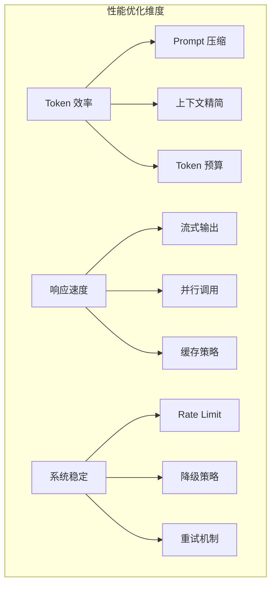

# 性能优化专题

本目录收录 AI Agent 系统的性能优化相关面试题，涵盖 Token 优化、流式输出、Rate Limit 控制、Prompt 压缩等核心技术。

## 内容索引

| 主题 | 核心概念 | 文档 |
|------|----------|------|
| **Token 优化** | 流式输出、Prompt 压缩、上下文管理、Token 预算控制 | [token-optimization.md](./token-optimization.md) |

## 为什么性能优化对 Agent 至关重要

AI Agent 系统相比传统应用面临独特的性能挑战：

1. **Token 成本敏感**：LLM 调用按 Token 计费，频繁调用和冗长上下文会快速累积成本
2. **延迟影响体验**：Agent 通常需要多轮 LLM 调用，累积延迟直接影响用户感知
3. **上下文窗口限制**：需要在有限窗口内高效传递信息
4. **并发与限流**：API 调用有 Rate Limit，需要合理调度

## 面试重点

- **Token 优化**：如何在保证效果的前提下压缩 Prompt？如何选择性传递历史上下文？
- **流式输出**：Server-Sent Events 实现原理？如何处理流式输出的中断和重连？
- **Rate Limit**：Token Bucket vs Sliding Window？如何设计优雅的降级策略？
- **Prompt 压缩**：摘要 vs 截断 vs 向量化检索，如何选择？

## 相关专题

- [Agent 核心机制](../agent/README.md) - Function Calling、任务规划中的性能考量
- [RAG 检索](../retrieval/README.md) - 检索阶段的性能优化
- [记忆系统](../agent/memory-system.md) - 记忆压缩与检索优化
