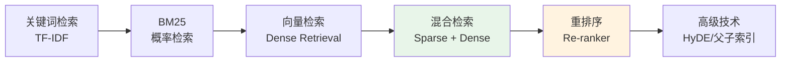

# RAG 检索技术

本目录收录 RAG（检索增强生成）中的核心检索技术与面试题，重点覆盖"召回质量、检索延迟、上下文保真、可解释性"四类高频考点。对于 Agent 系统而言，检索层往往直接决定工具调用效果、知识注入质量以及最终答案的稳定性。

## 内容索引

| 主题 | 核心概念 | 文档 |
|------|----------|------|
| **BM25 算法** | 经典稀疏检索算法 | [查看](./bm25.md) |
| **混合检索** | BM25 + 向量检索结合 | [查看](./hybrid-retrieval.md) |
| **父子索引** | Parent-Child Index 结构 | [查看](./parent-child-index.md) |
| **HyDE** | 查询时生成假设文档 | [查看](./hyde.md) |
| **Re-ranker** | 重排序模型（Cross-Encoder） | [查看](./re-ranker.md) |

## 适用场景总览

| 场景 | 主要痛点 | 推荐优先阅读 |
|------|----------|--------------|
| 企业知识库问答 | 关键词强、术语多、需要可解释 | BM25 → 混合检索 |
| 语义搜索 / FAQ 匹配 | 同义表达多、用户问题口语化 | 混合检索 → HyDE |
| 长文档问答 | Chunk 粒度难平衡、上下文容易丢失 | 父子索引 → 混合检索 |
| Agent 工具增强 | 查询波动大、召回稳定性要求高 | HyDE → 混合检索 |

## 学习目标

阅读本目录后，建议你至少能够回答以下问题：

1. **为什么单独使用 BM25 或向量检索都不够？**
   能说明关键词匹配与语义召回各自的优势、盲区以及在业务上造成的后果。
2. **混合检索的价值在哪里？**
   能解释级联、并行融合、RRF 等方案分别适用于什么样的延迟/召回约束。
3. **为什么需要 HyDE 或其他查询增强技术？**
   能把查询改写、假设文档生成和复杂问题召回质量联系起来。
4. **父子索引为什么常见于高质量 RAG？**
   能说明"检索粒度"和"生成上下文粒度"不一致时的工程权衡。

## 检索技术演进

## 面试重点

在面试中，检索问题通常不会只停留在"概念定义"，而会继续追问到系统设计与线上调优。建议重点准备以下维度：

1. **BM25 公式理解** - k1、b 参数的作用
2. **混合检索策略** - RRF 融合 vs 加权融合
3. **检索粒度设计** - 父子索引的应用场景
4. **查询增强** - HyDE 的原理与适用场景
5. **重排序技术** - Re-ranker 与 RRF 的区别、Bi-Encoder vs Cross-Encoder
6. **实际调优经验** - 如何根据业务选择检索方案

## 高频追问示例

### 题目 1：如果线上搜索结果"看起来相关但答非所问"，你会先排查检索层还是生成层？

**推荐回答思路：**

- 先做离线抽样，确认问题出在"没召回到正确文档"还是"召回到了但生成没用好"。
- 如果 Top-K 中没有正确文档，优先排查检索层：分词、chunk 策略、召回路由、融合权重、embedding 模型。
- 如果正确文档已经进入上下文但答案仍然偏离，再排查生成层：提示词、引用约束、上下文截断、答案模板。
- 面试中最好强调：**检索层和生成层要分开度量**，否则优化会失焦。

### 题目 2：什么时候不建议直接上混合检索？

**推荐回答思路：**

- 数据规模很小、查询模式简单、关键词匹配已经足够时，直接使用 BM25 或向量检索即可，避免系统复杂度过高。
- 如果当前问题的主要瓶颈是文档切分质量差、标签体系混乱、元数据缺失，盲目引入混合检索通常收益有限。
- 混合检索适合"关键词和语义信号都重要"的场景，不是所有系统都需要"双通道召回"。

## 阅读建议

### 面试准备路线

1. **先看 BM25**：建立对稀疏检索和可解释性的基础认知。
2. **再看混合检索**：理解主流生产方案为什么要做融合。
3. **然后看 HyDE**：补足复杂查询和低召回问题的处理思路。
4. **最后看父子索引**：理解长文档场景下的索引结构设计。

### 复习重点

- 若目标岗位偏 **搜索 / RAG 工程**：优先掌握 BM25、混合检索、父子索引、Re-ranker。
- 若目标岗位偏 **Agent / AI 应用开发**：重点理解混合检索、HyDE、Re-ranker 与工具调用质量之间的关系。
