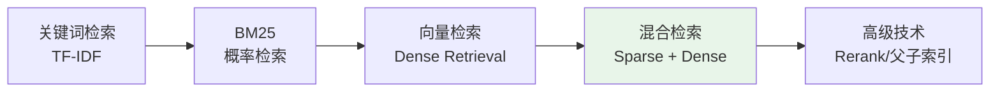

# RAG 检索技术

本目录收录 RAG（检索增强生成）中的检索技术相关面试题。

## 内容索引

| 主题 | 核心概念 | 文档 |
|------|----------|------|
| **BM25 算法** | 经典稀疏检索算法 | [查看](./bm25.md) |
| **混合检索** | BM25 + 向量检索结合 | [查看](./hybrid-retrieval.md) |
| **父子索引** | Parent-Child Index 结构 | [查看](./parent-child-index.md) |

## 检索技术演进

## 面试重点

1. **BM25 公式理解** - k1、b 参数的作用
2. **混合检索策略** - RRF 融合 vs 加权融合
3. **检索粒度设计** - 父子索引的应用场景
4. **实际调优经验** - 如何根据业务选择检索方案
