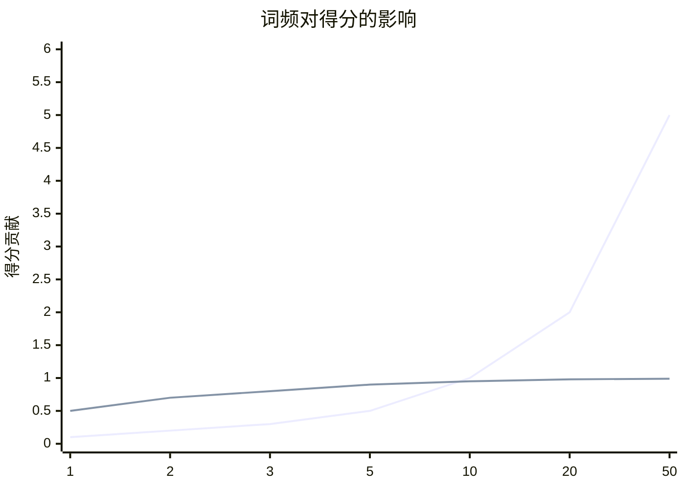
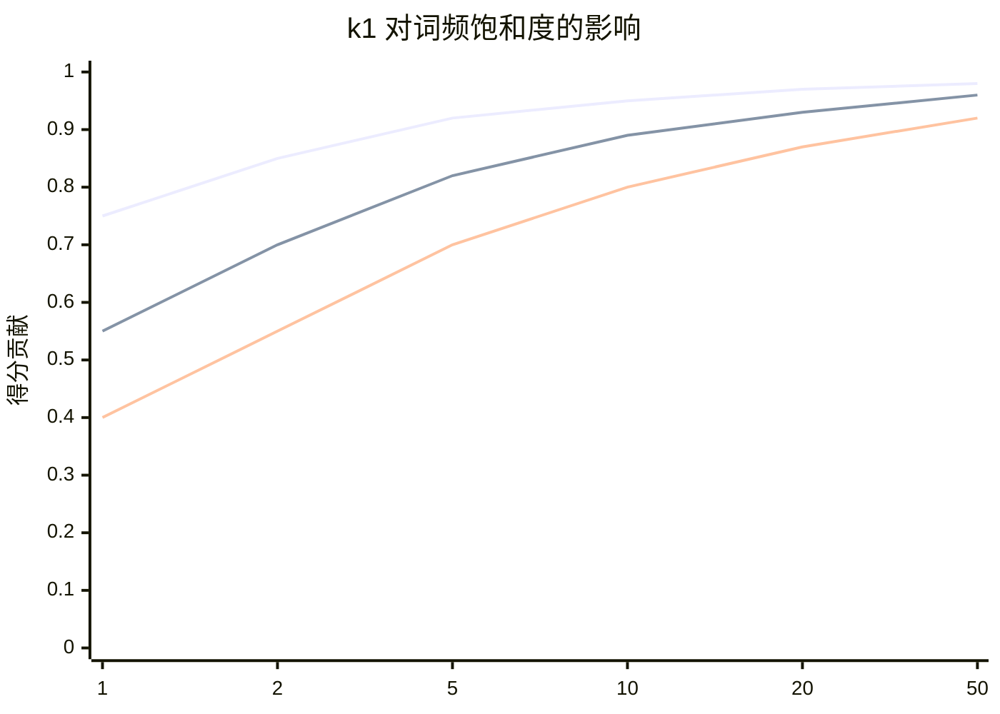
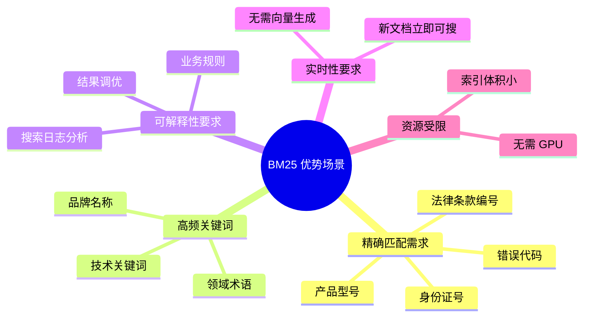

# BM25 算法详解

## 一、算法原理

### 1.1 什么是 BM25？

**BM25**（Best Match 25）是信息检索领域经典的**稀疏检索**算法，基于概率检索框架，是 TF-IDF 的改进版。

### 1.2 核心公式

**综合评分公式：**

$$\text{Score}(D, Q) = \sum_{i=1}^{n} \text{IDF}(q_i) \cdot \frac{f(q_i, D) \cdot (k_1 + 1)}{f(q_i, D) + k_1 \cdot \left(1 - b + b \cdot \dfrac{|D|}{\text{avgDl}}\right)}$$

**IDF 公式（Robertson-Sparck Jones 变体）：**

$$\text{IDF}(q_i) = \ln\left(\frac{N - n(q_i) + 0.5}{n(q_i) + 0.5} + 1\right)$$

其中 $N$ 为语料库中的文档总数，$n(q_i)$ 为包含词项 $q_i$ 的文档数。

**参数说明：**

| 符号 | 含义 | 典型值 |
|------|------|--------|
| `f(q_i, D)` | 词项 q_i 在文档 D 中的词频 | - |
| `len(D)` | 文档 D 的长度（词数） | - |
| `avgDl` | 语料库平均文档长度 | - |
| `N` | 语料库中的文档总数 | - |
| `n(q_i)` | 包含词项 q_i 的文档数 | - |
| `k1` | 词频饱和度参数 | 1.2 - 2.0 |
| `b` | 长度归一化参数 | 0.75 |

### 1.3 与 TF-IDF 的对比



| 特性 | TF-IDF | BM25 |
|------|--------|------|
| **词频处理** | 线性增长 | 非饱和（有上限） |
| **文档长度** | 无特殊处理 | 有归一化 |
| **参数调节** | 无 | 有 k1, b 可调 |
| **业界应用** | 基础 | 主流（ES 默认） |

---

## 二、面试题详解

### 题目 1：BM25 中的 k1 和 b 参数分别控制什么？如何调优？

#### 考察点
- 算法原理理解
- 参数调优经验

#### 详细解答

**k1 参数 - 词频饱和度：**



- **k1 = 0**：忽略词频，所有词一视同仁
- **k1 较小（0.5-1.0）**：快速饱和，词频影响迅速衰减
- **k1 较大（1.5-2.0）**：慢速饱和，词频影响持续较久
- **k1 → ∞**：接近线性，类似 TF-IDF

**b 参数 - 长度归一化：**

- **b = 0**：不考虑文档长度
- **b = 0.75**（标准值）：适度归一化
- **b = 1**：完全归一化

**调优建议：**

| 场景 | k1 | b | 原因 |
|------|----|---|------|
| 短文本（标题） | 0.5-1.0 | 0.3-0.5 | 词频本身就不高 |
| 长文本（论文） | 1.5-2.0 | 0.75-1.0 | 需要区分高频词 |
| 文档长度差异大 | 1.2 | 0.75 | 平衡设置 |

---

### 题目 2：BM25 适合什么场景？为什么不直接用向量检索？

#### 考察点
- 技术选型能力
- 对两种检索方式的理解

#### 详细解答

**BM25 的优势场景：**



**BM25 vs 向量检索：**

| 维度 | BM25 | 向量检索 |
|------|------|----------|
| **匹配方式** | 精确匹配 | 语义相似 |
| **容错性** | 低（必须关键词命中） | 高（理解同义词） |
| **可解释性** | 高（知道匹配了哪个词） | 低（黑盒） |
| **资源消耗** | 低（CPU 即可） | 高（需要 GPU） |
| **索引更新** | 实时 | 需重新生成向量 |
| **多语言** | 需分词 | 天然支持 |

**实际案例：**

```java
// 电商搜索场景
String query = "iPhone 15 Pro 256GB";

// BM25 能精确匹配型号、容量
// 向量检索可能返回 iPhone 14 Pro（语义相似但型号不对）

// 最佳实践：BM25 粗排 + 向量精排
List<Product> results = hybridSearch(query);
```

---

## 三、延伸追问

1. **"BM25 如何处理中文分词？"**
   - 依赖分词器（IK、jieba）
   - 分词质量直接影响检索效果

2. **"Elasticsearch 中如何调优 BM25 参数？"**
   - 通过 settings 配置 similarity
   - 可以字段级别设置不同参数
