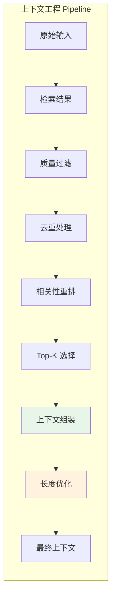
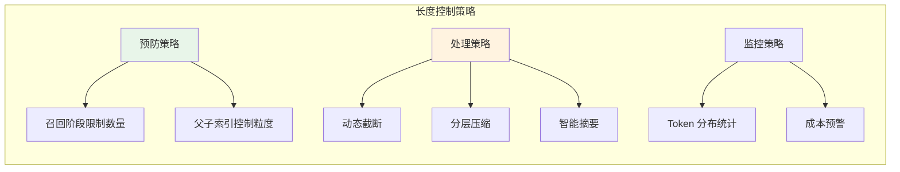
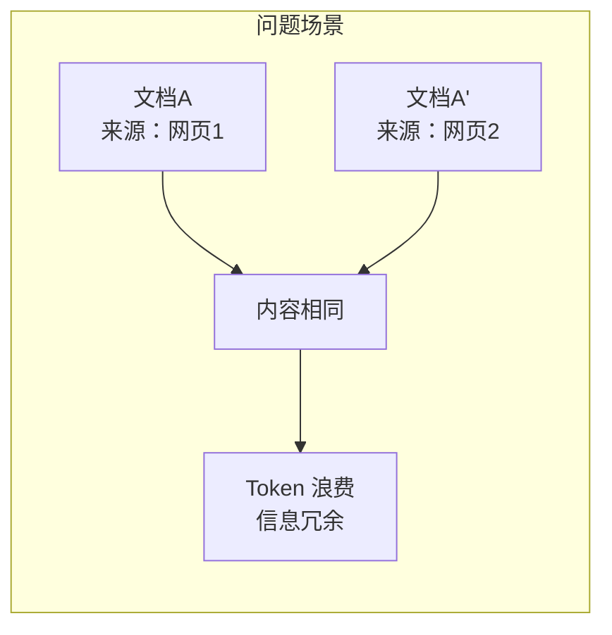
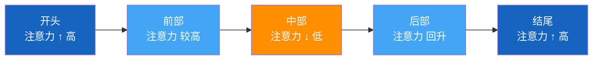

# 上下文工程（Context Engineering）

## 一、概述

### 1.1 什么是上下文工程？

**上下文工程**是将检索到的原始文档转换为 LLM 可用输入的系统性工程。它不仅仅是简单的文本拼接，而是涉及质量控制、结构化组织、长度优化等多个环节。



### 1.2 为什么需要上下文工程？

| 问题 | 后果 | 上下文工程解决 |
|------|------|---------------|
| 检索结果包含噪声 | LLM 生成偏离主题 | 质量过滤 |
| 重复文档占用空间 | Token 浪费 | 去重处理 |
| 文档顺序混乱 | 重要信息被淹没 | 相关性重排 |
| 缺乏结构化 | LLM 理解困难 | 模板组装 |
| 总长度超标 | 成本激增、性能下降 | 长度优化 |

---

## 二、上下文工程 Pipeline

### 2.1 质量过滤

**目标：** 剔除低质量、低相关的文档

```java
public class QualityFilter {
    
    private final double similarityThreshold = 0.7;
    private final double rerankerThreshold = 0.3;
    
    public List<ScoredDocument> filter(List<ScoredDocument> candidates) {
        return candidates.stream()
            // 相似度阈值过滤
            .filter(doc -> doc.getVectorScore() >= similarityThreshold)
            // Re-ranker 分数过滤
            .filter(doc -> doc.getRerankScore() >= rerankerThreshold)
            // 内容非空检查
            .filter(doc -> doc.getContent() != null && 
                          !doc.getContent().trim().isEmpty())
            // 长度检查（过短可能是噪声）
            .filter(doc -> doc.getContent().length() >= 50)
            .collect(Collectors.toList());
    }
}
```

### 2.2 去重处理

**目标：** 避免重复信息浪费 Token

```java
public class DeduplicationService {
    
    private final double similarityThreshold = 0.85;
    
    public List<Document> deduplicate(List<Document> documents) {
        List<Document> unique = new ArrayList<>();
        
        for (Document doc : documents) {
            boolean isDuplicate = false;
            
            for (Document existing : unique) {
                double sim = calculateSimilarity(doc, existing);
                if (sim >= similarityThreshold) {
                    isDuplicate = true;
                    // 保留分数更高的
                    if (doc.getScore() > existing.getScore()) {
                        unique.remove(existing);
                        unique.add(doc);
                    }
                    break;
                }
            }
            
            if (!isDuplicate) {
                unique.add(doc);
            }
        }
        
        return unique;
    }
    
    private double calculateSimilarity(Document d1, Document d2) {
        // 使用向量余弦相似度或文本相似度
        return cosineSimilarity(d1.getEmbedding(), d2.getEmbedding());
    }
}
```

### 2.3 相关性重排

**目标：** 确保最相关的文档排在前面

```java
public class ContextReranker {
    
    private final ReRanker reRanker;
    
    public List<ScoredDocument> rerank(String query, List<Document> documents) {
        // 使用 Re-ranker 计算每篇文档的相关性
        List<ScoredDocument> scored = documents.stream()
            .map(doc -> new ScoredDocument(
                doc, 
                reRanker.score(query, doc.getContent())
            ))
            .sorted(Comparator.comparing(ScoredDocument::getScore).reversed())
            .collect(Collectors.toList());
        
        return scored;
    }
}
```

### 2.4 Top-K 选择

**目标：** 确定最终送入 LLM 的文档数量

```java
public class TopKSelector {
    
    private final int defaultTopK = 5;
    private final double scoreGapThreshold = 0.15;
    
    public List<Document> select(List<ScoredDocument> ranked, String query) {
        // 策略1：固定数量
        // return selectFixed(ranked, defaultTopK);
        
        // 策略2：动态阈值（分数差距过大时截断）
        return selectByScoreGap(ranked);
        
        // 策略3：基于 Query 复杂度
        // return selectByComplexity(ranked, query);
    }
    
    private List<Document> selectByScoreGap(List<ScoredDocument> ranked) {
        List<Document> selected = new ArrayList<>();
        selected.add(ranked.get(0).getDocument());
        
        for (int i = 1; i < ranked.size(); i++) {
            double gap = ranked.get(i-1).getScore() - ranked.get(i).getScore();
            if (gap > scoreGapThreshold) {
                break;
            }
            selected.add(ranked.get(i).getDocument());
        }
        
        return selected;
    }
}
```

---

## 三、上下文拼接结构

### 3.1 标准结构模板

**结构化格式：**

```
基于以下参考信息回答问题：

【参考文档】
[1] 来源：产品手册_v2.3.pdf | 相关性：0.95
内容：
RAG（检索增强生成）是一种将检索技术与生成模型结合的技术架构...

[2] 来源：技术白皮书.pdf | 相关性：0.87
内容：
在实现 RAG 系统时，检索质量直接决定了最终生成效果...

【用户问题】
什么是 RAG 技术？
```

### 3.2 Java 实现

```java
public class ContextAssembler {
    
    private final boolean includeMetadata;
    private final boolean includeSource;
    private final boolean includeScore;
    
    public ContextAssembler() {
        this.includeMetadata = true;
        this.includeSource = true;
        this.includeScore = true;
    }
    
    /**
     * 组装上下文
     */
    public String assemble(List<RetrievedDocument> docs, String query) {
        StringBuilder context = new StringBuilder();
        
        // 1. 系统指令
        context.append("基于以下参考信息回答问题：\n\n");
        
        // 2. 参考文档
        context.append("【参考文档】\n");
        for (int i = 0; i < docs.size(); i++) {
            RetrievedDocument doc = docs.get(i);
            
            // 文档编号和元信息
            context.append(String.format("[%d] ", i + 1));
            
            if (includeSource && doc.getSource() != null) {
                context.append(String.format("来源：%s | ", doc.getSource()));
            }
            
            if (includeScore) {
                context.append(String.format("相关性：%.2f\n", doc.getScore()));
            }
            
            // 文档内容
            context.append("内容：\n");
            context.append(doc.getContent());
            context.append("\n\n");
        }
        
        // 3. 用户问题
        context.append("【用户问题】\n");
        context.append(query);
        
        return context.toString();
    }
}
```

### 3.3 其他常见结构

**引用式结构（适合需要标注来源的场景）：**

```
请根据以下信息回答问题，并在答案中标注引用编号：

[1] RAG 是一种结合检索和生成的技术...
[2] 向量检索是 RAG 的核心组件...

问题：什么是 RAG？
```

**对话式结构（适合多轮对话）：**

```
历史对话：
用户：什么是 RAG？
助手：RAG 是...

参考信息：
[1] ...
[2] ...

当前问题：RAG 有哪些优势？
```

---

## 四、避免上下文过长导致性能下降

### 4.1 策略总览



### 4.2 预防策略

**召回阶段控制：**

```java
public class ControlledRetriever {
    
    private final int maxRecallPerSource = 50;
    private final int maxTotalRecall = 100;
    
    public List<Document> retrieve(String query) {
        // 多路召回，但限制每路数量
        List<Document> bm25Results = bm25.search(query, maxRecallPerSource);
        List<Document> vectorResults = vectorStore.search(query, maxRecallPerSource);
        
        // RRF 融合后截断
        List<Document> fused = rrf.fuse(bm25Results, vectorResults);
        return fused.stream()
            .limit(maxTotalRecall)
            .collect(Collectors.toList());
    }
}
```

### 4.3 处理策略

**动态截断（按 Token）：**

```java
public class TokenBasedTruncator {
    
    private final int maxTokens;
    private final TokenEstimator estimator;
    
    public String truncate(List<Document> docs, String query) {
        StringBuilder context = new StringBuilder();
        int currentTokens = 0;
        
        // 预留 Query 的 Token
        int queryTokens = estimator.estimate(query);
        int availableTokens = maxTokens - queryTokens - 200; // 200 为指令预留
        
        for (Document doc : docs) {
            int docTokens = estimator.estimate(doc.getContent());
            
            if (currentTokens + docTokens > availableTokens) {
                // 剩余空间不足，尝试截断或跳过
                int remainingTokens = availableTokens - currentTokens;
                if (remainingTokens > 100) {
                    // 还有一定空间，截断当前文档
                    String truncated = truncateToTokens(
                        doc.getContent(), 
                        remainingTokens
                    );
                    context.append(truncated);
                }
                break;
            }
            
            context.append(doc.getContent()).append("\n\n");
            currentTokens += docTokens;
        }
        
        return context.toString();
    }
    
    private String truncateToTokens(String content, int maxTokens) {
        // 按字符估算（中文约 1 Token / 字）
        int maxChars = maxTokens;
        if (content.length() <= maxChars) {
            return content;
        }
        
        // 找到最后一个完整句子
        String truncated = content.substring(0, maxChars);
        int lastSentenceEnd = findLastSentenceEnd(truncated);
        return truncated.substring(0, lastSentenceEnd) + "...";
    }
}
```

### 4.4 监控策略

**Token 分布统计：**

```java
@Component
public class ContextMetricsCollector {
    
    private final MeterRegistry registry;
    
    public void recordContextStats(String query, List<Document> context) {
        int totalTokens = context.stream()
            .mapToInt(doc -> estimateTokens(doc.getContent()))
            .sum();
        
        int docCount = context.size();
        
        // 记录指标
        registry.counter("rag.context.tokens", 
            "query_type", classifyQuery(query))
            .increment(totalTokens);
        
        registry.histogram("rag.context.doc_count")
            .record(docCount);
        
        // 预警：Token 数超过阈值
        if (totalTokens > 6000) {
            log.warn("Context too large: {} tokens for query: {}", 
                totalTokens, query.substring(0, 50));
        }
    }
}
```

---

## 五、面试题详解

### 题目 1：上下文工程中最容易忽视的是哪个环节？

#### 考察点
- 对 RAG 全流程的理解
- 工程实践经验

#### 详细解答

**最容易忽视：去重处理**



**原因：**
- 多路召回时，BM25 和向量检索可能召回相同文档
- 不同来源的文档可能内容重复（如转载、抄袭）
- 重复信息会稀释真正有用的内容

**解决方案：**
- 在重排前去重
- 使用向量相似度判断重复
- 保留分数最高的版本

---

### 题目 2：上下文拼接时，文档顺序重要吗？

#### 考察点
- LLM 注意力机制理解
- 位置偏差（Position Bias）

#### 详细解答

**重要。** LLM 存在位置偏差：
- **开头**：注意力权重高，信息容易被记住
- **中间**：容易丢失信息
- **结尾**：注意力权重回升

**策略：**



**应对方法：**
1. **按相关性排序**：最相关的放开头
2. **倒序排列**：让最重要的在结尾（部分模型有效）
3. **重复强调**：关键信息在开头和结尾都出现

---

### 题目 3：如何评估上下文工程的效果？

#### 考察点
- 评估指标体系
- 离线/在线评估方法

#### 详细解答

**离线指标：**

| 指标 | 计算方式 | 目标值 |
|------|---------|--------|
| 召回准确率 | 包含答案文档的比例 | > 90% |
| 上下文压缩率 | 原始文档 / 最终 Token | 适中 |
| 去重准确率 | 正确识别重复的比例 | > 95% |

**在线指标：**

| 指标 | 说明 | 监控方式 |
|------|------|---------|
| 答案满意度 | 用户反馈 | 点赞/点踩 |
| 引用准确率 | 生成内容是否基于上下文 | 人工抽检 |
| 平均 Token 消耗 | 成本控制 | 日志统计 |
| 端到端延迟 | 用户体验 | 监控告警 |

---

## 六、延伸追问

1. **"多轮对话中的上下文如何管理？"**
   - 历史轮次摘要压缩
   - 关键信息提取
   - 滑动窗口保留最近 N 轮

2. **"如何处理冲突信息？"**  
   - 标注来源和时间
   - 让 LLM 自行判断
   - 优先级规则（如官方文档优先）

3. **"上下文工程和 Prompt Engineering 的关系？"**
   - 上下文工程：准备"材料"
   - Prompt Engineering：设计"指令"
   - 两者配合决定最终效果

4. **"为什么要在上下文中标注来源和分数？"**
   - 帮助 LLM 判断信息可信度
   - 便于生成引用标注
   - 调试时可追溯
