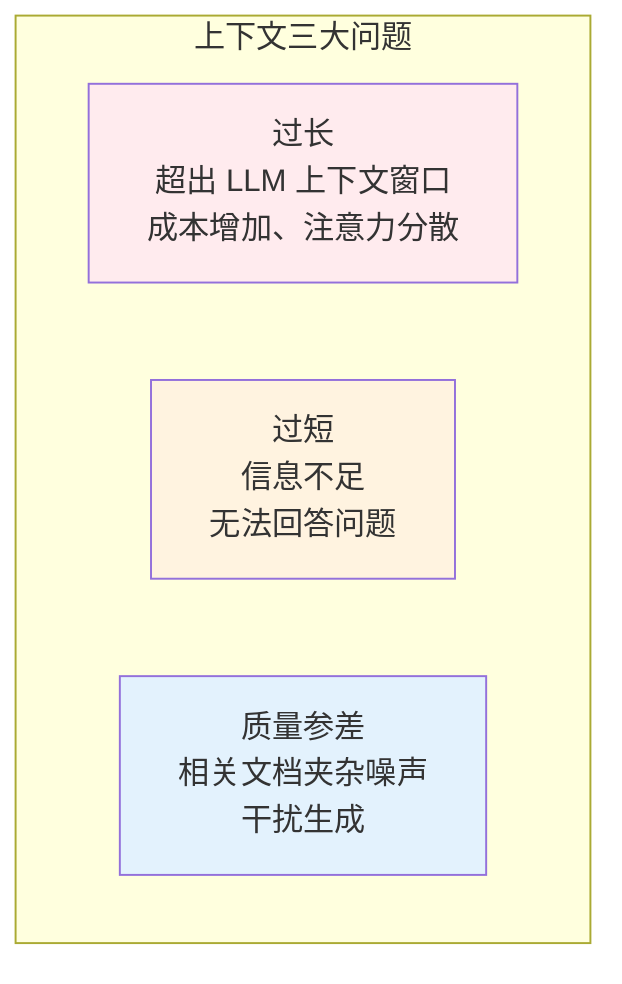
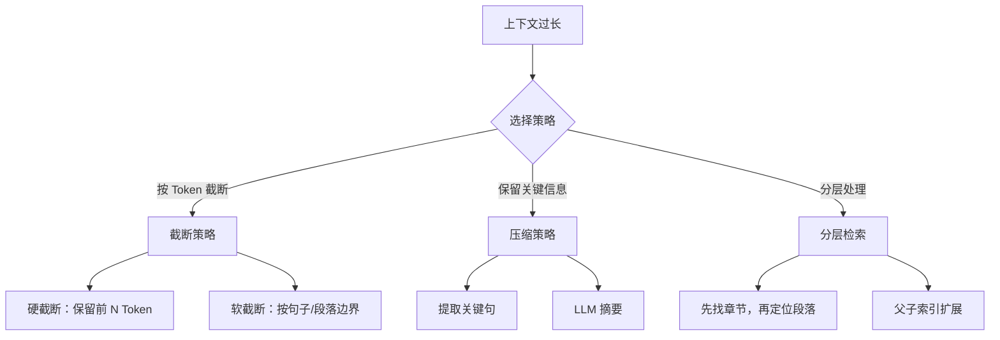
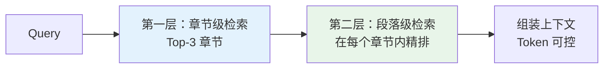
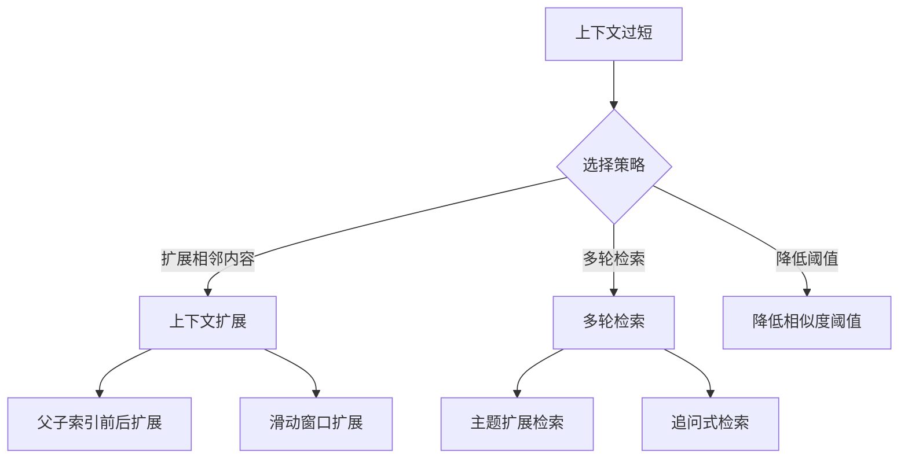
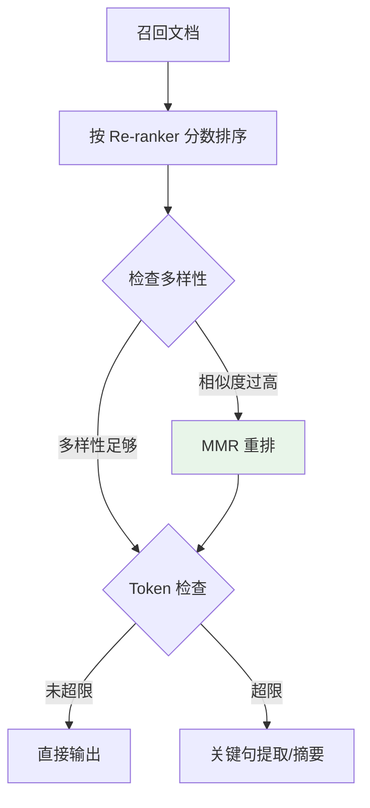
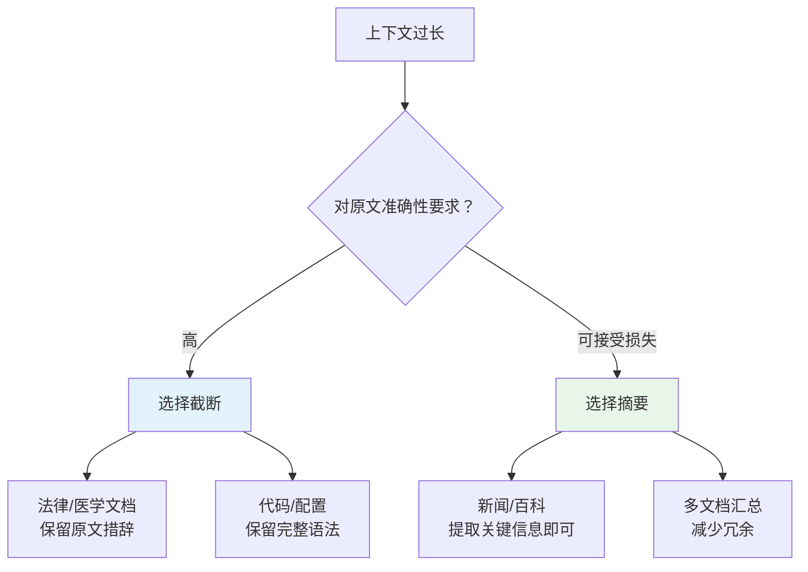

# 上下文优化（Context Optimization）

## 一、核心问题

### 1.1 为什么需要上下文优化？

RAG 系统的最终效果不仅取决于"召回什么"，更取决于"如何把召回的内容组装成有效的上下文"。上下文优化解决三个核心问题：



| 问题 | 表现 | 后果 |
|------|------|------|
| **过长** | Top-10 文档总 Token > 8K | 成本翻倍、关键信息被淹没 |
| **过短** | 召回文档无法覆盖答案 | LLM 幻觉、回答不完整 |
| **质量参差** | 高相关文档中夹杂低相关 | 生成内容偏离主题 |

---

## 二、上下文过长处理

### 2.1 策略总览



### 2.2 截断策略

**硬截断（简单直接）：**

```java
public String hardTruncate(String context, int maxTokens) {
    // 按 Token 估算（中文 1 Token ≈ 0.5-1 字）
    int maxChars = maxTokens * 2;  // 保守估计
    if (context.length() <= maxChars) {
        return context;
    }
    return context.substring(0, maxChars) + "...";
}
```

**软截断（按语义边界）：**

```java
public String softTruncate(String context, int maxTokens) {
    int maxChars = maxTokens * 2;
    if (context.length() <= maxChars) {
        return context;
    }
    
    // 找到最后一个完整句子或段落边界
    String truncated = context.substring(0, maxChars);
    int lastSentenceEnd = findLastSentenceEnd(truncated);
    
    return truncated.substring(0, lastSentenceEnd) + "...";
}

private int findLastSentenceEnd(String text) {
    // 找句号、问号、感叹号、换行
    for (int i = text.length() - 1; i >= 0; i--) {
        char c = text.charAt(i);
        if (c == '。' || c == '？' || c == '！' || c == '\n') {
            return i + 1;
        }
    }
    return text.length();
}
```

### 2.3 压缩策略

**关键句提取（轻量）：**

```java
/**
 * 基于 TF-IDF 的关键句提取
 */
public List<String> extractKeySentences(String document, int topK) {
    // 1. 分句
    List<String> sentences = segmentSentences(document);
    
    // 2. 计算每句与 Query 的相关性（简化版）
    Map<String, Double> scores = new HashMap<>();
    for (String sentence : sentences) {
        scores.put(sentence, calculateTfidfScore(sentence));
    }
    
    // 3. 取 Top-K
    return scores.entrySet().stream()
        .sorted(Map.Entry.<String, Double>comparingByValue().reversed())
        .limit(topK)
        .map(Map.Entry::getKey)
        .collect(Collectors.toList());
}
```

**LLM 摘要（高精度但成本高）：**

```java
public String llmSummarize(String longContext, String query, LLMClient llm) {
    String prompt = String.format("""
        用户问题：%s
        
        请从以下文档中提取与问题相关的关键信息，控制在 500 字以内：
        
        %s
        """, query, longContext);
    
    return llm.complete(prompt);
}
```

### 2.4 分层检索

**先粗后精策略：**



**Java 实现：**

```java
public class HierarchicalRetrieval {
    
    private final VectorStore chapterIndex;   // 章节级索引
    private final VectorStore paragraphIndex; // 段落级索引
    
    public List<Document> retrieve(String query, int maxTokens) {
        // 1. 先检索相关章节（粗粒度）
        List<Document> chapters = chapterIndex.search(query, 3);
        
        List<Document> finalResults = new ArrayList<>();
        int currentTokens = 0;
        
        // 2. 在每个章节内精确定位段落
        for (Document chapter : chapters) {
            List<Document> paragraphs = paragraphIndex.searchWithin(
                query, chapter.getId(), 5
            );
            
            for (Document para : paragraphs) {
                int tokens = estimateTokens(para.getContent());
                if (currentTokens + tokens > maxTokens) {
                    break;
                }
                finalResults.add(para);
                currentTokens += tokens;
            }
        }
        
        return finalResults;
    }
}
```

---

## 三、上下文过短处理

### 3.1 策略总览



### 3.2 上下文扩展

**父子索引扩展（推荐）：**

```java
public class ContextExpansion {
    
    private final ChildChunkIndex childIndex;
    private final int windowSize = 2;  // 前后各扩展 2 个 chunk
    
    public String expandContext(ChildChunk hitChunk) {
        // 获取相邻 chunk
        List<ChildChunk> neighbors = childIndex.getNeighbors(
            hitChunk.getParentId(),
            hitChunk.getIndex(),
            windowSize
        );
        
        // 组装完整上下文
        return neighbors.stream()
            .map(ChildChunk::getContent)
            .collect(Collectors.joining("\n...\n"));
    }
}
```

### 3.3 多轮检索

**主题扩展策略：**

```java
public class MultiRoundRetrieval {
    
    private final VectorStore vectorStore;
    private final LLMClient llm;
    
    public List<Document> multiRoundRetrieve(String query, int maxRounds) {
        List<Document> allResults = new ArrayList<>();
        Set<String> seenIds = new HashSet<>();
        
        String currentQuery = query;
        
        for (int i = 0; i < maxRounds; i++) {
            // 检索
            List<Document> results = vectorStore.search(currentQuery, 5);
            
            // 去重后添加
            for (Document doc : results) {
                if (!seenIds.contains(doc.getId())) {
                    allResults.add(doc);
                    seenIds.add(doc.getId());
                }
            }
            
            // 生成下一轮查询（主题扩展）
            if (i < maxRounds - 1) {
                currentQuery = expandQuery(query, results);
            }
        }
        
        return allResults;
    }
    
    private String expandQuery(String originalQuery, List<Document> results) {
        // 提取已召回文档的关键主题
        String context = results.stream()
            .map(Document::getContent)
            .collect(Collectors.joining("\n"));
        
        String prompt = String.format("""
            原始问题：%s
            已找到的相关信息：%s
            
            请生成一个扩展查询，用于寻找更多相关信息：
            """, originalQuery, context.substring(0, Math.min(500, context.length())));
        
        return llm.complete(prompt);
    }
}
```

---

## 四、质量过滤与重排

### 4.1 相关性阈值过滤

```java
public List<Document> filterByThreshold(List<ScoredDocument> candidates, 
                                         double threshold) {
    return candidates.stream()
        .filter(doc -> doc.getScore() >= threshold)
        .map(ScoredDocument::getDocument)
        .collect(Collectors.toList());
}
```

### 4.2 多样性去重

```java
/**
 * MMR (Maximal Marginal Relevance) 多样性排序
 */
public List<Document> mmrRerank(List<ScoredDocument> candidates, 
                                 String query,
                                 double lambda,  // 相关性与多样性权衡
                                 int topK) {
    List<Document> selected = new ArrayList<>();
    Set<String> selectedIds = new HashSet<>();
    
    while (selected.size() < topK && !candidates.isEmpty()) {
        ScoredDocument best = null;
        double bestScore = Double.NEGATIVE_INFINITY;
        
        for (ScoredDocument candidate : candidates) {
            if (selectedIds.contains(candidate.getDocument().getId())) {
                continue;
            }
            
            // MMR 分数 = λ * 相关性 - (1-λ) * 最大相似度(已选文档)
            double relevance = candidate.getScore();
            double maxSim = selected.stream()
                .mapToDouble(s -> similarity(s, candidate.getDocument()))
                .max()
                .orElse(0);
            
            double mmrScore = lambda * relevance - (1 - lambda) * maxSim;
            
            if (mmrScore > bestScore) {
                bestScore = mmrScore;
                best = candidate;
            }
        }
        
        if (best != null) {
            selected.add(best.getDocument());
            selectedIds.add(best.getDocument().getId());
        }
    }
    
    return selected;
}

private double similarity(Document d1, Document d2) {
    // 计算文档相似度（可用向量余弦相似度）
    return cosineSimilarity(d1.getEmbedding(), d2.getEmbedding());
}
```

---

## 五、面试题详解

### 题目 1：上下文窗口有限时，如何决定保留哪些文档？

#### 考察点
- 上下文优先级策略
- 工程权衡能力

#### 详细解答

**策略对比：**

| 策略 | 做法 | 优点 | 缺点 |
|------|------|------|------|
| **按分数截断** | 保留分数最高的前 N 个 | 简单、相关度高 | 可能丢失多样性 |
| **按 Token 截断** | 按顺序累加，到上限停止 | 可控、可预测 | 可能截断在高相关文档中间 |
| **MMR 多样性** | 平衡相关性与多样性 | 覆盖多维度信息 | 计算复杂 |
| **分层摘要** | 长文档先摘要再送入 | 信息密度高 | 摘要可能丢失细节 |

**推荐做法：**



---

### 题目 2：如何验证 Top-K 选择是否合理？

#### 考察点
- 离线评估方法
- 在线实验设计

#### 详细解答

**离线验证：**

```java
public class TopKValidator {
    
    /**
     * 评估不同 Top-K 的效果
     */
    public Map<Integer, Metrics> evaluateTopK(List<TestCase> testCases, 
                                               int[] kValues) {
        Map<Integer, Metrics> results = new HashMap<>();
        
        for (int k : kValues) {
            int correct = 0;
            int totalTokens = 0;
            
            for (TestCase testCase : testCases) {
                List<Document> retrieved = retrieve(testCase.getQuery(), k);
                
                // 检查是否包含答案文档
                boolean hasAnswer = retrieved.stream()
                    .anyMatch(doc -> testCase.getAnswerDocs().contains(doc.getId()));
                
                if (hasAnswer) correct++;
                totalTokens += retrieved.stream()
                    .mapToInt(doc -> estimateTokens(doc.getContent()))
                    .sum();
            }
            
            results.put(k, new Metrics(
                (double) correct / testCases.size(),  // Recall@K
                totalTokens / testCases.size()        // 平均 Token 数
            ));
        }
        
        return results;
    }
}
```

**在线 A/B 实验：**

| 指标 | 说明 | 目标 |
|------|------|------|
| 答案满意度 | 用户反馈或人工标注 | > 85% |
| 引用准确率 | 生成内容是否基于上下文 | > 90% |
| 平均延迟 | 端到端响应时间 | < 2s |
| 成本 | Token 消耗 | 可控 |

**实验设计：**
- 对照组：Top-5
- 实验组：Top-10
- 流量比例：各 50%
- 周期：1-2 周

---

### 题目 3：上下文过长时，摘要和截断怎么选？

#### 考察点
- 成本与效果的权衡
- 场景判断能力

#### 详细解答

**选择依据：**



**对比：**

| 方案 | 适用场景 | 成本 | 信息保真 |
|------|---------|------|---------|
| **硬截断** | Token 紧急、简单场景 | 极低 | 可能断句 |
| **软截断** | 一般场景 | 低 | 保留完整句子 |
| **关键句提取** | 长文档、信息密度不均 | 中 | 中等 |
| **LLM 摘要** | 高精度要求 | 高 | 可能改写 |

---

## 六、延伸追问

1. **"如何动态调整上下文长度？"**
   - 根据 Query 复杂度：简单问题 Top-3，复杂问题 Top-10
   - 根据文档类型：代码短、论文长
   - 根据用户反馈：历史满意度高的配置优先

2. **"多轮对话中的上下文累积怎么处理？"**
   - 历史轮次摘要：用 LLM 压缩历史
   - 关键信息提取：只保留与当前问题相关的历史
   - 滑动窗口：保留最近 N 轮

3. **"父子索引扩展时，前后各取多少合适？"**
   - 一般取 1-2 个相邻 chunk
   - 根据 chunk 大小调整：chunk 大则取少，chunk 小则取多
   - 总 Token 控制在 2K-4K 为宜