# 稠密检索（Dense Retrieval）详解

> 向量检索原理、ANN 算法、与稀疏检索的对比

---

## 一、概念与原理

### 1.1 什么是稠密检索？

**稠密检索（Dense Retrieval）** 是将文本编码为低维稠密向量（Dense Vector），通过向量相似度进行检索的方法。与基于词匹配的稀疏检索（如 BM25）不同，稠密检索利用语义向量捕捉深层语义关系。

```mermaid
flowchart TB
    subgraph Sparse["稀疏检索（BM25）"]
        S1["查询：苹果 公司"] --> S2["倒排索引匹配"]
        S2 --> S3["必须包含"苹果"和"公司""]
        S3 --> S4["无法召回：苹果公司"]
        style S4 fill:#ffebee
    end
    
    subgraph Dense["稠密检索（Dense）"]
        D1["查询：苹果 公司"] --> D2["编码为向量<br/>[0.1, -0.3, 0.8, ...]"]
        D3["文档：苹果公司"] --> D4["编码为向量<br/>[0.2, -0.2, 0.9, ...]"]
        D2 --> D5["向量相似度计算"]
        D4 --> D5
        D5 --> D6["高相似度 → 召回"]
        style D6 fill:#e8f5e9
    end
```

### 1.2 稠密检索的核心流程

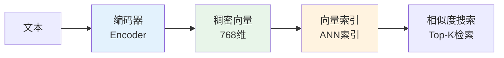

**关键组件：**

| 组件 | 功能 | 代表技术 |
|------|------|---------|
| **编码器** | 文本 → 向量 | BERT、Sentence-BERT、OpenAI Embedding |
| **向量维度** | 通常为 384/768/1024 维 | - |
| **相似度度量** | 向量间距离计算 | 余弦相似度、点积、欧氏距离 |
| **ANN 索引** | 高效近似最近邻搜索 | HNSW、IVF、PQ |

### 1.3 稠密检索 vs 稀疏检索

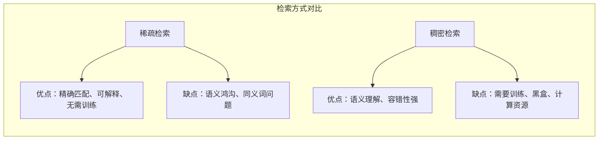

| 维度 | 稀疏检索（BM25） | 稠密检索（向量） |
|------|-----------------|-----------------|
| **匹配方式** | 词项精确匹配 | 语义向量相似 |
| **容错性** | 低（必须关键词命中） | 高（理解同义词） |
| **训练需求** | 无需训练 | 需要编码器模型 |
| **可解释性** | 高（知道匹配了哪个词） | 低（黑盒） |
| **资源消耗** | 低（CPU 即可） | 高（需要 GPU） |
| **索引大小** | 小（倒排索引） | 大（向量存储） |
| **新词处理** | 差（OOV 问题） | 好（语义泛化） |
| **多语言** | 需分词 | 天然支持 |

---

## 二、面试题详解

### 题目 1：稠密检索的基本原理是什么？与稀疏检索相比有什么优缺点？

#### 考察点
- 稠密检索原理
- 编码器作用
- 两种检索方式对比

#### 详细解答

**稠密检索原理：**

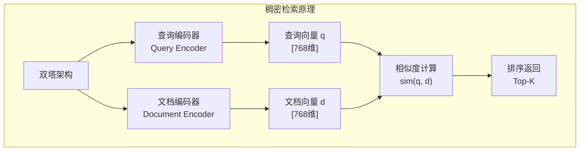

**双塔架构（Bi-Encoder）：**

```
查询 "如何学习机器学习" → Query Encoder → [0.1, -0.3, 0.8, ...]
文档 "机器学习入门指南" → Doc Encoder → [0.2, -0.2, 0.9, ...]

相似度计算：
cosine_sim = dot(q, d) / (||q|| * ||d||) = 0.95

高相似度 → 相关文档
```

**编码器演进：**

| 阶段 | 模型 | 特点 |
|------|------|------|
| **1.0** | BERT 句向量 | 取 [CLS] 或平均池化 |
| **2.0** | Sentence-BERT | 使用孪生网络训练 |
| **3.0** | OpenAI Embedding | API 调用，效果优秀 |
| **4.0** | E5、BGE | 针对检索任务优化 |

**优缺点对比：**

| 维度 | 稀疏检索 | 稠密检索 |
|------|---------|---------|
| **优点** | ✅ 精确匹配<br>✅ 可解释<br>✅ 无需训练<br>✅ 资源消耗低 | ✅ 语义理解<br>✅ 同义词处理<br>✅ 多语言支持<br>✅ 语义泛化 |
| **缺点** | ❌ 语义鸿沟<br>❌ 同义词问题<br>❌ 新词 OOV | ❌ 需要训练<br>❌ 黑盒不可解释<br>❌ 资源消耗高<br>❌ 领域迁移难 |

**适用场景：**

```mermaid
flowchart TB
    subgraph SparseS["稀疏检索适合"]
        S1["精确匹配需求<br/>产品型号、错误代码"]
        S2["关键词搜索<br/>品牌名称、技术术语"]
        S3["可解释性要求<br/>搜索日志分析"]
    end
    
    subgraph DenseS["稠密检索适合"]
        D1["语义理解需求<br/>自然语言问答"]
        D2["同义词处理<br/>"电脑"→"计算机""]
        D3["多语言场景<br/>跨语言检索"]
        D4["语义相似度<br/>找相似文档"]
    end
```

**Java 伪代码：**

```java
/**
 * 稠密检索系统
 * 
 * 核心思想：将文本编码为稠密向量，通过向量相似度检索
 */
public class DenseRetrievalSystem {
    
    private final EmbeddingModel encoder;      // 编码器模型
    private final VectorIndex vectorIndex;     // 向量索引
    private final SimilarityMetric metric;     // 相似度度量
    
    /**
     * 索引文档
     * @param documents 文档列表
     */
    public void indexDocuments(List<Document> documents) {
        for (Document doc : documents) {
            // 1. 编码文档为向量
            float[] vector = encoder.encode(doc.getContent());
            
            // 2. 添加到向量索引
            vectorIndex.add(doc.getId(), vector, doc.getMetadata());
        }
        
        // 3. 构建索引（如 HNSW、IVF）
        vectorIndex.build();
    }
    
    /**
     * 检索
     * @param query 查询文本
     * @param topK 返回数量
     * @return 检索结果
     */
    public List<RetrievalResult> search(String query, int topK) {
        // 1. 编码查询
        float[] queryVector = encoder.encode(query);
        
        // 2. 向量相似度搜索
        List<VectorSearchResult> candidates = vectorIndex.search(queryVector, topK * 2);
        
        // 3. 精排（可选）
        List<RetrievalResult> results = rerank(candidates, query);
        
        // 4. 返回 Top-K
        return results.subList(0, Math.min(topK, results.size()));
    }
    
    /**
     * 计算相似度
     */
    public float calculateSimilarity(float[] v1, float[] v2) {
        switch (metric) {
            case COSINE:
                return cosineSimilarity(v1, v2);
            case DOT_PRODUCT:
                return dotProduct(v1, v2);
            case EUCLIDEAN:
                return -euclideanDistance(v1, v2);  // 取负，越大越相似
            default:
                throw new IllegalArgumentException("Unknown metric");
        }
    }
    
    /**
     * 余弦相似度
     */
    private float cosineSimilarity(float[] v1, float[] v2) {
        float dot = 0, norm1 = 0, norm2 = 0;
        for (int i = 0; i < v1.length; i++) {
            dot += v1[i] * v2[i];
            norm1 += v1[i] * v1[i];
            norm2 += v2[i] * v2[i];
        }
        return dot / (float)(Math.sqrt(norm1) * Math.sqrt(norm2));
    }
    
    /**
     * 点积
     */
    private float dotProduct(float[] v1, float[] v2) {
        float sum = 0;
        for (int i = 0; i < v1.length; i++) {
            sum += v1[i] * v2[i];
        }
        return sum;
    }
}

/**
 * 文档
 */
@Data
class Document {
    private String id;
    private String content;
    private Map<String, Object> metadata;
}

/**
 * 检索结果
 */
@Data
class RetrievalResult {
    private String docId;
    private String content;
    private float score;
    private Map<String, Object> metadata;
}
```

---

### 题目 2：稠密检索中的编码器有哪些类型？双塔架构和单塔架构有什么区别？

#### 考察点
- 编码器架构
- 双塔 vs 单塔
- 性能与效率权衡

#### 详细解答

**编码器类型：**

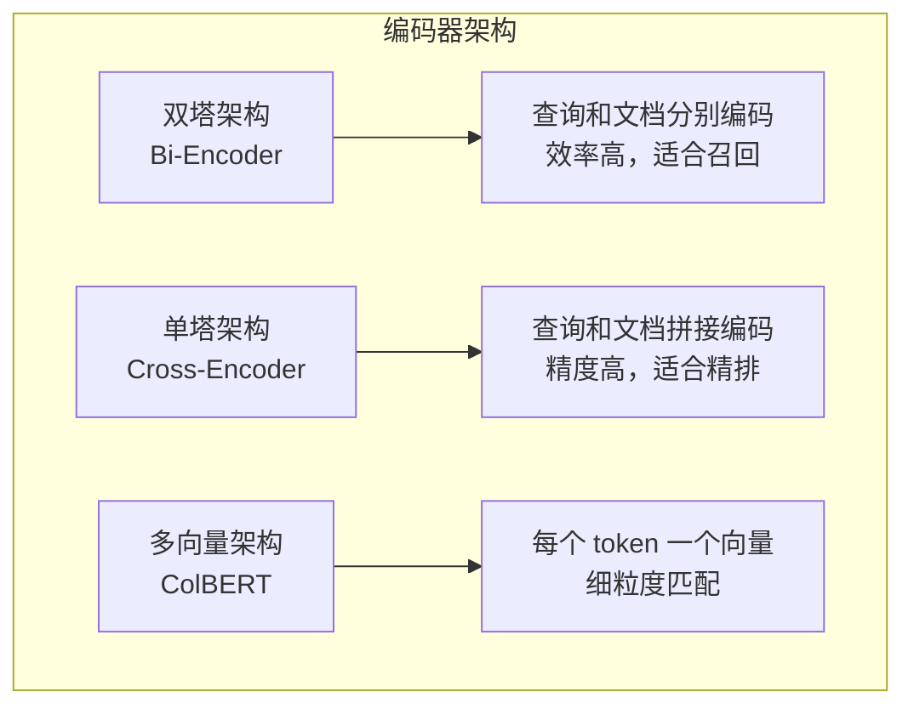

**1. 双塔架构（Bi-Encoder）：**

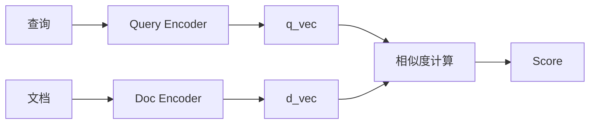

**特点：**
- 查询和文档独立编码
- 文档向量可离线预计算和索引
- 检索时只需编码查询，效率高
- 适合大规模召回

**2. 单塔架构（Cross-Encoder）：**

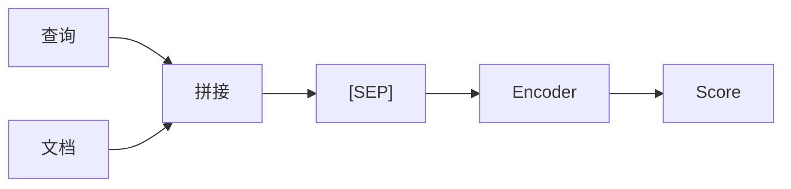

**特点：**
- 查询和文档拼接后一起编码
- 可以捕捉细粒度交互
- 每次都要重新编码，效率低
- 适合小规模精排

**对比：**

| 维度 | 双塔（Bi-Encoder） | 单塔（Cross-Encoder） |
|------|-------------------|----------------------|
| **架构** | 分别编码 | 拼接编码 |
| **效率** | ✅ 高（文档可预索引） | ❌ 低（每次重新编码） |
| **精度** | 中 | ✅ 高（细粒度交互） |
| **适用阶段** | 召回 | 精排 |
| **计算复杂度** | O(n) 检索 | O(n) 重编码 |
| **代表模型** | DPR、Sentence-BERT | BERT Cross-Encoder |

**3. 多向量架构（ColBERT）：**

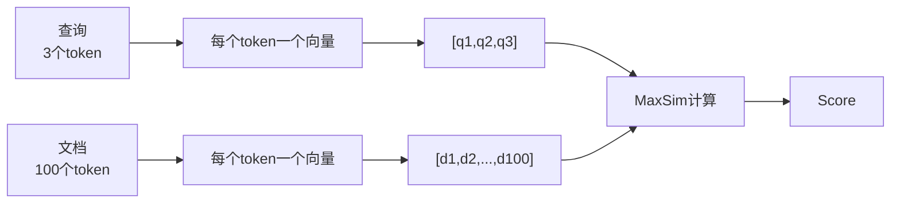

**特点：**
- 每个 token 一个向量
- Late Interaction：查询时计算相似度
- 平衡效率和精度

**Java 伪代码：**

```java
/**
 * 编码器架构对比
 */
public class EncoderArchitectures {
    
    private final EmbeddingModel queryEncoder;
    private final EmbeddingModel docEncoder;
    private final CrossEncoder crossEncoder;
    
    /**
     * 双塔编码（Bi-Encoder）
     * 特点：分别编码，效率高，适合召回
     */
    public float biEncoderScore(String query, String doc) {
        // 分别编码（文档可预计算）
        float[] queryVec = queryEncoder.encode(query);
        float[] docVec = docEncoder.encode(doc);
        
        // 计算相似度
        return cosineSimilarity(queryVec, docVec);
    }
    
    /**
     * 单塔编码（Cross-Encoder）
     * 特点：拼接编码，精度高，适合精排
     */
    public float crossEncoderScore(String query, String doc) {
        // 拼接：[CLS] 查询 [SEP] 文档 [SEP]
        String combined = "[CLS] " + query + " [SEP] " + doc + " [SEP]";
        
        // 一起编码
        float[] features = crossEncoder.encode(combined);
        
        // 分类头输出相似度分数
        return sigmoid(features[0]);
    }
    
    /**
     * ColBERT 多向量编码
     * 特点：每个 token 一个向量，Late Interaction
     */
    public float colbertScore(String query, String doc) {
        // 查询编码：每个 token 一个向量 [query_len, dim]
        float[][] queryVecs = queryEncoder.encodeTokens(query);
        
        // 文档编码：每个 token 一个向量 [doc_len, dim]
        float[][] docVecs = docEncoder.encodeTokens(doc);
        
        // Late Interaction：MaxSim
        float score = 0;
        for (float[] qVec : queryVecs) {
            float maxSim = 0;
            for (float[] dVec : docVecs) {
                float sim = dotProduct(qVec, dVec);
                maxSim = Math.max(maxSim, sim);
            }
            score += maxSim;
        }
        
        return score / queryVecs.length;
    }
}

/**
 * 两阶段检索：双塔召回 + 单塔精排
 */
public class TwoStageRetrieval {
    
    private final DenseRetrievalSystem biEncoderSystem;   // 双塔召回
    private final CrossEncoder crossEncoder;               // 单塔精排
    
    public List<RetrievalResult> retrieve(String query, int finalTopK) {
        // Stage 1: 双塔召回（快速，大规模）
        int recallTopK = finalTopK * 10;  // 召回更多候选
        List<RetrievalResult> candidates = biEncoderSystem.search(query, recallTopK);
        
        // Stage 2: 单塔精排（精确，小规模）
        List<ScoredResult> reranked = new ArrayList<>();
        for (RetrievalResult candidate : candidates) {
            float score = crossEncoder.score(query, candidate.getContent());
            reranked.add(new ScoredResult(candidate, score));
        }
        
        // 按精排分数排序
        reranked.sort((a, b) -> Float.compare(b.score, a.score));
        
        // 返回 Top-K
        return reranked.subList(0, finalTopK).stream()
            .map(s -> s.result)
            .collect(Collectors.toList());
    }
}
```

---

### 题目 3：ANN（近似最近邻）算法有哪些？HNSW 和 IVF 的原理是什么？

#### 考察点
- ANN 算法原理
- HNSW 和 IVF 机制
- 算法选择

#### 详细解答

**ANN 算法分类：**

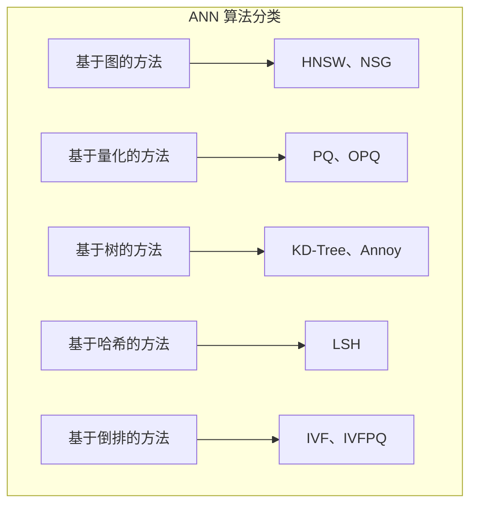

**1. HNSW（Hierarchical Navigable Small World）：**

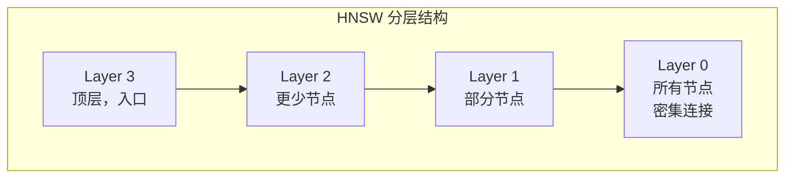

**原理：**

```
分层结构：
- 顶层：稀疏图，快速定位大致区域
- 底层：稠密图，精确搜索最近邻

搜索过程：
1. 从顶层随机入口开始
2. 贪心搜索：找当前层最近的邻居
3. 到达局部最优后，进入下一层
4. 重复直到最底层
5. 在最底层进行精确搜索

插入过程：
1. 计算新节点的层数（随机，指数衰减）
2. 从顶层开始找到最近邻
3. 在每一层建立连接（最多 M 个邻居）
```

**参数：**

| 参数 | 说明 | 典型值 |
|------|------|--------|
| **M** | 每层最大连接数 | 16-64 |
| **efConstruction** | 构建时的搜索深度 | 100-200 |
| **efSearch** | 搜索时的搜索深度 | 64-256 |

**2. IVF（Inverted File Index）：**

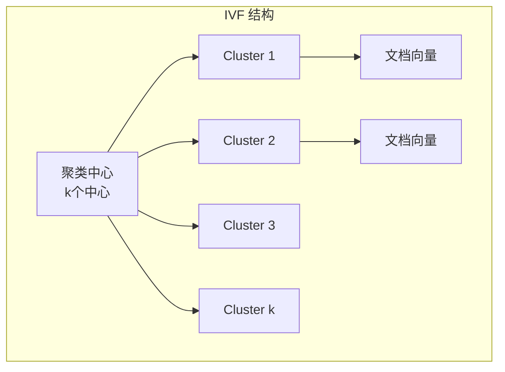

**原理：**

```
构建过程：
1. 对文档向量进行 K-Means 聚类，得到 k 个中心
2. 每个文档分配到最近的中心
3. 建立倒排索引：中心 → 文档列表

搜索过程：
1. 计算查询向量与所有中心的距离
2. 选择最近的 nprobe 个中心
3. 只在这些中心的文档中搜索
4. 返回 Top-K

优势：
- 大幅减少搜索空间
- 适合大规模数据（十亿级）
```

**参数：**

| 参数 | 说明 | 典型值 |
|------|------|--------|
| **nlist** | 聚类中心数 | 100-4096 |
| **nprobe** | 搜索时查询的中心数 | 10-100 |

**3. PQ（Product Quantization）：**

```
原理：
1. 将高维向量分成 m 个子向量
2. 对每个子空间进行 K-Means 聚类（k=256）
3. 每个子向量用最近的中心 ID 表示（1 byte）

压缩效果：
- 原始：768维 × 4字节 = 3072字节
- PQ后：m个子空间 × 1字节 = m字节（如96字节）
- 压缩比：32:1

搜索：
- 预计算查询与各中心的距离表
- 通过查表快速计算近似距离
```

**算法对比：**

| 算法 | 原理 | 优点 | 缺点 | 适用场景 |
|------|------|------|------|---------|
| **HNSW** | 分层图 | 精度高、构建快 | 内存占用大 | 百万-千万级 |
| **IVF** | 倒排+聚类 | 内存小、可扩展 | 精度略低 | 千万-亿级 |
| **IVFPQ** | IVF+PQ | 内存极小 | 精度损失 | 十亿级+ |
| **PQ** | 量化压缩 | 压缩率高 | 精度损失 | 存储受限 |

**Java 伪代码：**

```java
/**
 * ANN 索引实现
 */
public class ANNIndex {
    
    private IndexType indexType;
    private int dim;           // 向量维度
    
    // HNSW 参数
    private int hnswM;
    private int efConstruction;
    private int efSearch;
    
    // IVF 参数
    private int nlist;         // 聚类中心数
    private int nprobe;        // 搜索时查询的中心数
    
    /**
     * 构建 HNSW 索引
     */
    public void buildHNSW(List<float[]> vectors) {
        // 初始化分层图
        HNSWGraph graph = new HNSWGraph(hnswM);
        
        for (int i = 0; i < vectors.size(); i++) {
            float[] vec = vectors.get(i);
            
            // 计算节点层数（指数衰减）
            int level = calculateLevel();
            
            // 从顶层开始插入
            for (int l = graph.maxLevel(); l >= 0; l--) {
                if (l <= level) {
                    // 在当前层找到最近邻
                    List<Integer> neighbors = searchLevel(vec, l, efConstruction);
                    
                    // 建立双向连接（最多 M 个）
                    graph.addNode(i, l, neighbors.subList(0, Math.min(hnswM, neighbors.size())));
                }
            }
        }
        
        this.graph = graph;
    }
    
    /**
     * HNSW 搜索
     */
    public List<Integer> searchHNSW(float[] query, int topK) {
        // 从顶层入口开始
        int entryPoint = graph.getEntryPoint();
        
        // 贪心搜索到最底层
        for (int level = graph.maxLevel(); level >= 0; level--) {
            entryPoint = greedySearch(query, entryPoint, level);
        }
        
        // 在最底层进行精确搜索
        return beamSearch(query, entryPoint, topK, efSearch);
    }
    
    /**
     * 构建 IVF 索引
     */
    public void buildIVF(List<float[]> vectors) {
        // 1. K-Means 聚类
        KMeans kmeans = new KMeans(nlist);
        float[][] centroids = kmeans.fit(vectors);
        
        // 2. 分配文档到最近的中心
        Map<Integer, List<Integer>> invertedLists = new HashMap<>();
        for (int i = 0; i < vectors.size(); i++) {
            int nearestCentroid = findNearestCentroid(vectors.get(i), centroids);
            invertedLists.computeIfAbsent(nearestCentroid, k -> new ArrayList<>()).add(i);
        }
        
        this.centroids = centroids;
        this.invertedLists = invertedLists;
    }
    
    /**
     * IVF 搜索
     */
    public List<Integer> searchIVF(float[] query, int topK) {
        // 1. 计算与所有中心的距离
        List<ScoredCentroid> scoredCentroids = new ArrayList<>();
        for (int i = 0; i < centroids.length; i++) {
            float dist = euclideanDistance(query, centroids[i]);
            scoredCentroids.add(new ScoredCentroid(i, dist));
        }
        
        // 2. 选择最近的 nprobe 个中心
        scoredCentroids.sort(Comparator.comparingDouble(s -> s.distance));
        List<Integer> selectedCentroids = scoredCentroids.subList(0, nprobe)
            .stream()
            .map(s -> s.id)
            .collect(Collectors.toList());
        
        // 3. 在这些中心的倒排列表中搜索
        List<ScoredVector> candidates = new ArrayList<>();
        for (int centroidId : selectedCentroids) {
            List<Integer> docList = invertedLists.get(centroidId);
            for (int docId : docList) {
                float dist = euclideanDistance(query, vectors.get(docId));
                candidates.add(new ScoredVector(docId, dist));
            }
        }
        
        // 4. 排序返回 Top-K
        candidates.sort(Comparator.comparingDouble(s -> s.distance));
        return candidates.subList(0, Math.min(topK, candidates.size()))
            .stream()
            .map(s -> s.id)
            .collect(Collectors.toList());
    }
    
    /**
     * 选择索引类型
     */
    public static ANNIndex create(int dim, int dataSize, IndexType type) {
        ANNIndex index = new ANNIndex();
        index.dim = dim;
        index.indexType = type;
        
        switch (type) {
            case HNSW:
                index.hnswM = 16;
                index.efConstruction = 200;
                index.efSearch = 64;
                break;
            case IVF:
                index.nlist = (int) Math.sqrt(dataSize);  // 经验值
                index.nprobe = Math.max(1, index.nlist / 10);
                break;
            case IVFPQ:
                // IVF + PQ 组合
                index.nlist = (int) Math.sqrt(dataSize);
                index.nprobe = index.nlist / 10;
                // PQ 参数...
                break;
        }
        
        return index;
    }
}

enum IndexType {
    HNSW,      // 分层可导航小世界
    IVF,       // 倒排文件
    IVFPQ,     // 倒排+乘积量化
    PQ,        // 乘积量化
    FLAT       // 暴力搜索（基准）
}
```

---

### 题目 4：稠密检索在实际应用中有哪些挑战？如何解决？

#### 考察点
- 实际挑战识别
- 解决方案设计
- 工程实践

#### 详细解答

**主要挑战：**

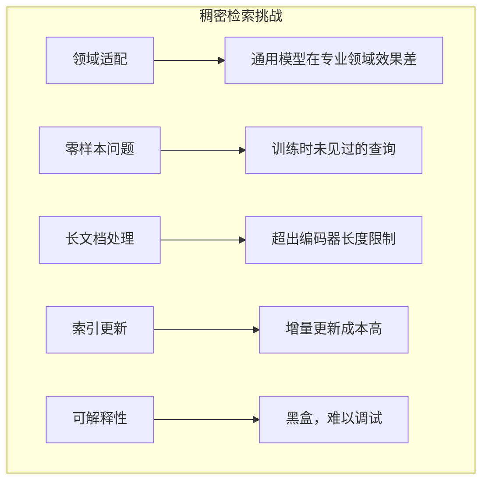

**1. 领域适配（Domain Adaptation）：**

```
问题：
- 通用预训练模型（如 BERT）在特定领域（医疗、法律）效果差
- 领域术语理解不准确

解决方案：
1. 领域预训练
   - 在领域语料上继续预训练
   - 学习领域词汇和语义

2. 对比学习微调
   - 使用领域内的正样本对（查询-相关文档）
   - 使用 InfoNCE 等对比损失

3. 领域特定编码器
   - 从头训练领域编码器
   - 如：Contriever、GTR
```

**2. 零样本检索（Zero-Shot Retrieval）：**

```
问题：
- 训练时未见过的查询类型
- 新领域、新任务

解决方案：
1. 提示工程（Prompt Engineering）
   - "Represent this sentence for retrieval: {text}"
   - 引导模型进入检索模式

2. 指令微调（Instruction Tuning）
   - 使用多样化指令训练
   - 提升泛化能力

3. 混合检索
   - 稠密 + 稀疏组合
   - 互相补充
```

**3. 长文档处理：**

```
问题：
- 编码器通常有 512/1024 token 限制
- 长文档需要截断或分段

解决方案：
1. 滑动窗口
   - 文档分块，每块独立编码
   - 聚合块级表示

2. 层次编码
   - 句子级编码 → 段落级聚合
   - 类似 Transformer 的层次结构

3. 长文本模型
   - Longformer、BigBird
   - 稀疏注意力机制
```

**4. 索引更新：**

```
问题：
- 新文档加入需要重新索引
- HNSW 等图索引不支持高效增量更新

解决方案：
1. 分段索引
   - 按时间/类别分多个索引
   - 只更新部分索引

2. 定期重建
   - 批量累积后重建索引
   - 适合文档更新不频繁场景

3. 近似更新
   - 找到最近邻，局部更新连接
   - 牺牲部分精度换取效率
```

**5. 可解释性：**

```
问题：
- 向量相似度是黑盒
- 不知道为什么召回这个结果

解决方案：
1. 注意力可视化
   - 查看编码时的注意力权重
   - 了解模型关注哪些词

2. 向量分解
   - 将向量分解为可解释维度
   - 如：Sparse Retrieval + Dense

3. 混合检索解释
   - 稀疏检索提供词级别匹配证据
   - 稠密检索提供语义相似度
```

**解决方案对比：**

| 挑战 | 解决方案 | 效果 | 成本 |
|------|---------|------|------|
| **领域适配** | 领域预训练 + 对比学习 | 显著提升 | 高 |
| **零样本** | 提示工程 + 指令微调 | 中等提升 | 中 |
| **长文档** | 分块 + 层次编码 | 有效 | 中 |
| **索引更新** | 分段索引 + 定期重建 | 有效 | 低 |
| **可解释性** | 混合检索 + 注意力可视化 | 部分解决 | 低 |

**Java 伪代码（完整系统）：**

```java
/**
 * 生产级稠密检索系统
 */
public class ProductionDenseRetrieval {
    
    private final EmbeddingModel encoder;
    private final VectorIndex vectorIndex;
    private final SparseRetrieval sparseRetrieval;  // 混合检索
    
    // 领域适配组件
    private final DomainAdapter domainAdapter;
    private final QueryRewriter queryRewriter;
    
    /**
     * 领域适配编码
     */
    public float[] domainAwareEncode(String text, String domain) {
        // 1. 领域特定预处理
        String processed = domainAdapter.preprocess(text, domain);
        
        // 2. 提示工程
        String prompted = "Represent this " + domain + " document for retrieval: " + processed;
        
        // 3. 编码
        return encoder.encode(prompted);
    }
    
    /**
     * 长文档处理
     */
    public List<float[]> encodeLongDocument(String longDoc, int maxChunkLength) {
        List<float[]> chunkVectors = new ArrayList<>();
        
        // 1. 文档分块
        List<String> chunks = chunkDocument(longDoc, maxChunkLength);
        
        // 2. 每块编码
        for (String chunk : chunks) {
            float[] vec = encoder.encode(chunk);
            chunkVectors.add(vec);
        }
        
        // 3. 聚合（平均池化或加权）
        return aggregateChunks(chunkVectors);
    }
    
    /**
     * 混合检索（稠密 + 稀疏）
     */
    public List<RetrievalResult> hybridSearch(String query, int topK) {
        // 1. 稠密检索
        List<RetrievalResult> denseResults = denseSearch(query, topK * 2);
        
        // 2. 稀疏检索
        List<RetrievalResult> sparseResults = sparseRetrieval.search(query, topK * 2);
        
        // 3. 结果融合（RRF 或加权）
        return fuseResults(denseResults, sparseResults, topK);
    }
    
    /**
     * RRF（Reciprocal Rank Fusion）融合
     */
    private List<RetrievalResult> fuseResults(
            List<RetrievalResult> denseResults,
            List<RetrievalResult> sparseResults,
            int topK) {
        
        Map<String, Double> fusedScores = new HashMap<>();
        int k = 60;  // RRF 常数
        
        // 稠密检索分数
        for (int i = 0; i < denseResults.size(); i++) {
            String docId = denseResults.get(i).getDocId();
            double score = 1.0 / (k + i + 1);
            fusedScores.merge(docId, score, Double::sum);
        }
        
        // 稀疏检索分数
        for (int i = 0; i < sparseResults.size(); i++) {
            String docId = sparseResults.get(i).getDocId();
            double score = 1.0 / (k + i + 1);
            fusedScores.merge(docId, score, Double::sum);
        }
        
        // 排序返回
        return fusedScores.entrySet().stream()
            .sorted(Map.Entry.<String, Double>comparingByValue().reversed())
            .limit(topK)
            .map(e -> mergeResultInfo(e.getKey(), denseResults, sparseResults))
            .collect(Collectors.toList());
    }
    
    /**
     * 增量索引更新
     */
    public void incrementalIndex(List<Document> newDocuments) {
        // 方案1：添加到当前索引（如果索引支持）
        if (vectorIndex.supportsIncrementalUpdate()) {
            for (Document doc : newDocuments) {
                float[] vec = encoder.encode(doc.getContent());
                vectorIndex.add(doc.getId(), vec);
            }
        } else {
            // 方案2：写入增量索引，定期合并
            VectorIndex deltaIndex = createDeltaIndex(newDocuments);
            scheduleMerge(vectorIndex, deltaIndex);
        }
    }
    
    /**
     * 可解释性：生成解释
     */
    public Explanation explain(String query, RetrievalResult result) {
        Explanation explanation = new Explanation();
        
        // 1. 稠密相似度解释
        explanation.setDenseScore(result.getScore());
        
        // 2. 稀疏匹配解释
        List<String> matchedTerms = sparseRetrieval.getMatchedTerms(query, result.getDocId());
        explanation.setMatchedTerms(matchedTerms);
        
        // 3. 注意力可视化（如果模型支持）
        if (encoder.supportsAttention()) {
            Map<String, Double> attentionWeights = encoder.getAttentionWeights(query, result.getContent());
            explanation.setAttentionWeights(attentionWeights);
        }
        
        return explanation;
    }
}

/**
 * 检索解释
 */
@Data
class Explanation {
    private double denseScore;                    // 稠密相似度
    private double sparseScore;                   // 稀疏分数
    private List<String> matchedTerms;            // 匹配的稀疏词
    private Map<String, Double> attentionWeights; // 注意力权重
    private String explanationText;               // 自然语言解释
}
```

---

## 三、延伸追问

### 追问 1：稠密检索和稀疏检索如何结合使用？

**混合策略：**

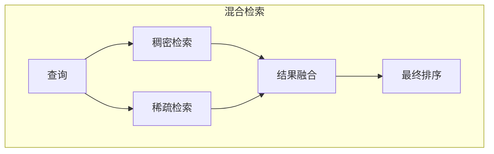

**融合方法：**

| 方法 | 原理 | 公式 |
|------|------|------|
| **线性加权** | 分数加权求和 | score = α·dense + (1-α)·sparse |
| **RRF** | 倒数排名融合 | score = Σ 1/(k + rank_i) |
| **级联** | 先用一种召回，再用另一种精排 | 稀疏召回 → 稠密精排 |

### 追问 2：稠密检索的向量维度如何选择？维度越高越好吗？

**维度选择：**

| 维度 | 优点 | 缺点 | 适用场景 |
|------|------|------|---------|
| **256** | 存储小、检索快 | 表达能力有限 | 资源受限 |
| **384** | 平衡 | 通用选择 | 通用场景 |
| **768** | 表达能力强 | 存储大 | 高精度需求 |
| **1024+** | 最强表达 | 成本最高 | 专业领域 |

**不是越高越好：**
- 高维度增加存储和计算成本
- 存在维度灾难
- 需要更多数据训练

### 追问 3：如何评估稠密检索的效果？有哪些指标？

**评估指标：**

| 指标 | 说明 | 计算方式 |
|------|------|---------|
| **Recall@K** | Top-K 召回率 | 相关文档在 Top-K 中的比例 |
| **MRR** | 平均倒数排名 | 第一个相关文档排名的倒数平均 |
| **NDCG** | 归一化折损累积增益 | 考虑位置加权的排序质量 |
| **Latency** | 检索延迟 | P99 响应时间 |

---

## 四、总结

### 面试回答模板

> 稠密检索是将文本编码为稠密向量进行语义相似度检索的方法，与稀疏检索（BM25）相比，优势在于语义理解和同义词处理，缺点是黑盒、需要训练、资源消耗高。
>
> **核心组件**：编码器（双塔/单塔/多向量）、向量索引（HNSW/IVF/PQ）、相似度度量（余弦/点积）。
>
> **ANN 算法**：HNSW 使用分层图结构，精度高；IVF 使用倒排+聚类，适合大规模；IVFPQ 结合量化压缩，适合十亿级。
>
> **实际挑战**：领域适配（需微调）、零样本（需提示工程）、长文档（需分块）、索引更新（需分段）、可解释性（需混合）。

### 一句话记忆

| 概念 | 一句话 |
|------|--------|
| **稠密检索** | 文本编码为向量，语义相似度检索 |
| **双塔架构** | 查询文档分别编码，效率高，适合召回 |
| **单塔架构** | 查询文档拼接编码，精度高，适合精排 |
| **HNSW** | 分层可导航小世界图，精度高，内存大 |
| **IVF** | 倒排文件+聚类，适合大规模 |
| **混合检索** | 稠密+稀疏结合，取长补短 |

---

> 💡 **提示**：稠密检索是 RAG 系统的核心组件，理解其原理、ANN 算法和与稀疏检索的对比是面试重点。
