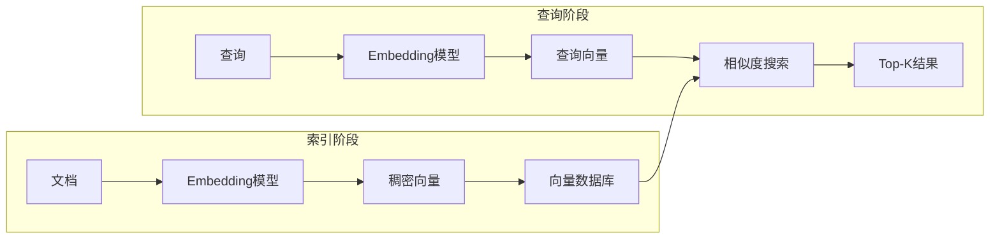
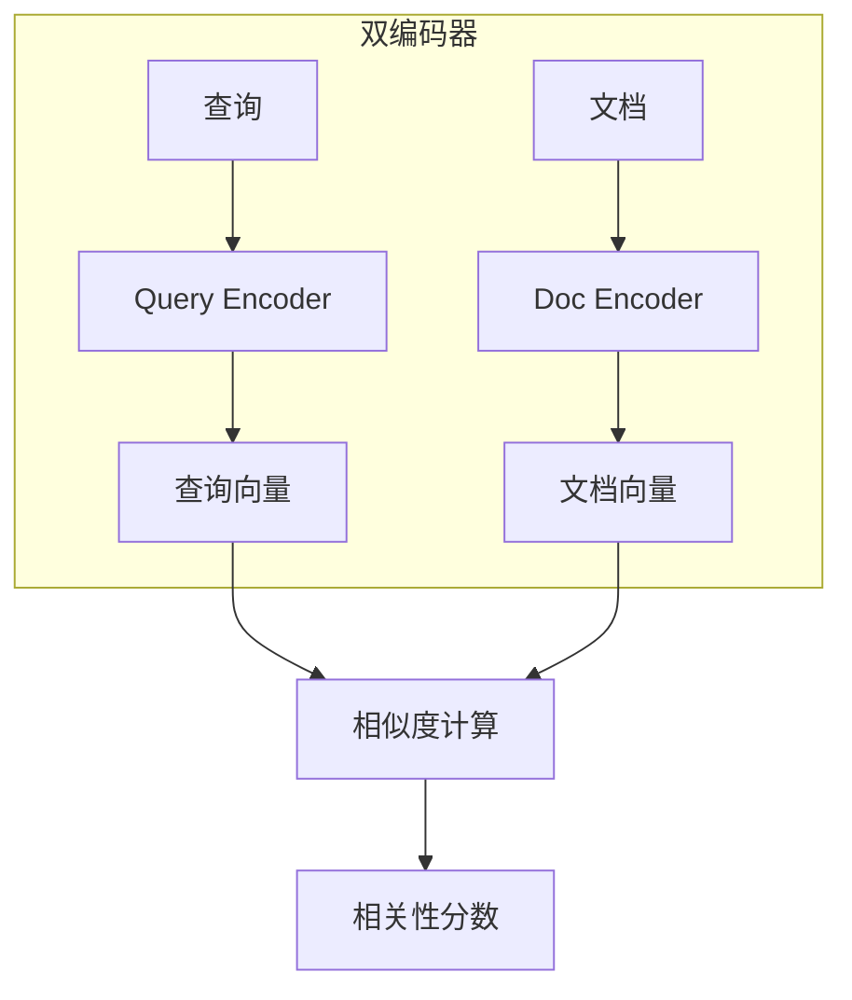
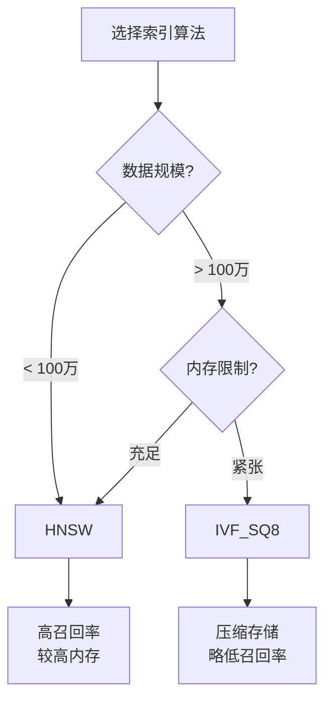
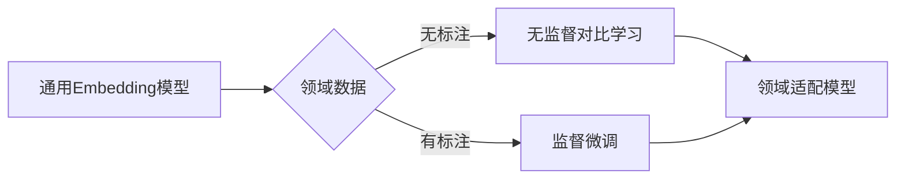

# 稠密检索（Dense Retrieval）

> 基于向量表示的语义检索技术，RAG 系统的核心组件

---

## 一、概念与原理

### 1.1 什么是稠密检索

稠密检索（Dense Retrieval）是一种将文本转换为低维稠密向量（Dense Vector），通过向量相似度计算来实现语义检索的技术。与基于词项匹配的传统稀疏检索（如 BM25）不同，稠密检索能够捕获查询和文档之间的语义关系，即使它们没有共享相同的词汇。

### 1.2 核心原理



**关键步骤：**
1. **编码（Encoding）**：使用预训练的 Embedding 模型将文本编码为固定维度的向量
2. **索引（Indexing）**：将文档向量存储到高效的向量数据库中
3. **搜索（Search）**：将查询编码为向量，在向量空间中查找最相似的文档

### 1.3 向量相似度度量

| 度量方式 | 公式 | 适用场景 |
|---------|------|---------|
| **余弦相似度** | $\cos(\theta) = \frac{A \cdot B}{\|A\| \|B\|}$ | 方向比模长更重要 |
| **欧氏距离** | $d = \sqrt{\sum_{i=1}^{n}(A_i - B_i)^2}$ | 绝对距离有意义时 |
| **点积** | $A \cdot B = \sum_{i=1}^{n}A_i B_i$ | 向量已归一化时 |

> 💡 **提示**：实际应用中，余弦相似度最常用，因为它不受向量模长影响，只关注语义方向。

### 1.4 双编码器架构



**特点：**
- 查询和文档分别编码，可以离线索引文档
- 推理时只需编码查询，检索效率高
- 代表模型：DPR、Contriever、GTE

---

## 二、面试题详解

### 题目 1（初级）：稠密检索 vs 稀疏检索

**问题**：请对比稠密检索（Dense Retrieval）和稀疏检索（Sparse Retrieval，如 BM25）的区别，并说明各自的适用场景。

#### 考察点
- 对两种检索范式的理解深度
- 知道各自的优缺点和适用边界
- 能够在实际场景中做出合理选择

#### 详细解答

| 维度 | 稀疏检索（BM25） | 稠密检索（Dense Retrieval） |
|------|-----------------|---------------------------|
| **表示方式** | 高维稀疏向量（词袋模型） | 低维稠密向量（通常 384-1024 维） |
| **匹配方式** | 词项精确/模糊匹配 | 语义相似度匹配 |
| **词汇鸿沟** | 存在（同义词无法匹配） | 不存在（语义层面匹配） |
| **计算效率** | 倒排索引，查询快 | 需要向量检索，略慢 |
| **存储开销** | 小 | 大（需存储浮点向量） |
| **可解释性** | 高（可看到匹配词项） | 低（黑盒语义表示） |
| **冷启动** | 无需训练 | 依赖预训练模型 |

**适用场景：**

- **稀疏检索适合**：
  - 关键词精确匹配场景（如产品型号、ID 查询）
  - 资源受限环境
  - 需要高可解释性的场景

- **稠密检索适合**：
  - 语义理解类查询（如"如何解决内存泄漏"）
  - 长文档检索（语义压缩）
  - 多语言场景（跨语言检索）

#### Java 伪代码示例

```java
/**
 * 混合检索服务 - 结合稀疏和稠密检索的优势
 */
public class HybridRetrievalService {
    
    private final SparseRetriever sparseRetriever;  // BM25
    private final DenseRetriever denseRetriever;    // 向量检索
    private final double sparseWeight = 0.3;        // 稀疏检索权重
    private final double denseWeight = 0.7;         // 稠密检索权重
    
    /**
     * 混合检索
     * 
     * @param query 用户查询
     * @param topK 返回结果数
     * @return 融合后的排序结果
     */
    public List<RetrievalResult> retrieve(String query, int topK) {
        // 1. 并行执行两种检索
        List<RetrievalResult> sparseResults = sparseRetriever.search(query, topK);
        List<RetrievalResult> denseResults = denseRetriever.search(query, topK);
        
        // 2. 结果融合（RRF - Reciprocal Rank Fusion）
        Map<String, Double> scoreMap = new HashMap<>();
        
        // 稀疏检索结果打分
        for (int i = 0; i < sparseResults.size(); i++) {
            String docId = sparseResults.get(i).getDocId();
            double score = sparseWeight * (1.0 / (60 + i));  // RRF公式
            scoreMap.merge(docId, score, Double::sum);
        }
        
        // 稠密检索结果打分
        for (int i = 0; i < denseResults.size(); i++) {
            String docId = denseResults.get(i).getDocId();
            double score = denseWeight * (1.0 / (60 + i));
            scoreMap.merge(docId, score, Double::sum);
        }
        
        // 3. 按融合分数排序返回
        return scoreMap.entrySet().stream()
            .sorted(Map.Entry.<String, Double>comparingByValue().reversed())
            .limit(topK)
            .map(e -> new RetrievalResult(e.getKey(), e.getValue()))
            .collect(Collectors.toList());
    }
}
```

---

### 题目 2（中级）：Embedding 模型的选择

**问题**：在实际项目中，如何选择合适的 Embedding 模型？请列出关键考虑因素，并对比几款主流模型的特点。

#### 考察点
- 了解主流 Embedding 模型及其特点
- 能够根据业务需求做出技术选型
- 理解模型维度、上下文长度等关键参数的影响

#### 详细解答

**选型考虑因素：**

| 因素 | 说明 | 影响 |
|------|------|------|
| **语言支持** | 是否支持中文/多语言 | 决定能否处理多语言查询 |
| **向量维度** | 输出向量的维度（384/768/1024/1536） | 影响存储和计算成本 |
| **上下文长度** | 最大输入 token 数（512/2048/8192） | 决定能处理多长的文档 |
| **检索性能** | 在标准 benchmark 上的 Recall@K | 决定检索质量 |
| **推理速度** | 编码一个文档的耗时 | 影响索引和查询延迟 |
| **模型大小** | 参数量（MB/GB） | 影响部署成本 |

**主流模型对比：**

| 模型 | 维度 | 上下文 | 特点 | 适用场景 |
|------|------|--------|------|---------|
| **text-embedding-3-small** | 1536 | 8192 | OpenAI，性价比高 | 通用场景，英语为主 |
| **text-embedding-3-large** | 3072 | 8192 | OpenAI，性能最强 | 高质量检索需求 |
| **bge-large-zh** | 1024 | 512 | 中文优化，开源 | 中文场景首选 |
| **bge-m3** | 1024 | 8192 | 多语言，长文本 | 多语言长文档 |
| **gte-large** | 1024 | 512 | 阿里开源，中文友好 | 中文企业场景 |
| **e5-large-v2** | 1024 | 512 | 微软，英文强 | 英文技术文档 |
| **m3e-base** | 768 | 512 | 中文社区流行 | 中文通用场景 |

> 💡 **提示**：中文场景优先选择 bge-large-zh 或 gte-large，它们在 C-MTEB 中文评测榜上表现优异。

#### Java 伪代码示例

```java
/**
 * Embedding 模型管理器
 */
public class EmbeddingModelManager {
    
    private final Map<String, EmbeddingModel> models = new HashMap<>();
    
    public EmbeddingModelManager() {
        // 注册不同场景的模型
        models.put("zh-general", new BgeLargeZhModel());      // 中文通用
        models.put("en-technical", new E5LargeV2Model());     // 英文技术
        models.put("multilingual", new BgeM3Model());         // 多语言
        models.put("long-doc", new BgeM3Model());             // 长文档
    }
    
    /**
     * 根据场景选择最优模型
     */
    public EmbeddingModel selectModel(RetrievalScenario scenario) {
        switch (scenario) {
            case CHINESE_GENERAL:
                return models.get("zh-general");
            case ENGLISH_TECHNICAL:
                return models.get("en-technical");
            case MULTILINGUAL:
                return models.get("multilingual");
            case LONG_DOCUMENT:
                return models.get("long-doc");
            default:
                return models.get("zh-general");
        }
    }
    
    /**
     * 批量编码文档（生产环境建议批量处理）
     */
    public List<float[]> encodeDocuments(List<String> documents, String modelKey) {
        EmbeddingModel model = models.get(modelKey);
        
        // 分批处理，避免内存溢出
        List<float[]> embeddings = new ArrayList<>();
        int batchSize = 32;
        
        for (int i = 0; i < documents.size(); i += batchSize) {
            List<String> batch = documents.subList(i, Math.min(i + batchSize, documents.size()));
            embeddings.addAll(model.encode(batch));
        }
        
        return embeddings;
    }
}

/**
 * Embedding 模型接口
 */
public interface EmbeddingModel {
    int getDimension();
    int getMaxContextLength();
    List<float[]> encode(List<String> texts);
}
```

---

### 题目 3（中级）：向量数据库的选择与优化

**问题**：请对比几款主流向量数据库（Milvus、Pinecone、pgvector、Redis Vector）的特点，并说明在生产环境中如何优化向量检索性能。

#### 考察点
- 了解主流向量数据库的架构差异
- 理解向量索引算法（HNSW、IVF）的原理和适用场景
- 掌握生产环境的性能优化策略

#### 详细解答

**主流向量数据库对比：**

| 数据库 | 架构 | 索引算法 | 特点 | 适用场景 |
|--------|------|---------|------|---------|
| **Milvus** | 分布式 | HNSW、IVF_FLAT、IVF_SQ8 | 功能最全，云原生 | 大规模企业级应用 |
| **Pinecone** | 全托管 | 内部优化 | 无需运维，按量付费 | 快速上线，无运维资源 |
| **pgvector** | PostgreSQL 扩展 | HNSW、IVF | 与 PG 生态集成 | 已有 PG 基础设施 |
| **Redis Vector** | 内存数据库 | HNSW、FLAT | 低延迟，内存计算 | 高并发，小数据量 |
| **Qdrant** | 开源/云 | HNSW | Rust 实现，高性能 | 开源偏好，高性能需求 |
| **Weaviate** | 开源/云 | HNSW | 模块化，GraphQL 接口 | 需要灵活模块化 |

**索引算法选择：**



| 算法 | 原理 | 优点 | 缺点 | 适用 |
|------|------|------|------|------|
| **HNSW** | 分层导航小世界图 | 高召回、快查询 | 内存占用大 | 默认首选 |
| **IVF_FLAT** | 倒排文件 + 精确计算 | 内存友好 | 查询较慢 | 大数据集 |
| **IVF_SQ8** | IVF + 标量量化 | 极低内存 | 召回略低 | 超大规模 |

**生产环境优化策略：**

| 优化维度 | 策略 | 效果 |
|---------|------|------|
| **索引参数** | HNSW: M=16, efConstruction=200 | 平衡构建时间和查询性能 |
| **查询参数** | ef=128-256（越大召回率越高） | 控制查询时的搜索范围 |
| **数据分区** | 按类别/时间分 Collection | 减少单次搜索数据量 |
| **混合检索** | 向量 + 倒排索引混合 | 提高精确匹配能力 |
| **缓存** | 热点查询结果缓存 | 降低重复查询延迟 |
| **批量查询** | 合并多个查询请求 | 提高吞吐量 |

#### Java 伪代码示例

```java
/**
 * 向量数据库客户端 - Milvus 示例
 */
public class VectorDatabaseClient {
    
    private final MilvusClient client;
    private final String collectionName;
    
    // HNSW 索引参数
    private static final int HNSW_M = 16;                    // 每个节点的最大连接数
    private static final int HNSW_EF_CONSTRUCTION = 200;     // 构建时的搜索范围
    private static final int HNSW_EF = 128;                  // 查询时的搜索范围
    
    /**
     * 创建 Collection 和索引
     */
    public void createCollection(int vectorDimension) {
        // 1. 定义字段
        FieldType idField = FieldType.newBuilder()
            .withName("id")
            .withDataType(DataType.Int64)
            .withPrimaryKey(true)
            .withAutoID(true)
            .build();
            
        FieldType vectorField = FieldType.newBuilder()
            .withName("embedding")
            .withDataType(DataType.FloatVector)
            .withDimension(vectorDimension)
            .build();
            
        FieldType contentField = FieldType.newBuilder()
            .withName("content")
            .withDataType(DataType.VarChar)
            .withMaxLength(65535)
            .build();
        
        // 2. 创建 Collection
        CreateCollectionParam createParam = CreateCollectionParam.newBuilder()
            .withCollectionName(collectionName)
            .withFieldTypes(Arrays.asList(idField, vectorField, contentField))
            .withShardsNum(2)  // 分片数
            .build();
        client.createCollection(createParam);
        
        // 3. 创建 HNSW 索引
        CreateIndexParam indexParam = CreateIndexParam.newBuilder()
            .withCollectionName(collectionName)
            .withFieldName("embedding")
            .withIndexType(IndexType.HNSW)
            .withMetricType(MetricType.COSINE)
            .withExtraParam(String.format("{\"M\":%d,\"efConstruction\":%d}", 
                HNSW_M, HNSW_EF_CONSTRUCTION))
            .build();
        client.createIndex(indexParam);
    }
    
    /**
     * 批量插入向量
     */
    public void insertVectors(List<String> contents, List<float[]> embeddings) {
        List<InsertParam.Field> fields = new ArrayList<>();
        
        // 内容字段
        fields.add(new InsertParam.Field("content", contents));
        
        // 向量字段
        List<List<Float>> vectorData = embeddings.stream()
            .map(e -> {
                List<Float> list = new ArrayList<>(e.length);
                for (float v : e) list.add(v);
                return list;
            })
            .collect(Collectors.toList());
        fields.add(new InsertParam.Field("embedding", vectorData));
        
        InsertParam insertParam = InsertParam.newBuilder()
            .withCollectionName(collectionName)
            .withFields(fields)
            .build();
            
        client.insert(insertParam);
    }
    
    /**
     * 向量相似度搜索
     */
    public List<SearchResult> search(float[] queryVector, int topK) {
        List<String> searchOutputFields = Arrays.asList("id", "content");
        
        SearchParam searchParam = SearchParam.newBuilder()
            .withCollectionName(collectionName)
            .withMetricType(MetricType.COSINE)
            .withVectors(Collections.singletonList(toList(queryVector)))
            .withVectorFieldName("embedding")
            .withTopK(topK)
            .withParams(String.format("{\"ef\":%d}", HNSW_EF))
            .withOutFields(searchOutputFields)
            .build();
            
        R<SearchResults> results = client.search(searchParam);
        return parseResults(results);
    }
    
    /**
     * 带过滤条件的搜索（混合检索）
     */
    public List<SearchResult> searchWithFilter(
            float[] queryVector, 
            String category,
            int topK) {
        
        // 构建过滤表达式
        String expr = String.format("category == '%s'", category);
        
        SearchParam searchParam = SearchParam.newBuilder()
            .withCollectionName(collectionName)
            .withMetricType(MetricType.COSINE)
            .withVectors(Collections.singletonList(toList(queryVector)))
            .withVectorFieldName("embedding")
            .withTopK(topK)
            .withExpr(expr)  // 添加过滤条件
            .withParams(String.format("{\"ef\":%d}", HNSW_EF))
            .build();
            
        return parseResults(client.search(searchParam));
    }
    
    private List<Float> toList(float[] arr) {
        List<Float> list = new ArrayList<>(arr.length);
        for (float v : arr) list.add(v);
        return list;
    }
}
```

---

### 题目 4（高级）：稠密检索的局限性与改进方案

**问题**：稠密检索在实际应用中存在哪些局限性？请列举至少 3 个问题，并给出相应的改进方案。

#### 考察点
- 对稠密检索技术边界的深入理解
- 能够识别实际问题并提出解决方案
- 了解 RAG 系统的最新研究进展

#### 详细解答

**局限性及改进方案：**

| 局限性 | 原因 | 影响 | 改进方案 |
|--------|------|------|---------|
| **领域适配问题** | 通用模型对专业领域理解不足 | 专业术语检索效果差 | 领域微调、动态 Embedding |
| **长尾查询问题** | 训练数据分布不均 | 罕见查询召回率低 | 查询扩展、混合检索 |
| **多义词问题** | 上下文信息丢失 | "苹果"（水果/公司）混淆 | 上下文感知编码、重排序 |
| **粒度不匹配** | 查询短，文档长 | 长文档语义稀释 | 段落切分、ColBERT 细粒度 |
| **冷启动问题** | 新文档无索引 | 无法检索最新内容 | 增量索引、实时更新 |

**详细改进方案：**

1. **领域适配（Domain Adaptation）**



- **无监督方法**：使用领域文档进行对比学习（Contriever 风格）
- **有监督方法**：构建领域内的 query-doc 对进行微调
- **提示工程**：在输入前添加领域标识，如"[医疗] 糖尿病治疗方法"

2. **查询扩展（Query Expansion）**

```java
/**
 * 查询扩展器 - 使用 LLM 扩展查询
 */
public class QueryExpander {
    
    private final LLMClient llmClient;
    
    /**
     * 生成查询扩展
     * 
     * @param originalQuery 原始查询
     * @return 扩展后的查询列表
     */
    public List<String> expand(String originalQuery) {
        String prompt = String.format(
            "请为以下查询生成 3 个语义相关的扩展查询，帮助检索更多信息：\n" +
            "原始查询：%s\n" +
            "扩展查询（用换行分隔）：",
            originalQuery
        );
        
        String response = llmClient.complete(prompt);
        
        List<String> expandedQueries = new ArrayList<>();
        expandedQueries.add(originalQuery);  // 保留原始查询
        expandedQueries.addAll(Arrays.asList(response.split("\\n")));
        
        return expandedQueries.stream()
            .filter(q -> !q.trim().isEmpty())
            .distinct()
            .collect(Collectors.toList());
    }
    
    /**
     * 多查询检索并融合结果
     */
    public List<RetrievalResult> multiQueryRetrieve(
            String query, 
            DenseRetriever retriever,
            int topK) {
        
        List<String> expandedQueries = expand(query);
        Map<String, Double> scoreMap = new HashMap<>();
        
        // 对每个扩展查询进行检索
        for (String q : expandedQueries) {
            List<RetrievalResult> results = retriever.search(q, topK);
            for (int i = 0; i < results.size(); i++) {
                String docId = results.get(i).getDocId();
                double score = results.get(i).getScore() * (1.0 / (1 + i));
                scoreMap.merge(docId, score, Double::sum);
            }
        }
        
        // 归一化并排序
        return scoreMap.entrySet().stream()
            .sorted(Map.Entry.<String, Double>comparingByValue().reversed())
            .limit(topK)
            .map(e -> new RetrievalResult(e.getKey(), e.getValue()))
            .collect(Collectors.toList());
    }
}
```

3. **重排序（Re-ranking）**

```java
/**
 * 两阶段检索：召回 + 重排序
 */
public class TwoStageRetriever {
    
    private final DenseRetriever firstStageRetriever;    // 第一阶段：快速召回
    private final CrossEncoderReranker reranker;          // 第二阶段：精确重排
    
    private static final int FIRST_STAGE_K = 100;         // 第一阶段召回数量
    private static final int FINAL_K = 10;                // 最终返回数量
    
    /**
     * 两阶段检索
     * 
     * 第一阶段：使用双编码器快速召回 Top-100
     * 第二阶段：使用交叉编码器对 Top-100 进行精确重排
     */
    public List<RetrievalResult> retrieve(String query, int topK) {
        // 1. 第一阶段：快速召回
        List<RetrievalResult> candidates = firstStageRetriever.search(query, FIRST_STAGE_K);
        
        // 2. 第二阶段：精确重排
        List<ScoredDocument> reranked = reranker.rerank(query, candidates);
        
        // 3. 返回 Top-K
        return reranked.stream()
            .limit(topK)
            .map(r -> new RetrievalResult(r.getDocId(), r.getScore()))
            .collect(Collectors.toList());
    }
}

/**
 * 交叉编码器重排序器
 * 
 * 原理：将 query 和 doc 拼接后输入模型，获得更精确的相关性分数
 * 代价：计算成本高，只能用于少量文档重排
 */
public class CrossEncoderReranker {
    
    private final CrossEncoderModel model;
    private final int batchSize = 8;  // 批处理大小
    
    public List<ScoredDocument> rerank(String query, List<RetrievalResult> candidates) {
        List<ScoredDocument> scoredDocs = new ArrayList<>();
        
        // 分批处理，避免内存溢出
        for (int i = 0; i < candidates.size(); i += batchSize) {
            List<RetrievalResult> batch = candidates.subList(
                i, Math.min(i + batchSize, candidates.size())
            );
            
            // 构建输入对 (query, doc)
            List<Pair<String, String>> pairs = batch.stream()
                .map(c -> Pair.of(query, c.getContent()))
                .collect(Collectors.toList());
            
            // 批量预测相关性分数
            float[] scores = model.predict(pairs);
            
            // 收集结果
            for (int j = 0; j < batch.size(); j++) {
                scoredDocs.add(new ScoredDocument(
                    batch.get(j).getDocId(),
                    batch.get(j).getContent(),
                    scores[j]
                ));
            }
        }
        
        // 按分数降序排序
        scoredDocs.sort(Comparator.comparing(ScoredDocument::getScore).reversed());
        return scoredDocs;
    }
}
```

---

## 三、延伸追问

### 追问 1：稠密检索和稀疏检索如何有效融合？

**简要答案要点：**

1. **线性加权融合**：`final_score = α * dense_score + β * sparse_score`
2. **RRF（Reciprocal Rank Fusion）**：`score = Σ 1/(k + rank)`，对排名进行融合而非分数
3. **级联融合**：先用稀疏检索过滤，再用稠密检索精排
4. **学习融合**：训练模型学习最优融合权重

### 追问 2：如何评估稠密检索的效果？

**简要答案要点：**

| 指标 | 说明 | 计算方式 |
|------|------|---------|
| **Recall@K** | Top-K 中相关文档的比例 | 最核心指标 |
| **MRR** | 平均倒数排名 | 第一个相关文档排名的倒数平均 |
| **NDCG** | 归一化折损累积增益 | 考虑文档相关度分级 |
| **Latency** | 查询延迟 | P50、P99 分位值 |

### 追问 3：Embedding 向量是否需要归一化？

**简要答案要点：**

- **使用余弦相似度时**：必须归一化，因为 `cos(A,B) = A·B / (|A||B|)`，归一化后简化为点积
- **使用点积时**：可以归一化，但不必须
- **使用欧氏距离时**：通常不归一化
- **生产建议**：归一化后存储，简化计算且数值稳定性更好

---

## 四、总结

### 面试回答模板

> 稠密检索是 RAG 系统的核心技术，通过将文本编码为语义向量实现语义匹配。与 BM25 等稀疏检索相比，它能解决词汇鸿沟问题，但存在计算成本高、可解释性差的缺点。
>
> 在实际应用中，我通常会采用**混合检索**策略：先用稠密检索召回语义相关文档，再用 BM25 补充关键词匹配结果，最后用交叉编码器重排序。模型选型上，中文场景推荐 bge-large-zh，英文场景推荐 e5-large-v2。
>
> 生产环境优化要注意三点：1) 选择合适的向量索引算法（HNSW 适合大多数场景）；2) 合理设置索引参数（M、efConstruction、ef）；3) 实施两阶段检索（召回+重排）平衡效果和效率。

### 一句话记忆

| 概念 | 一句话 |
|------|--------|
| **稠密检索** | 将文本变成向量，找语义相近而非字面匹配的文档 |
| **双编码器** | 查询和文档分别编码，速度快但交互少 |
| **交叉编码器** | 查询和文档一起编码，精度高但速度慢 |
| **HNSW** | 图索引算法，高召回率但内存占用大 |
| **混合检索** | 稠密+稀疏+重排，效果最好的组合拳 |

---

## 参考资料

1. [Dense Passage Retrieval for Open-Domain QA](https://arxiv.org/abs/2004.04906) - DPR 论文
2. [Unsupervised Dense Information Retrieval](https://arxiv.org/abs/2112.07708) - Contriever
3. [BGE: BAAI General Embedding](https://github.com/FlagOpen/FlagEmbedding) - BGE 模型
4. [Milvus Documentation](https://milvus.io/docs) - 向量数据库文档