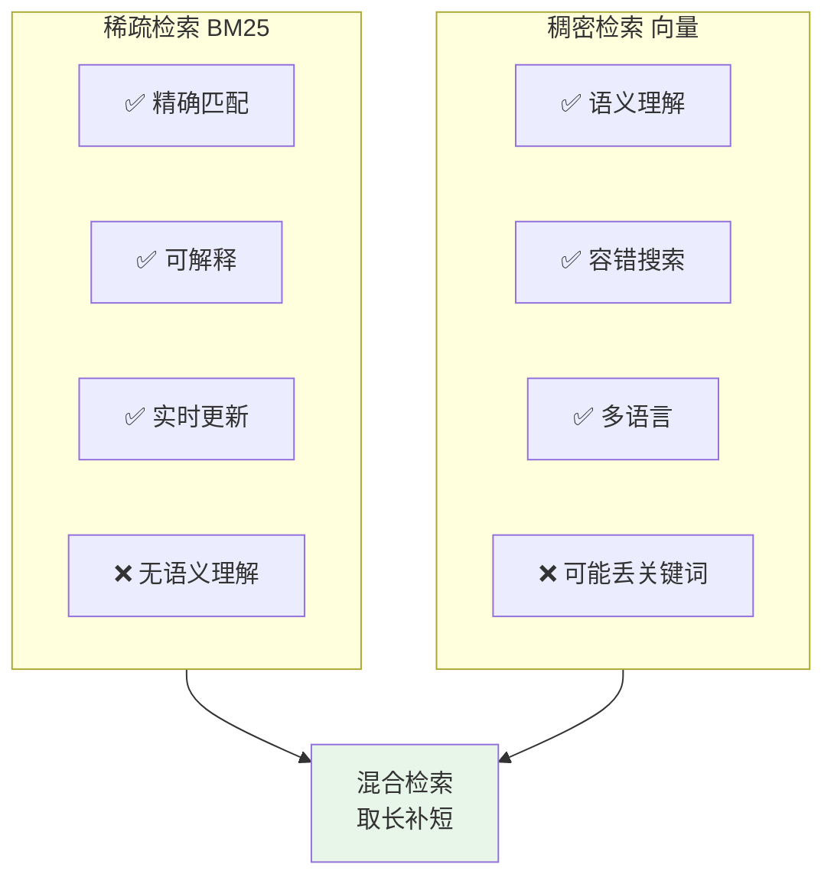
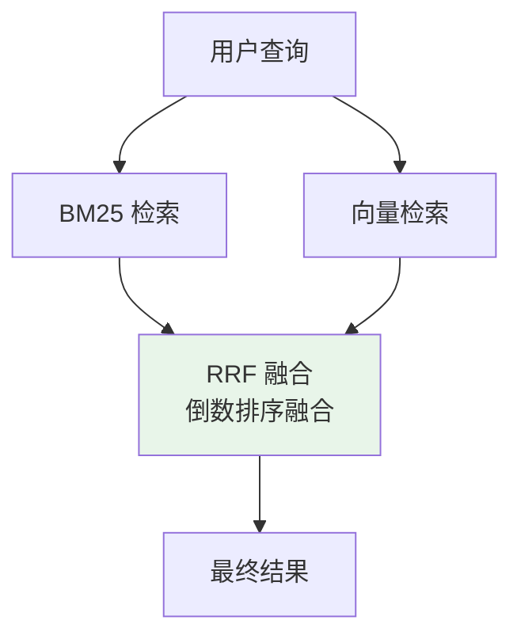

# 混合检索：BM25 + 向量检索

## 一、为什么要结合？

### 1.1 各自的优势与局限



| 检索方式 | 优势 | 劣势 |
|----------|------|------|
| **BM25** | 精确匹配、可解释、实时 | 无法理解语义 |
| **向量检索** | 语义理解、容错性强 | 可能丢失关键词 |

**结合 = 精确匹配 + 语义理解**

---

## 二、结合方式

### 2.1 级联检索（Cascade）


**适用场景：** 文档量大，需要快速过滤

**优点：** 速度快，BM25 快速缩小候选集
**缺点：** 可能丢失语义相关但关键词不匹配的结果

### 2.2 并行融合（Fusion）



**RRF 公式：**

$$\text{RRF-score}(d) = \sum_{i=1}^{m} \frac{1}{k + \text{rank}_i(d)}$$

- $k = 60$（经验值）
- $\text{rank}_i(d)$ = 文档 $d$ 在第 $i$ 个检索列表中的排名
- $m$ = 参与融合的检索方法数量

### 2.3 对比

| 方式 | 速度 | 召回率 | 适用场景 |
|------|------|--------|----------|
| 级联 | 快 | 中 | 大文档集 |
| 并行融合 | 中 | 高 | 追求高召回 |

---

## 三、面试题详解

### 题目 1：RRF 融合中 k=60 是怎么来的？可以调整吗？

#### 考察点
- 对 RRF 算法的理解
- 参数调优经验

#### 详细解答

**k 的作用：**

k 是平滑参数，用于平衡不同检索方法的排名差异：
- **k 越大**：对排名差异越不敏感，两种检索结果更平等
- **k 越小**：排名差异影响越大，高排名的文档优势更明显

**k=60 的来源：**

来自原始论文《Reciprocal Rank Fusion outperforms Condorcet and individual Rank Learning Methods》的经验值，在多个数据集上表现稳定。

**调优建议：**

```mermaid
xychart-beta
    title "k 值对融合结果的影响"
    x-axis [10, 30, 60, 100, 200]
    y-axis "低排名文档得分" 0 --> 0.1
    
    line "排名 10 的文档" : [0.05, 0.03, 0.014, 0.009, 0.005]
    line "排名 50 的文档" : [0.009, 0.006, 0.004, 0.003, 0.002]
```

| k 值 | 效果 | 适用场景 |
|------|------|----------|
| 20-40 | 重视高排名 | 对精度要求高 |
| 60（默认） | 平衡 | 通用场景 |
| 100+ | 更平等 | 两种检索质量相当 |

---

### 题目 2：除了 RRF，还有哪些融合策略？各自的优劣？

#### 考察点
- 融合算法广度
- 技术选型能力

#### 详细解答

**融合策略对比：**

| 策略 | 原理 | 优点 | 缺点 |
|------|------|------|------|
| **RRF** | 倒数排名相加 | 无需分数归一化、对异常值鲁棒 | 丢失分数绝对值信息 |
| **加权求和** | 分数 × 权重相加 | 直观、可解释 | 需要归一化、权重调优难 |
| **Borda 计数** | 投票制 | 简单、公平 | 只考虑排名 |
| **机器学习** | 训练融合模型 | 效果可能最好 | 需要标注数据 |

**加权融合 Java 实现：**

```java
/**
 * 加权分数融合
 */
public List<Document> weightedFusion(
        List<ScoredDocument> bm25Results,
        List<ScoredDocument> vectorResults,
        double bm25Weight,
        double vectorWeight) {
    
    // 1. 归一化分数到 [0, 1]
    normalizeScores(bm25Results);
    normalizeScores(vectorResults);
    
    Map<String, Double> fusedScores = new HashMap<>();
    Map<String, Document> docMap = new HashMap<>();
    
    // 2. BM25 分数加权
    for (ScoredDocument sd : bm25Results) {
        String id = sd.getDocument().getId();
        fusedScores.put(id, sd.getScore() * bm25Weight);
        docMap.put(id, sd.getDocument());
    }
    
    // 3. 向量分数加权
    for (ScoredDocument sd : vectorResults) {
        String id = sd.getDocument().getId();
        fusedScores.merge(id, sd.getScore() * vectorWeight, Double::sum);
    }
    
    // 4. 排序返回
    return fusedScores.entrySet().stream()
        .sorted(Map.Entry.<String, Double>comparingByValue().reversed())
        .map(e -> docMap.get(e.getKey()))
        .collect(Collectors.toList());
}

private void normalizeScores(List<ScoredDocument> results) {
    double max = results.stream()
        .mapToDouble(ScoredDocument::getScore)
        .max()
        .orElse(1.0);
    
    results.forEach(sd -> sd.setScore(sd.getScore() / max));
}
```

**选择建议：**
- 快速实现 → RRF
- 精细调优 → 加权融合
- 有标注数据 → 机器学习模型

---

## 四、延伸追问

1. **"混合检索在 Elasticsearch 中如何实现？"**
   - Elasticsearch 8.x 原生支持 `knn` 向量搜索与 BM25 结合
   - 使用 `bool` 查询将 BM25 分数与 kNN 分数合并
   - 可通过 `boost` 参数调整两路分数的权重比例

2. **"RRF 融合是否需要对两路分数归一化？"**
   - RRF 的核心优势之一正是**无需归一化**
   - 只依赖排名（rank），对分数的绝对值和分布不敏感
   - 这使得 BM25 分数（无上限）和向量相似度（通常 0-1）可以直接融合

3. **"混合检索的召回率和精确率如何权衡？"**
   - 增大 BM25 候选数 → 提高关键词精确匹配的精确率
   - 增大向量检索候选数 → 提高语义召回率
   - 实践中可对两路设置不同的 Top-K，再统一融合排序

4. **"线上延迟敏感场景如何使用混合检索？"**
   - 两路检索并行发起，等待最慢的一路完成后再融合
   - 设置超时阈值，超时则只返回已完成的那路结果（降级策略）
   - 也可对 BM25 结果做轻量向量重排（级联模式），而非完全并行