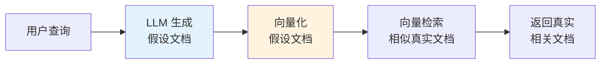
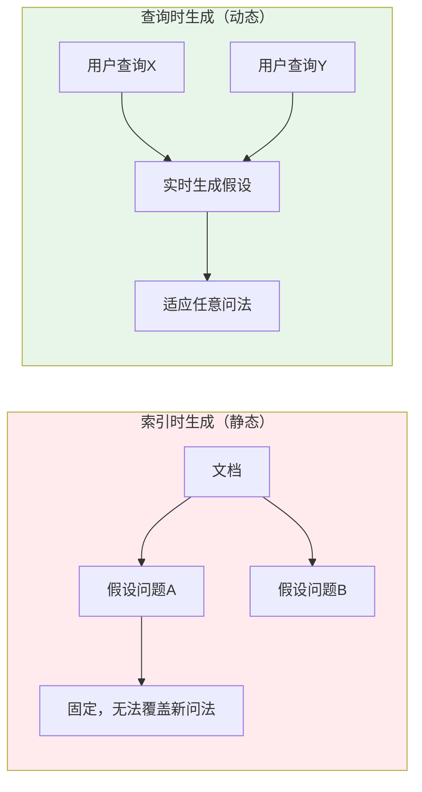
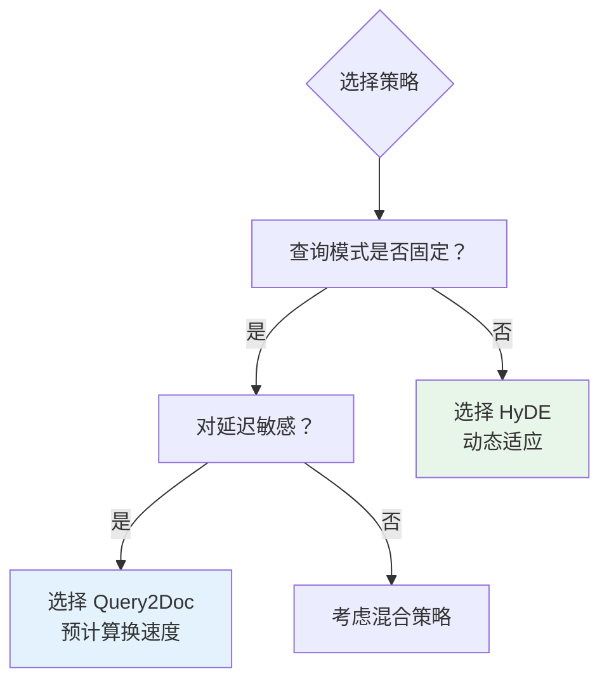
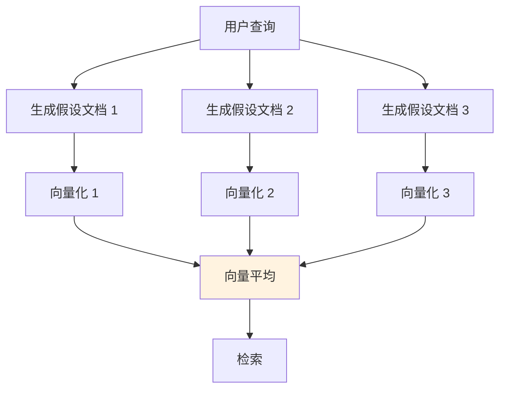

# HyDE (Hypothetical Document Embeddings)

## 一、概念与原理

### 1.1 什么是 HyDE？

**HyDE**（Hypothetical Document Embeddings，假设文档嵌入）是一种查询增强技术，核心思想是：**用 LLM 将用户查询扩展为假设答案，再用假设答案的向量进行检索**。

### 1.2 核心流程



### 1.3 为什么有效？

| 问题 | HyDE 解决方式 |
|------|--------------|
| 查询太短 | 扩展成完整文档 |
| 查询-文档语义不对齐 | 都映射到"答案空间" |
| 关键词缺失 | 生成包含相关术语的文档 |

**示例：**

```java
// 用户查询
String query = "RAG 优化技巧";

// 原始查询向量化（可能召回不准）
float[] queryVector = embed(query);  // 太短，语义不明确

// HyDE 方式：先生成假设文档
String hypotheticalDoc = llm.generate(
    "请写一段关于 RAG 优化技巧的详细说明"
);
// 生成："RAG 优化可以从检索和生成两方面入手..." 

// 用假设文档向量化（语义更丰富）
float[] hydeVector = embed(hypotheticalDoc);
```

---

## 二、面试题详解

### 题目 1：HyDE 为什么选择在查询时生成假设文档，而不是索引时？

#### 考察点
- 对 HyDE 设计思想的理解
- 成本与效果的权衡
- 工程实践经验

#### 详细解答

**两种策略对比：**


**HyDE 选择查询时生成的原因：**

**1. 查询意图未知**

```java
// 索引时的问题：不知道用户会怎么问
String doc = "RAG 是一种结合检索和生成的技术...";

// 生成的假设问题可能覆盖不到用户的真实问法
List<String> hypotheticalQuestions = generateQuestions(doc);
// ["什么是 RAG？", "RAG 的原理是什么？"]

// 但用户实际可能问：
// "怎么解决大模型幻觉？"
// "知识库问答怎么实现？"
```

**2. 成本对比**

| 维度 | 索引时生成 | 查询时生成 |
|------|-----------|-----------|
| LLM 调用次数 | 每文档 N 次 | 每查询 1 次 |
| 存储成本 | 增加 N 倍向量 | 不增加存储 |
| 索引时间 | 大幅增加 | 正常 |
| 查询延迟 | 低 | 增加 |

```java
// 假设：10万文档，每文档生成 5 个假设问题
// 索引时生成：50万次 LLM 调用！
// 查询时生成：每次查询 1 次调用
```

**3. 动态适应性**



---

### 题目 2：HyDE 和 Query2Doc 有什么区别？什么时候用哪个？

#### 考察点
- 两种技术的对比
- 技术选型能力

#### 详细解答

**核心区别：**

| 特性 | Query2Doc | HyDE |
|------|-----------|------|
| **生成时机** | 索引时 | 查询时 |
| **生成内容** | 假设问题 | 假设答案 |
| **存储成本** | 高（多存向量） | 低 |
| **适应新问法** | 弱 | 强 |
| **查询延迟** | 低 | 高 |
| **LLM 调用** | 一次性大量 | 按需少量 |

**选择建议：**



---

### 题目 3：Multi-HyDE 是什么？有什么优势？

#### 考察点
- HyDE 的扩展变体
- 多样性策略

#### 详细解答

**Multi-HyDE 思想：**



**Java 实现：**

```java
/**
 * Multi-HyDE 检索
 */
public List<Document> multiHyDESearch(
        String query, 
        int numHypotheses, 
        int topK) {
    
    // 1. 生成多个假设文档
    List<String> hypotheses = new ArrayList<>();
    for (int i = 0; i < numHypotheses; i++) {
        hypotheses.add(generateHypotheticalDocument(query, i));
    }
    
    // 2. 向量化并取平均
    List<float[]> vectors = hypotheses.stream()
        .map(embeddingModel::embed)
        .collect(Collectors.toList());
    
    float[] avgVector = averageVectors(vectors);
    
    // 3. 检索
    return vectorStore.search(avgVector, topK);
}

/**
 * 向量平均
 */
private float[] averageVectors(List<float[]> vectors) {
    int dim = vectors.get(0).length;
    float[] result = new float[dim];
    
    for (float[] vec : vectors) {
        for (int i = 0; i < dim; i++) {
            result[i] += vec[i];
        }
    }
    
    for (int i = 0; i < dim; i++) {
        result[i] /= vectors.size();
    }
    
    return result;
}
```

**优势：**
- 减少单次生成的偏差
- 覆盖更多相关语义空间
- 提高召回率

---

## 三、HyDE 实现代码

```java
/**
 * HyDE 检索服务
 */
public class HyDERetrievalService {
    
    private final LLMClient llm;
    private final EmbeddingModel embeddingModel;
    private final VectorStore vectorStore;
    
    /**
     * 标准 HyDE 检索
     */
    public List<Document> search(String query, int topK) {
        // 1. 生成假设文档
        String hypotheticalDoc = generateHypotheticalDocument(query);
        
        // 2. 向量化假设文档
        float[] hydeVector = embeddingModel.embed(hypotheticalDoc);
        
        // 3. 用 HyDE 向量检索
        List<Document> hydeResults = vectorStore.search(hydeVector, topK);
        
        // 4. 用原始查询再检索一次
        float[] queryVector = embeddingModel.embed(query);
        List<Document> queryResults = vectorStore.search(queryVector, topK);
        
        // 5. RRF 融合
        return reciprocalRankFusion(hydeResults, queryResults, topK);
    }
    
    /**
     * 生成假设文档
     */
    private String generateHypotheticalDocument(String query) {
        String prompt = String.format("""
            用户查询：%s
            
            请根据这个查询，生成一段详细的、包含相关信息的文档段落。
            这段文档应该包含可能回答该查询的关键信息。
            长度约 100-200 字。
            """, query);
        
        return llm.complete(prompt);
    }
}
```

---

## 四、延伸追问

1. **"HyDE 生成的假设文档偏离主题怎么办？"**
   - 添加约束条件到 Prompt
   - 用原始查询做相关性过滤
   - 多假设取平均（Multi-HyDE）

2. **"HyDE 和查询扩展（Query Expansion）有什么区别？"**
   - 查询扩展：加同义词、相关词
   - HyDE：生成完整文档，语义更丰富

3. **"HyDE 适用于什么类型的查询？"**
   - ✅ 短查询、关键词少
   - ✅ 查询与文档表达方式差异大
   - ❌ 已经很明确的查询（增加成本无收益）
